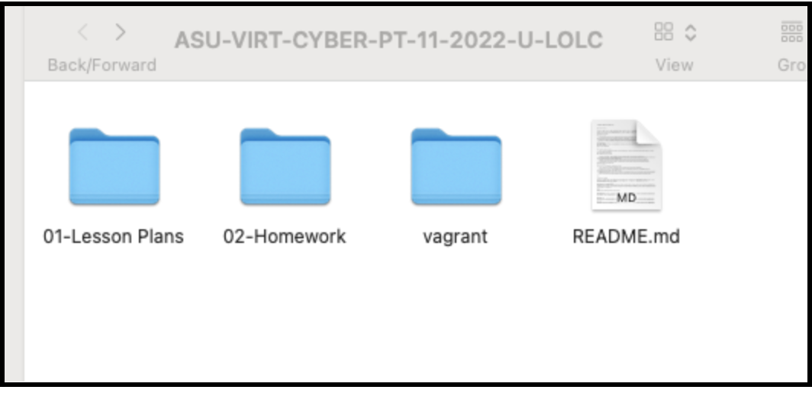
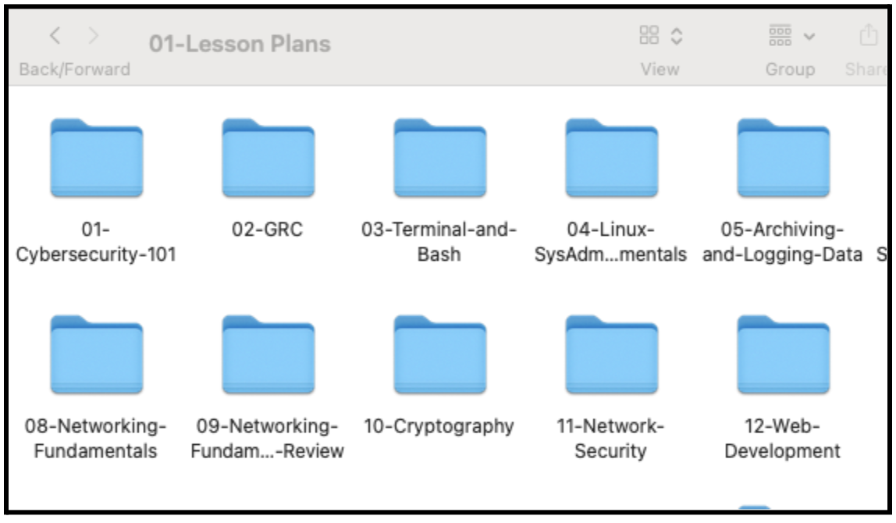
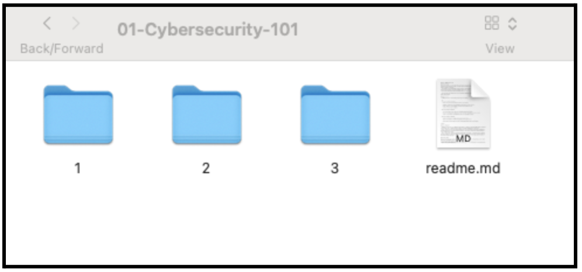
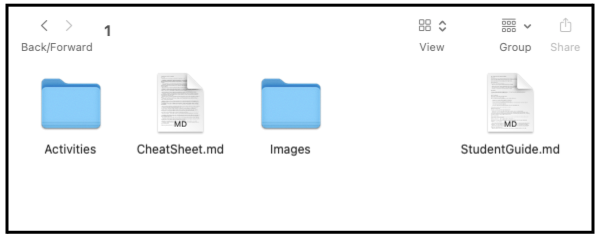
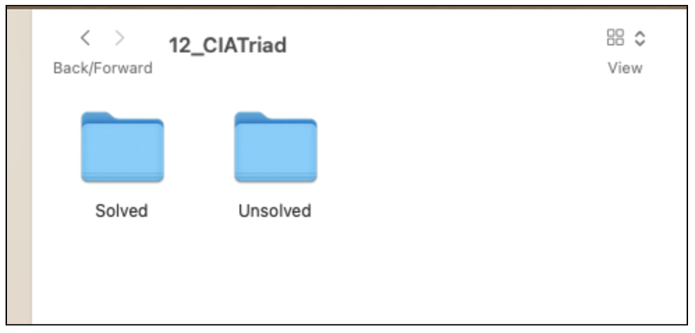

# Cybersecurity Classroom Workflow

## Sample Workflow

Every class is different, but this workflow walkthrough is a starting point for instructors to develop their own classroom plan

### Before Class
- Do a complete walkthrough of all technical activities 
    - **IMPORTANT!** - Make certain you are using the same environment that your students will be using
    - Doing the activities on your host machine, or using host-based versions of the tools might be faster, but the instructions are written around specific environments.  Not all students will have local copies of the software and you cannot control for version consistency (Example: Wireshark for Linux, Windows, and Mac all look slightly different and toolbar locations change)
- Make note of any pain points or inconsistencies in the activities to avoid being caught off-guard during class
- Reset virtual machines/web labs after walkthrough
    - **IMPORTANT** - Many activities will show different results on a second walkthrough (example: John the Ripper will not crack the same hash twice, but will direct you to run the `--show` flag to view passwords that have already been cracked)
    - Resetting the environment will allow students to follow along during the activities

### Upload Student Documents
- Before class, upload student documents to the student Gitlab Repository  (Different from Github)  Prior to start of cohort, your SSM should have provided you with a link to your classes’ specific repository (Ex: https://asu.bootcampcontent.com/)
- Upload the following documents
    - Student Guide (contains link to slide deck)
    - Resources Folder
    - Images Folder
    - Activities Folder
        - **IMPORTANT** - Before class upload `Unsolved` folders only!
- Do not upload the `Lesson Plans` or `Solved` folders!

NOTE: Be careful to maintain a consistent file structure when uploading files

Top Level - 01-Lesson Plans and 02-Homework (NOTE: Current Version no longer has a `vagrant folder`)

Next - Sort by Modules

Then - Sort by Day

Finally - Folders for each day

This ensures that all the links in the student guide will be consistent 

At this point, the links to any resources or images will work.  Students will be able to access the activities from within the student guide

### After Class

Once class is over upload the solution folders for the activities folders used in class

This will allow students to go back and review with access to the solution files

**LASTLY** - As soon as possible after class (Usually available within a few minutes of office hours ending) publish the Zoom link for your class

## Other Notes:
- This is a guide - use your best judgment based on your class and students to modify this workflow
    - Example - If your students are motivated to get ahead, you can post the activity files and student guide for the next class when you post the solutions for the current class.
        - Posting ahead for Projects is not recommended as many of the resources may not be available until the day of class
- Document issues in the material
    - Use the [Bootcamp Feedback Form](https://docs.google.com/forms/d/e/1FAIpQLSd1xVOLdgeyaCyoIBgSuA3G0qARN5OehjucRtnePNq8_tqEsw/viewform) to document any issues or curriculum enhancement requests
        - **IMPORTANT!** - The 05 Slack Channel is great for identifying specific issues for fellow instructors, but the curriculum team prioritizes updates based on the feedback form.  Requests for corrections/enhancements often get lost the noise of the channel
- Set expectations for your students early on to avoid confusion.  Between Github, Gitlab, and Canvas, our students can be overwhelmed early on - establish best practices in the early modules
    - Review the student guide before class - This will provide students with:
        - The slides
        - A walkthrough of the class
        - Links to the activities in class
        - Links to solutions to the activities after class
    - Review the class specific Gitlab before class - This will provide students with:
        - Any files in the Resource folder that may not be linked in the activities
        - Any ‘cheat sheets’ that are included in the activities
- Taking a few minutes early on to walk students through the resources will help reinforce the material covered during the pre-work will pay off later as students will know exactly what resources are available for each class before class starts
 
