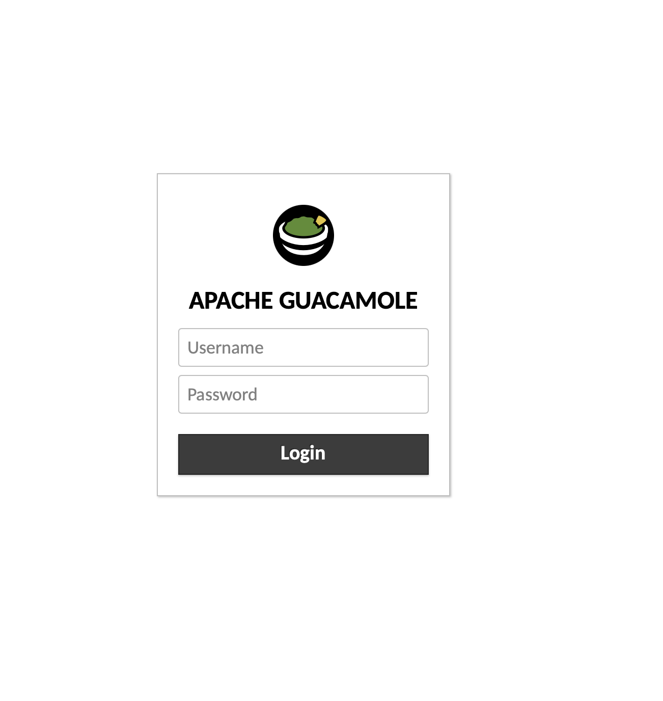
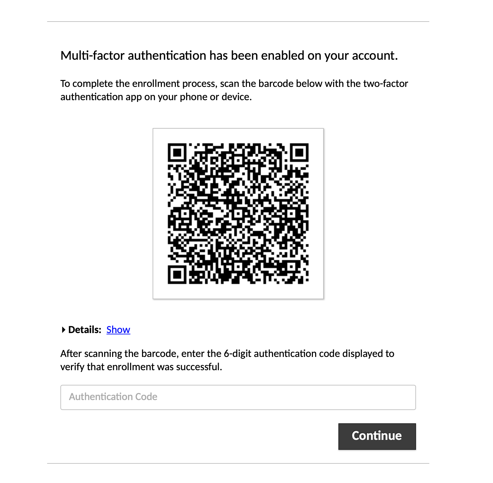
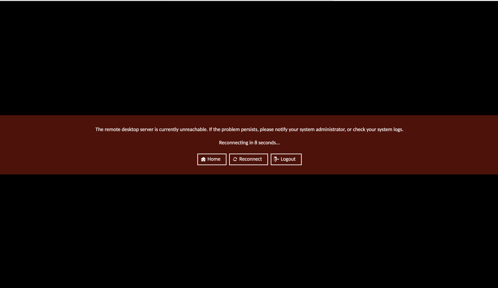
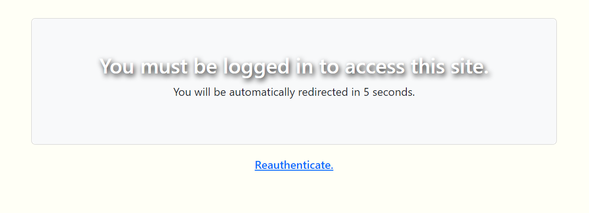
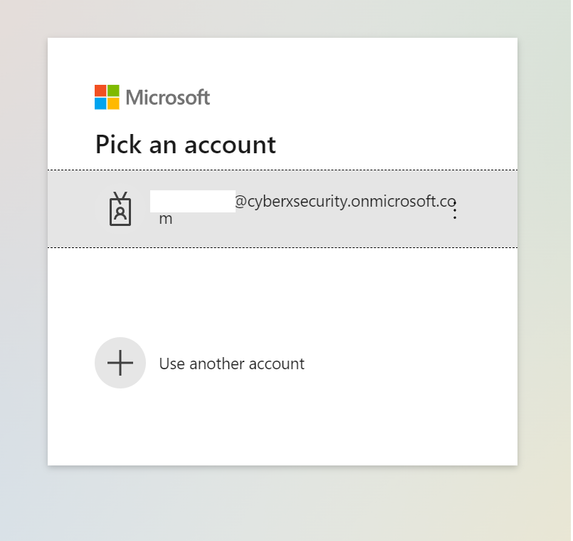

## Web Labs / Student Portal Guide

**Web Labs**

### 01. Signing into to Web Labs

Your instructor will Slack you your initial credentials.

**NOTE:** There are two different usernames and passwords that will be sent to you

- A username and password for the WebLabs
- A username ending in `@cyberxsecurity.onmicrosoft.com` and password for the WebLab on/off and reset.

To connect to the web lab, go to this [link](http://cybersecurity.vmportal.org/).  

Be sure to bookmark this URL as you will use it throughout the entire course.

- Log in with the first set of credentials provided. 
	
	
	
- Once you login, you will be asked to change your password.

	

- You will then be asked to set up multi-factor authentication.

	
	
	### Important Notes on Multi-factor Authentication ###

- Not all Authenticators will work with Guacamole!

	- The following authenticators **do not** work at this time:

		- Authy
		- Microsoft Authenticator
		- Google Authenticator (on Apple iOS devices)

	- The following authenticators have been tested and currently work:

		- Last Pass Authenticator: [Google Play Store](https://play.google.com/store/apps/details?id=com.lastpass.authenticator&hl=en_US&gl=US&pli=1), [Apple App Store](https://apps.apple.com/us/app/lastpass-authenticator/id1079110004)
		- Google Authenticator: (Android Only - Does not work on iOS devices) [Google Play Store](https://play.google.com/store/apps/details?id=com.google.android.apps.authenticator2)
		- Authenticator Chrome Extension: [Authenticator.cc](https://authenticator.cc/)

	---

	:warning: Disclaimer: Our recommendations for third-party authentication apps are provided as suggestions only, and we assume no liability for any breaches of security, data leaks, or unauthorized access that may occur. It is your responsibility to evaluate and select the authentication app that best suits you, and we encourage you to stay informed about security best practices. By using our recommendations, you acknowledge and accept these terms.
		
	---

### 02. Accessing Web Labs

- After logging in, ensure you can access the Ubuntu VM by double-clicking on it.

	

- You should see the default Ubuntu desktop. If prompted for credentials for 'sysadmin', the password is **cybersecurity**.

	

- If you see the following screen, the WebLab is not currently on.  Once you complete the student portal section below, you will be able to turn the machine on.

	

	
### 03. Web Lab Usage

Web labs use a service called **Guacamole** to render the virtual machine in your browser. 

- In order to copy/paste from Guacamole, press ctrl+shift+alt (Windows) or ctrl+command+shift (Mac)
	
	
	
- There shouldn't be a reason to tamper with any settings within Guacamole unless instructed to do so. 

**Student Portal**

- To access the **student portal** go to the following URL: https://control.vmportal.org (**Note:** Bookmark this site)
- Unless you have already logged in, you will be redirected to authenticate

**NOTE:** If you have other Microsoft accounts on your computer, there may be issues with logging in.  Try using an incognito browsing window and logging in again.

  
- You will then recieve a Microsoft prompt to login with your provided credentials

- After logging in, you will see the following page with your labs.
    - **Lab Toggle** - This can be used to turn on and off your lab during non class hours
       - Note your lab will automatically be turned on during class hours
    - **Lab Reset** - This will reset all your Lab setting and remove all files and anything saved within your lab.
        - - If the VMs within Guacamole become corrupted or have a major issue, you can utilize this option.

**NOTE:** If the WebLab does not start within a few minutes, try toggling the lab off and on again.

---

© 2023 edX Boot Camps LLC. Confidential and Proprietary. All Rights Reserved.    
