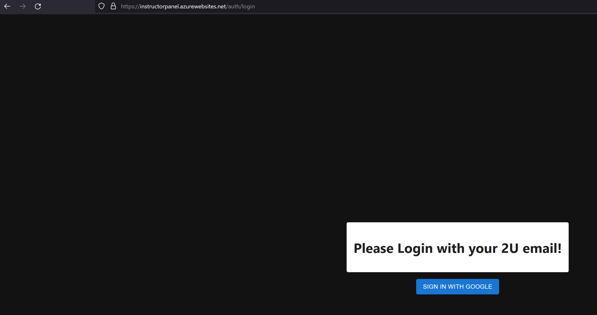
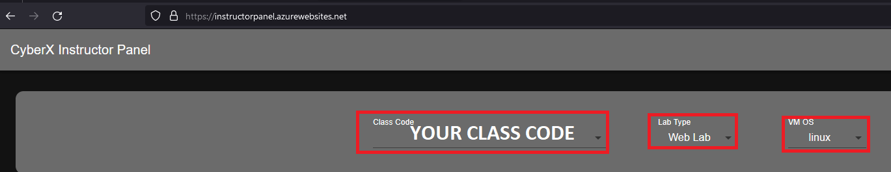
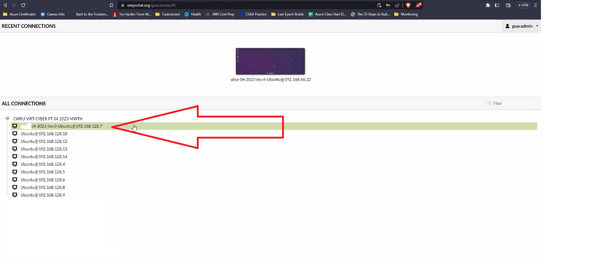
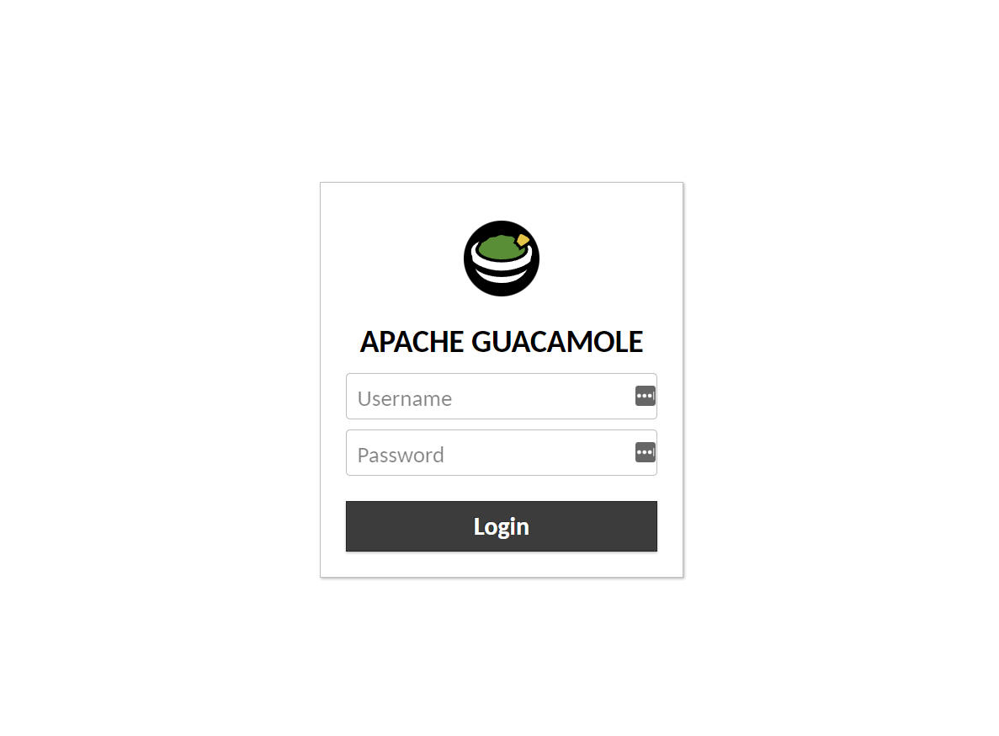
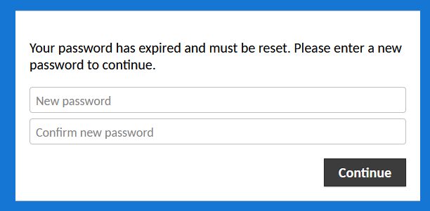
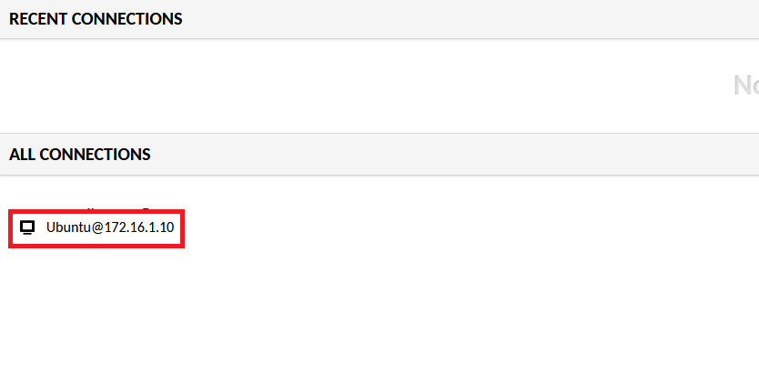
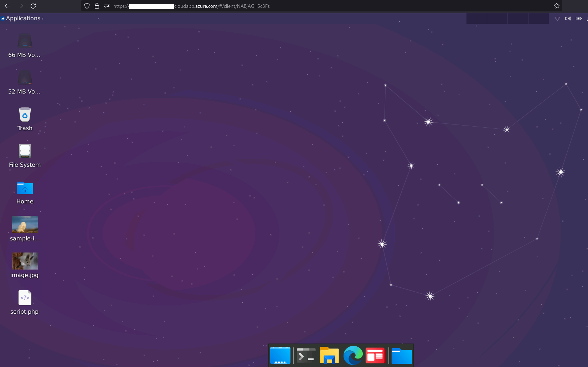
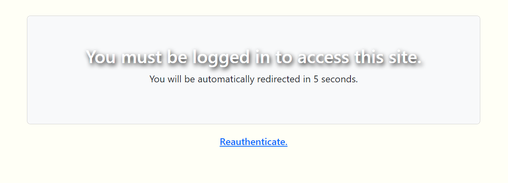
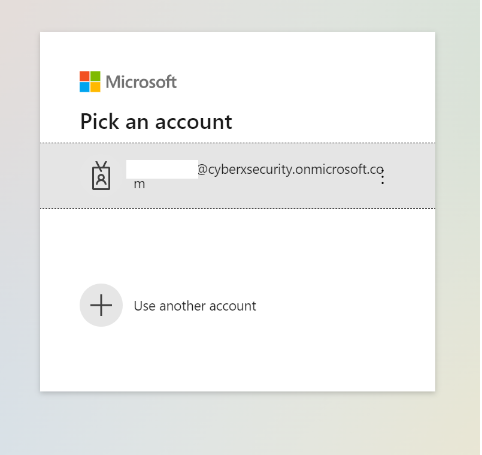
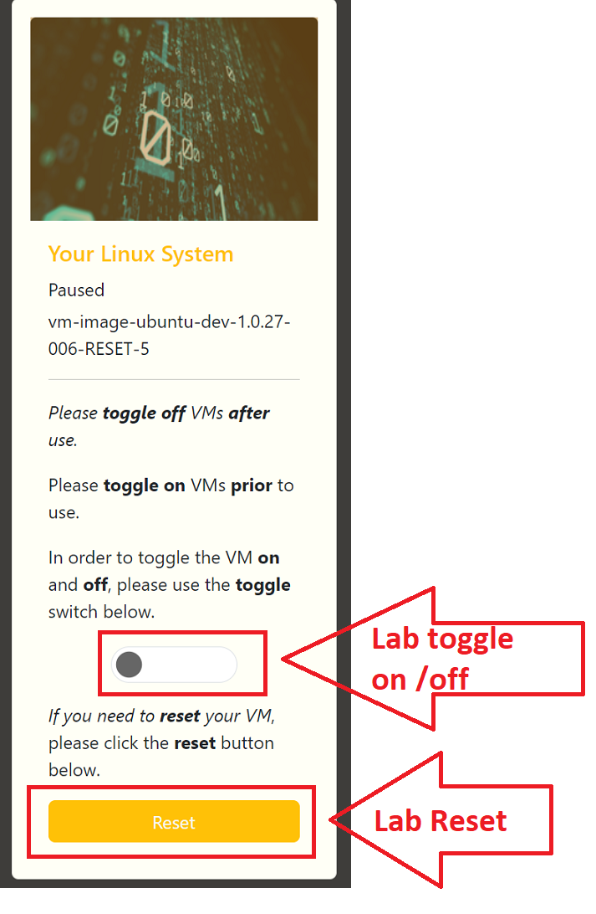

## 2.2 Lesson Plan: Risk Management and Threat Modeling

### Overview

Today's class will introduce students to **cyber risk management** and **threat modeling**.

### Class Objectives

By the end of today's class, students will be able to:

- Identify threat agents, possible attacks, and exploitable vulnerabilities relevant to a given asset.

- Prioritize risks based on likelihood and impact potential.

- Choose and justify controls for a given risk.

- Login and access their web labs

### Instructor Notes

Today's lesson will use the **OWASP Threat Modeling** protocol and its subsequent steps in order to approach  cyber risk management and threat modeling.

- You will use a macro-enabled, risk analysis spreadsheet that includes a heat map: [Risk Analysis Template](https://docs.google.com/spreadsheets/d/1ahV3yTix33JWxdQz1eXxl3BlHgDiKDwZ/copy)

- When opening this document, you will be asked to create a copy.

### Instructor Lab Environment Setup

You will set up the Guacamole Web Lab environment today and walk students through logging into their Web Lab VM. While you won't use the environment until next week, it's important to set it up now to ensure any issues can be solved as early as possible.
- Be sure to leave 10&ndash;15 minutes to introduce the Web Lab and Student Portal to the class

- Navigate to the [Instructor Administrative Site](https://instructorpanel.azurewebsites.net/) and login with your @instructors.2u.com email address. 

	

- From the dropdown menu, select your class code and choose "Web Lab" as the Lab Type, with the VM OS as "linux".

	
   
- The table will then populate with the students' names, usernames for the Web Labs, and the default password ("password"). From here, as the instructor, you have the opportunity to also reset the VM and the students' passwords if needed.

	.png) 
	
- Copy and paste the 'Lab URL' and send it out to students via Slack along with the table of their credentials.
  - You can download the list of student credentials by selecting "DOWNLOAD CSV".
  
-  Students will be prompted to change their credentials when logging in for the first time.

### Instructor Lab Access

To access the instructor's lab for demonstrations and activities:
- Login with your instructor credentials.
- Under "All Connections", select the option that has the letters "ins" in the computer name.
   - Note that all the other options are the student labs, separated out by IP address.

 

### Module Day 2 Contents

- [x] [01. Instructor Do: Welcome and Overview](LessonPlan.md#01-instructor-do-welcome-and-overview-005)
- [x] [02. Instructor Do: Introduction to Threat Modeling and Risk Management](LessonPlan.md#02-instructor-do-introduction-to-threat-modeling-and-risk-management-020)
- [x] [03. Student Do: Threat Modeling Steps 1&ndash;4](LessonPlan.md#03-student-do-threat-modeling-steps-1–4-025)
- [x] [04. Instructor Review: Threat Modeling Steps 1&ndash;4 Activity](LessonPlan.md#04-instructor-review-threat-modeling-steps-1–4-activity-010)
- [x] [05. Instructor Do: Risk Analysis](LessonPlan.md#05-instructor-do-risk-analysis-030)
- [x] [06. Break](LessonPlan.md#06-break-015)
- [x] [07. Group Do: Threat Modeling Step 5 &ndash; Risk Analysis](LessonPlan.md#07-group-do-threat-modeling-step-5-–-risk-analysis-030)
- [x] [08. Instructor Review: Threat Modeling Step 5 &ndash; Risk Analysis Activity](LessonPlan.md#08-instructor-review-threat-modeling-step-5-–-risk-analysis-activity-010)
- [x] [09. Instructor Do: Mitigating Risk](LessonPlan.md#09-instructor-do-mitigating-risk-010)
- [x] [10. Group Do: Threat Modeling Step 6 &ndash; Mitigating Risk](LessonPlan.md#10-group-do-threat-modeling-step-6-–-mitigating-risk-015)
- [x] [11. Optional Instructor Review: Threat Modeling Step 6 &ndash; Mitigating Risk Activity](LessonPlan.md#11-optional-instructor-review-threat-modeling-step-6-–-mitigating-risk-activity-000)
- [x] [12. Class Do: Web Labs Introduction](LessonPlan.md#12-class-do-web-labs-introduction-010)

### Slideshow 

The lesson slides are available on Google Drive here: [2.2 Slides](
https://docs.google.com/presentation/d/1U_kYxhdpLY6uSvRvo9Bxd_6c-F09lLsZjTqGflJ7Y6Y/edit?usp=drive_link).
- To add slides to the student-facing repository, download the slides as a PDF by navigating to **File** > **Download as** and choosing **PDF document**. Then, add the PDF file to your class repository along with other necessary files.

- **Note:** Editing access is not available for this document. If you or your students wish to modify the slides, please create a copy by navigating to **File** > **Make a copy**.

### Time Tracker

The time tracker is available on Google Drive here: [2.2 Time Tracker](https://docs.google.com/spreadsheets/d/1RKy_tQXA4UdF4pO0AD_N7AlMenfKAam9k2CbzY2olHY/edit#gid=1145703143)

### Student Guide

Send the class the student-facing version of the lesson plan: [2.2 Student Guide](StudentGuide.md)

---

### 01. Instructor Do: Welcome and Overview (0:05)

This section will serve as a brief review of the topics and scenario of last class as well as a broad introduction to threat modeling and risk management.

- Welcome students to class and briefly review topics covered in the previous class:

  - The roles and responsibilities of the **Security Department**

  - Applying the **security culture framework** to build a plan for improving an organization's security culture

  - Identifying appropriate security controls for a given resource and situation

Inform students of the following:

- You will continue the GeldCorp scenario from last class. GeldCorp is a financial technology firm experiencing a physical breach. 

- As hired consultants, you developed a security awareness training plan for GeldCorp employees.

- This incident suggests GeldCorp might be facing other serious risks, which it should address before they get exploited again.

Today's class will introduce **risk management** and **threat modeling** as methods of identifying, anticipating, budgeting, and planning for when risks occur.

- These tools will allow us to:

  - Enumerate possible risks, threats, and vulnerabilities to a company.

  - Identify the most likely and most serious risks.

  - Evaluate the impact the occurrence of a serious risk may have.

  - Develop strategies for monitoring or mitigating risks.

- Emphasize that these skills will augment our knowledge of technical infrastructure protection, with an emphasis on evaluating **what** to protect.

- Present the daily objectives, and take a moment to address remaining questions before proceeding.

[<- Back to Module Contents](LessonPlan.md#module-day-2-contents)

---

### 02. Instructor Do: Introduction to Threat Modeling and Risk Management (0:20)

#### Risk Management and Threat Modeling

Review the basic security elements of vulnerabilities, threats, and risks and how they apply to the practical business tasks of risk analysis, risk management, and threat modeling.  

- Review the definitions of the terms vulnerability, threat, and risk:

  - A **vulnerability** is an aspect of a business that can be exploited to compromise a system's CIA (confidentiality, integrity, or availability).

  - A **threat** is an actor that might exploit a vulnerability. Threats can be intentional (a malicious hacker steals data), unintentional (an incompetent sysadmin destroys the network), or due to a natural disaster.

  - A **risk** is the possibility of losing something valuable. Equivalently, a risk will cost money if it occurs.

Now, explain the common business practices that organizations employ to understand, manage, and forecast these elements:  

- Define **risk analysis** as the practice of understanding what risks an organization faces, which are most severe, and which are most likely.

- Define **risk management** as the practice of using the results of such an analysis to determine how to deploy personnel and spend budget.

- Define **threat modeling** as the practice of determining which attacks an organization is most likely to experience,  who is most likely to launch them, and what can be done to stop them.

Emphasize that these practices directly relate to a business's pursuit of profit:

  - Risk analysis is important because it quantifies how much a business needs to spend in the event of a given security breach. Therefore, businesses can plan for setbacks before they occur.

  - Threat modeling is important because risks come with a price, which the business will have to pay if the threat is realized. Threat modeling allows the business to prioritize the most expensive risks. 

Explain that threat modeling is so essential to running a business that the results are funneled upwards to executives to influence business decisions.

Continue the lesson, focusing on how to perform threat modeling.

#### Threat Modeling Methodologies

Explain that there are multiple approaches to threat modeling. Security professionals often refer to the following industry standard frameworks for the general steps of the process:

  - **PASTA:** Process for Attack Simulation and Threat Analysis. This aims to align consideration of business objectives with technical requirements.

  - **STRIDE:** Spoofing, Tampering, Repudiation, Information disclosure, DoS (Denial of Service), Elevation of Privilege. This focuses on identifying what can fail in the system being modeled.

  - **OWASP:** Open Web Application Security Project. This focuses on identifying possible threats, prioritizing risks, and planning mitigation strategies. It is mainly applied to the analysis of applications, such as web or desktop apps.

Explain that each methodology is relevant in different situations. A bank might opt for PASTA, which gives greater consideration to the business being modeled, while a pentesting firm would probably opt to use STRIDE or OWASP. We are likely to run into more than one of these during our professional careers.

Explain that this lesson focuses on the OWASP Threat Modeling process.

#### OWASP In-Depth

Explain that the OWASP process consists of six steps: 
1. Determine Assessment Scope.
2. Identify Threat Agents.
3. Identify Possible Attacks.
4. Identify Exploitable Vulnerabilities.
5. Rank/Prioritize Risks.
6. Mitigate Risks.

Provide a brief overview of each step:

1. **Determine Assessment Scope:** List the assets under consideration, determine their value, and define objectives for your threat modeling assessment.
    
    - **Asset value** is the monetary worth of a given asset. For assets like web applications, asset value should represent how much revenue and profit the asset generates.

    - An **objective** is the metric that the business wants to achieve, such as reducing the incidence of DoS attacks against its servers. 
  
2. **Identify Threat Agents:** A **threat agent** is a person or group that can actualize a threat, whether they are malicious or not. 
  
    - Examples include advanced persistent threats (APTs), script kiddies, employees who open phishing emails, and even incompetent users who break configurations on company computers.

3. **Identify Possible Attacks:** Identify the attacks that each threat agent is likely to perform, based on how much skill and funding they have. 
  
4. **Identify Exploitable Vulnerabilities:** Identify ways for data to enter and exit the system. 
  
   - For example, a web application takes information in from users and sends information back out in response to requests. Consider ways attackers might exploit these points of entry and exit.
  
5. **Rank/Prioritize Risks:** Rank which potential attacks are most severe and most likely to occur.
  
6. **Mitigate Risks:** Determine ways to mitigate the most serious risks you identified.

Inform students that they'll have an opportunity to practice each of these six steps throughout today's exercises.

Proceed by discussing the first four steps in more detail.

#### Step 1: Determining Scope

Explain that determining scope aims to identify which assets an organization wants to assess. 
  
- Organizations often consider one specific category of risk at a time. 

- For example, they might perform a risk analysis to specifically assess the weakness of their network infrastructure, and **not** think about their application security. 

- When an organization focuses on specific subset of its assets, it is adjusting scope.

- Scope is important because it tells risk analysts what they should focus on and what they can ignore.

Scoping begins with **asset inventory**. 
  
- Asset inventory is the process of identifying and assigning an asset value (financial worth of an asset) to all of an organization's assets. 

- For assets like a web application, asset value might be measured as the revenue and/or profit it generates. A secret recipe might be valued as the amount of revenue generated by that particular dish, plus however much the business gains by being the only one to offer it.

- Determining scope usually results in a spreadsheet or a written report.

Explain the following to students: 
-  Today's exercise scenario will focus on analyzing GeldCorp's internal corporate and web application networks. The assets we'll focus on are the business's servers and databases.

- You will not have to go through the scoping step yourself, as you have already been provided with a description of GeldCorp's networks.

#### Step 2: Identifying Threat Agents

Explain that analysts identify threat agents by determining which attackers would be interested in the relevant assets. Analysts also consider "unwitting" sources of threats, such as incompetent employees and natural disasters. However, these unintentional threat agents will not be the focus of today's discussion.

  - For example: Threat agents faced by Facebook are script kiddies, APTs, and disgruntled insiders.

#### Step 3: Identifying Potential Attacks

Explain that analysts identify which attacks the threat agent would most likely perform.

  - For example: A script kiddie would have different goals than a disgruntled employee. Therefore, they would use different attacks. As such, these are different risks and must be considered separately.

Analysts often consider each threat agent's motivation, skill level, and level of funding when determining which attacks they'll attempt.

  - For example: Suppose a client's web application is taken offline by a DoS attack. The severity of this risk depends on the threat agent:
  
    - A script kiddie might DoS a server simply to cause trouble.
  
  - An APT, on the other hand, might DoS a server as a smokescreen while they break in elsewhere to steal trade secrets.

#### Step 4: Identifying Exploitable Vulnerabilities and Points of Failure

Finally, analysts evaluate the system for ways malicious attackers can deliver these attacks and which parts of the system are likely to suffer security failures.

  - For example: If your network uses one database to store all data, the entire company will lose access to all data if that single machine goes down. An attacker seeking to DoS the company's network can exploit this database to achieve their goal.

#### Summary

Review the steps of the OWASP threat modeling process and their corresponding action items:

  - **Determining Assessment Scope:** Identify all relevant assets and their financial values.

  - **Identify Threat Agents:** Identify potential attackers who might be interested in these assets and possible unwitting sources of risk.

  - **Identify Potential Attacks:** Identify attacks that these threat agents are most likely to use.

  - **Identify Exploitable Vulnerabilities:** Identify areas in the system most vulnerable to these kinds of attacks.

Inform students that they'll have an opportunity to practice applying these four steps in the next exercise.

Take a moment to address questions before proceeding.

[<- Back to Module Contents](LessonPlan.md#module-day-2-contents)

---

### 03. Student Do: Threat Modeling Steps 1&ndash;4 (0:25)

In this activity, students will learn more about GeldCorp's business operations and assets and then apply steps 1&ndash;4 of the OWASP Threat Modeling Process.

Explain the following:

- You will play the role of security consultants contracted to advise a financial technology firm called GeldCorp.

-  Because of a major breach that the finance department experienced, the assignment is to help GeldCorp better understand where its core networks are most vulnerable to attack and advise it on what is most important to protect.

- In this specific activity, you’ll read about the business and its assets, then apply Steps 1&ndash;4 of the OWASP Threat Modeling Process.

:globe_with_meridians: This activity will use breakout rooms. Assign students into groups of 2&ndash;4 and move them into breakout rooms. 

Send students the following file: 
- [Activity File: Threat Modeling Steps 1-4](Activities/03_Threat_Modeling/Unsolved/README.md)

[<- Back to Module Contents](LessonPlan.md#module-day-2-contents)

---

### 04. Instructor Review: Threat Modeling Steps 1&ndash;4 Activity (0:10)

:bar_chart: Using [Zoom's](https://support.zoom.us/hc/en-us/articles/213756303-Polling-for-meetings) or [Slack's](https://slack.com/help/articles/229002507-Create-a-poll-) poll feature, conduct a comprehension check to evaluate how well students completed the activity. 

This activity had students apply the first four steps of the threat modeling process to a business scenario.

Distribute the solution file and use it to review:

- [Solution Guide: Threat Modeling Steps 1-4](Activities/03_Threat_Modeling/Solved/README.md)

Note that not all students will be familiar with the possible attack and exploitable vulnerabilities listed in the solution file.

- At this point in the program, there is no need to go in depth into the nuances of these attacks (as students will learn more about them in future modules).

- Instead, keep the discussion high level and focus on students' critical thinking abilities.

#### Walkthrough

- **Step 1**: Determine Assessment Scope

    - We completed Step 1 by reading the provided information and familiarized ourselves with the assessment scope.  

- **Step 2:** List three threat agents relevant to the intranet.

    - Script kiddies

    - Organized cybercriminals

    - Insider threats

- **Step 3:** List three potential attacks against the intranet.

    - **Phishing:** An attacker might try to gain access to the private intranet by phishing employees.

    - **Malware:** Attackers might use malware to infect the intranet. For example, they may infect it with ransomware.

    - **Physical attacks:**  Attackers might be able to gain physical access to the building.

- **Step 4:** Identify three possible vulnerabilities in the intranet, and rank them in order of severity. Explain how each one could be exploited.

    - **No content filter:** Employees can download files from any site they want. This makes it much easier for attackers to introduce malware.

    - **Poor access control policies:** Every employee in a department should not have access to all of that department's data.

    - **Older workstations:** Windows 7/8 machines are more vulnerable than newer versions.

### Bonus: Web Application Infrastructure 

- List three threat agents relevant to the web application:

    - **Script kiddies** are a risk to any website. They are unsophisticated and don't have a lot of money, so they're fairly harmless unless there are easily exploitable vulnerabilities in the client-side web application.

    - **Organized cybercriminals** might specifically target GeldCorp because it manages money and equity transfers. These attackers are well-motivated and skilled enough to identify and exploit subtle security holes.

    - **Insider threats** are worth considering. Recall that all employees in a given department can access all of that department's data. This means that an engineer on the front-end web team would be able to read the code behind the automated trading algorithms, which the company considers top secret. This is a problem, because that engineer can now leak those secrets, even though they didn't need access to them in the first place.

- List three attacks that threat agents might attempt against the web application. Explain what the attacker gains from the attack.

    - **DDoS:** The trading platform must respond to the market in real time. Taking down the web application through a DDoS attack would seriously impact the business's reputation. This is most likely to come from script kiddies.

    - **Dumping the database:** Attackers might attempt to use SQL injection to dump the database to steal social security numbers. Both script kiddies and more sophisticated attackers might try this attack.

    - **Cross-site scripting (XSS):** With cross-site scripting, an attacker can execute malicious code into a vulnerable web page.  Depending on the code,  attackers can execute a number of attacks, including the transmission of sensitive data such as cookies and session information, redirecting the victim to malicious web content, or compromising the victim’s machine.

- Identify three possible vulnerabilities in the web application infrastructure, and rank them in order of severity. Explain how each one could be exploited.

    - The **app server** is probably vulnerable to XSS vulnerabilities. These can be used to steal user cookies and hijack their sessions.

    - The **database** is probably vulnerable to SQL injection. This could be exploited to dump confidential PII.

    - GeldCorp did not state that the database was encrypted. If attackers dump the database, they'll immediately have access to confidential PII in plaintext.

[<- Back to Module Contents](LessonPlan.md#module-day-2-contents)

---

### 05. Instructor Do: Risk Analysis (0:30)

:warning: **Heads Up:** This section covers math formulas. Be prepared to allocate a little extra time answering questions during this section.

Explain that this section will focus on risk analysis, and explain the process of prioritizing attack possibilities.

Point out that some of the possible threat agents and attacks identified in the previous exercise are more likely than others. The goal of these first four steps was to identify all possible threats, including unlikely ones.

  - For example: script kiddies are likely to account for the majority of attacks an organization experiences, simply because they're so numerous.

  - For most organizations, organized cybercriminals aren't a major threat actor. They are more relevant to financial organizations, branches of government, and military targets.

- Explain that **risk analysis** is the process of prioritizing these possibilities according to their potential impact and likelihood.

Provide the following scenario to contextualize risk analysis:

  - You've identified over 10 potential attacks that GeldCorp should consider. All can be mitigated, but it costs upwards of $2,500 to implement each fix. The Security Department only has $10,000 budgeted for this project, and needs advice on which four fixes would have the greatest security benefit.

Let students know that you'll proceed by exploring:

  - Qualitative vs. Quantitative Risk Analysis

  - Likelihood, Impact, and Loss Expectancies

  - Risk Factor and Heat Maps

#### Qualitative vs. Quantitative Risk Analysis

Explain that risk analysis can be conducted in one of two ways: qualitatively or quantitatively.

- Define **qualitative risk analysis** as the process of prioritizing risk based on intangible factors.

- Define **quantitative risk analysis** as the process of evaluating each risk based on its measured likelihood and impact.

    - **Likelihood** is the probability that the event will occur and **impact** is a measure of how bad it would be.

    - There is an additional metric, called **risk factor**, which is the number you get from multiplying likelihood by impact.

    - For example, if a risk has a likelihood of 20 and an impact of 20, its risk factor would be 400.

- :question: **Ask class:** What is the risk factor for a likelihood of 10 and an impact of 30?

    - **Answer:** 300

Explain that not every scenario is easily qualitative. Likewise, other scenarios are difficult to quantify. In the next section, differentiate between scenarios that call for each risk analysis methodology.

#### Qualitative Risk Analysis

Qualitative risk analysis is useful because accurately assigning likelihood and impact can be difficult, if not impossible.

  - It's impossible to calculate a precise probability that some malicious attacker, somewhere in the world, will attack your servers within the next four quarters.

  - It's impossible to precisely determine the fallout of a breach. For example, a company might face the risk of a DDoS attack against its core web servers. The cost of this attack depends on how long the attack lasts, which is impossible to determine ahead of time.

Explain that qualitative analysis is typically much faster than quantitative risk analysis and it might be just as effective for high-level problems.

  - For example: a baking company might be deciding between an inexpensive VPN service that logs traffic on its servers for internal use and a more expensive service that does **not** keep any logs.

  - In this case, a simple qualitative analysis might lead to the conclusion that the less expensive VPN is suitable, since it shouldn't much matter if non-confidential information is being logged.

  - A defense organization, on the other hand, would probably opt for the more expensive service, as it would prefer to leave no traces.

In either case, a complex evaluation of cost versus benefit is unnecessary.

#### Quantitative Risk Analysis

On the other hand, there are circumstances where intuitive analysis is insufficient. The following scenarios require quantitative analysis:

  - The Security Department wants to invest in protecting an organization's infrastructure. In order to secure money from the Finance Department, they must justify their ask. So, they present a quantitative risk analysis to demonstrate that the cost of **not** investing is much greater than the budget they're requesting.

  - The Executive Team needs to decide whether to migrate to a new cloud provider as part of negotiations with a potential partner. This transition has major financial implications, so they wouldn't make the decision without an accurate assessment of potential losses due to downtime, retraining, or risk of data corruption during migration, etc.

Reassure students that risk analysts use a well-defined methodology to determine the likelihood and potential impact of a given risk.

- :question: **Ask class:** What's the main difference between qualitative and quantitative analysis?

    - **Answer:** Quantitative analysis focuses on hard, numerical data. Qualitative analysis focuses on the aspects that cannot be measured through numerical data. 
    
#### Asset Value and Exposure Factor

Explain that in order to perform quantitative risk analysis, analysts start by calculating how much it costs if an asset is breached. To calculate this, they first quantify **asset value** and **exposure factor**.

- We've previously covered that **asset value** is how much money the asset is worth in dollars.

  - In the case of a web application's core application server, the asset value would probably be the **amount of revenue or profit** generated by that server, **not** the price of the server itself.

- Analysts also consider how exposure to an attack can result in either partial/temporary or complete/permanent destruction of an asset. For example, a DDoS attack might take down a server for a few hours, whereas a fire would destroy it for good.

- Analysts quantify this **exposure factor** by measuring "how much" of an asset will be affected in the event of a breach.

  - Exposure factor is always somewhat subjective. Analysts should start by estimating whether the occurrence of a risk would completely eliminate (1.0), mostly eliminate (0.75), half eliminate (0.5), partially eliminate (0.25), or not affect (0.0) an asset's ability to function.

  - For instance, consider the risk of attackers DDoS-ing one of an organization's web application servers. If the network has another backup server, the exposure factor might be 0.5, because the attack takes down roughly half of the application's ability to generate profit.

  - For the risk of attackers DDoS-ing all of an organization's application servers, the exposure factor would be 1.0.

- :question: **Ask class:** A mail server that's reduced to 0% functionality during a power outage has an exposure factor of what? 

    - **Answer:** Exposure factor of 1

#### Loss Expectancies

Explain that **loss expectancy** is a measure of how much money an organization will lose in the event of a given breach.

- There are two common methods of measuring loss expectancy:

  - Single loss expectancy (SLE)

  - Annual loss expectancy (ALE)

Explain that analysts use exposure factor and asset value to calculate the number they're actually interested in: **single loss expectancy (SLE)**.

- Define **single loss expectancy** as the estimated cost of the occurrence of a risk on a given asset.

   - It is calculated as: SLE = AV x EF, where SLE is single loss expectancy, AV is asset value, and EF is exposure factor.

  - **SLE** is the estimated cost each time the risk occurs. If it happens twice, the total cost would be twice the SLE.

- Define **annual loss expectancy** as the metric determining the cost of a risk re-occurring.

  - It is calculated as: ALE = ARO x SLE, where ALE is annual loss expectancy, ARO is annual rate of occurrence, and SLE is single loss expectancy.

- Define **annual rate of occurrence** as an estimate of how many times a risk is likely to occur in a given year.

  - For example: you might assume a physical break-in would only happen once per year at most. However, you should guess that phishing attacks could happen as often as monthly.

  - **ARO** is calculated as follows: ARO = X / years, where ARO is annual rate of occurrence, X occurrence(s), and years is per number of years.

    - (ex. 1) 2 attacks every 3 years is ARO = 2 / 3. ARO would be 0.67.
    - (ex. 2) 1 attack every 2 years is ARO = 1 / 2. ARO would be 0.50.

- :question: **Ask class:** With an asset value of $10,000 and an exposure factor of 0.5, what would the single loss expectancy be?

    - **Answer:** SLE = AV x EF (10,000 x 0.5 = 5,000).

Explain that loss expectancy can be used to categorize a breach's impact as marginal, notable, severe, or catastrophic.

  - **Marginal:** The organization has sufficient resources to respond to the breach immediately without affecting day-to-day operations or revenue.

  - **Notable:** The organization has sufficient resources to respond to the breach, but may not be able to do so immediately. It may experience interruptions to operations.

  - **Severe:** The organization experiences serious interruptions to operations and does not have sufficient monetary and/or personnel resources to respond to the breach effectively. It may have to defer revenue, delay project timelines, reassign employees, and/or hire consultants to address the issue.

  - **Catastrophic:** The organization suffers severe, lasting damage to its reputation and/or infrastructure. The future of the business is threatened by reputational damage, bankruptcy, or being found in contempt of federal regulations, etc.

Let students know that different organizations use different categories and thresholds, and these categories will be used throughout today's lesson.

#### Risk Factor and Heat Maps

Explain that these assessments also make it possible to generate charts that make it easier to understand how risks "stack up". Today, we'll focus on risk matrices and heat maps.

- A **risk matrix** is used to compare how many of the risks an organization faces are mild to how many are severe.

- A **heat map** is a visual representation of the probability and likelihood of risks to an organization. Heat maps provide organizations with the capability to make strategic decisions designed to protect the company.

  - During a risk assessment, having the ability to visualize risks provides a holistic view of risks that affect an organization.

  - Heat maps display two relative values:

    - **Likelihood/Probability** is measured from left (low) to right (high).
    - **Impact** is measured from top (low) to bottom (high).
  
#### Demonstration: The Risk Spreadsheet

Explain that risk analysts typically use spreadsheets to automate the calculation of these metrics. In this section, we'll take a look at one.

1. Open the spreadsheet and conduct this activity in **Google Sheets**: 

   - [Risk Analysis Template](https://docs.google.com/spreadsheets/d/1ahV3yTix33JWxdQz1eXxl3BlHgDiKDwZ/copy) 
   
   - You will be asked to make a copy.

   - Once you have made a copy, call attention to  the tabs at the bottom of the sheet: **Risk Assessment Heat Map** and **Dropdown Keys**.

2. Click on **Dropdown Keys** and explain that this tab documents how GeldCorp categorizes probability (likelihood) and impact.

    - Probability is rated based on expected annual rate of occurrence.

    - Impact is rated based on cost. It falls into one of five categories: insignificant, minor, moderate, major, or severe.

  

3. Click the **Risk Assessment** tab and explain the columns:

    - **REF ID** The numerical ID for the risk

    - **DATE RAISED** When the risk was raised

    - **RISK DESCRIPTION:** A textual description of the risk

    - **LIKELIHOOD:** Probability that the event will happen (1-5 - Refer to the Dropdown Keys for Description)

    - **IMPACT:** Monetary impact of the event (1,2,4,8,16 - Refer to Dropdown Keys for Descriptiom)

    - **RISK SEVERITY SCORE:** Product of likelihood and impact

    - **NOTES:** Any additional notes for this risk

4. Explain that the score of 1-80 is used to map the categories of marginal, noticeable, severe, and catastrophic to numbers.

    - Note that this spreadsheet does not require you to explicitly calculate asset value, exposure factor, SLE, or ALE. You should estimate the ALE directly and use this to determine impact rating.

6. Explain that the **Heat Map** auto-populates as you fill in the **Risk Assessment** tab. 

7. Explain that in the **DATA TABLE**, Severity Score is auto-populated and ranked.

8. Explain that an organization will use this completed Heat Map to help prioritize the risks

Take a moment to address questions before proceeding.

[<- Back to Module Contents](LessonPlan.md#module-day-2-contents)

---

### 06. Break (0:15)

[<- Back to Module Contents](LessonPlan.md#module-day-2-contents)

---

### 07. Group Do: Threat Modeling Step 5 &ndash; Risk Analysis (0:30)

In this activity, students will fill out a spreadsheet and generate a risk matrix and heat map for GeldCorp.

Explain the following:

- In this activity, you will work on a Risk Template spreadsheet and will use the threats you identified in the previous exercise to fill in the nine most critical risks you can think of.

- You will fill out the description, probability, and impact cells for each risk.

- Using the other tabs in this sheet, you will look at how risky GeldCorp is and answer the following questions:

  - Which risks should be mitigated?
  - Which risks should be managed?
  - Which risks should be monitored?
  - Do these results align with expectations?

:globe_with_meridians: This activity will use the same breakout room groups as the previous activity. 

Send the following file: 

- [Activity File: Threat Modeling Step 5: Risk Analysis](Activities/07_Risk_Analysis/Unsolved/README.md)

[<- Back to Module Contents](LessonPlan.md#module-day-2-contents)

---

### 08. Instructor Review: Threat Modeling Step 5 &ndash; Risk Analysis Activity (0:10)

:bar_chart: Using [Zoom's](https://support.zoom.us/hc/en-us/articles/213756303-Polling-for-meetings) or [Slack's](https://slack.com/help/articles/229002507-Create-a-poll-) poll feature, conduct a comprehension check to evaluate how well students completed the activity. 

Use the sample solution template to review the activity. Results may vary:

- [Solution Guide: Threat Modeling Step 5: Risk Analysis](https://docs.google.com/spreadsheets/d/1v1QMihD0Y8C9bBFIFmdlZ9vIWQ0obubkHTK10KchteU/edit#gid=1384626883).

You may have identified different risks, so feel free to update the solved file. 

Point out the following 10 risks identified. (Again, update these if you modified the file): 

  - Engineer Steals Trading Algorithms from Technology Database
  - XSS Injection Used to Hook Web-App Users' Browsers
  - SQL Injection to Dump Web App Database
  - Brute-Force to Login to User Accounts
  - XSS Injection Used to Hook Corporate Intranet Browsers
  - Employee Steals Financial Data from Physical Server
  - Attacker Impersonates User in Financial Advisor Live Chat
  - Employee Downloads Backdoor Into Corporate Intranet
  - Finance Employee Downloads Backdoor Into Corporate Intranet

Review the likelihood and impact for each of these risks. Ask the class what risks they came up with and how they assigned their likelihood and impact.

[<- Back to Module Contents](LessonPlan.md#module-day-2-contents)

---

### 09. Instructor Do: Mitigating Risk (0:10)

Explain that analysts rank risks to clarify which threats are worth investing in solutions for. In the final section of the class, look at recommending controls for the most critical risks.

#### Deciding on Security Controls

Explain that determining an appropriate control entails answering the following questions:

  - **Required Control Type:** Should the control be physical, administrative, or technical? Should it be protective, preventive, deterrent, corrective, or detective in nature? Sometimes multiple types of controls might be appropriate.

  - **Required Strength of Control:** How strong does the control **really** need to be? An organization could require everyone to encrypt their disks and refresh their passwords weekly, but it probably doesn't need to.

  - **Cost of Implementation:** How much does the control cost, relative to how much protection it provides and how much is needed?

  - **Time to Implementation:** How long will it take to implement this control? Sometimes an imperfect but more immediate fix is better than a fully general solution you can only implement later.

Explain that in addition, we should consider what resources our clients have available when deciding on controls. Some organizations will be able to afford "proper" solutions, while others might only be able to implement something "good enough."

#### Mitigation Example

Provide the following scenario as an example of a risk mitigation method:

 
  - LifeNotes is a new medical records company that makes it easy for doctors from different hospitals to share medical records with each other. When they need to transfer a patient to another hospital or physician, they can use the application to send the patient's medical history, lab results, medication schedules, etc.  LifeNotes also ensures that doctors can only see records for their own patients.

    The app functions like "Google for medical records." To use it, doctors enter a password to log in, search for a patient by name, select the correct patient, and then view the patient's records.

    However, a client recently reported that they were able to load records for patients they were not assigned to. They noticed this because they accidentally clicked on the wrong search result, but were still able to load that patient's medical details.

    This violates regulatory standards for protecting patient medical information, and it must be resolved immediately.

Point out that this is a security issue because it violates client-data **confidentiality**.

:question: **Ask class:** Ask a few different students to suggest controls for this problem. 

Discuss the following example solutions:

- **Required Control Type**

  - Since this problem must be fixed immediately, LifeNotes must implement a corrective control. It should also implement protective controls to prevent the issue from reoccurring.

  - It can accomplish this with either administrative or technical controls.

- **Required Control Strength**

  - The corrective control must completely resolve the issue, since the bug means LifeNotes is in violation of the law.

  - The protective control(s) must completely prevent this issue from reoccurring, for the same reason.

- **Control:** LifeNotes can implement the following example controls:

  - As a corrective control, it can redeploy the older version of the application, which did not have this issue.

  - As an administrative preventive control, it can require doctors to transfer records to the target hospital and then have the hospital pass those records on to the specific doctor who needs them.

  - As a technical preventive control, it can require doctors to provide a password to log in, and also provide their Employee ID to load a specific patient's records. This is called **two-factor authentication**.

- **Cost of Implementation**

  - **Low cost:** Roll back to an older version of the application.

  - **High cost:** Change the way doctors and hospitals communicate data to one another. This requires both that clients change their processes and that LifeNotes change the way the application works.

  - **Medium cost:** Implement two-factor authentication. It requires that the engineering team implement a new feature and that doctors learn a new workflow. However, this is an acceptable amount of work for both doctors and developers, as this controls the issue entirely.

- **Time to Implementation**

  - Rolling back to an older version of the application should take less than a day.

  - The administrative control would take months to implement.

  - Implementing two-factor authentication probably takes about a quarter.

Emphasize that there might be many controls relevant to any given issue.

- Let students know that they'll have an opportunity to decide on controls for GeldCorp in the upcoming exercise.

Take a moment to address questions before proceeding.

[<- Back to Module Contents](LessonPlan.md#module-day-2-contents)

---

### 10. Group Do: Threat Modeling Step 6 &ndash; Mitigating Risk (0:15)

In this activity, students will conceptualize a risk mitigation plan.

Explain the following:

- You will continue to play the role of security consultants contracted to advise the financial technology firm GeldCorp.

-  With the analysis obtained in the previous exercise, you will advise GeldCorp as to how to address the risks you identified.

:globe_with_meridians: This activity will use the same breakout room groups as the previous activity. 

Send students the following file:

- [Activity File: Threat Modeling Step 6: Mitigating Risk](Activities/10_Mitigating_Risk/Unsolved/README.md)

See if students have any questions before completing the activity.

[<- Back to Module Contents](LessonPlan.md#module-day-2-contents)

---

### 11. Optional Instructor Review: Threat Modeling Step 6 &ndash; Mitigating Risk Activity (0:00)

:bar_chart: Using [Zoom's](https://support.zoom.us/hc/en-us/articles/213756303-Polling-for-meetings) or [Slack's](https://slack.com/help/articles/229002507-Create-a-poll-) poll feature, conduct a comprehension check to evaluate how well students completed the activity. 

Using the following file, review the solutions of the previous activity:  

- [Solution Guide: Threat Modeling Step 6: Mitigating Risk](Activities/10_Mitigating_Risk/Solved/README.md)

If time permits, have each group present on each risk and the security control(s) they came up with. Ask other groups if they considered different controls.

#### Walkthrough

Refer to the risk analysis from earlier and identify all of the risks we should monitor, manage, or mitigate.

- XSS Injection Used to Hook Web-App Users' Browsers
- SQL Injection Used to Dump Database
- Engineer Downloads Backdoor Into Corporate Intranet
- Employee Steals Trading Algorithms from Technology Database

Suggest a security control for each risk. For each control, provide the following:  

- XSS Injection Used to Hook Web-App Users' Browsers

  - **Recommendation:** Use a framework to handle user input.
  - **Type:** Technical
  - **Intent:** Preventive
  - **Time to Implementation:** One quarter
  - **Cost of Implementation:** Low (<$10,000). Engineers must simply refactor existing code.

- SQL Injection Used to Dump Database

  - **Recommendation:** Use a framework to handle user input.
  - **Type:** Technical
  - **Intent:** Preventive
  - **Time to Implementation:** One quarter
  - **Cost of Implementation:** Low (<$10,000). Engineers must simply refactor existing code.

- Employee Downloads Backdoor Into Corporate Intranet

  - **Recommendation:** Install antivirus over whole Enterprise domain.
  - **Type:** Technical
  - **Intent:** Preventive
  - **Time to Implementation:** Very fast
  - **Cost of Implementation:** Very Low (<$10).

- Engineer Steals Trading Algorithms from Technology Database

  - **Recommendation:** Restrict access to databases containing confidential information.
  - **Type:** Technical
  - **Intent:** Preventive
  - **Time to Implementation:** Very fast
  - **Cost of Implementation:** Very Low (<$10). Cost is mostly due to licensing the software.

Finally, rank these issues from least to most important, taking into consideration how much each solution costs.
1. Employee Downloads Backdoor Into Corporate Intranet
2. XSS Injection Used to Hook Web-App Users' Browsers
3. Engineer Steals Trading Algorithms from Technology Database
4. SQL Injection Used to Dump Database

[<- Back to Module Contents](LessonPlan.md#module-day-2-contents)

---

### 12. Class Do: Web Labs Introduction (0:10)

Explain to the class that for the rest of the day we will introduce the virtual environment we will use for the majority of future class activities. 

- During these first two weeks, the in-class activities were mostly big-picture security thinking and conceptual exercises.  

- Starting in class next week, we will complete practical technical activities.

- To complete these activities, students will need access to virtual machines and virtual networks. They will use these tools to practice attacking and securing systems.

Emphasize the following:

* While we will not use the virtual machine until Module 3, we want to provide students ample time and resources to set up their environment so they are ready to work immediately when we start the module. 

* If students experience any issues during this set up process, they should schedule time to visit office hours so the instructional staff can assist. 

#### What is a Virtual Machine?

:question: **Ask class**: Can anyone explain what a virtual machine is? 

Using the slides, cover the following: 

- To most people, a computer means a desktop or laptop. These are the common **physical machines** we use in everyday life.

- Physical machines, also known as bare metal machines, are physical computers that have hardware components used to run a variety of tasks.

- Physical machines contain many computer parts, or hardware, that make them run. The monitor, graphics card, and the hard drive are all examples of hardware.

Explain that it's possible to write a software program that simulates a whole computer.

In other words, it's possible to simply run an application that acts like a completely different physical computer!

  - These software versions of physical computers are called **virtual machines (VMs)**.

  - We can use a single physical machine to run multiple virtual machines, effectively turning one computer into many.

Virtual machines have many advantages over physical machines:

  - They are easy and inexpensive (often free) to set up and run.

  - We can easily distribute them. In this class, we will distribute VMs so that each student is running the exact same setup.

  - As mentioned earlier, a single physical machine can run multiple VMs. Among other scenarios, a single device will run multiple machines to set up and attack target other machines and set up redundant back-up machines. 

The main advantage of physical machines over virtual machines is that they are typically more efficient because they access the hardware components directly.

- To ensure everyone is on the same hardware, we've hosted the virtual machines for everyone in the Microsoft's cloud platform, called Azure. 

- Everyone will be able to access their own virtual machine via their own web browser. This is made possible through a solution called **Guacamole**. 
  - Guacamole simply allows connection to a remote machine by using a web browser.

Explain that students will have access to two websites:

- (1)  **Web Lab**  (http://cybersecurity.vmportal.org/) This is the website you will go to access your lab.
  - Your Web Lab will automatically be accessible during class hours.
- (2)  **Student Portal** (https://control.vmportal.org)  This is the website you will access to administer the following for your web lab:
   - Enable your Web Lab during non class hours
      - Be sure to disable when you are finished!
   - Reset your Web Lab
       - Note that this option will reset all settings and remove all files you may have saved in your lab.
  
Send students the following activity file: 

- [Activity File: Web Labs Setup](../2/Activities/12_WebLabs/)

**Web Lab**

- Have students browse to the Web Lab URL and login with their credentials you provided.

	
	
- Once they login, they will be asked to change their password.

	
	
- Once logged in, ensure each student can access the Ubuntu VM.
   - Have the students select their Ubuntu machine 

	

- Students should be able to use the Ubuntu machine.

	
	
After successfully logging into the Ubuntu machine, explain that this is the Virtual Machine where we will be conducting many of our class activities.
  - Explain that if the a lesson or activity calls for using a **web lab**, this is where you will access the lesson/activity.
  - Point out that we will not need to access this machine until the third week

Let the students know that for the remaining time in class, they can feel free to explore the "web lab" environment.

**Student Portal**

Explain that students will also have access to the Student Portal to self-administer their Web Lab

- To access the **student portal** go to the following URL: https://control.vmportal.org
- Unless you have already logged in, you will be redirected to setup your authentication.
   - Note: [Microsoft's Authenticator](https://www.microsoft.com/en-us/security/mobile-authenticator-app) is the recommended authenticator app

  
- You will then recieve a Microsoft prompt to login with your provided credentials

- After logging in, you will see the following page with your labs:
    - **Lab Toggle** - This can be used to turn on and off your lab during non-class hours
       - Note: Your lab will automatically be turned on during class hours and kept off outside of class hours. If you manually turn your lab ON outside of class time, make sure to turn it OFF before logging out.
    - **Lab Reset** - This will reset all your Lab settings and remove all files and anything saved within your lab.
       - If the VMs within Guacamole become corrupted or have a major issue, you can utilize this option.

**Note:** Refer students to this [Lab FAQ](https://cyberbootcamp.notion.site/192f2f35105941389eb17fe0f0595cdd?v=e1ca5879a62f49e6ac02c731a1390303). It will help answer common access questions/issues. 

  - Ask the class if they have any questions before wrapping up the class.

[<- Back to Module Contents](LessonPlan.md#module-day-2-contents)

© 2023 edX Boot Camps LLC. Confidential and Proprietary. All Rights Reserved.
