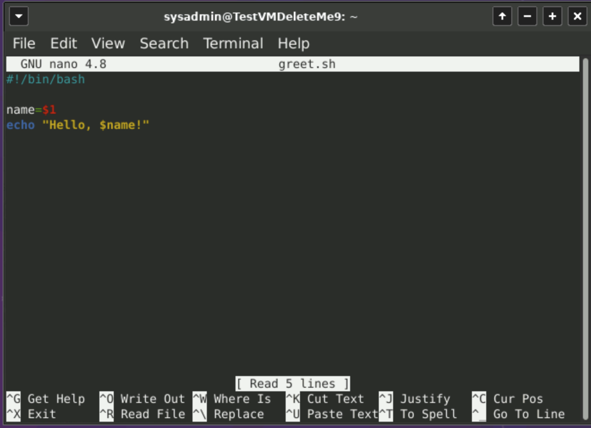
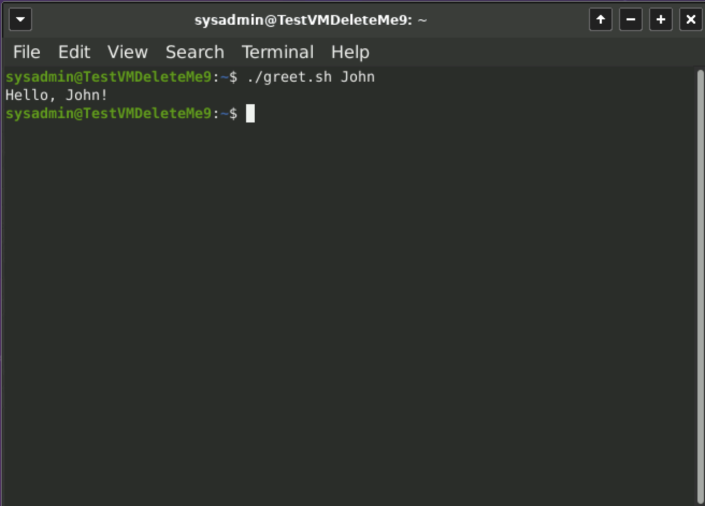

## 3.3 Lesson Plan: Stick to the Script

### Overview

In today's class, students will further develop their command-line skills by learning how to use text processing and text editing to develop their own `cd log_directory` line script.

### Class Objectives

By the end of class, students will be able to:

- Define three benefits of text processing programs over programming languages for a security professional.

- Use `sed` to make substitutions to a file.

- Use `awk` to isolate data points from a complex log file.

- Edit contents of a file using `nano`.

- Design an IP lookup shell script by passing arguments.

### Lab Environment   

You will use the Ubuntu virtual machine inside your web lab for today's activities. Please note that instructors and students have different access credentials.

 - Student credentials:
    - Username:`student`
    - Password: `cybersecurity`

  - Instructor credentials:
    - Username: `instructor`
    - Password: `instructor`
  
:warning: **Heads Up:** In the event of lab malfunctions, use a backup zip file containing this module's student activity directories.

  - [Backup Student Activity Directories: Terminal and Bash Module](Resources/terminal.zip)

### Module Day 3 Contents

- [x] [01. Instructor Do: Class Introduction](LessonPlan.md#01-instructor-do-class-introduction-005)
- [x] [02. Student Do: Warm-up](LessonPlan.md#02-student-do-warm-up-010)
- [x] [03. Instructor Do: Intro to Text Processing](LessonPlan.md#03-instructor-do-intro-to-text-processing-010)
- [x] [04. Instructor Do: Intro to sed](LessonPlan.md#04-instructor-do-intro-to-sed-010)
- [x] [05. Student Do: Use sed](LessonPlan.md#05-student-do-use-sed-015)
- [x] [06. Instructor Review: Use sed Activity](LessonPlan.md#06-instructor-review-use-sed-activity-005)
- [x] [07. Instructor Do: Intro to awk](LessonPlan.md#07-instructor-do-intro-to-awk-015)
- [x] [08.  Student Do: Use awk](LessonPlan.md#08-student-do-use-awk-015)
- [x] [09. Instructor Review: Use awk Activity](LessonPlan.md#09-instructor-review-use-awk-activity-005)
- [x] [10. Break](LessonPlan.md#10-break-015)
- [x] [11. Instructor Do: Intro to Shell Scripting](LessonPlan.md#11-instructor-do-intro-to-shell-scripting-008)
- [x] [12. Instructor Do: Write and Edit Files](LessonPlan.md#12-instructor-do-write-and-edit-files-015)
- [x] [13. Student Do: My First Shell Script](LessonPlan.md#13-student-do-my-first-shell-script-015)
- [x] [14. Instructor Review: My First Shell Script Activity](LessonPlan.md#14-instructor-review-my-first-shell-script-activity-007)
- [x] [15. Instructor Do: Passing Arguments](LessonPlan.md#15-instructor-do-passing-arguments-007)
- [x] [16. Student Do: Build an IP Lookup Tool](LessonPlan.md#16-student-do-build-an-ip-lookup-tool-015)
- [x] [17. Instructor Review: Build an IP Lookup Tool Activity](LessonPlan.md#17-instructor-review-build-an-ip-lookup-tool-activity-005)

### Slideshow

The lesson slides are available on Google Drive here: [3.3 Slides](https://docs.google.com/presentation/d/1XOtj00EaMRikW2-BQv_DD9uTjTiFkS-qK0ykMSJnBqA/edit#slide=id.gfc2777889c_0_1203).

- To add slides to the student-facing repository, download the slides as a PDF by navigating to File > "Download as" and choose "PDF document." Then, add the PDF file to your class repository along with other necessary files.

- **Note:** Editing access is not available for this document. If you or your students wish to modify the slides, please create a copy by navigating to File > "Make a copy...".

### Time Tracker 

The time tracker is available on Google Drive here: [3.3 Time Tracker](https://docs.google.com/spreadsheets/d/16ao8JacUvQnnzjok40yYAnuUJXZIiIDIgYQ-zHzb32A/edit#gid=1047115118).

### Student Guide 
- Send class a student-facing version of the lesson plan: [3.3 Student Guide](StudentGuide.md)  

---

### 01. Instructor Do: Class Introduction (0:05)

Begin class by welcoming students back and informing them that today they will learn a powerful skill for IT and security professionals: **command line scripting**.

- Before introducing new command line concepts, we'll review concepts taught in the last class:

  - Command options and man pages.

    - Commands can have their default behavior modified using **options**.

    - Command options can have their own arguments called **parameters**.

    - **Man pages** are documentation that exist within the terminal containing command syntax, options, and parameters.
    
    - `man` followed by a command will display the documentation for that specific command.

  - Searching for directories, files, and data within files.

    - The `find` command is used to find directories or files.

      - `-type d` is the option and parameter for finding directories.

      - `-type f` is the option and parameter for finding a file.

    - The `grep` command is used to find a data point within a file.

    - **Wildcards**, indicated with a `*`, can assist `grep` and `find` by:

        - Searching through multiple files. For example: `*.txt`; and

        - Searching for part of a data point. For example: `*login*`.

- Counting data and piping.

  - The `wc` command can be used for counting files, lines, and words.

  - Pipes, which are indicated by `|`, are used to combine multiple commands together.

  - Pipes will take the output from the command on the left and apply it to the the new command on the right.

Remind the class that the best way to learn these commands is to practice them, so we will start today's class with a warm-up activity to practice these commands.

- Ask the class if they have any questions before starting on the warm-up activity.

[<- Back to Module Contents](LessonPlan.md#module-day-3-contents)

---

### 02. Student Do: Warm-up (0:10)

Explain the following to students:

- In this activity, you will continue your role as a security analyst at Candy Corp.

- Thanks to your great work, the authorities have been able to charge Sugar.

- The prosecutor of the case has subpoenaed you for a list of additional data to help build their case against Sugar.

- You are tasked with gathering additional information specified in the subpoena.

Send students the following:

- [Activity File: Warm-up](Activities/02_warmup/unsolved/readme.md)

- [Directories/Files: Warm-up](Resources/warmup.zip)

Additionally, provide the solution file so the students can self-review:

- [Solution Guide: Warm-up](Activities/02_warmup/solved/readme.md)

[<- Back to Module Contents](LessonPlan.md#module-day-3-contents)

---

### 03. Instructor Do: Intro to Text Processing (0:10)

Begin by explaining the following challenge commonly faced by security professionals:

 - Security professionals work with many forms of data, such as application logs, server logs, server files, configuration files, and raw code.

 - Many of these forms of data are complex and large, and not easy to analyze in their raw form.

    For example, take a look at the following web server log file:

 

- These complex data files can be difficult for anyone to analyze.

- Explain that  embedded within these complex and large files are **data points** that can help security analysts research security incidents.  

   - Explain that examples of data points are:

        - Dates;

        - Usernames; and

        - Phone numbers.

- Explain that these data points can help security professionals to:

  - **Isolate attack signatures**

     For example, an attacker could use a specific username to launch an attack. Finding this data point can assist with isolating the username tied to an attacker.

  - **Identify attack vectors**

     For example, an attacker could launch an attack through a field on a login page. Finding this data point can assist with identifying the field being used for the attack.

  - **Identify the timing of attacks**

    For example, an attacker could launch their attack at exactly midnight every night. Finding this data point can help identify the timing of the attack.

Explain that security professionals are challenged with taking these large and complex files and isolating the data points that are needed to complete their tasks.

- Emphasize that this can be accomplished with text processing commands.

#### Text Processing Commands

Define **text processing commands** as command language used to manipulate text and simplify complex data.

Cover the following:

  - Text processing commands have many capabilities to simplify working with complex data, such as:

    - Substituting text;

    - Filtering lines of text; and

    - Delimiting text.

  - There are multiple text processing commands that are already built in to the terminal, such as `cut`, `awk`, and `sed`.

  Mention that other command languages can also manipulate text, such as Python and C++. These are designed for programming, such as for running web applications.

Explain that text processing provides the following three benefits over programming languages:

 1. **Simplicity:** Text processing is simpler and easier to learn than programming languages.

 2. **Convenience:** Most text processing commands are pre-installed in terminals, unlike many programming languages.

 3. **Compatibility:** Text processing commands can be easily combined to complete more advanced tasks. This is much more challenging to do with programming languages.

Explain that today we will be focusing on the powerful text processing utilities of `awk` and `sed`.

Answer any questions that remain before proceeding to introduce the `sed` command.

[<- Back to Module Contents](LessonPlan.md#module-day-3-contents)

---

### 04. Instructor Do: Intro to sed (0:10)

Begin by reminding the class that we just covered how security professionals spend a lot of time working with complex log files.  

Explain that one source of added time and complication is the need to analyze and consolidate complex data from different sources.

- For example:

     - You need to analyze login activities across two different applications.

     - One application labels logins as LOGGED IN while the other labels them as ACCESS ACCEPTED.

  The challenge is to replace all strings of ACCESS ACCEPTED with LOGGED IN, so the data will be consistent when analyzing the datasets together.

Explain that we can use the text processing command `sed` to accomplish this task.

Introduce `sed` by covering the following:

  - `sed` stands for "stream editor."

  - This means that it reads and edits text, line by line, from an input stream.

  - An input stream is a string of all the characters in a text file.

  - Explain that it's a "stream" because `sed` reads the file from top to bottom, line by line, and only reads each line once.

Summarize that, in layman's terms, `sed` is a command-line utility that modifies text using an easy and compact coding language.

- Explain to the class that, while `sed` has multiple capabilities, we will be learning the most basic `sed` capability: **string replacement**.

#### Use sed for String Replacement

First, explain that string replacement is synonymous with string substitution.

  - Point out that it is similar to the Windows find-and-replace feature.

Inform the class that we will walk through a simple `sed` command to create a basic string replacement.

  - We will be doing the following string replacement:

     `The Dog Chased the Ball` will become ` The Dog Chased the Cat`.

    We will use `sed` to replace `Ball` with `Cat`.    

#### sed Demonstration

1. Access the `/03-instructor/day3/sed_demonstration/` directory:

    -  `cd /03-instructor/day3/sed_demonstration/`

2. Explain that within this directory, there is a file called `sed.txt`.

3. Show the contents of the file by running:  

    - `cat sed.txt`

    - Point out that this displays the only line in the file:   

      -  `The Dog Chased the Ball`

4. Point out that next, we will use `sed` to replace the word "Ball"  with "Cat" using the following command:

    - `cat sed.txt | sed s/Ball/Cat/`

     Explain the syntax:

    -   `cat  (file name)   (pipe)    sed   s/(old value)/(replacement value)/`

5. Run the command and point out it replaces the word  "Ball" with "Cat" with the following result:

   - `The Dog Chased the Cat`

#### Demonstration Summary

Review the following concepts:

  - `sed` is a text processing utility that can assist security professionals with analyzing data.

  - The most basic `sed` capability is string replacement. This can increase consistency across separate data sources, which can assist in research.

  - The basic syntax of string replacement is `sed   s/(old value)/(replacement value)/`.

Take a moment to address questions before proceeding.

Explain that in the following command-line activity, students will get to use the `sed` command to replace data in a log file to make data consistent.

[<- Back to Module Contents](LessonPlan.md#module-day-3-contents)

---

### 05. Student Do: Use sed (0:15)

Explain the following to students:

- In this activity, you will continue your role as a security analyst at Candy Corp.

- Your manager believes there is a new cybercriminal attempting, but failing, to log in to several administrative websites owned by Candy.

- Your manager provides you with the access logs for two different administrative websites. They want to find out information about this cybercriminal before they get unauthorized access.

- You are first tasked with combining the two different access logs into a single file and using text processing to make the "failed login" data consistent.

Send students the following:

- [Activity File: Use sed](Activities/05_sed_activity/unsolved/readme.md)

- [Directories/Files: Use sed](Resources/learning_sed.zip)

[<- Back to Module Contents](LessonPlan.md#module-day-3-contents)

---

### 06. Instructor Review: Use sed Activity (0:05)
:bar_chart: Using [Zoom](https://support.zoom.us/hc/en-us/articles/213756303-Polling-for-meetings) or [Slack's](https://slack.com/help/articles/229002507-Create-a-poll-) poll feature, conduct a comprehension check and evaluate how well students completed the activity. 

Remind students that the goal of this activity was to practice using the text processing capability of `sed` to replace data and make data consistent.

Explain that this activity requires the following steps:

  - Concatenating multiple files into a single file.

  - Using `sed` to do a replacement of text.

  - Redirecting the results into a new file.

Send students the following solution file and use it to guide your review:

- [Solution Guide: Use sed](Activities/05_sed_activity/solved/readme.md)

 Answer any questions that remain before proceeding to the next lesson.

[<- Back to Module Contents](LessonPlan.md#module-day-3-contents)

---

### 07. Instructor Do: Intro to awk (0:15)

Begin this section by reminding students that security professionals often need to obtain specific data points within complex log files.

- For example:

  - You have a log file that contains city, state, and country fields, separated out by commas. However, for our analysis, we only need the states from the log file.

  - In other words, our log record contains records like "Atlanta, Georgia, USA," but we only need "Georgia."

- Explain that we can technically use `sed` to perform the task with the following command:

   -  `sed 's/^.*\(,.*,\).*$/\1/' | sed 's/,//g'`

- But while `sed` can technically perform this task, it is a complicated set of code that takes time to compose.  

- Fortunately, there is another text processing utility called `awk` that will allow us to perform this task more efficiently.

Introduce `awk` by covering the following:

 - Like `sed`, `awk` is designed for text processing, but is primarily used for data extraction and reporting from streams of text.

 - `awk` can separate out fields in a stream of text and isolate specific fields needed.

Explain that we will demonstrate how to isolate the state field from the above example by using `awk`.

#### awk Demonstration

1. Access the `/03-instructor/day3/awk_demonstration/` directory:

    -  `cd /03-instructor/day3/awk_demonstration/`

2. Within this directory is a file called `awk.txt`.

3. Show the contents of the file by running:  

    - `cat awk.txt`

   Point out that this displays the only line in the file:   

      - `Atlanta, Georgia, USA`

4. Explain that to use `awk` to only display the state, Georgia, we will run the following:        

    - `awk -F, '{print $2}' awk.txt`

    Break down the above syntax of the `awk` command:

    - `awk -F(delimiter)  '{print $(field_number)}' `  

      - `awk`: Indicator telling your operating system to run the `awk` command

      - `-F,`: Option for doing field separation with `awk`

        - The value that comes right after `F` is the parameter signifying how the file separates out the data points. In the example, the parameter is a comma (`,`).

        - This parameter is also known as the **delimiter**.

        - **Note:** The parameter needs to come directly after the `-F`, with no spaces.

      - `'{print  $2}'`: Indicates `awk` is printing the second field, after the fields have been separated by a comma

        - The `$` is included before the number to indicate the field.  

        - Multiple fields can be added, with a comma between each.

        - The required format must have single quotes (`''`) and curly brackets (`{}`) around the print function.

5. Run the command and point out the following:

    - We were able to separate out `Atlanta, Georgia, USA` by commas using `awk` and only print out the second field, which contained the value `Georgia`.

    - This is a much simpler set of code than what was required by `sed`.

:bar_chart: Take a moment to run a comprehension check poll and address any questions before moving on. 

- Point out that this was a very basic example, and often security professionals need to isolate out multiple fields from complex log files.

- Explain that we will do another more challenging demonstration to illustrate how `awk` can be used to assist with a security incident.

#### awk Demonstration for a Security Incident

- Explain the following scenario to the class:

    - You are security analysts at ACME Corp, which has just experienced an attack of a high volume of network requests.

    - You have been provided the logs of these network requests.

    - You are tasked with isolating out the IP addresses and times from these logs to determine which IP address is appearing most frequently. This IP likely belongs to the attacker.

1. Access the `/03-instructor/day3/awk_demonstration/` directory. Run:

    - `cd /03-instructor/day3/awk_demonstration/`

2. Preview the log file called `access_logs`. Run:

    - `more access_logs`

3. Explain that next, we need to analyze the data of the log file to determine how to build our `awk` command.

    Note each of the items below:

    - The fields are separated out by spaces, so a space will be used as a field separator.

    - When we separate out the fields by spaces, time is in the second field, so we will need to print out the second field first.

    - IP addresses are in the first field, so we will need to print this field out after time.

4. Run the following `awk` command to illustrate how this will be accomplished:

      - `awk -F" "  '{print $2, $1}' access_logs`

     Explain the syntax of the `awk` command:

     - `awk -F" "`

        - This is instructing the operating system to run the `awk` command of field separation.

        - In this example, one space is the delimiter.

          To indicate that we want to separate the fields by spaces, we place one space between two double quotes.

      - `{print $2, $1}`

          - This command will print out the second and first fields in that order.  

6. Run the command and point out that `awk` is able to take a complex log file, and parse it out to show only the fields needed: time and IP address.

7. Explain that in this result, the top reoccurring IP of  `41.33.233.87`  is easy to detect. This is likely the IP address of the attacker.

8. Explain that identifying an IP address of the attacker can assist a security professional with determining what IP address should be blocked from a network to prevent future attacks.

#### awk Summary  

Review the following concepts:

  - `awk` is a text processing utility like `sed`, but is more robust, as it can separate out fields with simple code.

  - `awk` can assist security professionals by isolating specific data points, like IP addresses, to assist with determining what IP addresses should be blocked.

  - The basic syntax of field separation with `awk` is:

     - `awk -F(delimiter)  '{print $(field_number)}' `  

Take a moment to address questions before proceeding.

Explain that in the next command-line activity, students will get to use the `awk` command to isolate certain fields in a log file.

[<- Back to Module Contents](LessonPlan.md#module-day-3-contents)

---

### 08.  Student Do: Use awk (0:15)

Explain the following to students:

- You will continue your role as a security analyst at Candy Corp.

- Your manager needs your assistance finding information on the cybercriminal who is attempting to log in to several administrative websites owned by Candy.

- You are now tasked with isolating several fields from the log file to determine the primary username attempting to log in to the administrative websites.

Send students the following instructions:

- [Activity File: Use awk](Activities/08_awk_activity/unsolved/readme.md)

[<- Back to Module Contents](LessonPlan.md#module-day-3-contents)

---

### 09. Instructor Review: Use awk Activity (0:05)
:bar_chart: Using [Zoom](https://support.zoom.us/hc/en-us/articles/213756303-Polling-for-meetings) or [Slack's](https://slack.com/help/articles/229002507-Create-a-poll-) poll feature, conduct a comprehension check and evaluate how well students completed the activity. 

Remind students that the goal of this activity is to practice using the  `awk` command, and to see how it can be used to isolate certain fields from complex files.

Explain that this activity requires the following steps:

  - Moving a file

  - Using `awk` to isolate out certain fields

  - Redirecting the results into a new file

Send students the following solution file and use it to guide your review:

- [Solution Guide: Use awk](Activities/08_awk_activity/solved/readme.md)

Answer any questions that remain before taking a break.

[<- Back to Module Contents](LessonPlan.md#module-day-3-contents)

---

### 10. Break (0:15)

[<- Back to Module Contents](LessonPlan.md#module-day-3-contents)

---

### 11. Instructor Do: Intro to Shell Scripting (0:08)

Welcome class back from break and remind them that this week, they have learned many commands to complete a variety of IT and security tasks from the command line.

- Explain that as IT and security professionals, they will be required to complete security tasks that involve multiple subsequent commands.

  - For example, an IT professional could be tasked with cleaning up space in a directory because log files are taking up too much space.

  - To complete these tasks they would need to run the following  three separate commands, in order:
    1. `cd` to navigate to the directory containing log files.

    2. `zip` to compress the files.

        - `zip` commands will be explained in more detail in a future lesson.

    3. `mv` to move the new zip file into an archive folder.

Rather than run each of these activities separately, we can **script** them together, which allows the commands to be run in order using a single command.

Explain that writing scripts, or **scripting**,  provides the following benefits to IT and security professionals:

   - Running multiple commands with a single script can improve the speed of accomplishing tasks.

   - Having a single script that runs multiple commands can improve the consistency of task results.

   - Scripts can be provided to other users for reusability, meaning the exact same tasks can be completed by someone unfamiliar with the individual commands necessary to complete them.

Explain that in the terminal, we will focus on a specific type of scripting known as  **shell scripting**.

  - **Shell** is a terminal program that assists in the interaction between the user and the terminal.

     - There are many shells available in the terminal, such as `sh`, `bash`, `zsh`, and `csh`.

  - Shell scripting is a way of using these shell programs to automate tasks in the form of a collection of commands.

Explain how shell scripts are designed by illustrating the following:

   - For the above example, we could write a single shell script called `diskcleanup.sh`.

   - Within the `diskcleanup.sh` are the three commands in the order they need to run, from top down, one line per command:

      - `cd log_directory`

      - `zip logfiles.zip Log*.txt`

      - `mv logfiles.zip ./archive_directory`

   - To execute the shell script, we'd only need to run this single command:

      - `sh diskcleanup.sh`

   - Running that single command would execute all three commands inside of the script, in order.

Explain that before we start writing our own scripts, we need to learn how to write into a file to add in our commands.   

[<- Back to Module Contents](LessonPlan.md#module-day-3-contents)

---

### 12. Instructor Do: Write and Edit Files (0:15)

Explain that text editors are efficient utilities for creating and editing files containing data.

#### Text Editors

Introduce text editors by covering the following:

- **Text editors** can be run from the terminal or desktop environments, depending on the editor.

- IT and security professionals can use text editors to build scripts and create documentation, reports, or files of any type.

- Students are likely familiar with a type of text editor: Notepad in Windows.

- Common text editors available within the terminal are nano, vi, Vim, and emacs.

- Text editors can be used to create new files or edit existing files.

Explain that we will be completing a file editing demonstration with the text editor nano, as this is the simplest one to learn and typically available on most terminals

Explain that we will use nano to create a simple shell script that contains the two following commands:

   - `mkdir new_directory`

   - `cd new_directory`

#### Building a Shell Script Demonstration

1. Navigate to `/03-instructor/day3/`

2.  Create a `nano_demonstration` directory:

    - `mkdir nano_demonstration`

3. Access the `/03-instructor/day3/nano_demonstration/` directory:

    - `cd nano_demonstration`

4. Explain that to create a new script called `myfirstscript.sh` with nano,we run:

    - `nano myfirstscript.sh`

   The syntax is simply:

     - `nano <new file name>`

5.  Point out that if the file already existed, it would take you to edit that previously existing file.

6.  Run the command: `nano myfirstscript.sh` and point out that this takes you into an editing window within the terminal.

    

7.  Explain that to start off, we'll need to add:

      - `#!/bin/bash`
    
    Remind students that the line `#!/bin/bash` tells our Linux OS that this is a bash script, and should be run with the bash shell. This will also create a log in the `/bin/bash` directory, which is important so that we may see when different scripts were run. 

8.  Next, we type the first command on the first line:

      - `mkdir scripts`

9. Enter the second command on the second line:

      - `mv myfirstscript.sh scripts`

10.  Explain that next, we need to save the changes in this file:

      - Hold the Ctrl+X at the same time.

      - You will be asked if you want to save the file. Press Y for yes. 

11.  Point out that it will confirm the name of the file:  `myfirstscript.sh`

      - Press Enter to keep this file name.

12.  Explain that this just created a shell script file called `myfirstscript.sh`.

13.  Illustrate that to run this new shell script we simply run:

      - `sh myfirstscript.sh`

14. Run the command and explain that this just made a directory, called `scripts`, and placed your script file into it.

15. Run the `ls scripts` command to show that this took place.

#### File Writing and Editing Summary  

Review the following concepts:

  - Text editors are command line utilities that are used to create or edit plain text files.

  -  Nano is an easy-to-use text editor that is available in most terminals, and is good for creating shell scripts.

Take a moment to address questions before proceeding.

Explain that in the next command line activity, students will get to use the `nano` command to write their first shell script.

[<- Back to Module Contents](LessonPlan.md#module-day-3-contents)

---

### 13. Student Do: My First Shell Script (0:15)

Explain the following to students:

- In this activity, you will continue your role as a security analyst at Candy Corp.

- Your manager needs your assistance creating a simple shell script to automate the `awk` and `sed` tasks you did today on your log file.

- This shell script can be provided to other security analysts so they can easily complete the same tasks you ran today.

- You are tasked with using `nano` to create a shell script with the `awk` and `sed` commands to analyze a log file.

Send students the following:

- [Activity File: My First Shell Script](Activities/13_shell_scripting/unsolved/readme.md)

- [Directories/Files: My First Shell Script](Resources/first_shell_script.zip)

[<- Back to Module Contents](LessonPlan.md#module-day-3-contents)

---

### 14. Instructor Review: My First Shell Script Activity (0:07)

:bar_chart: Using [Zoom](https://support.zoom.us/hc/en-us/articles/213756303-Polling-for-meetings) or [Slack's](https://slack.com/help/articles/229002507-Create-a-poll-) poll feature, conduct a comprehension check and evaluate how well students completed the activity. 

Remind students that the point of this exercise is to learn how using shell scripts can assist with executing several commands by running one single command.

Explain that this activity requires the following steps:

  - Using `nano` to create a shell script

  - Placing the `sed` and `awk` commands inside the shell script

  - Executing the shell script to confirm the results are as expected

Send students the following solution file and use it to guide your review:

- [Solution Guide: My First Shell Script](Activities/13_shell_scripting/solved/readme.md)

Congratulate the students for building their first shell script!

Explain that in the final terminal activity of the module, students will use many of the skills they learned to build a shell script that can look up the country of an IP address.

[<- Back to Module Contents](LessonPlan.md#module-day-3-contents)

---

### 15. Instructor Do: Passing Arguments (0:07)

Explain to the class that the script they just created will run the exact same process each time it is executed.

However, there may be times when they'll need to change a single value in a script.

- For example, a security analyst may need to run the cleanup shell script we just created, but only need it to zip up a certain file date.

  - If we need to zip up files named `logs0519`, we need to change one command in the script:

    -  `zip logs* logfiles.zip` > `zip logs0519 logfiles.zip`   

  - Rather than manually edit the script to make this change each time the script is run, we can add a **passing argument**.

#### Passing a Single Argument

Explain how to pass a single argument in a shell script by covering the following:

  - You pass an argument into a script simply by placing the argument after the script name.

    - For the above example, we can run:

      -  `sh diskcleanup.sh  0519`

     - The syntax is: `sh   (shell script name) (Argument1)`

  - Explain that to pass the `0519` into the script, we have to add a `$1` indicating where the first argument, `0519`, will be passed.

      - We would change:

          `zip logs* logfiles.zip`

         to

        `zip logs$1 logfiles.zip`  
      - This way, when the script `sh diskcleanup.sh  0519` is run, the command will be changed to:

        - `zip logs0519 logfiles.zip`

#### Adding Multiple Arguments   

  - Explain that additional arguments can be added with the following syntax:

      - `sh   shellscript   Argument1 Argument2 Argument3`

- For example:

    - `sh diskcleanup.sh  0519  backupfolder`

  - Within the script, the arguments would be represented by:   
       - Argument1 = `$1`
       - Argument2 = `$2`
       - Argument3 = `$3`

#### Passing Arguments Demonstration

In this demo, we will create a simple script called `greet.sh` that will take a person's name as an argument and display a greeting message.

1. Navigate to `/03-instructor/day3/`.

2. Create a `passing_variables` directory:

    - `mkdir passing_variables`

3. Navigate to this new directory:

    - `cd passing_variables`

4. Create your new script:

    - `nano greet.sh`

5. For your first line of your new script write:

    - `#!/bin/bash`

6. Then add the following two lines:

    - `name=$1`

    - `echo "Hello, $name!"`

  - This sets the first variable `name` to whatever you enter when you run the script

  

7. Save the script and exit nano.

8. Make the script executable:

    -`chmod 777 greet.sh`

9. Run the script with any name after the script:

    -`./greet.sh John`

  

#### Passing Arguments Summary  

Review the following concepts:

  - Some scripts have to be slightly modified each time they are run. This can be simplified by passing arguments.

  - When a script is run, you can add an argument or multiple arguments to pass into a script simply by placing the argument(s) after the script name.

  - Within the script itself, an argument or arguments can be represented by a `$1` for the first argument, `$2` for the second argument, and so on.

Take a moment to address questions before proceeding.

Explain that in the final command-line activity, students will get to use all the skills learned today to build their own IP lookup script.

[<- Back to Module Contents](LessonPlan.md#module-day-3-contents)

---

### 16. Student Do: Build an IP Lookup Tool (0:15)

Explain the following to students:

- In this activity, you will continue your role as a security analyst at Candy Corp.

- Your manager needs to know which country these attacks are coming from so they can block it from accessing their network.

- Your manager is impressed with the great work you did on the last script and  would like you to design one that can look up the the country from an IP address in the logs.

Send students the following instructions:

- [Activity File: Build an IP Lookup Tool](Activities/16_ip_lookup_activity/unsolved/readme.md)

[<- Back to Module Contents](LessonPlan.md#module-day-3-contents)

---

### 17. Instructor Review: Build an IP Lookup Tool Activity (0:05)

:bar_chart: Using [Zoom](https://support.zoom.us/hc/en-us/articles/213756303-Polling-for-meetings) or [Slack's](https://slack.com/help/articles/229002507-Create-a-poll-) poll feature, conduct a comprehension check and evaluate how well students completed the activity. 

Remind students that the goal of this activity was to review many of the command-line skills covered during the week.  Additionally, let students know that looking up a location associated with an IP is a common security task.

Explain that this activity requires the following steps:

  - Using `man` to learn a new command

  - Using `grep`, pipes, and `awk` to filter results from a command

  - Designing a shell script to include the modified command

  - Configuring the shell script to accept arguments

  - Running the shell script by passing arguments

Send students the following solution file and use it to guide your review:

- [Solution Guide: Build an IP Lookup Tool](Activities/16_ip_lookup_activity/solved/readme.md)

Spend the remaining class time reviewing any questions students have regarding material from today and the rest of the module. 

[<- Back to Module Contents](LessonPlan.md#module-day-3-contents)

---

&copy; 2023 edX Boot Camps LLC. Confidential and Proprietary. All Rights Reserved.
