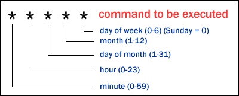
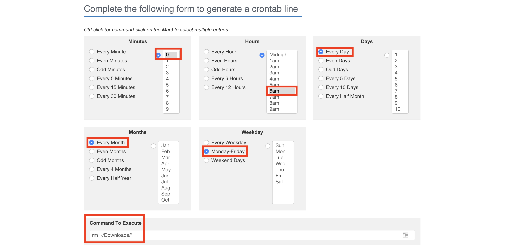
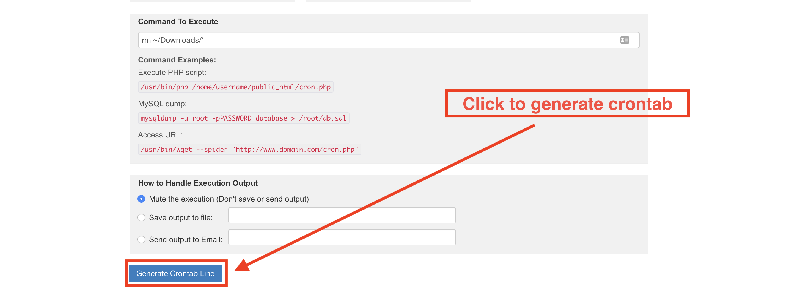
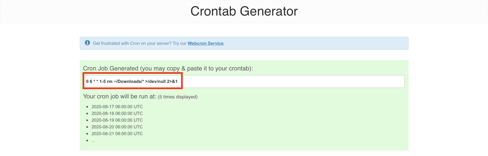

## 5.2 Lesson Plan: Introduction to `cron` and Scheduled Jobs

### Overview

In today's class, students will use `cron` to schedule and automate important maintenance and security tasks such as moving files, updating packages, and running security scans. 


### Class Objectives

By the end of class, students will be able to:

- Schedule regular jobs for individual users with crontab.

- Write simple scripts for maintenance and security tasks.

- Use `cron` to automate the execution of security scripts to perform maintenance on a regular basis.

### Instructor Notes:

- Since `cron` only runs jobs at certain times, a "pure" demonstration of the tool would require scheduling a job, then waiting for it to execute. Since this is infeasible from an instructional perspective, you will not wait for `cron` to execute jobs. Instead, focus on explaining the syntax of the crontab or script you're discussing, and assume `cron` runs them as expected.

- When editing their crontab, students using local Windows machines may not be able to save the settings properly. If so, check to make sure that the file is not saving in DOS mode. To do this, they should press `alt-M` when saving a file in nano.

- It is recommended to practice running Lynis scans. You will be expected to provide an explanation of the scan results in the 09: Instructor Do. 


### Lab Environment   

You will use your web lab for today's activities. Please note that instructors and students have different access credentials.

- Instructor access:
  - Username: `instructor`
  - Password: `instructor`
  
- Student access:
  - Username: `sysadmin`
  - Password: `cybersecurity`

### Module Day 2 Contents

- [x] [01. Instructor Do: Welcome and Overview](LessonPlan.md#01-instructor-do-welcome-and-overview-005)
- [x] [02. Instructor Do: Overview of `cron`](LessonPlan.md#02-instructor-do-overview-of-cron-020)
- [x] [03. Student Do: Simple Cronjobs](LessonPlan.md#03-student-do-simple-cronjobs-020)
- [x] [04. Instructor Review: Simple Cronjobs](LessonPlan.md#04-instructor-review-simple-cronjobs-010)
- [x] [05. Instructor Do: Introduction to Scripts](LessonPlan.md#05-instructor-do-introduction-to-scripts-020)
- [x] [06. Student Do: Introduction to Scripts](LessonPlan.md#06-student-do-introduction-to-scripts-030)
- [x] [07. Instructor Review: Introduction to Scripts](LessonPlan.md#07-instructor-review-introduction-to-scripts-010)
- [x] [08. Break](LessonPlan.md#08-break-015)
- [x] [09. Instructor Do: Scheduling Backups, Cleanups, and Security Checks](LessonPlan.md#09-instructor-do-scheduling-backups-cleanups-and-security-checks-020)
- [x] [10. Student Do: Scheduling Backups, Cleanups, and Security Checks](LessonPlan.md#10-student-do-scheduling-backups-cleanups-and-security-checks-020)
- [x] [11. Instructor Review: Scheduling Backups, Cleanups, and Security Checks](LessonPlan.md#11-instructor-review-scheduling-backups-cleanups-and-security-checks-010)
- [x] [12. Student Do: Reviewing `cron`](LessonPlan.md#12-student-do-reviewing-cron-optional-assignment)
- [x] [13. Instructor Review: Reviewing `cron`](LessonPlan.md#13-instructor-review-reviewing-cron-010)


### Slideshow

The lesson slides are available on Google Drive here: [5.2 Slides](https://docs.google.com/presentation/d/1-_sah0nA9bsRdjh7uzL128vNHKwUMKcrNM5KtL9_UJY/edit#slide=id.g288c793976b_0_817).

- To add slides to the student-facing repository, download the slides as a PDF by navigating to File > "Download as" and choose "PDF document." Then, add the PDF file to your class repository along with any other necessary files.

- Editing access is not available for this document. If you or your students wish to modify the slides, please create a copy by navigating to File > "Make a copy...".

### Time Tracker

The time tracker is available on Google Drive here: [5.2 Time Tracker](https://docs.google.com/spreadsheets/d/1tJ__o69pyfAD7YnNjhoFeL_bvnlqMY5DFpoBjW-DmzM/edit#gid=1145703143).


### Student Guide

Distribute the student-version of this lesson plan to class: [5.2 Student Guide](StudentGuide.md)

---

### 01. Instructor Do: Welcome and Overview (0:05)

In the previous class, we archived data, scheduled data backups, and monitored log files. Now, we will spend today learning methods to automate our work in an effort to become more efficient.

- Previously, we protected system stability by using `tar` to list and extract data, and to manually create backups that we can use to restore the system to an earlier state.

- Today, you will learn how to write scripts and use a tool called `cron` to schedule regular automation for many of the tasks performed last class.

Explain that many of these steps must be performed regularly to remain effective. For example, backups are only useful if they're current, and health checks are only informative if they're real time.

Explain that system administrators address this need for constant performance by using **automation**. Automation is the process of setting tasks to execute on their own. It takes two main forms:

- **Scripts** are files that contain multiple commands. All these commands can be executed by simply calling the script name. You will touch on this today and take a deeper dive into scripting next week.

- **Scheduled jobs** allow you to run commands or scripts at specific, designated times. A scheduled job is a command or script that the system runs at a specific time interval. These will be the focus of today's lesson.

Explain that system administrators often use these tools together in the following work flow:

- **Fix an issue:** For example, making a list of all users with old passwords, then forcing those users to update their credentials.

- **Write a script to solve the issue automatically:** For example, writing the script `find_stale_users.sh`, containing the commands you ran to fix the password update issue.

- **Use `cron` to run the script and email the results regularly:** For example, using `cron` to run `find_stale_users.sh` every Saturday at noon.

Sysadmins tend to grow and scale their solutions by using scripts and scheduling to automate anything they must do more than once.

Let students know that today's class will give them all the tools they need to begin using this work flow themselves. You will start by introducing `cron` and exploring scheduled jobs, so students have a better sense of which tasks are worth being scripted. Then, you'll progress to using `cron` and scripts together.

Present the daily objectives.

Let the students know that we'll be covering the following in today's lesson:

- First, we'll discuss `cron` and how to configure simple cronjobs used to perform actions based on schedules within a Linux system.

- Then, we'll delve into the world of Bash scripting and how to use scripts to combine multiple tasks into a single executable function, such as file movement, data archiving, and performing backups.

- Next, we'll revisit `cron`, using the scripts that students created, and expand upon the basic concepts of cronjobs and discuss the differences between user and system-wide cronjobs. There will also be a brief introduction to a tool called `lynis`, a security scanner that performs various systems integrity scans and system security audits.

- Lastly, we’ll go over a specific `cron` vulnerability and how to mitigate attacks.


Ask students if they have any questions before proceeding.

[<- Back to Module Contents](LessonPlan.md#module-day-2-contents)

---

### 02. Instructor Do: Overview of `cron` (0:20)

In this section, we'll introduce `cron`. Start by covering the following scenario:

- Before leaving the office for the day, you spend ten minutes deleting your cache, emptying the trash bin, and backing up your documents folder.

- You also spend one hour per day installing software updates.

Explain that rather than spending time repeatably completing these tasks, we can automate them using a tool called **cronjobs**:

 - User-level cronjobs can automate the process of deleting cache, emptying trash, and backing up documents.

 - System-level cronjobs can automate daily updates.

Define a **cronjob** as a script or command designated to run at regular or periodic, predetermined intervals. They can be used for both user-level or system-level tasks.

Explain that the *cron* in *cronjob* refers to a **system daemon** that keeps track of when to run scheduled tasks.

- A `daemon` is a computer program that runs as a background process, rather than being under the direct control of an interactive user. The term is derived from `daimon`, or guiding spirit.

- `cron`, (named after Kronos, the Greek god of time), is a robust tasks scheduler that allows us to schedule scripts or commands to run on a regular basis.

- `cron` is most suitable for scheduling repetitive tasks.

Explain that systems often start daemons at boot time. Daemons will then respond to network requests, hardware activity, or other programs by performing some task.

- Rather than respond to network requests or hardware activity, the `cron` daemon is initiated at designated time intervals.

`cron` tasks are scheduled in a file called **crontab**, or **cron table**.

- crontab stores lists of tasks and other instructions for the `cron` daemon to execute.

Explain that users have their own individual crontab files, which are private to them.

- Tasks scheduled by a user are run under the user's current privilege level.

- All user tasks on the system are essentially sandboxed processes that affect only the local user and not the overall system.

Explain that each user, including `root`, can have a `cron` file.

- These files don't exist by default, but can be created in the `/var/spool/cron` directory using the `crontab -e` command, which is also used to edit a `cron` file.

- Emphasize that one should never edit `cron` files directly in the `/var/spool/cron` directory. This will corrupt and essentially break the `cron` service by introducing bugs into the system. The preferred method is to edit crontab files only.

Emphasize that the `cron` daemon must be running at all times in order to check the crontab at one minute intervals. This one minute interval is the default set by the system. It's imperative that administrators can ensure that `cron` service is up and running with no conflicts.

Next, we'll take a look at `cron` and crontab rules on the command line.

- Let students know that although upon first glance, a crontab rule can be intimidating, it is a concept that can be relatively easy to learn with some practice.

In the upcoming section, we'll focus on the following:

- Reviewing general `cron` command line syntax.
- Listing the contents of the crontab with `crontab -l`.
- Editing a crontab with `crontab -e`.

#### Intro to `cron` Syntax

Begin by checking if the `cron` service is up and running.

  - Launch a terminal in your web lab and verify that `cron` is up by running `systemctl status cron`.

  - Review the excerpt of the following output and emphasize the importance of the following line: `Active: active (running) since Wed 2019-08-28 22:03:44 PDT; 5 days ago`.

    ```bash
    ● cron.service - Regular background program processing daemon
    Loaded: loaded (/lib/systemd/system/cron.service; enabled; vendor preset: enabled)
    Active: active (running) since Wed 2019-08-28 22:03:44 PDT; 5 days ago
        Docs: man:cron(8)
    Main PID: 884 (cron)
        Tasks: 1 (limit: 2318)
    CGroup: /system.slice/cron.service
            └─884 /usr/sbin/cron -fk
    ```

  - Explain that the status `active` verifies that `cron` is running as expected. It's also important to take note how long the `cron` service has been up and running, which may be helpful during troubleshooting.

    - **Running** = running currently
    - **Active** = will run on startup

Now, we'll focus on two crontab commands:

  - `crontab -l`, which lists the contents of a crontab.

  - `crontab -e`, which allows you to edit a crontab, and also checks for syntax errors upon saving.

| :warning: Head's Up :warning: |
|:-:|
| When editing their crontab, students may not be able to save the settings properly, especially if they are using a local Windows machine. If so, check to make sure that the file is not saving in DOS mode. To do this, they should press `alt-M` when saving a file in nano. |


First, we will list the contents of a crontab using `crontab -l`.

  - Run the following command:

    `crontab -l`

  - Output should look similar to the following:

      ```bash
      # Edit this file to introduce tasks to be run by cron.
      #
      # Each task to run has to be defined through a single line
      # indicating with different fields when the task will be run
      # and what command to run for the task.
      #
      # To define the time you can provide concrete values for
      # minute (m), hour (h), day of month (dom), month (mon),
      # and day of week (dow) or use '*' in these fields (for 'any').#
      # Notice that tasks will be started based on the cron's system
      # daemon's notion of time and timezones.
      #
      # Output of the crontab jobs (including errors) is sent through
      # email to the user the crontab file belongs to (unless redirected).
      #
      # For example, you can run a backup of all your user accounts
      # at 5 a.m every week with:
      #
      #
      # For more information see the manual pages of crontab(5) and cron(8)
      #
      # m h  dom mon dow   command
      ```

  - Explain that this is the default configuration of a crontab:

    - This crontab contains comments, but no actual jobs.

    - However, note the small example of crontab syntax at the bottom: `m h  dom mon dow   command`.

- Explain that these abbreviations respectively stand for *minute*, *hour*, *day of month*, *month of year*, and *day of week*. The `command` simply refers to the command to execute.

Now, we will take this time to review cron job syntax and explain how to verify whether your syntax is correct.



Using the preceding example, note that each value is specified with a number from the following ranges:

- Minutes are specified with 0&ndash;59.

- Hours are specified with 0&ndash;23, with 0 being midnight.

- Day of month is specified with 0&ndash;31, or however many days are in that month.

- Month of year is specified with 1&ndash;12, with 1 being January.

- Day of week is specified with 0&ndash;6, with 0 being Sunday, 1 being Monday, and so forth.
  - **Note:** Explain that while students might see `7` for Sunday, `0` is the more conventional option and best practice.

   - Some systems allow you to use three-letter abbreviations as well, such as `SAT` or `MON`. When in doubt, use numbers, which are universally understood.

- In a crontab, the `*` character means "every" For example, `*` in the day value means "every day."

Let's look at the following example:

  `0 23 * * 6     rm ~/Downloads/*`

- This job removes all files in the `~/Downloads` directory at 11pm, every Saturday, every month.

- Explain that this job is scheduled to run:

  - `0`: Minute

  - `23`: At 11pm

  - `*`: Day of month

  - `*`: Month of year

  - `6`: Day of week

Explain that there are several tools students can use to check their syntax as they write cronjobs.

- One popular tool for **creating** crontabs is [Crontab Generator](https://crontab-generator.org), which translates cron jobs into plain English.

  - Return to your host machine and navigate to https://crontab-generator.org in a browser.

  - Use the following settings for this example: `0 6 * * 1-5`.

  - Explain that this translates to **at 6am sharp, every week, every month, (Mon-Fri)**.

- **Note:** Explain that another popular crontab generation tool that's great for **reverse engineering crontab records** is [crontab.guru](https://crontab.guru), which is great at translating existing cronjobs into plain English.

#### Crontab Generator Demo

- First, select your inputs, then input the commands to be executed in the **Command To Execute** box.

  
- Second, click on **Generate Crontab Line**.

  

- Lastly, **Copy** the newly generated cronjob and **Paste** it into your crontab file.

  

- Done!

  - Emphasize that this and other such tools are extremely popular among sysadmins, and are in no way considered "cheating." Think of this as another tool in your toolbox.

Next, we will dive into editing the crontab and inserting our own custom cronjobs.

- Return to the terminal in your web lab and open your crontab:

  - Run `crontab -e`.

  - **Note:** This may prompt you to select a text editor. The class should be using Nano as the text editor.

- Add the job you explained earlier to the bottom of the crontab file:

  - `0 6 * * 1-5     rm ~/Downloads/*`

- Before saving the file, explain that crontab automatically checks for syntax errors when you close it.

- Intentionally introduce an error by writing: `0 0 0 6 * * 1-5    rm ~/Downloads/*`. Attempt to save the file. Explain that crontab refuses and reports an error.

  ```bash
  crontab: installing new crontab
  "/tmp/crontab.j2THN1/crontab":22: bad day-of-month
  errors in crontab file, cannot install.
  Do you want to retry the same edit? (y/n)
  ```

- Correct the syntax error by entering `y`, removing the two leading `0 0`, and saving the file.

Remind students that this creates a crontab for the `instructor` user in `/var/spool/cron/crontabs`.

- Demonstrate this by running the following commands:

  - `sudo ls /var/spool/cron/crontabs` to display:

    ```bash
      instructor  jane  root	sysadmin
    ```

- In the preceding output, the `instructor` crontab file belongs to a user, `instructor`.

- Explain that we'll look at the contents of the `instructor` crontab file. Then run:

  - `sudo tail /var/spool/cron/crontabs/instructor` to display:

    ```bash
    # 
    # For example, you can run a backup of all your user accounts
    # at 5 a.m every week with:
    # 0 5 * * 1 tar -zcf /var/backups/home.tgz /home/
    # 
    # For more information see the manual pages of crontab(5) and cron(8)
    # 
    # m h  dom mon dow   command

    0 6 * * 1-5    rm ~/Downloads/*
    ```

- In the preceding output, we see the line at the bottom of the file that is a scheduled active task `rm ~/Downloads/*`. This task is scheduled to remove all files located in the `Downloads` folder, at 6am sharp, every week, every month, (Mon-Fri).

Now, we will discuss the `root` crontab and the differences between the `root` and `user` crontabs.

- Remind students that cronjobs run under the same permissions as the user who creates it. Therefore, a cronjob created by user `root` runs with root privileges.

- This introduces security risks that can potentially allow anyone capable of performing privilege escalation to add a malicious cronjob to the `root` crontab, thus executing commands with root privileges.

  - Emphasize to students that there are a large number of risks associated with using `cron` with root privileges. We will address these risks in our last section of the lesson.

  - Best practice is to avoid using the `root` crontab at all. However, it is important to understand that it exists and how to inspect it.

- Let students know that inspecting the `root` crontab for unauthorized or malicious entries is a critical step for ensuring the integrity of any system.

Explain that one of the differences between a `root` and `user` crontab is how they are accessed and edited. To access and edit `root`, we use `sudo`.

- Demonstrate accessing and editing `root` crontab by running:

  - `sudo crontab -l` and entering your password.

Also, the root crontab differs from user crontabs in that it is formatted differently, located in a different folder, and runs with root privileges.

	- Explain that the `root` crontab is an exact replica of a user version, with the exception of the privilege level at which it runs and the directory where it is located.

	- Remind students that the command, `sudo crontab -l`, says: run `crontab -l` as the `root` user.

	- Since `crontab -l` displays the crontab under the privileges of the user who runs it, this displays the `root` crontab, even if you are `sysadmin`, a non-`root` user.

Take a moment to address remaining questions before proceeding to the first activity of the day.

[<- Back to Module Contents](LessonPlan.md#module-day-2-contents)

---

### 03. Student Do: Simple Cronjobs (0:20)

Explain the following:

- In this activity, you are a junior administrator at Rezifp Pharma Inc.

- There has been a wave of recent ransomware attacks. You will be responsible for using `cron` to automate backup jobs for the E-Prescription Treatment database.

- Rezifp Pharma Inc. maintains a large number of files associated with patients, doctors, and their treatments. Administrators at various clinics often create files that contain Personal Identifiable Information or (PII) such as email addresses, passwords, biometric records, etc.

Remind students that `cron` can either run jobs for a specific user, _or_ for the system as a whole. Since the crontab is best used for personal jobs, students will only schedule user-level tasks in this exercise. Later, they'll adapt these single commands into scripts that they will use to administer the entire system.

Send students the following files:

- [Activity File: Simple Cronjobs](./Activities/03_Simple_Cronjobs/Unsolved/README.md)

[<- Back to Module Contents](LessonPlan.md#module-day-2-contents)

---

### 04. Instructor Review: Simple Cronjobs (0:10)

:bar_chart: Run a comprehension check before reviewing the activity. 

Remind students that the goal of this activity was to use `cron` to automate jobs to perform regularly scheduled backups for files that contained PII and Personal Health Information (PHI).

Completing this activity required the following steps:

- Using ` systemctl` to verify that the `cron` daemon is installed and running.
- Using ` crontab –l` to inspect user crontabs and verify their validity.
- Using ` crontab -e` to edit user crontab files.
- Using ` crontab` to automate cronjobs to move and archive files and directories.
- Verifying archives after they are written to check for errors.

Use the following solution file as a guide to review the activity:

- [Solution Guide: Simple Cronjobs](./Activities/03_Simple_Cronjobs/Solved/README.md)

Take a moment to address remaining questions before proceeding.

[<- Back to Module Contents](LessonPlan.md#module-day-2-contents)

---

### 05. Instructor Do: Introduction to Scripts (0:20)

Explain that `cron` is most useful for managing single function tasks, such as backing up the `/home` directory, as opposed to performing multiple tasks, such as backing up several users' home directories: for example, backing up `/home/user1`, `/home/user2`, etc.

Explain that instead of running several lines of code every day using `cron`, we can use scripting to perform all of our functions at once, and run the script once per day. The benefits of scripting becomes clear under these circumstances very quickly.

#### Writing a Script Demonstration

Launch a terminal session in your web lab and switch to the `instructor` account with `su instructor` and password: `password`, make sure you're working out of `/home/instructor/Documents`, then create and move into a new directory called `custom_scripts`.

- Run `cd ~/Documents`.

- Run `mkdir custom_scripts`.

- Run `cd custom_scripts`.

Create a new script called `cleanup_downloads.sh` by running the following command in terminal:

- `nano cleanup_downloads.sh`

For the first line of your script, write: `#!/bin/bash`.

- Break down the syntax:

  - `#!` is called a **shebang** or **hashbang**. It tells the shell that this file is a script that should be executed by Bash.
  -  `/bin/bash` is the absolute path to the Bash interpreter.
  - The shebang line specifies which interpreter to use when writing scripts.
  - For shells other than Bash, or in different languages, the shebang line would indicate a different shell or language.
  - For example: for perl `#!/bin/perl`; for zcash `#!/bin/zsh`; for tcash `#!/bin/tsh`; for kash `#!/bin/ksh`.

Let students know that for this lesson, we will focus exclusively on the Bash shell since it's the most-used shell today.

Next, add the commands from the preceding crontab example to the script, exactly as you wrote them in the crontab:

  ```bash
  #!/bin/bash

  mv ~/Downloads/doctors*.docx /usr/share/doctors
  mv ~/Downloads/patients*.txt /usr/share/patients
  mv ~/Downloads/treatments*.pdf /usr/share/treatments
  ```

- Explain that this file now contains the same commands as your crontab but without the dates and times.

Save (`CTRL+X` if using `nano`) the file and perform a `ls long-listing` to emphasize that the script has been created.

- `ls -l`

  ```bash
  -rw-rw-r-- 1 instructor instructor   17 Aug  3 14:16 cleanup_downloads.sh
  ```

- Emphasize that the file permissions for this script do not contain an `x`.

- Remind students that scripts are meant to be run, or *executed*, and the execute bit is required for such files.

Set the execute bit by running the following command:

- `chmod +x cleanup_downloads.sh`

Then, rerun the long-listing to emphasize that the `x` bit is now present.

- `ls -l`

  ```bash
  -rwxrwxr-x 1 instructor instructor   17 Aug  3 14:16 cleanup_downloads.sh
  ```

Now, we can use `cron` to schedule execution of this script, rather than each individual command.

- To do this, first test the script for bugs, then update the crontab to use the script.

To test this script, we'll create some files that should move from `~/Downloads` into the appropriate subdirectories in `~/Documents`.

Move to `~/Downloads` and create several dummy files:

- `cd ~/Downloads`
- `touch treatments1.pdf treatments2.pdf`
- `touch doctors10.docx doctors11.docx`
- `touch patients20.txt patients44.txt`

Next, move back to the directory containing your script and run it:

  - `cd ~/Documents/custom_scripts`
  - `sudo ./cleanup_downloads.sh`

:warning: **Heads Up:** If you get `mv: target '/usr/share/doctors' is not a directory`, you need to run `sudo mkdir -p /usr/share/{doctors,patients,treatments}`.
  - Explain to students that the `-p` option stands for parents and will create parent directories as needed.

Explain that `./cleanup_downloads.sh` means *run the executable file `cleanup_downloads.sh` in the current directory (`.`)*. This syntax would not work if the `x` bit had not been set with `chmod`.

Test that the script worked as expected by inspecting your `~/Downloads` directory by running:

  - `ls ~/Downloads` to display the files have been moved

Explain that we should see them in the `/usr/share` directories and run:

  - `ls /usr/share/treatments` to display:

    ```bash
    treatments1.pdf  treatments2.pdf
    ```

  - `ls /usr/share/doctors` to display:

    ```bash
    doctors10.docx  doctors11.docx
    ```

  - `ls /usr/share/patients` to display:

    ```bash
    patients20.txt  patients44.txt
    ```

Since this verifies that the script behaves as expected, we can now update our crontab to use it.

Open your crontab for editing with: 

- `crontab -e`.

Add a line that runs the script every day at 6pm:

  ```bash
  0 18 * * *     ~/Documents/custom_scripts/cleanup_downloads.sh
  ```

- Save the crontab and explain that this will do the same job as before, but all of the cleanup tasks are now grouped into a single script called `cleanup_downloads.sh`.

Finally, let students know that they'll often see shell scripts saved without extensions. If a script contains a shebang line, Bash doesn't need the file extension, so it is common practice to not include it.

Rename your script by running: 

- `mv ~/Documents/custom_scripts/cleanup_downloads.sh ~/Documents/custom_scripts/cleanup_downloads`

Be sure to also update your crontab. Update the line you added to:

```bash
0 18 * * *     ~/Documents/custom_scripts/cleanup_downloads
```

- We've now transformed multiple jobs that used single lines of commands into one script that executes all of the jobs.  

#### Demo Summary

Summarize what we've done as follows:

- Saved several commands into a single script, called `~/Documents/custom_scripts/cleanup_downloads`.
- Verified that this script behaves as expected.
- Updated our crontab to run the script instead of the three separate commands.

Using scripts allows us to complete complex tasks, such as creating backups or cleaning up multiple directories, through the execution of a single script. This results in cleaner crontabs with fewer lines of code, and the ability to schedule complex jobs that cannot be expressed by a single command.

- We will dive deeper into scripts in the coming lessons.

Let students know that the next exercise will give them an opportunity to use scripts to perform common maintenance tasks. In the exercise that follows, they'll use `cron` to schedule tasks for regular execution.

Take a moment to address remaining questions before proceeding.

[<- Back to Module Contents](LessonPlan.md#module-day-2-contents)

---

### 06. Student Do: Introduction to Scripts (0:30)

Explain the following:

- In this activity, you'll continue to play the role of a junior administrator at Rezifp Pharma Inc.

- In response to malware, adware, and virus attacks, your organization has asked you to ensure proper configuration management of all networking equipment and associated systems.

- Previously, you learned how to scheduled backups using `cron`. Your senior systems administrator has requested that you begin automating these tasks by writing shell.

- Remind students that these hardening tasks and cleanups must run regularly to be effective, and are typically too complex to express with a single command. Grouping commands together with scripts is the typical way to automate these essential tasks and prepare them for scheduling with `cron`.

Send students the following file:

- [Activity File: Introduction to Scripts](./Activities/06_Introduction_to_Scripts/Unsolved/README.md)

[<- Back to Module Contents](LessonPlan.md#module-day-2-contents)

---

### 07. Instructor Review: Introduction to Scripts (0:10)

:bar_chart: Run a comprehension check before reviewing the activity. 

Remind students that the goal of this project is to write scripts that use cron to automate various tasks such as, performing regular backups and scheduling regular software updates that help keep the system secure.

Completing this activity required the following steps:

- Creating a directory to hold your scripts in `~/Security_scripts`. Then, moving into this directory.
- Writing shell script `backup.sh` to automate gzip-compressed archives and backups.
- Writing shell script `update.sh` to automate software package updates and removal.
- Writing shell script `cleanup.sh` to automate the cleanup of cache files and generate a report of system resource usage.
- Testing the scripts by running them with `bash` using the `./<name_of_script>.sh` command.

Use the following solution file as a guide to review the activity:

- [Solution Guide: Introduction to Scripts](./Activities/06_Introduction_to_Scripts/Solved/README.md)

In the next activity, we'll schedule our newly tested scripts with `cron` to ensure the server remains protected, even in the absence of manual intervention.

Take a moment to address remaining questions before proceeding.

[<- Back to Module Contents](LessonPlan.md#module-day-2-contents)

---

### 08. Break (0:15)

[<- Back to Module Contents](LessonPlan.md#module-day-2-contents)

---

### 09. Instructor Do: Scheduling Backups, Cleanups, and Security Checks (0:20)

:warning: **Heads Up:** Be prepared to possibly spend an extra few minutes explaining Lynis Scan results.

Welcome students back from the break, and let them know that we'll begin by scheduling jobs for the scripts that we wrote in the previous exercise, using `cron` for regular execution.

Remind students that user crontabs are useful for scheduling personal jobs, but not for system-level maintenance tasks.

- Crontabs belong to individual users and are designed to be run with the same permissions as the user.

- Therefore, they are typically unable to modify the system as a whole as they don't have root privileges.

Explain that students will use a different tool in this task: **system-wide `cron` directories**.

Explain that it’s important to understand the differences between system-wide cron directories and user crontabs:


-	System-wide cron directories are cronjobs that run with root privileges.


-	User crontabs are cronjobs under the privilege level of the user.

Explain where the system-wide `cron` directories are located:

- `/etc/cron.d`

- `/etc/cron.daily`

- `/etc/cron.weekly`

- `/etc/cron.monthly`

Each directory contains several scripts, which are run at dedicated time intervals.

- For example, any script placed in `/etc/cron.weekly` will run once per week.

Explain that the `/etc/cron.d` directory is used to store scripts that administrators run at custom times.
- Never edit `cron.d` directly. This has the potential to break `cron`.

Explain that this makes scheduling daily, weekly, and monthly jobs as easy as writing a script and putting it in the corresponding directory.

#### Single Line Scripts

Explain that administrators often write scripts containing a single line of code and put them in these directories. Even though single commands can easily be run through the crontab, placing them in scripts and managing them through the system-wide `cron` directories makes them much easier to manage.

Launch a terminal in your web lab. Navigate to `/etc/` and display the contents of the `daily` directory:

- `cd /etc`

- `ls cron.daily`

  ```bash
  00logwatch  apport      bsdmainutils      logrotate  passwd              ubuntu-advantage-tools
  0anacron    apt-compat  cracklib-runtime  man-db     popularity-contest  update-notifier-common
  apache2     aptitude    dpkg              mlocate    samba
  ```

Let students know that they don't need to be familiar with every script in this directory, but the following are noteworthy:

- `0anacron` is used by a tool called `anacron` to run jobs that are overdue. `anacron` is out of the scope of this lesson, as it does not always integrate well with `cron`, but it is a common tool.

- `apt-compat` and `dpkg` keep the machine's list of packages up-to-date. This ensures the machine always installs the most recent version of software and knows when it's time to run upgrades.

- `update-notifier-common` lets you know when a system update is available.

- `man-db` ensures that man pages are up-to-date.

- `logrotate` helps make long log files easy for administrators to manage and review. Students will learn about the `logrotate` tool in detail in the upcoming logging lesson.

Next, list the contents of the `cron.weekly` and `cron.monthly` directories:

- `ls cron.weekly`

  ```bash
  0anacron man-db update-notifier-common
  ```

- `ls cron.monthly`

  ```bash
  0anacron
  ```

Explain that there are fewer jobs in these directories.

- The `man-db` and `update-notifier-common` scripts are the same as the ones in `cron.daily`.

- They're included in `cron.weekly` for redundancy, to ensure they run.

Explain that, unlike user crontabs, `cron` executes scripts in the system-wide `cron` directories as `root`.

- This means it has full rights to perform any maintenance and administrative task, such as installing and upgrading software packages.

- The fact that `cron` runs jobs as `root` makes it a common target for attackers to achieve privilege escalation.

Finally, explain that while there exists a system-wide crontab file, it's rarely modified directly.

- By default, the system-wide crontab file contains instructions to read and execute commands contained within the system-wide `cron` directories.

- It's best to not modify this file unless it is absolutely necessary.

Display the system crontab by running the command and displaying the following output:

- `less /etc/crontab`

  ```bash
  # /etc/crontab: system-wide crontab
  # Unlike any other crontab you don't have to run the `crontab'
  # command to install the new version when you edit this file
  # and files in /etc/cron.d. These files also have username fields,
  # that none of the other crontabs do.

  SHELL=/bin/sh
  PATH=/usr/local/sbin:/usr/local/bin:/sbin:/bin:/usr/sbin:/usr/bin

  # m h dom mon dow user  command
  17 *    * * *   root    cd / && run-parts --report /etc/cron.hourly
  25 6    * * *   root    test -x /usr/sbin/anacron || ( cd / && run-parts --report /etc/cron.daily )
  47 6    * * 7   root    test -x /usr/sbin/anacron || ( cd / && run-parts --report /etc/cron.weekly )
  52 6    1 * *   root    test -x /usr/sbin/anacron || ( cd / && run-parts --report /etc/cron.monthly )
  #
  ```

Explain that the lines at the bottom of this file are responsible for running scripts at the desired intervals with `root` privileges, i.e., daily, weekly, monthly.

Let students know that the next exercise will give them an opportunity to use the system-wide `cron` directories to schedule the scripts they wrote in the previous exercise. In addition, they'll write new scripts to perform regular security scans with `lynis`, which will be demonstrated next.

#### Lynis Scanner

Explain that **Lynis** is a security scanner used to scan a machine for vulnerabilities. It generates and saves a report of its findings for administrators to review.

Let students know that Lynis offers numerous scan types. Today, we'll experiment with a few different ones. You'll review the output in more detail in the upcoming logging lesson.

Launch a terminal in your web lab and run: 

- `sudo lynis show help`.

  ```bash
  Lynis 2.6.2 - Help
  ==========================

  Commands:
  audit
  configure
  show
  update
  upload-only

  Use 'lynis show help <command>' to see details
  ```

Explain that one of the available commands is `audit`.

- This command can be used to audit the entire system.

- Students will use man pages to learn how to schedule weekly full-system audits in the next exercise.

Explain that, in addition to a full system audit, Lynis has the capability to scan specific parts on the system. This takes less time than a full system scan and can be performed on a more frequent basis because it uses fewer resources.

Show students the specific scans Lynis offers by running: 

- `sudo lynis show groups`

  ```bash
  accounting
  authentication
  banners
  boot_services
  containers
  crypto
  ```

Explain that you can run specific scans with the command `sudo lynis audit system --test-from-group <test group>`. Students will use this flag to schedule daily scans in the upcoming exercise.

**Instructor Note:** `Lynis` can run multiple test groups, but the `--test-from-group` prefix must be added to each group: `sudo lynis audit system --test-from-group <test group1> --test-from-group <test group2> --test-from-group <test group3>`


Take a moment to address remaining questions before proceeding.

[<- Back to Module Contents](LessonPlan.md#module-day-2-contents)

---

### 10. Student Do: Scheduling Backups, Cleanups, and Security Checks (0:20)

Explain the following to students:

- In this exercise, you will continue your work as a junior administrator at Rezifp Pharma, Inc.

- Now that you've developed scripts to keep the system clean, up-to-date, and properly backed up, the senior security manager has requested that you begin using system-wide `cron` directories to schedule your scripts. Additionally, you have been asked to schedule regular security scans with Lynis.

- Remind students that, in addition to executing jobs defined in crontabs, `cron` will automatically run scripts stored in the following system-wide cron directories, `/etc/cron.daily`, `/etc/cron.weekly`, etc.
  - While crontabs are useful for user-specific tasks, it is best practice to run system-level tasks using scripts in system-wide cron directories instead.

Send students the following file:

- [Activity File: Scheduling Backups, Cleanups, and Security Checks](./Activities/10_Scheduling_Backups_and_Cleanups/Unsolved/README.md)

[<- Back to Module Contents](LessonPlan.md#module-day-2-contents)

---

### 11. Instructor Review: Scheduling Backups, Cleanups, and Security Checks (0:10)

:bar_chart: Run a comprehension check before reviewing the activity. 

Remind students that the goal of this activity was to add previously written shell scripts to system-wide cronjobs, allowing the scripts to become automated with root privileges. 

The next part of the activity involved setting up `lynis` security scans to perform on a regular basis.

Completing this activity required the following tasks:

- Moving the `backup.sh`, `cleanup.sh`, and `update.sh` scripts to their corresponding system-wide `cron` directories.

- Creating `lynis` scripts to perform security scans.

Use the following solution file as a guide to review the activity:

- [Solution Guide: Scheduling Backups, Cleanups, and Security Checks ](./Activities/10_Scheduling_Backups_and_Cleanups/Solved/README.md)

[<- Back to Module Contents](LessonPlan.md#module-day-2-contents)

---

### 12. Student Do: Reviewing `cron` (Optional Assignment)

Time permitting, send students the following activity. Explain that they can also complete this as an optional activity outside of class time.

- [Activity File: Reviewing `cron`](./Activities/13_Reviewing_Crons/Unsolved/README.md)

[<- Back to Module Contents](LessonPlan.md#module-day-2-contents)

---

### 13. Instructor Review: Reviewing `cron` (0:10)

:bar_chart: Run a comprehension check before reviewing the activity. 

Remind students that the goal of this activity was to help them review what they have learned so far about `cron`, `tar`, and a little about `scripts`.

Use the following solution file as a guide to review the activity:

- [Solution Guide: Reviewing `cron`](./Activities/13_Reviewing_Crons/Solved/README.md)

[<- Back to Module Contents](LessonPlan.md#module-day-2-contents)

---

© 2023 edX Boot Camps LLC. Confidential and Proprietary. All Rights Reserved.  
