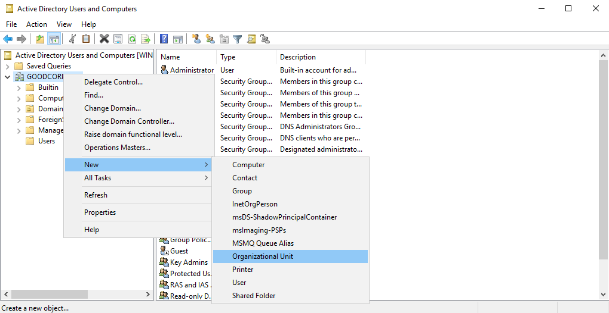
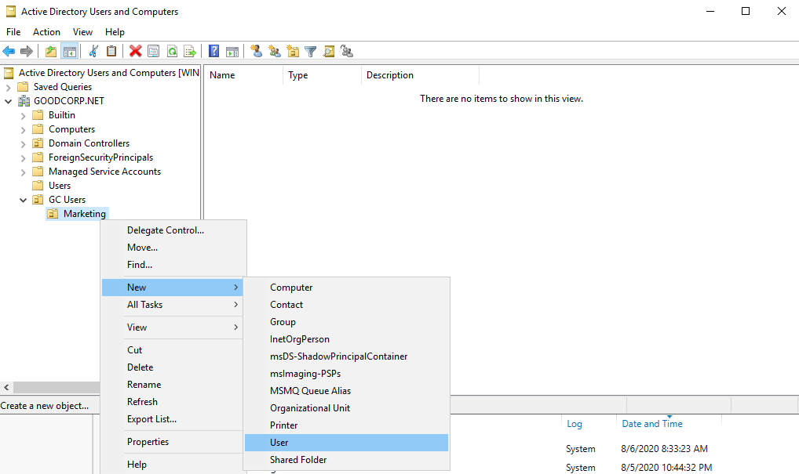
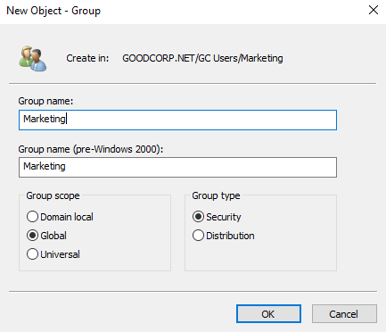
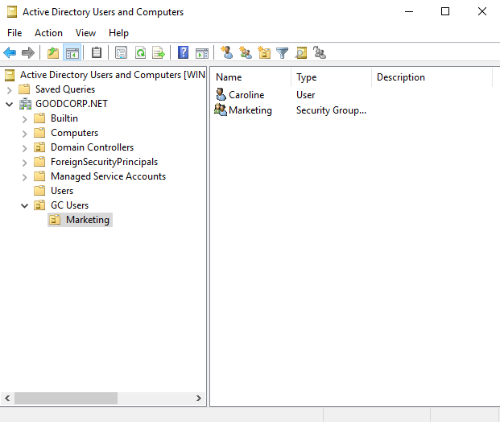
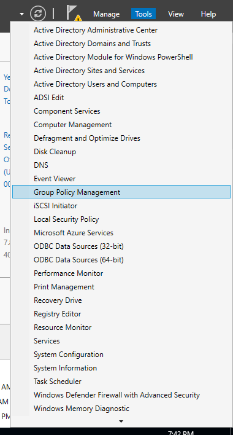
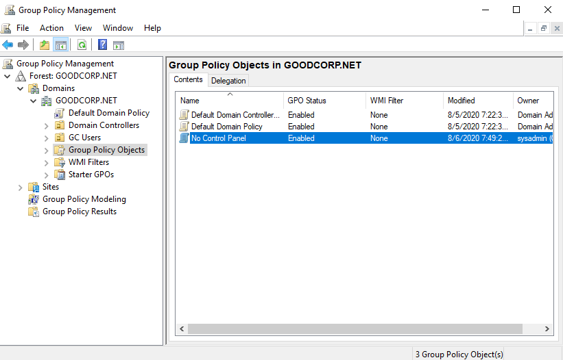
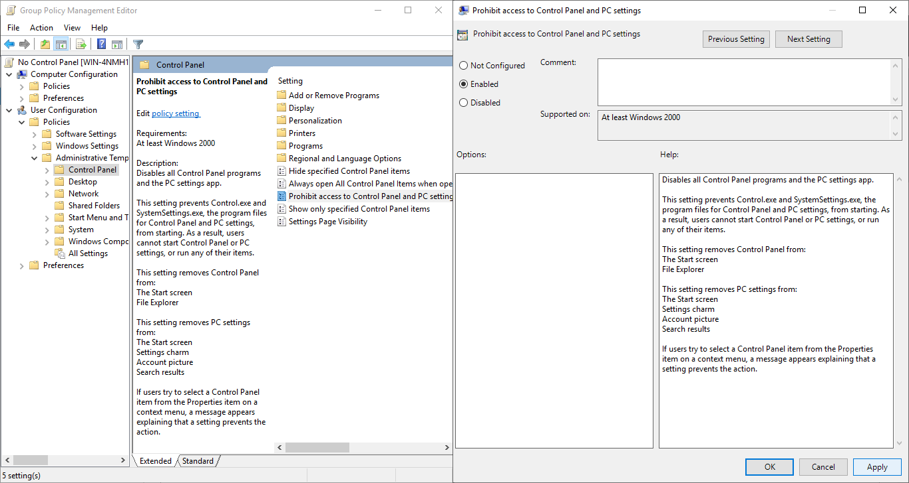
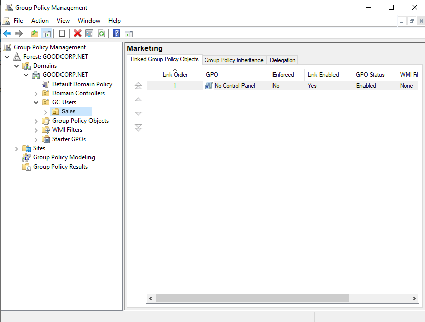
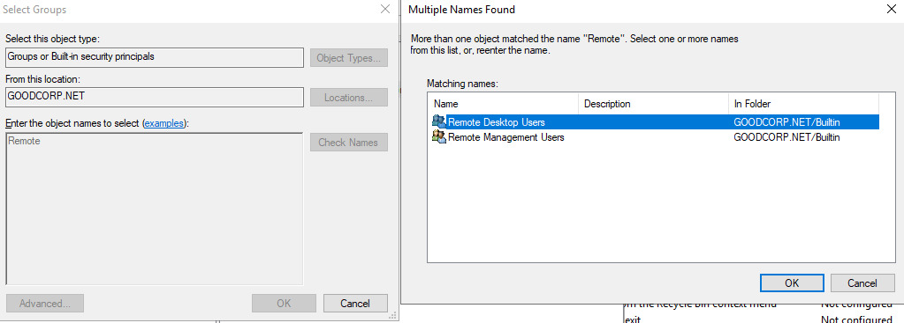
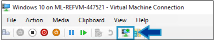

## 7.3 Student Guide: Windows Active Directory Domain Services

### Class Overview

In today's class, you will learn how to manage Active Directory Domain Services and secure a Windows Server domain.

### Class Objectives

By the end of the class, you will be able to:

- Explain how Active Directory is used to manage enterprise-scale environments.

- Define domain controllers as servers that manage AD authentication and authorization.

- Use Active Directory tools to create organizational units, users, and groups. 

- Create and link Group Policy Objects that enforce domain-hardening policies. 

### Lab Environment

<details><summary>Lab Details</summary>
<br>

In this module, you will use a new Windows lab environment located in Windows Azure Lab Services. Log in to the Windows RDP Host machine using the following credentials: 

  - Username: `azadmin`

  - Password: `p@ssw0rdp@ssw0rd`

Open the Hyper-V Manager in the Windows RDP Host machine to access the nested virtual machines:

**Windows 10 Machine:**

  - Username: `sysadmin`

  - Password: `cybersecurity`

**Windows Server Machine:**

  - Username: `sysadmin`

  - Password: `p4ssw0rd*`

#### Additional Lab Notes

- Note that the majority of today's demos, activities, and reviews will be conducted in the **Windows Server** machine, unless specified otherwise.

- At the end of class, be sure to turn off the VMs and the host machines to prevent issues connecting to the VMs in the future. You should do this every time you access the environment outside of class hours.

#### Understanding the Windows Module Lab

The following Google Doc contains a list of common Windows issues that occur during this module. Be sure to familiarize yourself with the module's issues so that you'll be able to refer to it accordingly:

- [Understanding the Windows Module Lab](https://docs.google.com/document/d/18Mz12q82nhxkypVRdIVgIqsLeNG1oCQj_TPsFJ3RgGk/edit)

</details>

### Module Day 3 Contents

- [x] [01. Welcome and Overview](#01-welcome-and-overview)
- [x] [02. What is Active Directory?](#02-what-is-active-directory)
- [x] [03. Creating Domain OUs, Users, Groups](#03-creating-domain-ous-users-groups)
- [x] [04. Activity: Creating Domain OUs, Users, and Groups](#04-creating-domain-ous-users-and-groups-activity)
- [x] [05. Activity Review: Creating Domain OUs, Users, and Groups Review](#05-activity-review-creating-domain-ous-users-and-groups-activity)
- [x] [06. Break](#06-break)
- [x] [07. Creating Group Policy with Group Policy Objects Demo](#07-creating-group-policy-with-group-policy-objects-demo)
- [x] [08. Activity: Creating Group Policy with Group Policy Objects](#08-activtiy-creating-group-policy-with-group-policy-objects)
- [x] [09. Activity Review: Creating Group Policy with Group Policy Objects Review](#09-activtiy-review-creating-group-policy-with-group-policy-objects)
- [x] [10. Windows Defender](#10-windows-defender)
- [x] [11. Best Practices and Shut Down Virtual Machines and Lab](#11-shut-down-virtual-machines-and-labs)


### Lesson Slideshow 

The lesson slides are available on Google Drive here: [7.3 Slides](https://docs.google.com/presentation/d/1v_UjHzkdYMx_quqg7gKnAzgeCfSrQdofQU8ETsGh6D8/edit?usp=sharing)

---

### 01. Welcome and Overview

Welcome to the third day of Windows. Briefly review what we covered in the previous class:

- We used PowerShell to navigate and manage the Windows system directories and files.

- We created event logs by utilizing PowerShell pipes and parameters.

- Lastly, we created PowerShell scripts that automated the removal of Windows packages utilizing the package manager, `choco`.

Now that we have some familiarity with PowerShell, today we're going to learn how to manage **Active Directory Domain Services** (also referred to as **Active Directory**, and abbreviated as **AD**). 

Active Directory is the central databasing and management system for enterprise-scale Windows environments.

Having a strong understanding of Active Directory is crucial for anyone working in Windows-based system administration and security.

The majority of roles in security fields interact with Active Directory in some form or another:

- Security analysts, threat hunters, forensics experts, and incidence responders will all likely be required to know _some_ Active Directory to be effective within their own organization or a client's.

- Experts in penetration testing, threat intelligence, and malware reverse engineering will need to understand and/or leverage vulnerabilities to execute exploits in poorly implemented AD configurations.

Before we can get started with Active Directory, we'll want to understand how it is set up and configured within our Windows Azure Lab environment.

#### Accessing the Lab

- Log in to your Windows RDP Host machine and then start up and log in to the nested virtual machines if you have not done so already.

- Use following guide if needed:

  - [Launching your Windows Lab](./Activities/00_Windows_Lab/ReadMe.md)

- Ensure that you launch the virtual machines and do Step 3 to extend your virtual machine evaluation licenses.

**The Machines**

Within our Windows RDP Host machine, we have two nested Hyper-V virtual machines:

- A Windows 10 virtual machine that has Windows 10 installed on it just like our Windows RDP Host machine.

- A Windows Server virtual machine that has the Windows Server 2019 operating system installed. 

**The Connectivity**

Your Windows Azure Labs have been already set up with Active Directory Domain Services installed and configured. 

The following are some details on how the machines are logically set up:

- Windows Server machine has Active Directory set up on it with the domain, `GoodCorp.net`. This will be the domain that we will be managing. We'll be using Active Directory to set up what are known as group policies on the Windows 10 machine. Also, the Windows Server machine is providing DNS for the Windows 10 machine. 

- The Windows 10 machine is connected to the Windows Server Active Directory domain&mdash;it is acting as a Windows client workstation that is set up so that it will receive and execute instructions and policies from the Active Directory server through a trust relationship.

Don't be worried about not knowing these concepts as we'll be covering them soon or in future lessons.

Let's look at a scenario in which Active Directory would be useful to an organization that is not using it.

[<- Back to Module Contents](#module-day-3-contents)

---

### 02. What is Active Directory?

Suppose a small startup with 20 employees recently received a large amount of funding, after which they hired 100 more employees. 

- When the company was smaller, everyone helped each other out and had access to the same resources. 

- But for organizational and security reasons, the company must now be stricter about who can access resources. They must ensure everyone can access what they need, and can't access the things they don't need.

For example:

- Accountants need access to sensitive files containing banking numbers.

- IT teams need access to networking components like switches and routers.

- Everybody should have access to the printer.

- No guests should be able to access the network. 

Files, networking components, and printers are all **resources** that require permission to access. Because of the diverse roles and responsibilities of each employee, access is only given to those who need it.

The users, groups, machines, permissions, and policies assigned to them are known as **security principals**.

Active Directory is the system that helps us manage these resources and security principals by enforcing **authentication** and **authorization**. 

- Authentication proves you are who you say you are, using a password, token, or biometric key.

- Authorization either allows or denies access to material. 

  -  Think about what we learned during the Linux weeks related to file permissions. AD uses these same principles to help keep confidential documents secure. 

AD is also useful in the following areas: 

- **Compliance:** A domain controller can help organizations stay compliant by implementing controls, which are crucial for passing security audits. An example of a control is implementing password policies to protect users from account compromise.

- **Risk management:** A properly managed domain can help reduce organizational risk. This includes managing and enforcing user access, password, and group policies to implement organizational compliance controls. Risk management can tie directly to business functions such as finance, and to external parties such as insurers, who will use risk levels to determine premiums and coverage.

- **Access control:** Access to files and directories are managed by Access Control Lists (ACLs). These identify which entities (security principals), such as users and groups, can access which resources. ACLs use security identifiers to manage which principals can access which resources.

AD is all the services that work together to manage authentication and authorization within a Windows Server network.

In AD, everything within a network is considered an **object**.

- Objects are users, groups, and computers, as well as the file shares, network printers, and other resources that users need access to. 

- This means that all the factors in the startup scenario mentioned earlier are considered objects, including:

  - Resources like printers, financial data, networking components, and mailboxes.

  - Security principals such as the accounting groups, guest users, and hot desk machines. Every security principal has a security identifier.

  - Just like in PowerShell, AD objects have attributes that describe properties of the objects. For example, the user object `Bob` might have an associated email attribute, bob@goodcorp.net. We'll explore this in more depth later.

Before we can understand how AD works, let's discuss what a Windows Server domain is.

#### Windows Domains and Domain Controllers

A **Windows Server domain** is a digital grouping of all object types, such as the users, computers, network resources, and security principals in an enterprise. These objects are managed by a server called a **domain controller**.

A domain controller is a server that manages access to all the domain resources. The domain controller has Active Directory installed and handles all authentication requests for these resources. The domain controller uses a database to verify authentication requests.

#### Active Directory Architecture

The Active Directory framework has multiple levels. These include containers, organizational units, groups, trees, and forests:

- **Containers:** Virtual collections of objects.

- **Organizational units (OU):** Collections of objects that have policies applied to them. These collections typically relate to business functions. For example, user objects within the accounting.GoodCorp.net OU should only include users in the accounting department. OUs are not considered security principals.

- **Groups:** Also collections of objects such as users, computers, and other resources. Groups are used to manage identical permissions and access controls for security purposes, and to manage email distribution groups. Groups are considered security principals and use authentication to access resources.

  - There are two types of groups in AD:

     1. **Distribution groups**: Used to create email distribution lists for mail services such as Microsoft Exchange.

     2. **Security groups**: Used to assign permissions (or access controls) to shared resources. We'll learn more about access controls when we get to Group Policy Objects.

- **Trees:** Collections of one or more domains and domain trees. For example, accounting.GoodCorp.net and sales.GoodCorp.net are child trees in the larger GoodCorp.net tree. The admin of the top level of a tree is called the **domain admin**. A GoodCorp.net domain admin would have AD control over all domains within the GoodCorp.net tree.

- **Forests:** Two or more trees that are part of the same AD configuration. For example, a forest of domains might include GoodCorp.org, GoodCorp.com, and GoodCorp.net. The trust relationship between the domains allows GoodCorp.net users to interface with GoodCorp.com hosts if needed. The administration group for the entire forest of domains for an organization is called **enterprise admins**. This group controls AD for all of Good Corp's domains. 

#### Active Directory Authentication

While we haven't covered protocols, we will discuss them during the week on Windows penetration testing.

Active Directory uses protocols, such as NTLM and Kerberos, to ensure that only the proper users can access the resources in the domain. Kerberos, the most commonly used authentication protocol, is considered one of the stronger methods of credential and authentication management. It is one of the reasons AD is so widely used.

- **LDAP:** Lightweight Directory Access Protocol (LDAP) is a standardized protocol used for adding, deleting, and editing objects within AD. Think of AD as a journal of information, and LDAP as the pencil and eraser.

- **Kerberos:** This is a ticket-based authentication protocol that is now the default authentication protocol for Windows Server domains. It provides direct encrypted sessions between users and networked resources, which protect users from external and internal threats.

- **NTLM:** New Technology LAN Manager (NTLM), like Kerberos, is an authentication protocol. It is now outdated due to pass-the-hash attacks. We will look at hashes more in our module on cryptography. We will also discuss pass-the-hash attacks in the module on penetration testing.

Let's look at exactly how Kerberos works. We'll use the example of a user, Bob, attempting to access a networked file server.

When Bob first signs in to the domain using Kerberos:

1. Bob's Windows 10 machine sends a request to authenticate to the **Key Distribution Center (KDC)**, seeking a **Ticket-Granting Ticket (TGT)**.

   - A Key Distribution Center has a database of valid credentials, an **Authentication Server**, and a **Ticket-Granting Server (TGS)**.

2. Once Bob's credentials are verified, he receives a Ticket-Granting Ticket that allows him to request access to resources. That Ticket-Granting Ticket is cached (or stored) and allows him to request more tickets for the current domain session.

3. When Bob attempts to access the file server, he sends the Ticket-Granting Ticket to the Ticket-Granting Server, requesting access to the file server.

4. The Key Distribution Center then checks to see if the file server exists and if the Ticket-Granting Ticket is valid. If it is, the Key Distribution Center sends Bob an encrypted **service ticket** containing the _past_ information he authenticated with earlier, and a **session key**. Bob is then sent the encrypted service ticket and a copy of the session key. Bob _cannot_ access the contents of the service ticket—only the file server can.

5. Bob then uses the session key to encrypt a new message containing his _current_ information and sends that, along with the service ticket, to the file server.

6. The file server then decrypts the service ticket containing the session key, and uses that session key to decrypt the message from Bob containing his _current_ information. 

   - If the service ticket's _past_ information about Bob matches the message containing Bob's _current_ information, the file server verifies that it is, in fact, Bob requesting access.

7. Lastly, the file server uses the session key to encrypt a new message to be sent to Bob containing information about the file server. If Bob's existing copy of the session key properly decrypts the message, the file server is verified to be the same file server Bob requested access to.

Recall that Active Directory is widely used not just for managing authentication within a Windows-based enterprise environment, but also for creating and managing logical user groups and organizational units.

Let's look at how we can create and manage these organizational units, users, and groups in our domain.

[<- Back to Module Contents](#module-day-3-contents)

---

### 03. Creating Domain OUs, Users, Groups

For this demo, we will continue our system administration tasks and set up users in Active Directory so they have accounts that are logically assigned to organization units and groups. 

- We need to set up marketing associate Caroline as a new user in Active Directory. 

- To do this, we will need to create organizational units (OUs), users, and groups.

We will complete the following tasks:

- Create a new domain organizational unit called `GC Users`.

- Create a sub-OU called `Marketing`.

- Create a user, `Caroline`, under the `GC Users > Marketing` OU.

- Create a group, `Marketing`, under the `GC Users > Marketing` OU.

#### Creating Organizational Units

At the top-right of the Server Manager, click **Tools**, and open the **Active Directory Users and Computers (ADUC)** tool.

- We use this tool to manage user and computer objects within a domain. We will be creating our users, groups, and organizational units with this tool.

- OUs are logical groupings of an organization's assets and accounts, used to manage these assets together. For example, all the computers in the company's marketing department should be grouped together in an organizational unit (OU). This OU might be called `GC Users > Marketing`. All of the computers in this OU have the same policy, which is set by the Group Policy.

- OUs allow us to distinguish computer objects based on how they are functionally associated with one another within the organization.

- OUs allow us to apply custom permissions, rules, and settings for users and groups in the domain through Group Policy Objects, which are collections of policy settings. We will learn more about these later. For now, we will look at creating OUs.

With ADUC still open, complete the following steps:

- Right-click **GOODCORP.NET**, go to **New**, then **Organizational Unit**.



- Name this OU `GC Users` (short for Good Corp, Inc.).

We now have a top-level organizational unit to hold all of our domain's users. Now we need to add a layer of organization to distinguish users. 

Let's create the `Marketing` sub-organizational unit.

- Right-click **GC Users**, then click **New**, then **Organizational Unit**.


- Name this sub-OU `Marketing` and click **OK**.

We now have a sub-OU for our marketing team. This will include our marketing team users, who will all have the same policies applied to them. 


Now, lets add a user. 

#### Creating Users

Users are the domain accounts that people log in with. Let's look at how to create the user `Caroline` under the `Marketing` organizational unit we just created.

With ADUC still open, complete the following steps:

- Click to expand the **GC Users** organizational unit, right-click **Marketing**, then **New** > **User**. The New Object - User window will appear.



- In this window, enter `Caroline` for the first name and for the user logon name.

   

Some organizations choose to use the last name initial, first name as the user account.

- To make it simple, and because our own domain won't be nearly as large as our clients', we are going to use first names as the username, followed by @GOODCORP.NET.

- Click **Next >**.

The next screen will have fields for setting Caroline's password and a few password settings for sysadmins to set.

- Set the password to `Ilovemarketing!`.

- Uncheck **User must change password at first logon**.

- You don't have to check any other boxes here.

In a real-world scenario, we would have our user reset their password on their first logon. We are keeping the names the same so we can test the user later.

- Click **Next >**.

- The next screen shows the settings you chose. It should have the following:

  - Full name: `Caroline`

  - User logon name: `Caroline@GOODCORP.NET`

- Click **Finish**.

- Double-click on the **GC Users > Marketing** organizational unit (the folder icon), and note our newly created user, `Caroline`, in the right pane.

  - 

Now that we have Caroline's domain account set up, we're going to add her to a group.

#### Creating Groups

Groups are collections of objects that require authorization to access resources.

Groups are different from organizational units in the following ways:

- You can link group policies to OUs, but not groups.

- You can give file, folder, sharing, and other resource permissions to groups, but not OUs.

- Groups have security identifiers, but OUs do not.

Groups are for managing permissions to resources, while organizational units are for linking policies to a set of objects, and for administration purposes. We'll be exploring Group Policies soon.

Users can belong to many groups, but are only part of one OU. OUs are organizational tools.

- For example, the `Caroline` domain account belongs under the `Marketing` organizational unit, but the user `Caroline` can be in the `Salesforce` _and_ `Customer Service` groups.

- The groups allow Caroline access to `Salesforce` and `Customer Service` resources such as networked file shares, while the `Marketing` OU will have the `Marketing` Group Policies applied to these accounts. 

   - A policy might be "no access to Windows control panel", meaning users in the `Marketing` OU won't be allowed access to Windows control panel to change system settings.

With ADUC still open, complete the following steps:

- Right-click the **GC Users > Marketing** OU, then go to **New**, then **Group**.

- Set the group name to `Marketing`. Leave group scope as **Global** and group type as **Security**.

   

  - Universal groups exist in the domain forest. If we also own the domains GoodCorp.com and BadCorp.net and they share a transitive trust relationship, user accounts in universal groups can use resources in all of these domains.

  - Global groups are set up to contain multiple users with identical permissions. Global groups are usually lists of users.

  - Local groups are best used when their objects only need access to specific resources.

- Click **OK**.

A new group, `Marketing`, will appear in the `GC Users > Marketing` organizational unit. We need to add `Caroline` to `Marketing` now.

  

- Right-click **Caroline** and go to **Add to a group...**.

  

- In Select Groups, type "Marketing" in the **Enter the object names to select** field.

  

- Click **Check Names**.

  - "Marketing" becomes underlined, meaning the system found the group.

- Click **OK**. A new screen will appear saying `The Add to Group operation was successfully completed.`

  

- Click **OK**.

`Caroline` is now part of the `Marketing` group in our domain. Later, we will set up the `Marketing` group permissions.

**:warning:** Your Active Directory Domain Controller must be set up to complete the next activity.

[<- Back to Module Contents](#module-day-3-contents)

---

### 04. Creating Domain OUs, Users, and Groups Activity

- [Activity File: Creating OUs, Users, and Groups](Activities/04_Creating_OUs_Users_Groups/Unsolved/README.md)

[<- Back to Module Contents](#module-day-3-contents)

---

### 05. Activity Review: Creating Domain OUs, Users, and Groups Activity

- [Solution Guide](Activities/04_Creating_OUs_Users_Groups/Solved/Readme.md)

[<- Back to Module Contents](#module-day-3-contents)

---

### 06. Break

[<- Back to Module Contents](#module-day-3-contents)

---


### 07. Creating Group Policy with Group Policy Objects Demo

We set up users and their associated OUs and groups, and can now create some policies that will distinguish them from one another.

- We use Group Policy Objects to implement the principle of least privilege, giving users only the access they need in order to keep a threat's attack surface area as small as possible. 

  - For example, we can use a Group Policy Object to deny `Sales` access to Control Panel, since members of the Sales team don't need to access this area of the system. 

- Group Policies manage and apply multiple policies at the same time. One change to a Group Policy can take effect on all the OUs the policies are applied to.

  Consider the following scenario: 

  - Recently, all of the accountants at your company had their passwords leaked. 

  - After securing the vulnerability that was exploited, you can assign the accounting OU, which consists of over 1,000 accounts, a policy that resets all users' passwords and requires every accountant to set a new password on their next logon. 

To pass a Group Policy to an OU, we need a Group Policy Object.

- A Group Policy Object (GPO) is a package of policy settings applied to OUs in our domain. GPOs are the cornerstone of policy management in Active Directory.

- Multiple Group Policies are often combined into one GPO. 

    - For example: If you want to require accountants to have password complexity requirements and to deploy an anti-malware software the next time they log on, you can combine these two policies into one Group Policy Object called `Better Password and Anti-Malware Setup`, and apply it to all the accountants in the OU.

#### Creating Group Policy with Group Policy Objects Demo

For this demo, we want our Sales team to have limited access to Windows Control Panel. 

Note that this week's Challenge will largely involve GPOs so this demo is especially important to understand.

Control Panel allows a user to change vital system settings on their machine, and as such, we are concerned that members of the Sales team might make mistakes if they try to troubleshoot problems on their own.  

In this demo, we will deny the Sales team access to the Control Panel. 

In order to do this, we will need to: 

- Create a Group Policy Object.

- Edit the individual policies for our Group Policy Object.

- Link the Group Policy Object to an organizational unit.

- Pull the latest Active Directory changes in the Windows 10 machine.

- Check if the GPO worked.

#### Create New Group Policy Object

Make sure that you're connected to the Windows Server machine before continuing.

Begin by opening the Group Policy Management tool.

- With the Server Manager open, click on **Tools** at the top-right.

- Select the **Group Policy Management** tool. The Group Policy Management window will appear.

  

Note that the left pane of the Group Policy Management window looks similar to where we saw our domain and organizational units.

Click on the following:

- In the Group Policy Management window, click on **Forest**. Move through **GOODCORP.NET** > **Domains** > **GOODCORP.NET**. 

   

- Right-click **Group Policy Objects** under **GOODCORP.NET** and click **New**.

   

In the New GPO window, type "No Control Panel" for the name.

- Click **OK**.

- Note the new `No Control Panel` GPO under the defaults in the Group Policy Objects list on the right-side pane.

   

#### Add Group Policies to Group Policy Object

We just created a Group Policy Object, but it doesn't have any policies to enforce yet. We'll look at how to do that now.

- Right-click the **No Control Panel** GPO and click **Edit**. The Group Policy Management Editor window will open.

This is where you select the policies to add to your GPO.

- Navigate to **User Configuration**, then click **Policies** > **Administrative Templates** > **Control Panel**. On the right-side pane are default policies you can edit.

  

- Double-click the **Prohibit access to Control Panel and PC settings** policy. This is the policy to deny access to the Control Panel on Windows systems.

- Select **Enable**, then press **Apply** > **OK**.

  

- Close the Group Policy Management Editor window.

#### Link and Apply the Group Policy Object

At this point, we have created a Group Policy Object with a single policy that denies access to the Control Panel. Now we need to apply it to the Sales team OU, which will acquire GPO links. 

Navigate to the Group Policy Management window so that we can link the Group Policy Objects to the organizational unit. 

- With the Group Policy Management window open, move through the following: **Group Policy Management** > **Forest** > **Domains** > **GOODCORP.NET** > **GC Users**. 
  
- Right-click the `Sales` organizational unit under `GC Users` and select `Link an Existing GPO...`. The `Select GPO` window will appear.

  

We can now apply the `No Control Panel` GPO we created.

- Click **No Control Panel** and click **OK**.

We have now applied the `No Control Panel` GPO to the `GC Users > Sales` OU.

  

#### Allow Group to Remote Demo

Next, we'll want to test to see if the Group Policy applied properly. We'll need to log in to the Windows 10 machine as `Bob` in order to do so. 

But first, we have to add `Bob` to the `Remote Desktop Users` group so that we can log in to the Windows 10 machine as him.

- Open Active Directory Users and Computers again and go to the `GC Users` > `Sales` sub-OU. 

  - Right-click the **Sales** group (not the OU), and select **Add to group...**.

  - Within the Select Groups window, type "Remote" and select **Check Names**.

  - Select **Remote Desktop Users** and click **OK**. Then click **OK** on the next window to apply it.

  

#### Toggle Enhanced Session Mode to Basic Session and Test GPO

Now we'll want to log in as `Bob` in our Windows 10 machine to see our changes. But first, we need to pull the latest Active Directory changes to the machine.

- Go back to the Windows 10 machine. Sign in as `sysadmin` if you have not already.

We're going to run the command `gpupdate` on the Windows 10 machine so that it pulls and refreshes the latest group policies.

- Open a CMD or PowerShell window and run `gpupdate`. You should see the following:

  ```
  Updating policy...

  Computer Policy update has completed successfully.
  User Policy update has completed successfully.
  ```

This means our machine has now pulled the latest group policies. 

Now we'll want to swap the Windows 10 machine to **Basic Session Mode**.

Note that the Windows Azure Lab should already be configured so that the virtual machines have **Enhanced Session Mode** enabled by default. 

> **Enhanced Session Mode** allows you to copy and paste directly into the virtual machines. You won't, however, be able to log in to the virtual machines as a domain user with **Enhanced Session Mode** enabled.

Toggling the Windows 10 virtual machine to **Basic Session Mode** will allow us to log in to our domain user in the Windows 10 machine.

- Click on the button pictured below to toggle the virtual machine into **Basic Session Mode**. If you hover your mouse over the button, you’ll be able to see which mode you are toggling to.

  - 

After toggling to **Basic Session**:

- Once you're signed out of `sysadmin`, you should be back at the Windows lock screen. Click it, then select **Other user**.

- Enter `Bob` and `Ilovesales!` for the **Username** and **Password**.
  
> **Note:** Once you are done using your domain user, you can toggle **Enhanced Session Mode** back on, which will return you to the login screen and allow copying and pasting into the VM again.

You should see the first-time Windows 10 login messages, such as `Hi` and `We're getting everything ready for you`. After a few seconds, you should be on `Bob`'s desktop.

- Click on the Start menu or the search bar and type "Control Panel". 

  

We should not be able to access the Control Panel as `Bob`.

- Press Enter to see the following Restrictions warning:

  

If you want to swap back to the `sysadmin` user, you'll want to sign out of `Bob`, then at the **Other user** login area, enter:

`.\sysadmin` as the username to log in with. The `.\` specifies logging in to a local account.

For the following activity, we'll need to create Group Policy Objects with policies and link them to the proper organizational units.

**Note:** If you followed along with the demo, you'll need to unlink the **No Control Panel** panel from the `Sales` OU as it may interfere with your activity.

[<- Back to Module Contents](#module-day-3-contents)

---

### 08. Activtiy: Creating Group Policy with Group Policy Objects

- [Activity File: Creating Group Policy with Group Policy Objects](Activities/08_Group_Policy_Objects/Unsolved/README.md)

[<- Back to Module Contents](#module-day-3-contents)

---

### 09. Activtiy Review: Creating Group Policy with Group Policy Objects

- [Solution Guide](Activities/08_Group_Policy_Objects/Solved/Readme.md)

[<- Back to Module Contents](#module-day-3-contents)

---

### 10. Windows Defender

Windows Defender is Microsoft's built-in anti-malware solution that comes integrated with Windows operating systems. Originally introduced as an antispyware program with Windows Vista, it has since evolved into a fully-fledged antivirus solution.

- Windows Defender actively scans your computer for malicious software, including viruses, spyware, and other potential threats. It uses both real-time protection to catch threats as they appear and scheduled scans to check the system periodically.

While home users will typically configure Defender on their own, in an enterprise environment, system administrators will configure Defender via Group Policies. They can utilize Windows Defender in several ways to secure workstations:

- **Real-time protection:** This feature monitors for malware activity continuously.
- **Scheduled scans:** They can set up Defender to scan at specific intervals or during off-peak hours.
- **Exclusions:** In environments where certain files or processes should not be scanned (like specific server tasks), admins can set exclusions. 
- **Block at First Sight:** This feature can be enabled to improve the speed of detecting new malware.
- **Tamper protection:** Prevents unauthorized changes to Windows Defender settings.

Some key features of Windows Defender are:

- **Cloud-delivered protection:** Provides rapid malware definition updates and potential threat information.
- **Family options:** Parental controls to ensure a safe browsing experience for younger users.
- **Ransomware protection:** Known as "Controlled folder access", it prevents unauthorized apps from modifying sensitive folders.
- **Browser integration:** Windows Defender SmartScreen integrates with browsers for web protection.
- **Exploit protection:** Provides intrinsic settings to protect against known software exploits.
- **Offline scanning:** Can perform offline scans when certain malware is difficult to remove while the OS is running.

In addition, Defender itself can have policies. These policies can ensure that the security measures are uniformly applied across all workstations and servers, and they can tailor the functionality of Windows Defender to the specific needs and requirements of their organization. Policies can do several things:

- Scan Preferences can define when and how often scans should be performed (quick, full, or custom scans), and how to handle detected threats.
- Signature Updates can configure how often Windows Defender checks for, downloads, and applies updates.
- Exclusions will specify files, folders, file types, and processes that Defender should not scan.
- Manage Windows Defender Firewall settings, including specifying which applications can listen for incoming traffic, defining firewall rules, and more.
- Protect sensitive folders from ransomware attacks by only permitting allowed applications to access and modify them.
	
This is just a brief summary of what Windows Defender is capable of and it has significantly improved from the days of Windows 7. 

[<- Back to Module Contents](#module-day-3-contents)

---

### 11. Shut Down Virtual Machines and Labs

Designing an Active Directory (AD) infrastructure is a critical task, as it serves as the backbone for authentication, authorization, and various services within an enterprise. There are some best practices to ensure efficiency and security:

- Ensure you fully understand the organizational structure, business units, geographical distribution, and potential growth. Your AD design should reflect and support these aspects.
	
- Whenever possible, opt for a simpler design. A straightforward AD structure is easier to manage, troubleshoot, and understand.

- Use a Descriptive Naming Convention. Name domains, organizational units (OUs), and groups meaningfully. This makes the AD structure self-documenting to some extent.

- While your current organization may be a certain size, it's crucial to design the AD infrastructure to scale with growth.

- Group Policies can profoundly impact the user experience and system behavior. Test all GPOs in a lab or staging environment before deploying to production.

- Document the AD structure, policies, permissions, and any changes. This is invaluable for troubleshooting, audits, and onboarding new team members.


Group Policy Objects are a way to manage and apply policies to entire sets of users or groups all at once.

While it took some time to get here, learning how to manage users and computers with Group Policy Objects is a vital part of understanding how to be an Active Directory domain system administrator and to create policies that can enforce security.


|                                                       :warning: Shut Down Your Machine :warning:                                                       |
|:-------------------------------------------------------------------------------------------------------------------------------------------------------:|
| Shutdown your Hyper-V virtual machine and Windows RDP Host machine. You will need the remaining hours to complete your Challenge. |

[<- Back to Module Contents](#module-day-3-contents)

---


### 12. Resources

Here are some additional resources on AD design:

#### 1. **Books:**
- [**"Active Directory: Designing, Deploying, and Running Active Directory"**](https://www.amazon.com/Active-Directory-Designing-Deploying-Running/dp/1449320023) by Brian Desmond, Joe Richards, Robbie Allen, and Alistair G. Lowe-Norris
  - A comprehensive guide on AD covering design principles.
- [**"Mastering Active Directory: Understand the Core Functionalities of Active Directory Services Using Microsoft Server 2016 and PowerShell"**](https://www.amazon.com/Mastering-Active-Directory-Understand-Functionalities/dp/1787289354) by Dishan Francis
  - Provides practical knowledge with advanced tactics.

#### 2. **Microsoft Documentation:**
- [**Active Directory Domain Services Overview**](https://learn.microsoft.com/en-us/windows-server/identity/ad-ds/get-started/virtual-dc/active-directory-domain-services-overview)
  - Microsoft's official guide offers in-depth guidance, demonstrations, and best practices.
- [**Microsoft Learn**](https://learn.microsoft.com/en-us/)
  - Hosting modules on AD design and management.

#### 3. **Online Courses**:
- [**Pluralsight**](https://www.pluralsight.com/search?q=active%20directory)
  - Offers courses on AD topics. Notably, courses authored by experts like Greg Shields.
- [**Udemy**](https://www.udemy.com/courses/search/?src=ukw&q=active+directory)
  - Features courses specific to AD design. Always check ratings and reviews.

#### 4. **Blogs and Communities:**
- [**Microsoft MVP Award Program Blogs**](https://techcommunity.microsoft.com/t5/microsoft-mvp-award-program-blog/bg-p/MVPAwardProgramBlog)
  - MVPs like Ned Pyle and Sean Metcalf maintain blogs discussing AD.
- [**Spiceworks Community**](https://community.spiceworks.com/)
  - IT-centric community with discussions on AD.
- [**Reddit**](https://www.reddit.com/r/sysadmin/)
  - Subreddits like r/sysadmin feature AD-related threads.

#### 5. **Forums and Q&A Sites:**
- [**Server Fault**](https://serverfault.com/)
  - Discussions related to AD design and best practices.
- [**Microsoft Q&A**](https://learn.microsoft.com/en-us/answers/questions/)
  - Microsoft's platform has a section dedicated to AD.

#### 6. **Tools and Utilities:**
- [**Microsoft AD Topology Diagrammer**](http://web.archive.org/web/20200803205227if%5C_/https://download.microsoft.com/download/e/7/0/e701cb52-e924-4ca6-912f-13f75bc344e7/ADTD.Net%20Setup.msi)
  - Useful for visualizing AD design.
- [**PingCastle**](https://www.pingcastle.com/)
  - A security audit tool for AD health and security checks.

#### 7. **Conferences and Workshops:**
- [**Microsoft Ignite**](https://ignite.microsoft.com/)
  - Annual conference with sessions on AD.
- **Local Workshops/Training**
  - Local IT providers or Microsoft partners sometimes host AD-related workshops.

[<- Back to Module Contents](#module-day-3-contents)

---


© 2023 edX Boot Camps LLC. Confidential and Proprietary. All Rights Reserved.
