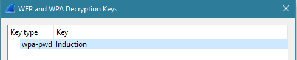

##  9.3 Lesson Plan: Networking Capture the Flag 

### Overview

Today, students will compete in a Capture the Flag activity that will test many of the networking skills and tools learned so far. As they do so, they will look for the answers for Capture the Flag questions and they'll collect them in a competition-style Capture the Flag (CTF) game. 

### Instructor Resources

- Students will fill out the Capture the Flag answers on a CTF website designed specifically for the activity. 

- Scores will be tracked using this website. 

### Lab Environment

#### Lab Access

- Students will use the CTF environment to find the correct flags. This environment will need to be prepared for the students before they begin.

- After uploading the Networking CTFd flags, the administrator password on the CTFd environment will be reset to:
 
  - Username: `admin`
 
  - Password: `ctfpassword`
  
### Online Classroom Strategies 

Refer to the following guidelines and best practices for conducting this class online: 

- [Cybersecurity Online Classroom Strategies](../../../00-Teaching-Staff-Prework/OnlineStrategies.md)  

### Module Day 3 Contents

- [x] [01. Instructor Do: Welcome and Introduction to the Networking Capture the Flag](LessonPlan.md#01-instructor-do-welcome-and-introduction-to-the-networking-capture-the-flag-005)
- [x] [02. Instructor Do: CTF Instructions and Rules](LessonPlan.md#02-instructor-do-ctf-instructions-and-rules-010)
- [x] [03. Student Do: Networking CTF Begins!](LessonPlan.md#03-student-do-networking-ctf-begins-220)
- [x] [04. Instructor Review: Networking CTF](LessonPlan.md#04-instructor-review-networking-ctf-015)

  
### Instructor Setup Instructions

⚠️ **Important** ⚠️ 

For this week's project, you will need to create the Capture the Flag environment that students use to submit the flags they find. 

  - This environment will also keep score for your students.

  - Be sure to set this up **before** class!
  
It is very important that students also follow the exact steps of setting up their web application. Specifically, students must pull the most current docker container before bringing it up. The instructions to enable the web application are listed in three steps in their guide.
   
**Complete the following steps to configure the web app CTF:**

1. We've created web apps for you to use in class. Select an available web app URL from the following [sheet](https://docs.google.com/spreadsheets/d/1Qe5S9qoziPqS2ftWMro6lGt4idww1OsRlxlySonMA7U/edit?usp=sharing). 

   - If you do not see any available apps, please reach out to the curriculum team. 

   - Be sure to indicate your starting date and end date of the Networking CTF activity.

2. Open up your webpage, and on the **General** tab, under **Event Name** (as shown in the following image), enter "Networking CTF".
  
    
  
3. Under the **Mode** tab, select **Team Mode**, since the students will compete in groups.

4. Under the **Administration** tab, choose a username, email, and password for your administrator account.

  - Note that these will be removed once you update your CTF, and your new credentials will be `admin:ctfpassword`.

5. Leave the defaults under the **Style** and **Date & Time** tabs.

6. Under **Integrations**, select **Finish**.

7. When the CTFd opens, select **Admin Panel**, as the following image shows:
  
    - 
  
8. Then, select **Config** and then **Backup**, as the following image shows:
  
   - 
  
9. Select the **Import** sub-tab.

10. Upload the following file: [Networking Capture the Flag](/v3.5-Curriculum/1-Lesson-Plans/09-Networking-Fundamentals-II-and-CTF-Review/3/Networking_Capture_The_Flag.zip).  

11. Select **Import**, as the following image shows: 
  
    

     - **Note:** Sometimes, the import appears to get stuck and not progress, but it has actually completed. Simply click the **Challenges** link at the top of the screen to see if the challenges have uploaded.  

12. Validate that your webpage is set up by:

     - Accessing your webpage.

     - Logging in as the new admin user with the following credentials:`admin` : `ctfpassword`

     - Registering a test student user account to view the flags display, which should resemble the following image:
  
    
  
Refer to the following guide to learn about additional features of CTFd: [CTFd guide](https://docs.ctfd.io/docs/overview).  

**Note:** The packet capture is available for download in the first flag within the Inspector Packet section. 

### Slideshow

- The lesson slides are available on Google Drive here: [9.3 Slides](https://docs.google.com/presentation/d/1uZhJtwu9wVxseAM7rr2BXRhijYa6ubzt1maURjnDqAs/edit#slide=id.g4789b2c72f_0_6) 

- To add slides to the student-facing repository, download the slides as a PDF by navigating to **File** > **Download as** and choosing **PDF document**. Then, add the PDF file to your class repository along with any other necessary files.

- **Note**: Editing access is not available for this document. If you or your students wish to modify the slides, please create a copy by navigating to **File** > **Make a copy**.

### Time Tracker

- The lesson time tracker is available on Google Drive here: [9.3 Time Tracker](https://docs.google.com/spreadsheets/d/12tDEik_fcO3LwJsrWr7EVPZuTd1urMVSui6egtNcbhE/edit#gid=1047115118)

---

### 01. Instructor Do: Welcome and Introduction to the Networking Capture the Flag (0:05)

Welcome the students to the last day of the second week of networking. Explain that, today, we will review everything we've learned about networks with a fun competition.

- Explain that we will be conducting a **Capture the Flag (CTF)** contest.

- CTFs are very common cybersecurity training exercises, and often take place at security conferences or training events.

Today's CTF will focus solely on the networking concepts learned over the past two weeks. 

[<- Back to Module Contents](LessonPlan.md#module-day-3-contents)

---

### 02. Instructor Do: CTF Instructions and Rules (0:10)

Explain how this CTF will work: 

- In this CTF, students will be provided a link to a website that contains various networking questions and activities.

- Questions and activities are separated into various networking categories.

- Students are required to download PCAP files in order to answer questions.

- The answers to questions and activities will serve as the **flags** that students must collect and document on the Networking CTF website. 

- Each flag has a different numeric point value. The higher the point value, the more challenging the question/activity.

- Total points of flags will be calculated automatically on the Networking CTF website.

- The student with the most points at the end of class, or who completes all the flags correctly first, wins the CTF. 

#### Today's Class

Let students know that the rest of today's class will proceed as follows:

- Overview of CTF rules

- Students will utilize the remainder of class to compete in the CTF!

Take a moment to address questions before proceeding.

  
#### CTF Instructions and Rules
 

**Instructions**

Cover the following rules of the CTF:

- Students are allowed to use all class notes, slides, and online materials to solve the questions/activities.

- Flags can be answered in any order. If a student is stuck on a question, they should move on to the next one.

- Instructors or TAs should assist with any technical CTF issues (e.g., a PCAP won't download), but should not provide guidance on answers.

Ask students if they have any questions before proceeding further to the CTF flag submission and scoring.
  

**CTF flag submission page**

- In your Lab browser, open a second tab and access your CTF page.
 
    - The instructor will provide the custom website for the CTF when it's time to begin.

- Once you have accessed this page, select "Register" on the top right to register your account, as the following image shows:
  
   

   - Remember your password in case you need to log back in!

   - ⚠️ **Important** ⚠️ Since you are competing in groups, select one team captain to choose a group name and password and share it among the team members when registering. As the following image shows, the team captain will select the "Create Team" option, and the rest of the team will select the "Join Team" option:
  
   

**CTF Flag Submission Page**
  
Introduce the CTF flag submission page by covering the following: 

  - After accessing the CTF website, select the "Challenges" tab.

  - This webpage contains a variety of questions ranging in topics and difficulty levels.
   
  -  The points awarded for a flag are indicated in the flag box. The more challenging the flag, the more points will be awarded for finding it, as the following image shows:
  
     
  
  - Selecting a flag will display important information for finding that flag, such as the question associated with that flag or guidance on how to locate the flag, as the following image shows:
  
    
  
  - Certain flags also have an associated file to use in answering questions.

  - Once you have found a flag, answer it by doing the following:

    - Step 1. Select the box with that flag number, and enter in the flag.

    - Step 2. Click the "Submit" button. 
       
    
  
 - You can view your team points total by selecting the "Scoreboard" option at the top of the page. 
  
   
  **Additional Hints for Success**

  - Think like a hacker!

  - Use the internet to help figure out the answers.

  - Make use of tools such as Wireshark.

  - We've covered most of the information in class, but there are some new things that will require additional research.
  
**CTF Rules**  

  Explain the following rules for today's activity:

  - Each group will start at the same time, once the URL for the CTF has been provided.
  
  - The team with the most points at the end of the allotted time will win.
  
  - You can use all available resources to assist you: class notes, slides, internet resources, tools such as Wireshark, etc.
  
  - If you feel your answer is correct but the flag does not accept it, please contact your instructor or TA to receive the flag.
  
  - Your instructor or TA can assist with technical or lab access issues, but will not provide guidance for finding the flags.
  
Ask the class if they have any questions before proceeding to the activity.  

[<- Back to Module Contents](LessonPlan.md#module-day-3-contents)

---

### 03. Student Do: Networking CTF Begins! (2:20)
  
We are ready to begin the Networking CTF!
  
- Remind the class that if they have any technical issues (e.g., the CTF is inaccessible, flags don't display when they should, etc.) they should reach out to you or a TA.

**Instructor Notes:**

- Reference [the solution file](./Resources/Networking_CTF_Key.xlsx) if any issues come up during the activity.

- The PCAPs are located in the Resources folder for reference.

- Wrap up the CTF 15 minutes before class ends to leave time for a class review.

[<- Back to Module Contents](LessonPlan.md#module-day-3-contents)

---

### 04. Instructor Review: Networking CTF (0:15)

Congratulate the winner, and second- and third-place finishers.

  - Offer the winning team the opportunity to show the class how they captured their flags.

Send the [solution file](./Resources/Networking_CTF_Key.xlsx) out to the students and review it, focusing on the flags that students found the most challenging.

Guides to answers that were not as straightforward:

- **Flag 11:** The answer to this question required an online search. The answer is found in this [Activision Support article](https://support.activision.com/articles/en_US/FAQ/Ports-Used-for-Call-of-Duty-Games).

- **Flag 12:** The total packet count is displayed on the bottom of the Wireshark screen.

- **Flag 13:** Adding a filter of ARP will show 19 packets displayed on the bottom of the screen.

- **Flag 14:** Filter by HTTP. The first GET request is for the host of thesimpsons.com.

- **Flag 15:** Packet number 24 shows the response code of `301 Moved Permanently`.

- **Flag 16:** In the same packet in the HTTP details, the redirect goes to fox.com/the-simpsons. The primary domain is fox.com.

- **Flag 18:** Packet 23 has the original source port of `50568`.

- **Flag 19:** Filter by DNS. In packet 20, in the packet details under **Domain Name Systems** > **Authoritative Nameservers**,  ns01.foxinc.com is shown as the primary nameserver.

- **Flag 20:** Filter by DNS. In the DNS response for the A record, packet 19, under Answers, is the TTL of 600.

- **Flag 21:** Filter by TCP. There is one SYN > ACK packet, packet 26. Under Timestamps in the packet details is the time since previous frame: 0.026018000.

- **Flag 22/23:** These are tricky. The recommended technique is: 
  - Search by "homer."
    - Use a filter `frame contains homer`. 
  - Only one packet displays: packet 46. 
  - This contains the data, but you have to scroll through the packet bytes data to get the answers.

  

- **Flag 24:** In that same packet, the MAC address of Homer, the sender of the message, is `a0:a4:c5:10:ac:c0`. Using any web tool, you will find the vendor is Intel.

- **Flag 28:** ASCII of 68 = `h`, 69 = `i`. The answer is `hi`.

- **Flag 29/30:** Use the [Browserling Binary to IP translation](https://www.browserling.com/tools/bin-to-ip) web tool. You have to run the conversion three times to get the answer: `38.42.56.32`.

- **Flag 31:** Arin.net will provide the AS number for the IP.

- **Flag 49:** Using any binary-to-text converter will convert the results to `Induction`. The **flag**, however, needs to be lowercase.

- **Flag 50:** To decrypt the packets in Wireshark, go to **Edit** > **Preferences**. In the protocols menu, select **IEEE 802.11**.
  
  - Check **Enable decryption**, then select **Edit**, enter in the WPA key of `wpa-pwd` : `Induction`, then filter by HTTP. **Note:** The first `I` in `Induction` is capitalized.  

  

- **Flag 51/52:** In packet 439, the packet details have the values: `Internet Protocol Version 4, Src: Karens-iMac.local (192.168.0.50), Dst: rr.pmtpa.wikimedia.org (66.230.200.100)`.

- **Flag 53:** From the top of the toolbar, select **Wireless** > **WLAN traffic**, and the SSID will display.

- **Flag 54:** Filter by DNS. The TTL is in packet 429.

- **Flag 55:** Filter by ICMP. All responses are unreachable, so the answer is zero.

- **Flag 56:** Filter by HTTP. Packet 778 (and several others) has a destination address with the word "transcripts", snltranscripts.jt.org. The answer is Saturday Night Live, or snl.

- **Flag 58/59:** Packet 2 shows the original (good) MAC that was already assigned, and a new (potentially bad) MAC that it was trying to be changed to.

- **Flag 60:** We can see 2015 in the frame part of the packet details of any packet. For example, `Oct  6, 2015 05:28:18.174006000 Eastern Daylight Time.`

- **Flag 61:** The formula is n(n - 1) / 2 , so (352 * 351) / 2 = 61,776.

- **Flag 62:** Number of hosts is 8,192. Subtract the broadcast and network address. Usable hosts: 8,190.

- **Flag 63:** For the ARPA, take the IP and switch the order of the octets from last to first. `66.56.54.194` becomes the ARPA IP of `194.54.56.66`.

- **Flag 64:** Using an [IPv6 CIDR calculator](https://www.ultratools.com/tools/ipv6CIDRToRange
 ), enter the IPv6 value with the CIDR notation, `2001:db8:85a3::8a2e:370:7334/107`, and it returns the number of hosts: 2,097,152.

[<- Back to Module Contents](LessonPlan.md#module-day-3-contents)

---

© 2023 edX Boot Camps LLC. Confidential and Proprietary. All Rights Reserved.    
