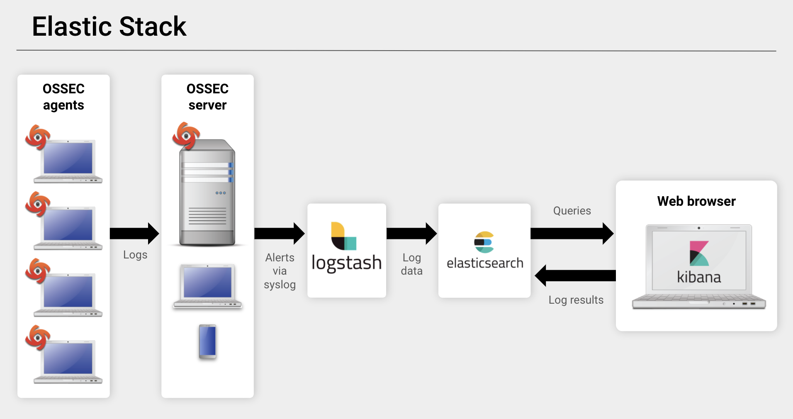

## 11.3 Lesson Plan: Enterprise Security Management (ESM)

### Overview

In today's class, students will advance their network security knowledge by learning enterprise security management (ESM) and how host-based OSSEC IDS technology plays a critical role in endpoint telemetry. Students will investigate threats using Security Onion's Elastic Stack and a web-based data analytics visualization tool called Kibana.

### Class Objectives

By the end of today's class, students will be able to:

- Analyze indicators of attack for persistent threats.

- Use enterprise security management to expand an investigation.

- Use OSSEC endpoint reporting agents as part of a host-based IDS alert system.

- Investigate threats using various analysis tools.

- Escalate alerts to senior incident handlers.

### Instructor Notes

Like Day 11.2, today's class will begin with  **01. Everyone Do: Security Onion Setup** in order to launch an instance of Security Onion and generate alert data that will be used throughout the day. 

- Please note that if student's PCAP files are not populating, they should run `sudo so-test` in the terminal of their Sec Onion machine. 

### Lab Environment

Lab Details

 

In this unit, you will be using the NetSec lab environment located in Windows Azure Lab Services.  RDP into the **Windows RDP host machine** using the following credentials:

  - Username: `azadmin`
  - Password: `p@ssw0rdp@ssw0rd`

Open Hyper-V Manager to access the below machines:

**Security Onion machine:**
  - Username: `sysadmin`
  - Password: `cybersecurity`

**UFW machine:**
  - Username: `sysadmin`
  - Password: `cybersecurity`

**firewalld machine:**
  - Username: `sysadmin`
  - Password: `cybersecurity`

In today's class, we will use the SecOnion machine.

### Online Classroom Strategies 

Refer to the following guidelines and best practices for conducting this class online: 

- [Cybersecurity Online Classroom Strategies](../../../00-Teaching-Staff-Prework/OnlineStrategies.md)

### Module Day 3 Contents

- [x] [01. Everyone Do: Security Onion Setup](LessonPlan.md#01-everyone-do-security-onion-setup-010)
- [x] [02. Instructor Do: Overview and Alert - C2 Beacon Setup](LessonPlan.md#02-instructor-do-overview-and-alert---c2-beacon-setup-020)
- [x] [03. Student Do: C2 Beacon](LessonPlan.md#03-student-do-c2-beacon-020)
- [x] [04. Instructor Review: C2 Beacon Activity](LessonPlan.md#04-instructor-review-c2-beacon-activity-010)
- [x] [05. Instructor Do: Enterprise Security Management/Monitoring](LessonPlan.md#05-instructor-do-enterprise-security-managementmonitoring-020)
- [x] [06. Student Do: Investigation, Analysis, and Escalation](LessonPlan.md#06-student-do-investigation-analysis-and-escalation-020)
- [x] [07. Break](LessonPlan.md#07-break-015)
- [x] [08. Instructor Review: Investigation, Analysis, and Escalation Activity](LessonPlan.md#08-instructor-review-investigation-analysis-and-escalation-activity-010)
- [x] [09. Instructor Do: Threat Hunting - Cyber Threat Intelligence](LessonPlan.md#09-instructor-do-threat-hunting---cyber-threat-intelligence-010)
- [x] [10. Student Do: Threat Hunting - Cyber Threat Intelligence](LessonPlan.md#10-student-do-threat-hunting---cyber-threat-intelligence-035)
- [x] [11. Instructor Review: Threat Hunting - Cyber Threat Intelligence Activity](LessonPlan.md#11-instructor-review-threat-hunting---cyber-threat-intelligence-activity-015)

### Lesson Slideshow 

The lesson slides are available on Google Drive here: [11.3 Slides](https://docs.google.com/presentation/d/1nbp5qmwqeqM1aT2pzqYYEI4ZDbTwJrkcEGgKfg4u4ac/edit)

- To add slides to the student-facing repository, download the slides as a PDF by navigating to File > "Download as" and choose "PDF document." Then, add the PDF file to your class repository along with other necessary files.

- **Note:** Editing access is not available for this document. If you or your students wish to modify the slides, please create a copy by navigating to File > "Make a copy..."

### Time Tracker

The lesson time tracker is available on Google Drive here: [11.3 Time Tracker](https://docs.google.com/spreadsheets/d/1FZrOydH1-aV9-WboQLUgsSQMS6igxz5mfVwO8GM0AoA/edit#gid=1047115118)

### Student Guide

Distribute a student-facing version of the lesson plan: [11.3 Student Guide](StudentGuide.md)

---

### 01. Everyone Do: Security Onion Setup (0:10)

#### Security Onion Setup

Like the previous class, in preparation for the labs, everyone will need to log in to Azure and connect to the Network Security environment. After you are connected, launch an instance of Security Onion from the HyperV manager. This will generate alert data that will allow everyone to complete the labs.

Send students the following file: 

- [Activity File: Security Onion Setup](../2/Activities/01_Security_Onion_Setup/README.md)

Log in to the Security Onion machine with the following credentials:

- Username: `sysadmin`
- Password: `cybersecurity`

Lead the class in the following demonstration.

 - `./sudo so-ipchange.sh`

       - Answer `Y` if it prompts you for a response. Otherwise, continue to the next step.

    - `sudo so-status`
      
       - `so-status`: Checks the status of currently installed NSM tools.
   
    - Output should look similar to below:
   
       
   
      - Ensure all statuses are listed as `running`.

      - If not, let the `so-status` command run for a few minutes. It can be slow.
   
    - If any of the statuses are not listed as `running` after a few minutes, restart the NSM tools with the following command:

       - `sudo reboot`
   
    - Run the `so-status` command again for a few minutes. All systems should be listed as `OK` after a few minutes.

      - Determine the IP address being used for Security Onion by entering `sudo ip a s eth0`
  
         - `ip a s eth0`: This command returns the IP address of the specified interface.
        
            - The `a` stands for `a`ddress and brings back the IPv4 or IPv6 address.

            - The `s` returns `s`tatistics on the interface made up of packets transferred and received.

    

    - **Note:** Your IP address may be different than the one depicted above.

#### Generate Alerts

2. Next, have the students log into Security Onion to verify that their PCAPs are still populated. Remind students that their Security Onion login credentials are:

   - Username: `sysadmin`
   - Password: `cybersecurity`

Verify that students still have their PCAPs loaded from the previous class. If this is not the case for anyone, have them run the following command to replay all PCAP files from previously captured malware:

   - `sudo so-test`

- Emphasize that it could take as long as 10–15 minutes for Security Onion to run all of the PCAPs.

Once everyone's machines are set up, move on to a brief review and introduce today's topics.

[<- Back to Module Contents](LessonPlan.md#module-day-3-contents)

---

### 02. Instructor Do: Overview and Alert - C2 Beacon Setup (0:20)

#### Network Security Recap

- On Day 1, we covered how firewalls protect a network. On Day 2, we expanded our layers of network security to cover IDS and IPS systems.

- Today, we will turn our focus to learning how an adversary conducts network security attacks. Then, through a process known as cyber threat hunting, we will use advanced network security tools, such as Security Onion and ELK, to gain a deeper understanding and situational awareness of a network's security posture.

Pause to answer any questions before proceeding.

#### C2 Alert Beacon Set Up

Let's start off with an activity in which students will apply their knowledge of NSMs. 

- Explain that we'll explore how **command and control (C2) servers** are used to create a specific type of alert against attacks that use persistence as part of its attack campaign.

- NSM plays a critical role in implementing a defense in depth approach, serving as an additional layer of protection when an adversary bypasses defenses. 

Before diving into the activity, let's take a look at command and control servers. 

#### Command and Control

- Servers that are compromised make callbacks to C2 servers. These callbacks, referred to as "keep alives", serve as beacons that keep the back channel open and let the C2 servers know that they are ready to receive commands. This enables cybercriminals to have access in and out of the network at all times. 

- These keep alive beacons activate a specific alert. In the screenshot below, we see an alert identified as a C2 beacon activity. Note it includes the text `ET MALWARE Zbot POST Request to C2` in the Rule. 

  

- Point out that there is a reference URL specified within the rule option.

   - Sometimes, writers of Suricata rules will put additional info in their rule message to help network defenders.

      - The example below shows the following message: `Malware Command and Control Activity Detected`

   - With this information, network defenders can form mitigation strategies to help improve their security posture.

   

Pause to ask the students if there are any questions before proceeding.

[<- Back to Module Contents](LessonPlan.md#module-day-3-contents)

---

### 03. Student Do: C2 Beacon (0:20)

Explain the following:

- In this activity, you will work in groups and play the role of a Security Operations Center (SOC) analyst for the California DMV.

- Your organization has just experienced another attack that Snort has identified as an emerging threat: a C2 beacon acknowledgement attack.

- You will establish an attacker profile that includes the TTPs used by the adversary and document all of your findings.

- You will notice that there are many attacks targeting the victim IP address. Please make sure to focus on the `ET MALWARE Zbot POST Request to C2` attack.

:globe_with_meridians: This activity will use **breakout rooms**. Assign students into groups of 3&ndash;5 and move them into breakout rooms.

Send students the following file:

- [Activity File: C2 Beacon](Activities/04_C2_Beacon/Unsolved/README.md)

[<- Back to Module Contents](LessonPlan.md#module-day-3-contents)

---

### 04. Instructor Review: C2 Beacon Activity (0:10)

:bar_chart: Run a comprehension check poll before reviewing the activity. 

Remind students that the goals of this activity were to practice investigating a C2 beacon acknowledgement attack, and to reinforce concepts related to Snort IDS, Security Onion, and network security monitoring.

- Emphasize that the strength of NSM depends knowing the limits of what you can detect, developing an understanding of adversarial tactics, and applying this knowledge to detecting future attacks.

- Point out that NSM accumulates a lot of information used by computer incident response teams to formulate specific tactics, techniques, and procedures used by an adversary.

Completing this activity required the following steps:

- Use Security Onion to analyze an indicator of attack (Suricata alert).

- Use Security Onion to take a closer look at Suricata rules.

- Use Drilldown to examine the data flow.

- Use the URL resource included in Security Onion to visit a website and discover the intent and TTPs used by the adversary.

Send students the following solution guide and use it to review the activity:

- [Solution Guide: C2 Beacon](Activities/04_C2_Beacon/Solved/README.md)

[<- Back to Module Contents](LessonPlan.md#module-day-3-contents)

---

### 05. Instructor Do: Enterprise Security Management/Monitoring (0:20)

Now that we've learned about the benefits of using firewalls and NSM, we will move from traditional network-based IDS engines like Snort to the more all-encompassing **enterprise security management** solutions (**ESM**)

#### OSSEC

Explain that firewalls and NSM cannot see inside of encrypted traffic. This is a major limitation because:

   - In most cases, malware will be transmitted from attacker to victim in an encrypted state in order to hide its presence and intent. This also serves as a method of obfuscation to bypass IDS detection engines.

   - Since malware cannot activate in an encrypted state, it must be decrypted. This can only happen after it is installed on the victim’s machine. This is where ESM and, more specifically, endpoint telemetry become relevant.

Explain that ESM uses **OSSEC (Open Source Security)** to provide visibility at the host level, where malware infection takes place after it's decrypted.

- OSSEC is the industry's most widely used host-based IDS (HIDS). It has many configuration options and can be tailored to the needs of any organization. 

- Explain **endpoint telemetry** as host-based monitoring of system data. 

   - OSSEC agents are deployed to hosts and collect syslog data. This data generates alerts that are sent to the centralized server, Security Onion. 

   - Security administrators can then use Security Onion to form a detailed understanding of the situation and reconstruct a crime.

#### Elastic Stack

Explain that OSSEC monitors all of the syslog data that it sees. However, not every syslog entry will generate an alert. Security admins will need to switch to other tools to fully analyze packet captures.

These other tools are known as the **Elastic (ELK) Stack**, the engine that operates within Security Onion. It consists of three important components:

   1. **Elasticsearch** is considered the heart of the Elastic Stack. It is a distributed, restful search and analytics engine built into Security Onion that is capable of addressing thousands of data points seen within network traffic. It helps security administrators locate the expected and uncover the unexpected.

   2. **Logstash** is an open-source, server-side data processing pipeline built into Security Onion. It ingests data from many sources at the same time by transforming it and sending it to designated log files, known as stashes.

   3. **Kibana** is a browser-based visualization interface. It uses thousands of data points from the Elastic Stack as its core engine.

Explain how these tools work together with OSSEC to make a comprehensive alert data process:

1. OSSEC agents generate an alert.

2. OSSEC sends alert data gathered from syslog to Security Onion's OSSEC server.

3. The OSSEC-generated syslog alert is written to Logstash for storage.

4. Log data is ingested into the Elasticsearch analytics engine, which parses hundreds of thousands of data points to prepare for data presentation.

5. Users interact with the data through the Kibana web interface.

#### Investigation, Analysis, and Escalation Demo

:warning: **Heads Up:** Each PCAP may not be imported in its exact sequence from the previous session. Therefore, the alert IDs in your demo may vary from the screenshots in this lesson plan. 

Explain that in this demo we will discuss using several tools that work together within Security Onion. We will focus on how these tools work within an investigation. 

- We will also focus on the process of escalation within an SOC:

   - Point out that a junior analyst working in an SOC will belong to a multi-tier group of analysts. Junior analysts typically perform the initial triage of alerts and then escalate these events to senior incident responders.

- This process and the tools involved will be our focus.

We'll continue our investigation by looking for more Zbot traffic:

- In Security Onion, click on the `Alerts` icon and modify the way the Alerts are displayed.
   

- We may need to change the date range to ensure we see all the alert data in our system. By default, it only displays the alerts from the last 24 hours. Make the following modifications.

   - 1. Change the date range to start with 2010/01/02 and end with today's date.

   - 2. Type Zbot into the filter

   - 3. Click `Refresh` to update the results
   
   

- The results show that there are other alerts that look like they might contain Zbot traffic. Add the `ET MALWARE Zbot Generic URI/Header Struct .bin` to the case that was created in the last activity. 

   - 1. Click the blue triangle with the exclamation point.

   - 2. Select the Malware Zbot Case

   

- Explain that we are now going to take a look at the status of the case we created.

   - Click on `Cases` on the left-hand side.

   - Then click the `binoculars` next to the case to view the case contents.

   

- From here, we can click on `Observables` and pivot to `Hunt` for additional instances of Zbot.

   - 1. Click `Observables`

   - 2. Then click the `crosshairs` icon next to the observable.

   

- We should now see the `Hunt Dashboard`. From here, we can see that `ET MALWARE Zbot POST Request to C2` has been added to the SO Hunt Query. This will limit results to those containing that name.

   - The dashboard also presents some basic metrics in regards to the incident.

   - There is also an incident count.

    

- Scrolling down, reveals all of the events that the query returns.

   - Within the event fields, we can see a reference URL that provides additional information about this particular type of Malware.

   

   - We can also click on any field, for example rule name, and perform a quick Google search on it to learn more about that particular field's contents.

   

- Explain that next we'll use Elastic Stack's data analytics engine through Kibana's web-based visualization tool. 

- Kibana will allow us to look at the data and visualize it in different ways.

Launch Kibana by doing the following:

   - Click on **Kibana** located in the bottom left menu.

   - A new tab will open, and the **Kibana** interface will appear. 

   

- After Kibana launches, you may be prompted to log in. If so, log in with the same credentials used for the Security Onion client.

  - Once the web browser tab launches, the data should be similar to what is displayed within the Security Onion Alerts.

 

   

- Explain that we have now started using the powerful Elastic Stack data analytics engine.

   - Remind students that Elastic Stack is the heart of Security Onion's ESM capabilities. Kibana is the interface that provides insight into endpoint telemetry by interpreting the OSSEC agent syslog data.

In this next example, we'll further our investigation by looking deeper into the `ET Malware Zbot . . .` alert.

   - Click the `+` sign next to the alert.

   - This will limit results to just those matching that alert.

   

- At this point in an investigation, we are looking for more evidence in relation to the Zbot malware.

   - For example, if we look at what non-local IP addresses are being used in this traffic, we might get a clearer picture of what is occurring on the network.

   - Review the image below, there are 8 instances occurring with the remote IP address of `188.72.243.72`. 

    

   - Let's add destination IP `188.72.243.72` by clicking its `+` sign

   - Now remove `rule.name: ET MALWARE Zbot POST Request to C2` by clicking the `x` next to it.

   - This will now just show us the traffic relating to `188.72.243.72`.

   

   - As we can see from the results, it looks like there is more suspicous looking traffic coming from `188.72.243.72.` We can probably come to the following conclusion.

      - It is likely that there is malicious activity occurring from that IP address.

      - Action should be taken to block all traffic related to that IP address.
      
      - Further analysis may be required.

- Explain that once we determine an alert needs further analysis, we can update the case and escalate the event to a senior incident handler for further review.

   - Return to your Security Onion tab.

   - Click **Cases** in the left column.

   - Select **Binoculars** on the Zbot Malware case.

   - Click **Case description . . .** and add the following "Possible C2 infection detected" and click **Save**.

   - Change the **Status** to in progress.

   - Change the **Severity** to critical.

   - Add a comment: "Zbot Malware may have been downloaded. The 188.72.243.72 IP address looks suspicious."

   - Click **Add**.

 **Note**: In a production environment, the case could be assigned to a senior analyst for more thorough inspection. Under Summary, there is an option to assign the case to another analyst.

We can verify the escalated event by:

- Selecting the **Cases** from the left column.

- Select the **Binoculars** for the Case.

- Then select **History**.

- Verifying the note that was entered by the junior analyst.

#### Summary

- This demonstration taught students how to conduct investigations using various threat hunting techniques. We focused on a few of the many ways to start an investigation.  

- ESM includes endpoint telemetry, host-based monitoring of system data that uses OSSEC collection agents to gather syslog data.

- To investigate network-based IDS alerts, security administrators must use ESM, which includes visibility into endpoint OSSEC agents.

- IDS alerts are snapshots in time. They raise questions that need answers. With the use of Security Onion, security admins can use PCAPs to reconstruct a crime.

Pause to ask the students if there are any questions before proceeding.

[<- Back to Module Contents](LessonPlan.md#module-day-3-contents)

---

### 06. Student Do: Investigation, Analysis, and Escalation (0:20)

Explain the following:

- In this activity, you will work in groups and continue your role as an SOC analyst for the California DMV.

- Although IDS alerts indicate an attack, they typically lead to many more questions than answers. Security administrators must expand their investigation by performing deep packet analysis using thousands of data points.

- You use Security Onion and Kibana to investigate, analyze, and escalate indicators of attack.

:globe_with_meridians: This activity will use **breakout rooms**. Assign students into groups of 3–5 and move them into breakout rooms.

Send students the following file:

- [Activity File: Investigation, Analysis, and Escalation](Activities/06_Investigation_Analysis_and_Escalation/Unsolved/README.md)

[<- Back to Module Contents](LessonPlan.md#module-day-3-contents)

---

### 07. Break (0:15)

[<- Back to Module Contents](LessonPlan.md#module-day-3-contents)

---

### 08. Instructor Review: Investigation, Analysis, and Escalation Activity (0:10)

:bar_chart: Run a comprehension check poll before reviewing the activity. 

Remind students that the goal of this activity was to reinforce concepts related to the investigation, analysis, and escalation process of enterprise security management.

- Restate that IDS provides a snapshot in time, creating questions that need answers. Emphasize that this is where full packet captures are useful. 

   - PCAPs allow security admins to reconstruct a crime. Security Onion provides this capability and more, through the use of deep packet analysis using Security Onion and Kibana.

- Point out that traditional IDS alerts are only indicators of security incidents. Full packet captures provide the security admin with the full context of an IDS alert, and a more complete understanding of the crime.

The main tasks we needed to complete were:

- Using Security Onion:

  - Analyze the Summary tab for the top destination country and IP.

  - Analyze the Views tab and determine which source and destination IP pair generated the most traffic.

- Using the `bro_conn` filter in Kibana, determine if there were any non-standard HTTP ports.

- Using Kibana:

   - Determine the most prevalent MIME types.

   - Analyze the HTTP - Sites section.

   - Pivot to CapME via the `bro_log` and determine the file type that was downloaded. 

   - Pivot to Google Lookup to perform preliminary malware analysis.

   - Escalate the alert to senior incident handlers as part of an incident response.

Send students the solution guide and use it for your review:

- [Solution Guide: Investigation, Analysis, and Escalation Activity](Activities/06_Investigation_Analysis_and_Escalation/Solved/README.md)

[<- Back to Module Contents](LessonPlan.md#module-day-3-contents)

---

### 09. Instructor Do: Threat Hunting - Cyber Threat Intelligence (0:10)

Explain that in the previous activity, we learned how to:

- Deepen a network security investigation by expanding our understanding of an event.

- Use Security Onion's Elastic Stack to perform data analysis.

- Establish an attacker profile and their TTPs.

- Add evidence to cases to respond and investigate incidents.

Point out that threat intelligence is important at every level of government and public sector organizations, which use it to determine acceptable risk and develop security controls that inform budgets.

Malicious actors have various motivations. For example:

- Hacktivist organizations are politically motivated.

- Criminal hackers are financially motivated.

- Cyber espionage campaigns, most typically associated with nation states, steal corporate secrets.

Knowing the motivations for attacks against your organization will help you determine the security measures necessary to defend against them.

#### Threat Intelligence Cards

- Explain that as a member of the Computer and Incident Response Team (CIRT), one of your responsibilities is to establish a threat intelligence card, which documents the TTPs used by an adversary to infiltrate your network.

- Threat intelligence cards are shared among the cyber defense community, allowing organizations to benefit from the lessons learned by others.

- Explain that cyber threat intelligence centers on the triad of actors, capability, and intent, along with consideration of TTPs, tool sets, motivations, and accessibility to targets.  

- These factors inform situational aware decision-making, enhanced network defense operations, and effective tactical assessments.

Below are examples of the TTPs used by adversaries as outlined through the Cyber Kill Chain framework. 

   - Note: Lockheed Martin, an aerospace and defense company, developed an Intelligence Driven Defense framework, designed to identify and prevent cyber attacks.

   - One aspect of that framework, called the **Cyber Kill Chain**, defines seven steps that an adversary must complete before being able to act on their objectives. Those steps are outlined as follows: 
   - One aspect of that framework, called the **Cyber Kill Chain**, defines seven steps that an adversary must complete before being able to act on their objectives. Those steps are outlined as follows: 

Briefly review each category with the class.

| TTP | Example |
| --- | --- |
| **Reconnaissance** | Information gathering stage against targeted victim. Information sources include: DNS registration websites, LinkedIn, Facebook, Twitter, etc. |

| **Weaponization** | After collecting information regarding infrastructure and employees, adversaries have the capability to establish attack vectors and technical profiles of targets such as: logical and administrative security controls, infil/exfil points, etc.|

| **Delivery** | The delivery of the weaponized payload, via email, website, USB, etc.|

| **Exploitation** | Actively compromise an adversary’s applications and servers while averting the physical, logical, and administrative controls. Exploiting employees through social engineering. This stage prepares for escalation during the installation phase.|

| **Installation** | A.k.a., the persistence preparation phase. Activities include malicious software installation, backdoor implants, persistence mechanism, ie. Cron Jobs, AutoRun keys, services, log file deletion, and timestamp manipulation.|

| **Command & Control (C2)** | A command channel, most typically Internet Relay Chat (IRC) , used for remote control of a victim's computer.|

| **Actions on Objectives** | After achieving the equivalent of "Hands on Keyboard" access to a victim's systems, adversaries are now able to act their objectives.|

Send the following articles to the class for use as a reference for the next activity.

Advise students to skim through these articles to use as examples for ideas of what to include in their own threat intel reports:

- [OnionDuke: APT Attacks Via the Tor Network (F-Secure Labs)](https://archive.f-secure.com/weblog/archives/00002764.html)

- [APT29 (Mitre)](https://attack.mitre.org/groups/G0016/)

- [APT29 Domain Fronting With TOR (FireEye)](https://www.fireeye.com/blog/threat-research/2017/03/apt29_domain_frontin.html)

- [APT29 Used Domain Fronting, Tor to Execute Backdoor (Threatpost)](https://threatpost.com/apt29-used-domain-fronting-tor-to-execute-backdoor/124582/)

[<- Back to Module Contents](LessonPlan.md#module-day-3-contents)

---

### 10. Student Do: Threat Hunting - Cyber Threat Intelligence (0:35)

Explain the following:

- In this activity, you will work in groups and continue your role as an SOC analyst for the California DMV.

- You've decided to include threat hunting as part of your defense strategy. You assembled a team of highly motivated security professionals.

- You will strengthen your knowledge of concepts related to intelligence gathering and incidence response as part of the enterprise security monitoring process. You can use any tool you've learned to hunt for any malicious threat.

- This activity only requires hunting a single threat, as time is limited.

:globe_with_meridians: This activity will use **breakout rooms**. Assign students into groups of 3–5 and move them into breakout rooms.

Send students the following file:

- [Activity File: Threat Hunting - Cyber Threat Intelligence](Activities/09_Threat_Hunting/Unsolved/README.md)

[<- Back to Module Contents](LessonPlan.md#module-day-3-contents)

---

### 11. Instructor Review: Threat Hunting - Cyber Threat Intelligence Activity (0:15)

:bar_chart: Run a comprehension check poll before reviewing the activity. 

The goal of this activity was to demonstrate how students can use all of the skills covered in this unit to investigate a threat.

Recap by emphasizing that:

- Cyber threat intelligence plays a critical role within the cyber incident and response community. Cyber threat intelligence information is shared across organizations in an effort to help prevent attacks.

- Cyber defense communities such as [CERT](https://www.us-cert.gov/) use threat intelligence shared by attacked entities as part of their National Cyber Awareness program. CERT's National Awareness Program sponsors free websites for organizations looking for information to help protect their cyber infrastructure.

Point out that the main tasks we needed to complete were:

- Hunt for a single threat deemed worthy of further investigation.

- Use all skills taught throughout this unit to establish a threat intelligence card that consists of the TTPs used in the attack.

#### Walkthrough

:warning: **DO NOT SEND THIS FILE TO STUDENTS:** Use the following Challenge Solutions file to help guide your review as a measure to gauge the students' understanding.

- [Challenge Solutions Guide](Resources/Green_Eggs_Spam_Solution.pdf)

Student responses will vary.

- Engage the class in a facilitated discussion.

- Call upon students to share their findings.  

- Emphasize the importance of understanding the concepts for each answer.

[<- Back to Module Contents](LessonPlan.md#module-day-3-contents)

---

© 2024 edX Boot Camps LLC. Confidential and Proprietary. All Rights Reserved.
