## 12.1 Lesson Plan: HTTP with Sessions and Cookies

### Class Overview

Today's class will introduce students to HTTP through the web client&ndash;server model and explore web application session management using cookies.

#### Class Objectives

By the end of today's class, students should be able to:

- Understand HTTP requests and responses.
- Use the `curl` command-line tool to make GET and POST requests and examine the responses.
- Explain different cookie types (permanent and third-party).
- Manage cookies using the Chrome extension Cookie-Editor.
- Token authentication
- Use Chrome's Developer Tools to audit HTTP request and response headers.

### Instructor Notes

Today is packed with four demonstrations and activities, so be sure to keep track of time.

If you run out of time, you can send the activity solution files instead of walking the class through the following:

- **08. Instructor Review: Inspect with Developer Tools (0:05)**
- **15. Instructor Review: Swap Sessions (0:15)**

Do *not* skip **12. Instructor Review: Use `curl` (0:10)**, as the material is relevant for the Challenge assignment.

If at any point in today's class you have an opportunity to speak about your professional experience, please do so.


### Lab Environment   

<details><summary>Lab Details</summary>
<br>

You will use your local Web Lab virtual machine for today's activities. Please note that instructors and students have different access credentials.

  - Instructor access:
    - Username: `instructor`
    - Password: `instructor`

  - Student access:
    - Username: `sysadmin`
    - Password: `cybersecurity`
    

</details>

### Lab Setup

- Make sure that you can bring up the WordPress containers by navigating to `/home/instructor/Documents/demo` and running `docker-compose up`.

- Note the following about `docker-compose up`:

  - You can run the Docker Compose container set in the background by using the `-d`  (detach) argument with `docker-compose up -d`. This will free up the terminal to be used again after standing up the container set. You won't be able to see container status updates in the terminal if you have just used `docker-compose up`.

  - If you do this, you'll need to explain that you are detaching the container setup output and that it is running in the background. 
  
  - :warning: **Head's Up:** Do *not* forget to run `docker-compose down` in the same directories that you run `docker-compose up`.

- Once you are done with Docker Compose for the day, run [`docker-compose down`](https://docs.docker.com/compose/reference/down/) to end the multi-container session.

#### :books: References

- [Tutorials Point: HTTP requests](https://www.tutorialspoint.com/http/http_requests.htm)
- [Tutorials Point: HTTP responses](https://www.tutorialspoint.com/http/http_responses.htm)
- [Tutorials Point: HTTP header fields](https://www.tutorialspoint.com/http/http_header_fields.htm)
- [Everything curl: Command-line options](https://ec.haxx.se/cmdline/cmdline-options)
- [W3Schools: HTTP request methods](https://www.w3schools.com/tags/ref_httpmethods.asp)
- [AirVPN: IP leak](https://ipleak.net/)
- [curl Docs: HTTP cookies](https://curl.haxx.se/docs/http-cookies.html)
- [curl Docs: Cookie option ](https://curl.haxx.se/docs/manpage.html#-c)
- [Mozilla's MDN: Cookie HTTP request header](https://developer.mozilla.org/en-US/docs/Web/HTTP/Headers/Cookie)
- [POSThere.io](http://posthere.io/)
- [Secureworks](https://www.secureworks.com)
- [OWASP Secure Headers Project: Secure HTTP headers](https://owasp.org/www-project-secure-headers/)
- [Mozilla's MDN: HTTP Strict-Transport-Security response header](https://developer.mozilla.org/en-US/docs/Web/HTTP/Headers/Strict-Transport-Security)


### Module Day 1 Contents

- [x] [01. Welcome and Overview](LessonPlan.md#01-welcome-and-overview-005)
- [x] [02. Instructor Do: Intro to the Modern Web](LessonPlan.md#02-instructor-do-intro-to-the-modern-web-005)
- [x] [03. Instructor Do: HTTP Requests and Responses](LessonPlan.md#03-instructor-do-http-requests-and-responses-020)
- [x] [04. Student Do: HTTP Request and Response Activity](LessonPlan.md#04-student-do-http-request-and-response-activity-015)
- [x] [05. Instructor Review: HTTP Requests and Responses](LessonPlan.md#05-instructor-review-http-requests-and-responses-005)
- [x] [06. Instructor Do: Sessions and Cookies](LessonPlan.md#06-instructor-do-sessions-and-cookies-025)
- [x] [07. Instructor Do: Use DevTools to Examine HTTP, Cookies, and Security](LessonPlan.md#07-instructor-do-use-devtools-to-examine-http-cookies-and-security-015)
- [x] [08. Student Do: Inspect with Developer Tools Activity](LessonPlan.md#08-student-do-inspect-with-developer-tools-activity-010)
- [x] [09. Instructor Review: Inspect with Developer Tools](LessonPlan.md#09-instructor-review-inspect-with-developer-tools-005)
- [x] [10. Break](LessonPlan.md#10-break-015)
- [x] [11. Instructor Do: Use curl](LessonPlan.md#11-instructor-do-use-curl-020)
- [x] [12. Student Do: Use curl Activity](LessonPlan.md#12-student-do-use-curl-activity-015)
- [x] [13. Instructor Review: Use curl](LessonPlan.md#13-instructor-review-use-curl-010)
- [x] [14. Instructor Do: Using the Cookie-Editor](LessonPlan.md#14-instructor-do-using-the-cookie-editor-025)
- [x] [15. Student Do: Swap Sessions Activity](LessonPlan.md#15-student-do-swap-sessions-activity-025)
- [x] [16. Instructor Review: Swap Sessions](LessonPlan.md#16-instructor-review-swap-sessions-015)


#### Slideshow 

The slides for today can be viewed on Google Drive here: [12.1 Slides](https://docs.google.com/presentation/d/1EG2UhwFugPGyNIKz7-VtnvGHNMUSOm9kSTcHqJALq3A/edit)

- To add slides to the student-facing repository, download the slides as a PDF by navigating to File > "Download as" and choose "PDF document." Then, add the PDF file to your class repository along with other necessary files.

- **Note:** Editing access is not available for these documents. If you or your students wish to modify the slides, please create a copy by navigating to File > "Make a copy..."

### Time Tracker

The time tracker for today's lesson can be viewed on Google Drive here: [12.1 Time Tracker](https://docs.google.com/spreadsheets/d/17TOcblJ-vKhVVMslUKDHU7BGGMb26qsDKBZ-KoA_axI/edit#gid=0)

#### Student Guide

After class, send a student-facing version of the lesson plan to class: [12.1 Student Guide](StudentGuide.md)

---

### 01. Welcome and Overview (0:05)

:warning: **Head's Up:** During this Welcome and Overview section, emphasize that this module is a preface for our Offensive Security module. In our coming modules, after our first project, we will transition to offensive security and penetration testing or ethical hacking.

Welcome students to class, and let them know that this week, they will learn how web applications work.

Tell students that, after this module, they will learn about cloud security and then conduct their first project, which includes many of the topics covered over the first 13 weeks.

#### Overview of the Web Development Module

In our previous modules, we learned about system administration and networking concepts. This week's module will build on those concepts as we explore how web-based communication works in the client&ndash;server model. 

This week, we'll examine how we interface or communicate over the web (networking) and how websites and web applications are created and deployed (system administration).

Throughout this module, we will examine how web applications work from both the perspective of a user and a web developer or architect. This week's classes will cover the following:

- What happens behind the scenes when we visit a webpage

- How websites "remember" us through cookies and sessions

- The architecture of web applications

- Deploying and managing data in a web application

#### Overview of Today's Topics

Today's topics will focus on what happens when we do everyday online activities, such as visiting a website or logging into an e-commerce site. Specifically, we will look at:

- How our browsers send and receive data from a web server

- Using our browser to dive deeper into the data being sent back and forth

- Using the command line to craft, manipulate, and examine data over the web

- And lastly, how web applications "remember" who we are

The next module, Web Vulnerabilities, will build directly on this week's material from a penetration testing and ethical hacking perspective. We will learn how to manipulate data over the web, allowing us to use web applications in ways that developers never intended.

[<- Back to Module Contents](LessonPlan.md#module-day-1-contents)

---

### 02. Instructor Do: Intro to the Modern Web (0:05)

Emphasize that the web is becoming more and more important for security professionals to understand. This is because:

- Organizations are increasingly incorporating web-based applications and services, such as Salesforce, into their operations.

- Companies are beginning to move their on-premises infrastructure and services to the cloud. For example, many companies use cloud-based backup services for their servers.

- Most people access the web on a daily basis, whether for shopping or streaming videos.

Note a few of the major security roles that focus on web technologies:

- **Web application security engineers** must deeply understand how their company's web application works and how to secure it from attackers.

- **Penetration testers** are ethical hackers who attempt to gain privileged access to web applications by finding vulnerabilities to exploit.

- **Risk assessors** must understand the risk profiles and tolerances within web applications so that they can help companies implement best practices and policies.

Emphasize that the threats embedded in the modern web are constantly growing. This is because:

- The number of users accessing the web at all times, whether through PCs, phones, or other devices, is growing constantly.
- The collective amount of personal data that is stored on the web is growing exponentially.

- Many attackers want to steal this personal data so that they can sell it.

- The web represents most organizations' largest attack surfaces.

It is now common to hear about security breaches in the news. It's up to security professionals to develop strategies and engineer solutions to secure the modern web.

[<- Back to Module Contents](LessonPlan.md#module-day-1-contents)

---

### 03. Instructor Do: HTTP Requests and Responses (0:20)

Inform the students that securing the modern web requires knowledge of the following topics. Students should have preliminary knowledge of these from previous modules:

- Client&ndash;server architecture
- HTTP (Hypertext Transfer Protocol)
- HTTP requests
- HTTP responses

Explain that the internet is a massive network connected by countless smaller networks that all communicate through HTTP.

- Attackers can leverage the HTTP and the growing number of web-connected organizations and users to compromise systems and gather sensitive data.

Before we explore HTTP in detail, let's look more closely at client&ndash;server architecture.

#### Client&ndash;Server Models and HTTP

Explain that the exchange of information through a cycle of requests and responses between clients and servers is known as the **client&ndash;server model**.

Recall that we covered the client&ndash;server model in the Networking module. Note that for *this* module, we're specifically going over web-based client&ndash;server models.

Review the typical client&ndash;server communication:

1. A user's device (the client) communicates with a server to request resources from it.
2. The server queries the resources from the internal servers to which it is connected.
3. The server sends a response back to the client.

Explain that, for clients and servers to communicate over the web, they must use the **HTTP**.

- HTTP is an OSI Layer 7 (application layer) protocol that websites and web applications use to communicate with user devices.

- HTTP is used to transfer webpages, static assets such as images and HTML/markup files, and raw data, such as MP4 video or MP3 audio.

When a client, such as a web browser, initiates communication, it generates an **HTTP request**. The server receives the request, finds the requested resource, and sends it back.

Explain that there are various types of requests, known as **HTTP methods**, that indicate the specific actions between the client and server, such as:

- A user can request data from a server, e.g., "I'd like to see my friend's photos on Facebook."
- A user can give data *to* a server, e.g., "Here are my credentials for my LinkedIn account."
- A user can update data on a server, e.g., "I'd like to reset my Zoom password." 

#### HTTP Request Methods

Below are the various HTTP methods. Review each method briefly.

| HTTP Request Method | Description                                                  |
| ----------- | ------------------------------------------------------------ |
| GET         | The GET method requests data *from* a server. Requests using GET should only retrieve data. |
| HEAD        | The HEAD method is identical to GET, except that the server does not send the response body.|
| POST        | The POST method sends data *to* the specified resource, often changing or updating the server. |
| PUT         | The PUT method replaces or updates resources with the request payload. |
| DELETE      | The DELETE method deletes the specified resource from the server.            |
| CONNECT     | The CONNECT method establishes a tunnel to the server. |
| OPTIONS     | The OPTIONS method describes the communication options for the specified resource. |

Explain that we will focus on the two most common methods: GET and POST requests. We'll also briefly use HEAD, PUT, and OPTIONS in the activities.

Provide examples of the following GET and POST requests:

- GET request: When you open a browser and go to amazon.com, the HTTP client (your browser) asks to GET the data that the URL (amazon.com) points to. That data is the webpage.

- POST request: Once your browser goes to amazon.com, you need to log into your Amazon account. The client sends a POST request that contains your credentials for logging in.

Quickly review what some of the other methods are used for:

- The HEAD request is similar to GET, but has the server only return HTTP header information. A server response to a HEAD request should not return a response body.

- The PUT request is similar to POST, in that it sends information to a server. However, it is used to overwrite resources, such as updating part of a webpage.

- The OPTIONS request asks the HTTP server to send all the methods to which it can respond.

#### The Anatomy of HTTP Requests and Responses

Use the following image to explain what an HTTP request and its parts look like:

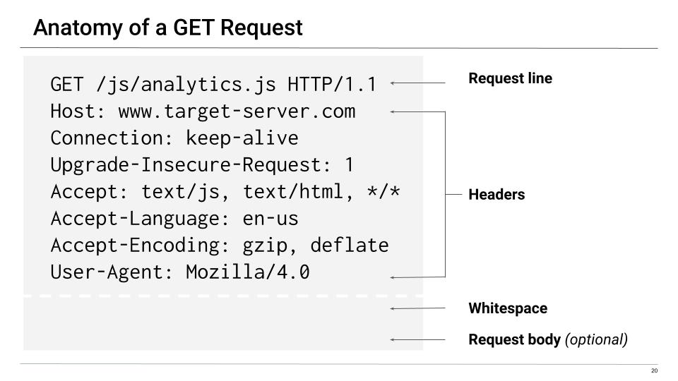

- A **request line** contains the request method, the name of the requested resource, and the version of HTTP in use.
  - The request line can also contain **query parameters**, which the client can use to send data to the server.

- **Headers** contain additional details about the requested resource. They are used to implement many actions with security implications, such as authenticating and remembering user resources.
  - There are many different types of headers, and students aren't expected to remember them all.
  - We'll see the most common headers as we continue to explore HTTP requests and responses. Links to reference documentation will be provided, which students can use for their own research later.
- **Whitespace** is a blank line indicating the end of the request.

Once the server receives the request, it returns an HTTP response that resembles the following image:

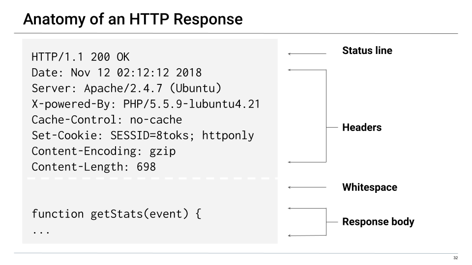

- A **status line** contains the response status code and translation, such as `OK` or `Conflict`.

- **Headers** contain additional information about the response, similar to request headers.

- Whitespace (a blank line) separates the header from the response body that follows.  
- A **response body** contains the resource requested by the client and all of the web code and styling that your browser uses to format the page.

#### HTTP Requests

Explain that in the upcoming examples, we're going to specifically examine GET and POST requests.

Remind students that GET requests are often used for receiving information from an HTTP server, and POST requests are often used for sending information to an HTTP server.

Break down the GET request example in more detail.


- The **request line**:
  - `GET`: The request method

  - `/js/analytics.js`: The requested resource. This resource is the file path from a domain stated in the header (`Host`).

  - `HTTP version 1.1`: The protocol version used by the browser.

- The **header** section:

  - `Connection: keep-alive`: Tells the server to keep open the TCP connection used for this HTTP transfer after sending the response.
    - This allows the client server to reuse the TCP connection for later HTTP requests.
    - The alternative is performing a TCP handshake: opening a connection, transferring the request and response, closing the connection, and repeating for each request response cycle.
    - Since HTTP usually involves a series of requests and responses, this would result in slower transfers than simply reusing the connection.

  - `Host: www.target-server.com`: Contains the domain name of the target server.
    - **Note:** The protocol (HTTP) + the host + the file path in the request line create the URL we see in the browser: http://www.target-server.com/js/analytics.js

  - `Upgrade-Insecure-Requests: 1`: Tells the server to turn this HTTP connection into HTTPS, which will encrypt the response and all further communications.

  - `Accept: text/html/, text/js, */*`: Tells the server that the client expects to receive a JavaScript or HTML document in response (`text/html`, `text/js`), but will accept data of any type (`*/*`).
  - `User-Agent: Mozilla/4.0`: Tells the server that this request is coming from a Mozilla 4.0 browser.

- Some other common request headers are:

  - **Authorization:** Contains the credentials used to authenticate a user with a server.

  - **Referer:** Contains the address of the previous webpage that linked to the currently requested page. This header allows servers to identify where people are visiting from and use that data for analytics, logging, or optimized caching.  
    - If a link from a Google search led to the current page, the referer is Google.
  - **Cookie:** Contains stored HTTP cookies previously sent by the server with the **Set-Cookie** response header. We will cover this in more detail later.

Explain that GET requests can also request data with **query parameters**.

- Query parameters are useful for specifying which parts of a resource to receive or send data to.

In the following example, the GET request specifically requests articles with two distinct parameters (the `latest` articles, created by author `jane`), as the following image shows:

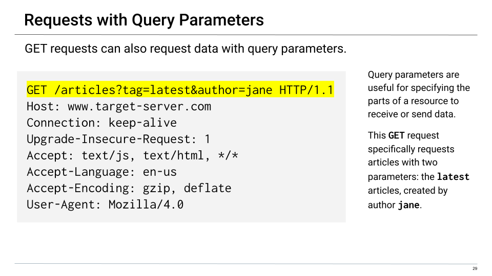

- The request line contains the specific parameters `/articles?tag=latest&author=jane`.

The general syntax for query parameters is `[path]?[firstParam]=[value]&[secondParam]=[value]`.

- There is no limit to the number of query parameters a user can send using GET requests.

Next, review the following image of a POST request:

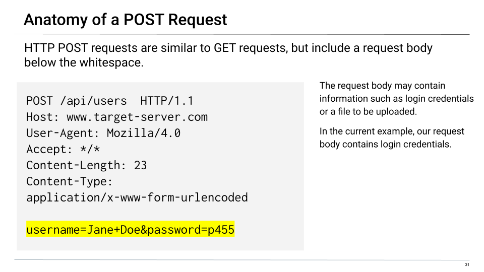

Remind the class that POST requests are used to send data to a server.

- The structure of an HTTP POST request is similar to a GET request, but includes a **request body** below the whitespace.

- The request body may contain information such as login credentials or a file to be uploaded. In the current example, our request body contains login credentials.

#### HTTP Responses

Now, we will examine the HTTP responses to GET and POST requests.

- Explain that the responses look very similar to the requests. They both contain response headers and often a response body.

Show an example HTTP response using the following image:


- In the status line:

  - `HTTP/1.1`: The unencrypted protocol is in use.

  - `200 OK`: Status code showing that the request was processed properly.

- In the response header:

  - `Date`: Contains a timestamp of when the response was generated.

  - `Server: Apache/2.4.7 (Ubuntu)`: Indicates the server is running Apache 2.4.7 on Ubuntu

  - `X-Powered-By: PHP/5.5.9-lubuntu4.21`: Indicates the server is running PHP version 5.5.9 on Lubuntu with kernel version 4.21.

  - `Set-Cookie: SESSID=8toks; httponly`: Tells the client to create a cookie called `SESSID` with the value `8toks` and that this cookie can only be set by the server with HTTP. We'll discuss cookies and `httponly` in greater detail later.

- Below the response header is a blank line followed by the response body, which is, in this case, the source code for the file `/js/analytics.js`. 

  - Knowing exactly what this file is isn't important right now, but it is important to recognize that it is in the response body.

Explain that we will cover many more security-enforcing response headers in depth later.

Briefly cover the following status codes:

- 200 codes indicate success.
- 300 codes indicate multiple choices, meaning the server can respond to the request in more than one way.
- 400 codes indicate client errors, meaning the client sent an improperly formatted request.
  - 404 is a common example of a 400 code, and it indicates that a webpage doesn't exist or can't be accessed.
- 500 codes indicate server errors, meaning the server application failed somehow.

:books: Let students know that a standard reference site for general headers and web information is the [Mozilla Developer Network](https://developer.mozilla.org/en-US/docs/Web/HTTP/Headers).

#### Key Takeaways

We just covered a lot of new information about HTTP requests and responses. Briefly review the main takeaways:

- HTTP requests are sent from an HTTP client to an HTTP server.
- HTTP responses are sent back from the HTTP server as a response to the client.
- HTTP requests include a request line, request header, and optional request body.
- HTTP responses include a status line, response header, and usually a response body.
- Query parameters allow you to be specific about the parts of a resource you want to send or receive data from.
- GET requests ask an HTTP server for resources, such as a whole webpage.
- POST requests send data to an HTTP server's resources, such as login credentials or images for a webpage.
- PUT requests also send data to an HTTP server, but are often used to overwrite resources, such as updating part of a webpage.
- OPTIONS requests ask an HTTP server to respond with all HTTP methods that the HTTP server is programmed to respond to.

Let students know that they will examine samples of HTTP requests and responses in their upcoming activity. They can use the [HTTP reference sheet](https://docs.google.com/document/d/114kp6IsNklMhiz852qTxUlSsaJwwFfbUxDWZmtAv8S8/edit?usp=sharing) as needed.

[<- Back to Module Contents](LessonPlan.md#module-day-1-contents)

---

### 04. Student Do: HTTP Request and Response Activity (0:15)

Explain the following to students:

- In this activity, you will be playing the role of a web app security engineer.

- There is a breach in one of your company's HTTP servers. Before the server goes down, a suspicious IP address sends it a rapid sequence of requests and responses.

- The administrators of the web server attempt to recover and reconstruct much of the client&ndash;server HTTP request and response traffic.

- You are tasked with investigating the remaining HTTP logs to figure out what happened during the attack on the web server.

Send students the following files:
- [Activity File: HTTP Requests and Responses](Activities/04_HTTP_Requests_Responses/Unsolved/README.md)
- [HTTP Reference Sheet](https://docs.google.com/document/d/114kp6IsNklMhiz852qTxUlSsaJwwFfbUxDWZmtAv8S8/edit?usp=sharing)

[<- Back to Module Contents](LessonPlan.md#module-day-1-contents)

---

### 05. Instructor Review: HTTP Requests and Responses (0:05)

:bar_chart: Run a comprehension check poll before reviewing the activity. 

The goal of this activity was to combine skills in research and critical thinking to investigate the HTTP sequences of a web attack on a company's servers.

Send students the following solution guide:

- [Solution Guide: HTTP Requests and Responses](Activities/04_HTTP_Requests_Responses/Solved/README.md)

#### Walkthrough

**Note:** While we can't be absolutely sure about what happened due to the corrupted logs, these are good guesses based on the information we have.

From a high level, the following sequence happened during the attack:

1. **HTTP Response 1:** This was the attacker's reconnaissance phase, in which they found all available HTTP methods that can be requested to the HTTP server. They used the OPTIONS method here. 
   - The OPTIONS method is useful for an attacker to find out what kind of request methods they can leverage while attempting to compromise an HTTP server.

2. **HTTP Response 2:** While we don't see the request, we can tell the attacker attempted to log into the login portal with a POST request. 
    - The response body shows a username and password being entered into the webpage while the response error (status code 401) indicates an invalid authorization attempt.

3. **HTTP Request 1:** The attacker used the PUT method to upload a cross-site script (XSS) to steal the cookies of users and send them to their own server.

4. **HTTP Response 3:** The corresponding response to the PUT request was a success.

5. **HTTP Request 4:** The attacker stole a cookie and was able to log into the admin portal using a GET request with the stolen cookies set in the header.

Being able to analyze the client&ndash;server HTTP request and response process is vital for any security professional, but especially for web application security engineers and penetration testers.

[<- Back to Module Contents](LessonPlan.md#module-day-1-contents)

---

### 06. Instructor Do: Sessions and Cookies (0:25)

Explain that web client&ndash;server architecture assumes clients and servers communicate via discrete, individual requests in order to exchange resources.

- HTTP resources are inherently **stateless**, meaning that whenever your browser requests a webpage, there is no way for that webpage to distinguish you from anyone else.

Websites need a way to deliver content that is specific to each user. To do so, they establish **sessions** with **cookies**.

- Sessions are unique, server-side sets of user data used to customize webpages for each specific user accessing them. 

- Cookies are small pieces of text data that, when sent by an HTTP server's response header, are saved by the user's HTTP client.

#### Types of Cookies

There are various different types of cookies. Most of them are used to store some kind of user information. Primarily, they are used for three things: session management, personalization, and tracking. These typically include activities like login accounts, shopping carts, and basically anything that you would want retained from page to page on a website. Here are some common cookie examples and types:

- **Session cookies:** These types of cookies are generated when a user interacts with a website, but they are deleted once the session ends. They do not contain an expiration date, which causes the browser to delete them once the session is terminated. An example would be a cookie that keeps you logged into a website as you browse.

- **Persistent cookies:** Persistent cookies stay on a user's computer for a specified period of time. This time is typically broken down into days, weeks, months, or years. Unlike session cookies, these cookies contain an expiration date.

- **Token Authentication cookies:** These cookies help to protect sensitive information by ensuring that sensitive data is sent to the proper user. This is accomplished by storing user account information with an associated cookie identifier.

- **Third-party/Tracking cookies:** These are normally used by tracking services to record user activity. Once the user activity has been captured, browsers then send the recorded data back to a tracking service when the website is visited again.

- **Zombie cookies:** These cookies are often used for malicious purposes. They reappear after they have been deleted, and are often stored outside of the normal cookie storage location.

#### Cookie Session Example

Provide the following example of a cookie session:

- You visit a shopping website and register an account with your first and last name. As soon as you do this, a session is created that saves your name to the site's database.

- This happens in the background, since you can't see the database saving your information. But you can see evidence of this action when you return to the site and are greeted with the following message: "Welcome back, [first name] [last name]! Are you ready to continue shopping?"

Explain that in this scenario, the session information was saved to a database, which was then linked to a unique cookie. That cookie was then sent to your client (or browser) in the HTTP server's response header. Your client then saves that cookie locally and sends it back through a request header whenever you visit the site.


To summarize:

- A session contains user-specific information that is saved in order to personalize an HTTP response.

- A cookie has information that uniquely identifies each session.

- The cookie is created by the HTTP server and sent to an HTTP client through a response header.

- When the HTTP server sends the client the cookie, it also sends back the personalized response body.

- The HTTP client receives the cookie, saves it, and processes the personalized response body.

- On future requests to the HTTP server, the HTTP client sends the cookie back to the HTTP server so that a personalized response body and cookie can be received in return.

Describe the following diagram as a basic example of a cookie changing how a user views a site:

  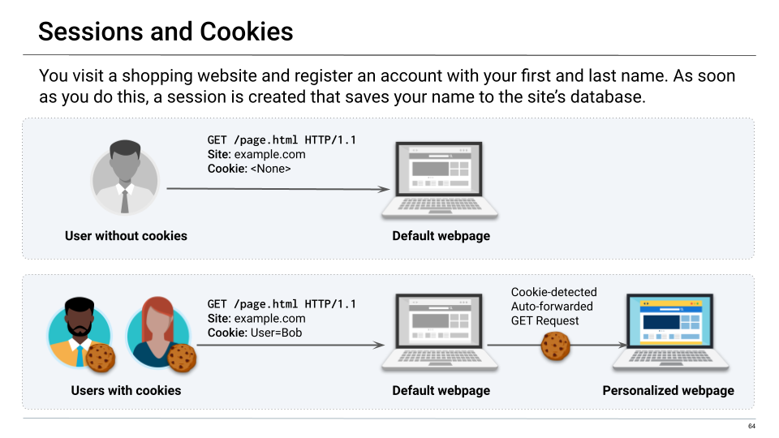 

Explain that because the second user has a cookie, when they request the webpage, the server forwards them to a new, personalized webpage that continues their session.

#### A Basic Single Cookie Session

Let's consider one more example:

Using the slides, move through the process of a single cookie session, providing a high-level explanation of the process:

1. Bob visits a shopping site. It is a default page with a list of products for sale.

2. Bob decides to buy an item and clicks a button to add it to his shopping cart. This button is set up to send a POST request to the HTTP server that includes the data of the recently added item.

3. When the website receives this request, it tells the database to create a unique cookie and link it to Bob's shopping session. 
   - The session in the database now stores a list of all the items in Bob's cart. This is Bob's unique session.

4. The HTTP server retrieves Bob's shopping cart session from the database and responds to Bob's client with `Set-Cookie: cart=Bob` in the response header and a response body containing Bob's newly updated cart contents.

5. Bob's client saves the new cookie locally.

6. Any new request made by Bob's browser sends the cookie back to the HTTP server via a request header (`Cookie: cart=Bob`).

Explain that cookies can be set and read by JavaScript, a powerful web-based programming language that attackers often use in attacks, such as cross-site scripts, clickjacking, and session hijacking. We will cover these types of attacks in more detail in a later module.

#### Session ID Cookies

Explain that implementations of sessions and cookies vary by site. While it isn't necessary for students to know the details of every cookie type, we will cover the difference between an insecure and secure cookie.

Explain that the following type of cookie is a session ID cookie. In a database, this cookie is still unique to each user's session, but it is vulnerable to tampering and spoofing.

Let's consider the example of our shopper, Bob. If his was the fifth account to ever be created on the shopping website, his cookie might look similar to the following:

- `Set-Cookie: Session-Id=5`

- In this case, an attacker can simply change their cookie's value so that when they make a request to the site, they do it as the user Bob.

Explain that modern versions of session cookies now contain uniquely hashed values specific to each user.

- The hashed data can consist of multiple things that identify the user, such as their first and last name.

- The servers may also include salts in the hashing process to add even more complexity.

- For example: `Set-Cookie: Session-Id=299367cd4c0e2c6d3ae6e09eda4e0590`

Explain that it's relatively difficult to reverse-engineer the contents of unique session ID cookies created with modern implementations.

- However, these cookies are still vulnerable to attacks, such as cross-site scripts or man-in-the-middle attacks, which we will cover in a later module.

- Instead of an attacker needing to figure out how to create a cookie that looks like another user's, they can simply steal it from them.

To summarize:

- A cookie is used to implement a user's session.

- A client and server exchange cookies through headers.

- Clients save cookies locally.

- A client sends a cookie via the cookie header.

- A server sends a cookie via the Set-Cookie header.

- Bad implementations of cookies can be spoofed or stolen, and cookies with modern implementations can be stolen.


[<- Back to Module Contents](LessonPlan.md#module-day-1-contents)

---

### 07. Instructor Do: Use DevTools to Examine HTTP, Cookies, and Security (0:15)

In the last activity, we took a close look at HTTP response and header examples.

Explain that in this next section, we will deconstruct and examine a web application using the native tools within a browser. This allows a security professional to:
- Understand the request and response flows between an HTTP client and server.
- Examine the security implementations of a website through its response headers.
- Identify where cookies are used in the HTTP request and response cycle.

#### Chrome Developer Tools Demo

Explain that Chrome's Developer Tools will be used to facilitate this process.

Reiterate that a web browser is a type of web client.

Open Chrome, and click the three vertical dots in the top-right of the browser window. It will reveal a dropdown menu. Click **More Tools** and then **Developer Tools**.

- :books: Distribute the following URL to students and explain that it can be used to learn more about Chrome Developer Tools: [Chrome DevTools](https://developers.google.com/web/tools/chrome-devtools)
- To open the developer console window on Chrome using hotkeys, use the keyboard shortcut Ctrl+Shift+J (on Windows) or Command+Option+J (on Mac).

Explain that Developer Tools are a set of tools that allow people to audit the requests and responses that are handled by the browser.

- Display the different tabs and cover a couple of them:

  - The **Elements** tab shows the design components that the webpage is comprised of. This is sent to the client in the response body.

  - The **Applications** tab can be used to see the cookies saved by your client. We'll cover cookies in depth later.

For the purpose of this class, we'll only be looking at the **Network** tab.

- Click on the **Network** tab. Explain that this tab is where we find the different requests and responses processed by our client, e.g., the Chrome browser.

For our demo, we'll review the website of a well-known managed security provider, SecureWorks.

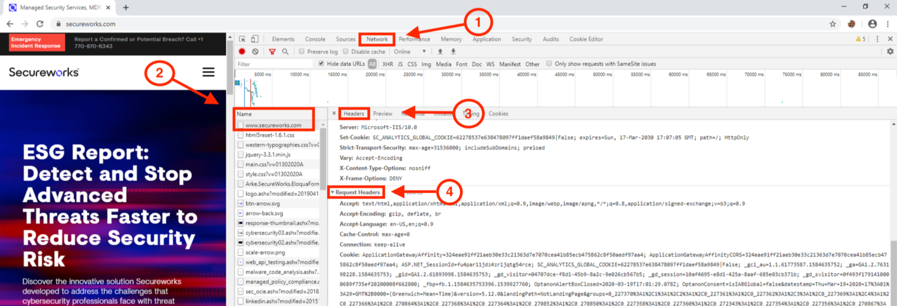

- Navigate to secureworks.com.

  - We can see, in real time, all the resources that we're requesting from visiting the main page.

- On the left-most column in the Network tab, we see our browser's initial GET request and the server's response.

- In the **Name** column, click on the the first www.secureworks.com request and response.

Explain that DevTools show us both the request and corresponding response for this page.

- Make sure the **Headers** tab is selected and scroll to the bottom. Point out the **Request Headers** section.

Explain that this section shows us all of the request headers from when we first requested this page.

- Point out the request header **Upgrade-Insecure-Requests**. This request header tells the HTTP server that it prefers to communicate through HTTPS over HTTP.

- This is one of a few request headers a user can use to protect themselves. It is then the responsibility of the HTTP response headers to ensure HTTP communications are protected.

- This means that web application developers are responsible for ensuring strict security policies.

Scroll up to the **General** section, which shows the status code, request method, and remote address.

  - We can see the standard 200 OK response for **Status Code**.
  - The **Request URL** points to the **Remote Address**, according to our DNS records.

Scroll down the **Response Headers** section, and point out the following:

  - The **server** response header tells us the kind of web server that is sending the HTTP response to our client. Microsoft-IIS is Microsoft's implementation of HTTP, like Apache or Nginx.

  - The **Set-Cookie** cookies are set here. The **ANALYTICS** cookie is likely a tracking cookie used by advertisers and data collectors. 

  - The **Strict-Transport-Security** header tells the HTTP client that it should use HTTPS over HTTP.

Explain to students that in their next activity, they will inspect the headers for the site CrowdStrike to find various points of information.

[<- Back to Module Contents](LessonPlan.md#module-day-1-contents)

---

### 08. Student Do: Inspect with Developer Tools Activity (0:10)

Explain the following to students:

- For this activity, you will continue in your role as a web app security engineer.

- You are tasked with examining the various request and response headers of one of your vendor's websites to assess its HTTP security.

- For this activity, you'll use Chrome Developer Tools to examine the initial request and response set from www.crowdstrike.com.

Send students the following file:

- [Activity File: Inspect with Developer Tools](Activities/07_Dev_Tools/Unsolved/README.md)

[<- Back to Module Contents](LessonPlan.md#module-day-1-contents)

---

### 09. Instructor Review: Inspect with Developer Tools (0:05)

:bar_chart: Run a comprehension check poll before reviewing the activity. 

This activity had students use their browser's tools to examine HTTP requests and responses, particularly security headers.

Send students the following solution guide:

- [Solution Guide: Inspect with Developer Tools](Activities/07_Dev_Tools/Solved/README.md)

#### Walkthrough

**Request Headers**

 Scroll to the bottom of the **Headers** tab to view the **Request Headers** section.

- Are there any notable security request headers that we've discussed? If so, what do they mean?

    - Solution: The **upgrade-insecure-requests** header, which is the browser's way of requesting that the HTTP server use HTTPS to communicate with it.

**Response Headers**

Scroll up to the **Response Headers** section.

- What response headers do you recognize from today's class? What do they mean?

    - Solution: **Set-Cookie** was set in the response header.  
    - 
- Are there any notable security response headers that we've discussed? If so, what do they mean?

  - Solution:

    - **Referer Policy:** `strict-origin-when-cross-origin` means that when a link on an external website leads to crowdstrike.com, that website is logged for statistical analysis (usually for ad payment). 
      
        It also forbids your browser from sending information from https://crowdstrike.com to http://crowdstrike.com (secure HTTPS to plaintext HTTP).
    - **Strict-transport-security** tells an HTTP client that it should only be accessed over HTTPS and not HTTP. This is the response header version of **upgrade-insecure-requests**.

    - **X-xss-protection**: `1`

      - Let students know that while we didn't cover this in the demo, it is a notable response header that tells the browser, "If you detect a cross-site script being loaded, stop loading the page." It's essentially another level of protection in case the page has been compromised.

[<- Back to Module Contents](LessonPlan.md#module-day-1-contents)

---

### 10. Break (0:15)

[<- Back to Module Contents](LessonPlan.md#module-day-1-contents)

---

### 11. Instructor Do: Use curl (0:20)

Reiterate that browsers are not the only way to interact with web servers. 

There will be cases when access to a web server is required, but there is no website with navigation links or visual UI.

#### Manage HTTP Requests and Responses in a Repeatable, Programmatic Way

Note that it's not always possible to examine HTTP requests and responses through a browser:
- Sometimes the tools you can use to send and receive HTTP requests are limited.

- For example, when working through a container that has no user interface, you'll need a command-line tool to send and receive HTTP requests.

Explain that cybersecurity professionals need to be able to quickly test HTTP requests in a way that can be automated, but also allows them to make adjustments as they work.

- There is a command-line tool called `curl` that allows security professional to do exactly this.

:warning: **Head's Up:** Before continuing, let students know that there will be a bonus activity section in the Challenge assignment involving `curl`.

#### Introduce curl

Explain that **`curl`** is a command-line client that allows us to send data to and from servers. In a security context, we use it to send customized HTTP requests that allow security professionals to:

- Test web server security configurations
- Ensure web servers don't leak sensitive data through their HTTP responses
- Verify that servers only respond to certain request types
- Look for vulnerabilities on a web server

Let students know that they'll frequently switch between using the browser and `curl` when auditing web applications.

And of course, as a command-line tool, `curl` can be used in conjunction with other command-line tools, such as `grep`, `sed`, and `awk`.

Explain that we'll demonstrate `curl` with the website POSThere.io.

- Open your browser and navigate to https://posthere.io.

- Explain that when we used the browser to navigate to the site, it sent a GET request to the POSThere.io server. The response produces the webpage we see now.

Remind students that the HTTP response body contains all the web code and styling that your browser uses to format the page.

- Demonstrate this by right-clicking anywhere on the page and clicking **View page source**.

- Scroll down to the very bottom of the page and point out the last HTML tag.

Let students know that they don't need to know exactly how HTML works. But when we use `curl`, we should expect to see the same HTML tags at the end of the response body.

#### Standard curl Usage

Explain that we'll first look at the most basic type of `curl` request.

- Open a terminal and run `curl https://posthere.io`.

 - Explain that running `curl` with only a URL executes a basic GET request. What we get in return is all the web code that displays and styles the page in our browser.

 - Show the students the response body and point out the `</html>` tag at the end of the `curl` response. It is the same tag we saw in our browser.

Scroll up to the response header area and point out the status code.

- As security professionals, students will often need to find the status code in HTTP responses.

- We can use `curl` to more easily examine the status code and response headers.

#### Use curl to View Headers

Remind students that looking at response headers can give them additional information about how an HTTP server is responding to requested data.

Running `curl` with the `--head` flag only shows the response header.

- Run `curl --head https://posthere.io` and point out the status line, `200 OK`, and key response headers, such as `Content-Type` and `Server`.

  ```console
  HTTP/1.1 200 OK
  Server: nginx/1.9.2
  Date: Thu, 12 Mar 2020 06:02:20 GMT
  Content-Type: text/html
  Content-Length: 12905
  Last-Modified: Wed, 01 Jan 2020 17:09:18 GMT
  Connection: close
  ETag: "5e0cd23e-3269"
  Accept-Ranges: bytes
  ```

- Explain that the `Content-Type` response header (`text/html`) tells our client (`curl`) that it is receiving a response body with the resource type HTML. This header serves the same purpose as a file name extension in your operating system.

- Explain that the `Server` response header tells our browser it is connecting to an `nginx` web server, one of the most popular HTTP servers.

#### Create a POST Request with Query Parameters

Remind students that a POST request is used for sending data to an HTTP resource.

Explain that, unlike a regular GET request, which returns the entire response body, POST requests need to specify *where* you want to send information.

- Open a browser and navigate to https://posthere.io. This site will help us customize POST requests.

- Click on the red underlined URL on the homepage.  
  - :warning: **Head's Up:** Your URL will be slightly different, which will change the example URLs as well.

  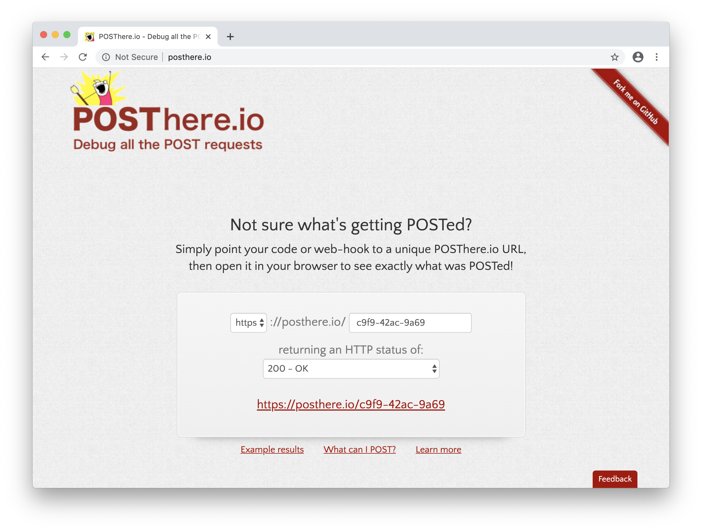

- We can send POST requests to this temporary page URL.

Explain that since we aren't using a standard GET request, we'll now need the `-X` option to specify that we are changing the request method, followed by the type of method that we want to use in our request (POST).

- Type `curl -X POST https://posthere.io/f260-48d9-8e1b`:

  - `-X`: Indicates that we are using a method other than the default GET,
  - `POST`: The method we are using,
  - `https://posthere.io/f260-48d9-8e1b`: Our unique URL that the page gave us. Everyone who uses the site is given a different URL.

Explain that we need to designate an area on the webpage to send information. We can do this with query parameters.

- Add the following string to the end of the POST request: `?query=parameter`

- Run `curl -X POST https://posthere.io/f260-48d9-8e1b?query=parameter` and refresh the page to see the query parameter.

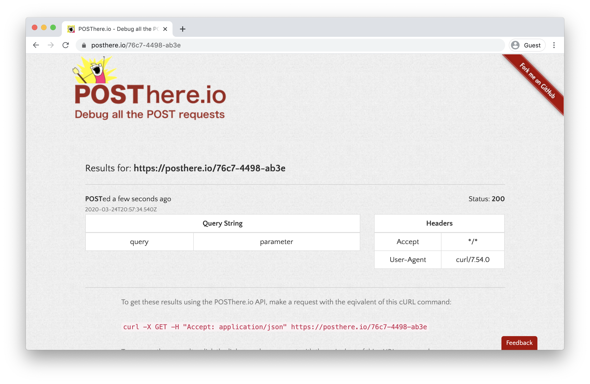

#### Create a POST Request with Plain Data

Explain that another way to POST data to a page is by using the `-d` option. The `-d` option can POST raw text data to an HTTP resource through the request body.

- Type `curl -X POST -d "test data" [URL]`, replacing `[URL]` with your page's URL:

  - `curl`: The tool we are using
  - `-X`: Indicates that we are using a different method than the default GET
  - `POST`: The method we are using
  - `-d`: Sends the data in a POST request to the server
  - `"test data"`: The message we are sending
  - `https://posthere.io/f260-48d9-8e1b`: The unique URL the page gave us

- When we run the command we should expect to see "test data" show up on the webpage.

- Run the command to send the POST request. Then refresh the page to verify the results.

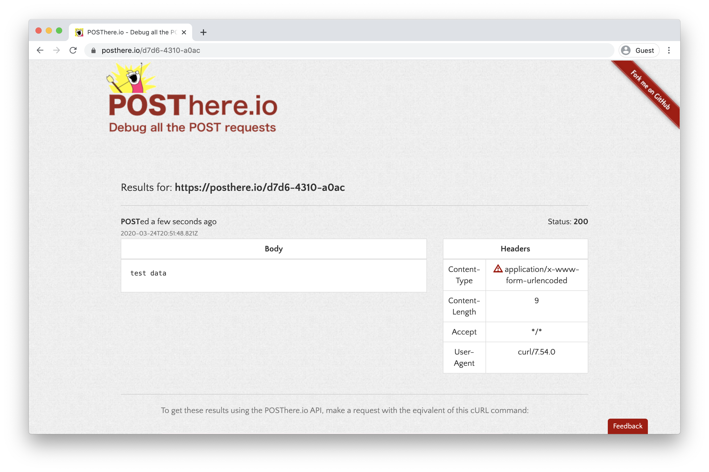

#### Create a POST Request with JSON Data

Now that we understand how to send data using a POST request, we can examine how cyber professionals use these tools in their daily work.

 - Usually, when professionals interact with data on webpages, the data is formatted as structured JSON data. 

- While we don't need to know the specifics of JSON data at this time, we should understand how to send it in a request.

Now, we'll create a POST request to upload structured JSON data. We'll use a new header option: `-H`.

- Type the following command into the terminal:  

  `curl -X POST -d "{\"jsonKey1\": \"jsonValue1\", \"jsonKey2\": \"jsonValue2\"}" -H "Content-Type: application/json" [URL]`  

    - Be sure to replace `[URL]` with the URL you got from the POSThere.io homepage. 

- This command tells the server that we are sending it JSON data with the `-H` option, followed by `"Content-Type: application/json"`.

- Refresh the page to show the JSON data POSTed to it.

  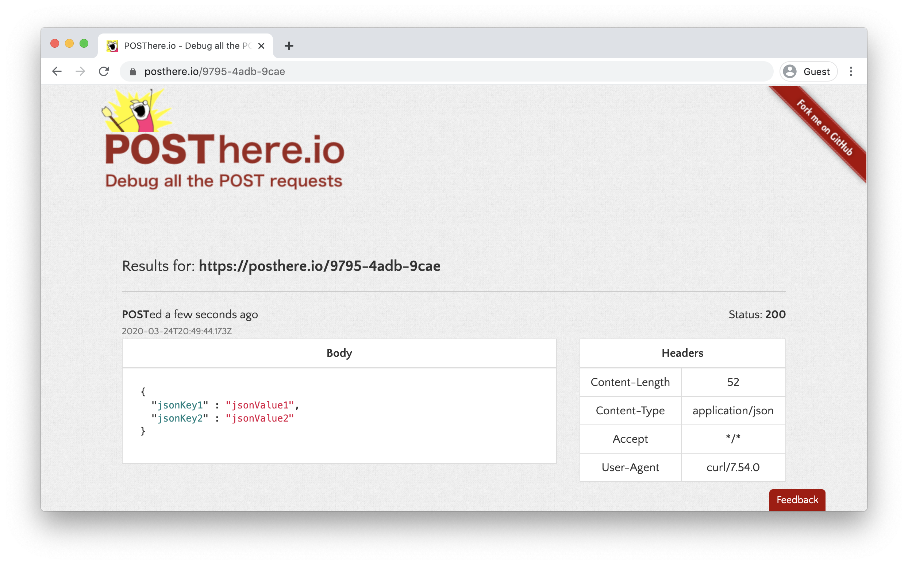

Summarize that we just covered how to POST structured JSON data to an HTTP resource using the `-H` header option and `"Content-Type: application/json"`.

Explain that the students will now write various `curl` requests for their activity.

[<- Back to Module Contents](LessonPlan.md#module-day-1-contents)

---

### 12. Student Do: Use curl Activity (0:15)

Explain the following to students:

- In this activity, you will continue in your role as a web application security engineer.

- You are tasked with writing various `curl` commands to interact with an HTTP web server. 

- You will use various `curl` options, request methods, and request headers to return specific responses.

Send students the following file:

- [Activity File: Use curl](Activities/11_Using_cURL/Unsolved/README.md)

[<- Back to Module Contents](LessonPlan.md#module-day-1-contents)

---

### 13. Instructor Review: Use curl (0:10)

:bar_chart: Run a comprehension check poll before reviewing the activity.

Remind students that `curl` is one of the most widely used tools for investigating HTTP requests and responses. This activity aimed to strengthen students' familiarity with `curl`.

Send students the following solution guide:

- [Solution Guide: Use curl](Activities/11_Using_cURL/Solved/README.md)

#### Walkthrough

Cover the command that the students created for each section and then answer each section's question.

1. Send a GET request

    `curl https://httpbin.org/anything`

    - A JSON response body is received that shows the requester's information, such as the requester's IP address.

2. Retrieve response headers

    `curl https://httpbin.org/ -I`

    - When we used the `-I` command, the `Content-Type` is set to HTML.

3. Retrieve new response headers

    `curl https://httpbin.org/anything -I`

    - When we used the `-I` command this time, `Content-Type` is set to JSON.

4. Send a POST request

    `curl -X POST "https://httpbin.org/anything" -d '{"Developer": "Andrew"}'`

    - When we run this command, the data should appear under the `form` JSON object in the response body.

5. Set parameters

    `curl -X POST "https://httpbin.org/anything?EmployeeDirectory=frontend"`

    - Explain that the the parameters appear under the `args` JSON object in the response body.

6. Set headers

    `curl -X POST "https://httpbin.org/anything" -d '{"Developer": "Andrew"}' -H "Content-Type: application/json"`

    - Setting the JSON `Content-Type` in the request header made it so the JSON POSTed under the `json` section in the response body this time.

Ask students if they have any questions before moving on.

[<- Back to Module Contents](LessonPlan.md#module-day-1-contents)

---

### 14. Instructor Do: Using the Cookie-Editor (0:25)

Explain that now that we have good understanding of how HTTP traffic and cookies work, we will further explore how cookies work, and how their data could potentially be manipulated. The next activity will provide an example of cookies can be exploited.


#### Instructor Demo: Sessions with Cookie-Editor

Explain to students that for their activity, they will use the Chrome extension Cookie-Editor to see how cookies and sessions work in their browser.

Explain that **Cookie-Editor** is an extension that works with Google Chrome to let us:
- Import users' cookies
- Export users' cookies
- Save users' cookies

Explain that for this demo, we will cover the following steps:

- Enable the Chrome extension Cookie-Editor.
- Create a user on a webpage and export their cookie to the clipboard with Cookie-Editor.
- Create a new user, which will overwrite the old user's cookie and session.
- Use the Cookie-Editor extension to import back the first user's session to show how a simple tool can be used to swap sessions.

#### Set Up Bob's Session

First, we'll need to pin the Cookie-Editor extension. 

- Launch Google Chrome by clicking on the bottom-left finder in Ubuntu and typing "Chrome." Click **Google Chrome** to launch it.

- After Chrome is launched, go to the top-right puzzle icon and click the pin icon next to Cookie-Editor to add the extension to your browser bar.

   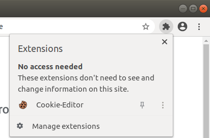

  - :warning: **Head's Up:** If the Cookie-Editor extension **does not** show in the browser bar shortly after launching Chrome, you need to install the extension by going to the [Cookie-Editor page in the Chrome web store](https://chrome.google.com/webstore/detail/cookie-editor/hlkenndednhfkekhgcdicdfddnkalmdm?hl=en) in Chrome and clicking **Add to Chrome**.

- Point out the cookie icon to the right of the URL bar.

Explain that Cookie-Editor allows users to import and export cookies.

- Navigate to httpbin.org/#/Cookies/get_cookies_set and scroll down to the **GET /cookies/set** location.

- Click **Try it out**.

- Enter "Bob" in the **Description** field and click **Execute**.

We have now saved a cookie that contains "Bob."

#### Export Bob's Cookies

- Click the Cookie-Editor icon and click **Export** on the bottom-right side.

- The cookie is now saved to our clipboard.

#### Set Up Andrew's Session and Remove Bob's Cookie

- Scroll back to the **GET /cookies/set** area where you set your cookie.

- Set the **Description** to "Andrew" and click **Execute**.

- Scroll up to the first **GET /cookies** section and click **Execute** to show that the page now associates to a cookie called "Andrew."

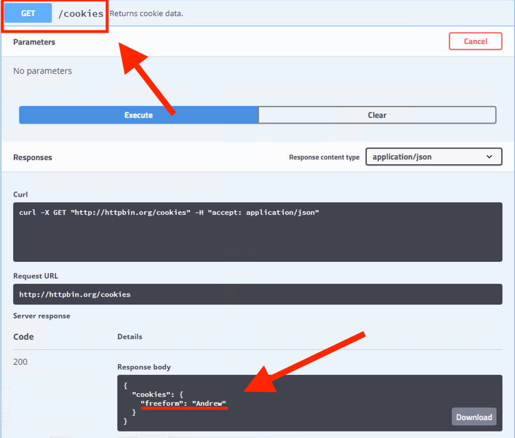

#### Turn Andrew's Session Back into Bob's

Explain that we'll now reassume Bob's cookie with Cookie-Editor.

- Click Cookie-Editor and click the **Import** button to the left of the **Export** button.

- Paste the contents of the cookie:

    ```JSON
    [
        {
            "domain": "httpbin.org",
            "hostOnly": true,
            "httpOnly": false,
            "name": "freeform",
            "path": "/",
            "sameSite": "unspecified",
            "secure": false,
            "session": true,
            "storeId": null,
            "value": "Bob"
        }
    ]
    ```


- Hit the bottom-right button to import Bob's cookie, and you should see a "Cookies were created" notification. Even if you don't see the notification, it may have worked properly, so continue with the verification step.

#### Verify We're Bob Again

- Click **Execute** again in the **GET /cookies** section to see that we're once again Bob.

  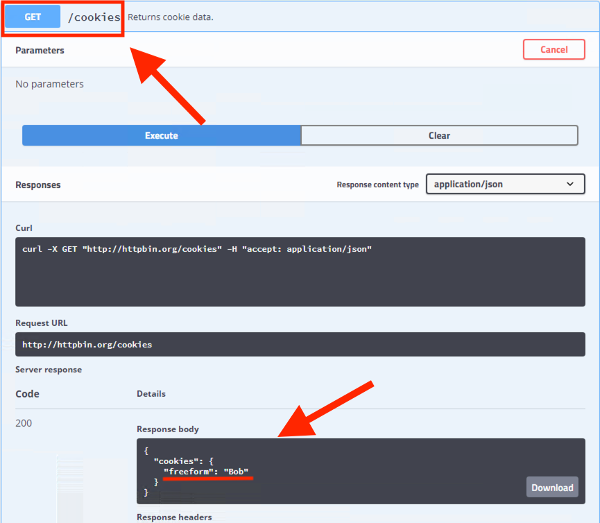

Explain that for our upcoming activity, students are going to use Cookie-Editor to swap sessions between two users with different administrative access levels to see how web servers handle data and authentication differently for each user.

This activity will also show how an attacker can use stolen cookies to assume a victim's session. It won't show the actual process of exploiting a vulnerability to steal the cookie, but it will show how the session swapping works.

:warning: **Head's Up:** This activity must be completed if students want to complete the bonus activity in the Challenge. The bonus activity requires that the WordPress site is set up as described in the activity.

[<- Back to Module Contents](LessonPlan.md#module-day-1-contents)

---

### 15. Student Do: Swap Sessions Activity (0:25)

Explain the following to students:

- For this activity, you will continue your role as a web app security engineer.

- After the previous web server was compromised, your company decides to use WordPress as a platform for its new e-commerce site.

- You are tasked with using the Chrome browser extension Cookie-Editor with your company's WordPress site to examine the process an attacker might take to hijack a session.

Send students the following file:

- [Activity File: Swap Sessions](Activities/14_Swapping_Sessions/Unsolved/README.md)

[<- Back to Module Contents](LessonPlan.md#module-day-1-contents)

---

### 16. Instructor Review: Swap Sessions (0:15)

:bar_chart: Run a comprehension check poll before reviewing the activity. 

Explain that the goal of this activity was a walkthrough to demonstrate how a cookie ties to a session and how a session's cookies, if compromised, can be used to hijack someone's session.

:warning: **Head's Up:** Note that we'll be building off of this activity for the bonus Challenge.

- **Instructor Note:** There is no official review with this activity. If necessary, use the activity file to walk students through the activity. They'll need to remember these steps for the Docker activities later this week.

Congratulate students for getting through a rigorous lesson on HTTP requests and responses, sessions, and cookies!

Ask if there are any questions before dismissing the class.

[<- Back to Module Contents](LessonPlan.md#module-day-1-contents)

---

&copy; 2023 edX Boot Camps LLC. Confidential and Proprietary. All Rights Reserved. 
