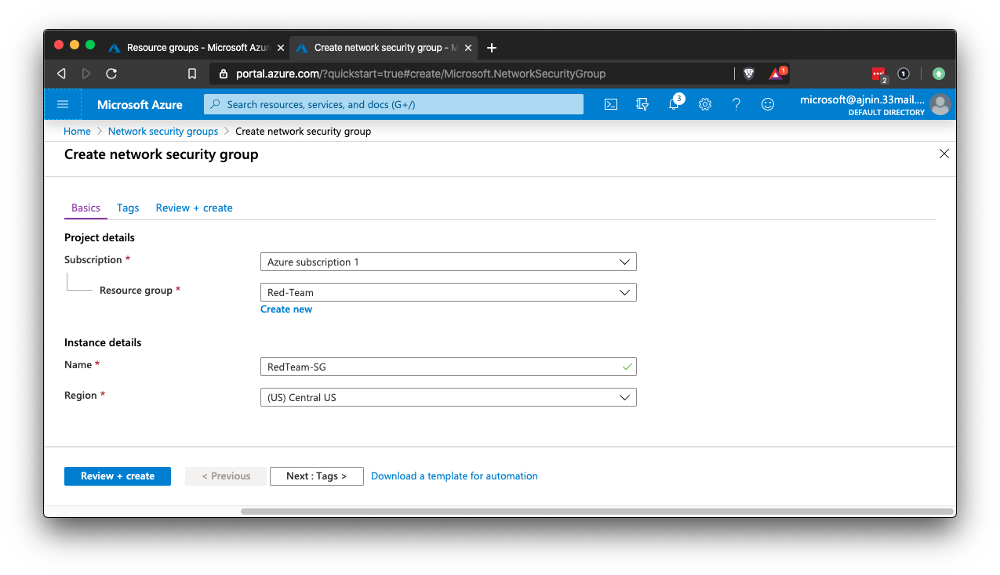
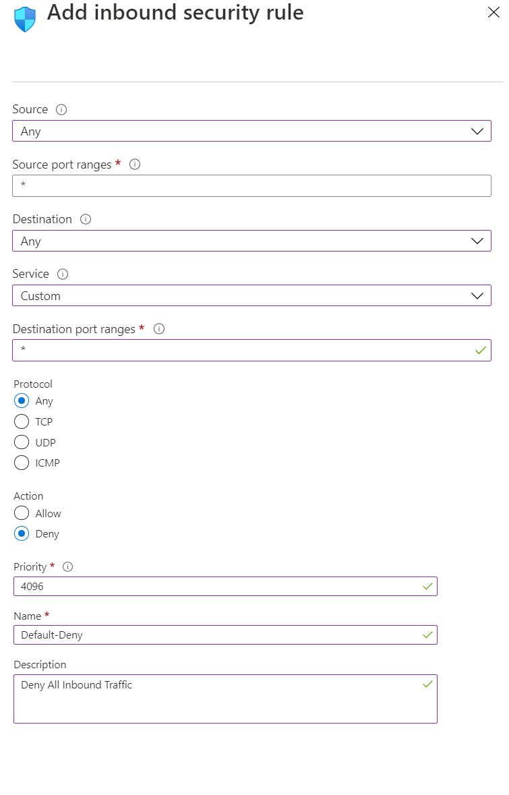

##Solution Guide: Security Groups

#### Walkthrough

To create a network security group:

- On your Azure portal home screen, search "net" and choose **Network security groups**.

    

- Create a new security group.

- Add this security group to your resource group.

- Give the group a recognizable name that is easy to remember.

- Make sure the security group is in the same region that you chose during the previous activity.

Your settings for this NSG should look similar to:

To create an inbound rule to block all traffic:

- Once the security group is created, click on the group to configure it.

- Choose **Inbound security rules** on the left.

- Click on the **+ Add** button to add a rule.

    

Configure the inbound rule and explain the following:

- Source: For now, we want to choose **Any** source to block all traffic.

- Source port ranges: Source ports are always random, even with common services like HTTP. Therefore, we will want to keep the wildcard (*) to match all source ports.

- Destination: Here, we will select **Any** to block any and all traffic associated with this security group.

- Service: Here we will leave this as **Custom** as we are going to select all port ranges in the next configuration.

- Destination port ranges: Usually we would specify a specific port or a range of ports for the destination. In this case, we can use the wildcard (*) to block all destination ports. You could also block all ports using a range like `0-65535`.

- Protocol: We will choose to block **Any** protocol that is used.

- Action: We want to use the **Block** action to stop all of the traffic that matches this rule.

- Priority: This rule will always be our last rule, so we want to choose the highest number for the priority available. Subsequent rules will always come before this rule. The highest number Azure allows is 4,096.

- Name: Give your rule a name like "Default-Deny."

- Description: Write a quick description similar to "Deny all inbound traffic."

    

- Save the rule.

- Your security group overview should now look similar to this:

    

   

We should now have a VNet in place protected by a network security group that is blocking all traffic.

---

© 2023 edX Boot Camps LLC. Confidential and Proprietary. All Rights Reserved.