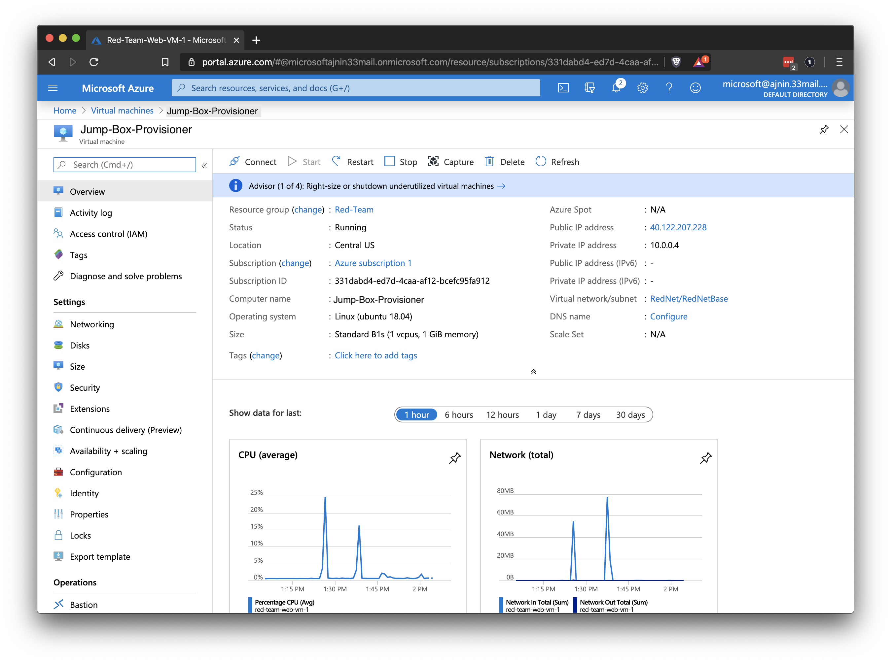
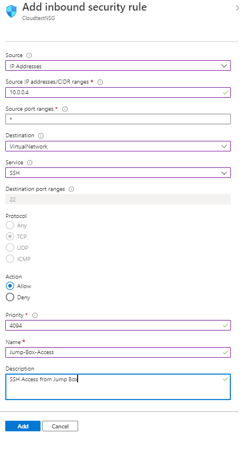

##Solution File: Containers

Open your terminal and SSH into your jump box.

- Run `ssh admin@jump-box-ip`.

- Once you are connected, run `apt-get update` to update your machine. 

Next, explain that we'll need to install `docker.io`. 

- Run `sudo apt install docker.io`.

Double check that the docker service is running.

- Run `sudo systemctl status docker`.

  - If the Docker service is not running, start it with `sudo systemctl start docker`. 

Now that Docker is installed, we can pull the container `cyberxsecurity/ansible`.

- Run `sudo docker pull cyberxsecurity/ansible`.

    - `docker pull`: The Docker command to download containers.

    - `cyberxsecurity/ansible`: The specific container to download from the Docker Hub.

   

Now launch the Ansible Docker container and connect to it.

 - Run `sudo docker run -ti cyberxsecurity/ansible bash`.

    - `sudo docker run`: The command to create and run a new container.

    - `-ti` stands for `terminal` and `interactive` sets up the container to allow you to run a terminal and interact with the container.

    - `cyberxsecurity/ansible`: The container image we just downloaded.

    - `bash`: The command we are running inside the container. This will give us a shell to control the container.

You now get a new command prompt showing that you are connected to the container.

- Run `exit` to quit.

Now we need to create a security group rule that gives our jump box machine full access to our VNet. Without this permission, the jump box will not be able to access any resources inside the Azure portal.

- Get the private IP address of your jump box from the VM resources page inside the Azure portal.

- Go to your security group settings and create a rule. Use settings that allow SSH connections from your jump box's internal IP address.

The rule should look similar to the following:

- Source: Use the **IP Addresses** setting with your jump box's internal IP address in the field.

- Source port ranges: **Any** or * can be listed here.

- Destination: Set to **Service Tag**/**VirtualNetwork**.

- Service: Select **SSH**.

- Destination port ranges: This will default to port `22`.

- Protocol: This will default to **TCP**.

- Action: Set to **Allow** traffic from your jump box.

- Priority: Priority must be a lower number than your rule to deny all traffic.

- Name: Name this rule anything you like, but it should describe the rule. For example: `SSH-from-Jump-Box`.

- Description: Write a short description similar to "Allow SSH from the jump box IP."

Your final security group rules should be similar to this:

While this is the easiest way to limit access to the VNet, other types of secure access include setting up a site-to-site VPN or a client-to-site VPN.

- If someone on the same network as you was able to access your SSH private key, they would be able to log into the jump box and access the entire VNet.

We don't have enough time to set up a VPN, but you can explore this more secure setup using these resources:

- [Azure VPN](https://azure.microsoft.com/en-us/services/vpn-gateway/)

- [Azure Point to Site](https://docs.microsoft.com/en-us/azure/vpn-gateway/vpn-gateway-howto-point-to-site-resource-manager-portal)

You should now have Docker and Ansible set up on your jump box, with the box being able to access the entire VNet.

---

© 2023 edX Boot Camps LLC. Confidential and Proprietary. All Rights Reserved. 
