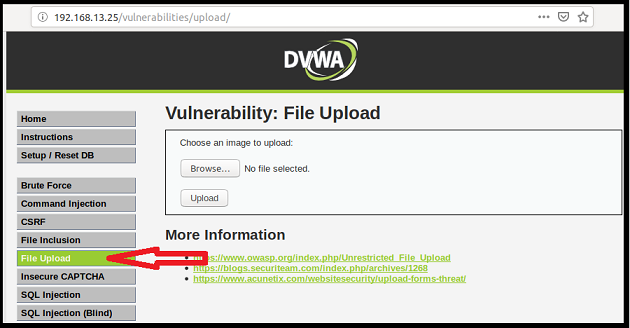

## Activity File: Local File Inclusion 

- In this activity, you will continue your role as an application security engineer with Replicants.

- You've just tested the company's main production website and confirmed that there is a back-end component vulnerability (**directory traversal**).

- Your manager is now concerned that there might be other back-end component vulnerabilities.

- More specifically, your manager would like you to test for **local file inclusion (LFI)** vulnerabilities.

- Your manager has asked you to propose a mitigation strategy based on your findings.

## Setup

- Access your web lab and open a browser.

- Return to the same webpage from the previous activity: <http://192.168.13.25>.

  - Select the **File Upload** option from the menu on the left side of the page.
    
    - Note that even though you will be on the **File Upload** page, you will first conduct a file inclusion activity.

  - Alternatively, you can access the webpage directly by using this link: <http://192.168.13.25/vulnerabilities/upload/>.
  
-  The page will resemble the following image:

    

- **Note:** If you have any issues accessing this webpage, you might need to repeat the activity setup steps from the SQL Injection Activity in 15.1.

### Instructions 

The webpage you have accessed represents a page within the Replicants website. This webpage is designed for a user to upload an image to the Replicants web server. Once the image has been uploaded, the user can access a directory to view their uploaded image. Complete the following steps to test for LFI vulnerabilities.

1. Test the intended use of the web application.

    **Uploading the Image**

    We will first see how to upload and view an image from the file upload webpage.

      - First select Browse to find the image that you want to upload.

      - By default, this should take you to the desktop of your web lab filesystem.

        - If it takes you to a different location, select Desktop.

    - There will be a file on your desktop called `image.jpg`.
    
      - Select that image.

    - Back on the file upload page, you should see the `image.jpg` file name that you selected.

      - To upload the file, select Upload.

    - You should then receive a success message that states:

      `../../hackable/uploads/image.jpg succesfully uploaded!`
  
    **Viewing the Image**  

    - Note that the previous success message indicates where the file has been uploaded: 

      - `../../hackable/uploads/image.jpg`

    - Access the image by replacing the `#` at the end of the URL with the complete location indicated earlier.

      - `192.168.13.25/vulnerabilities/upload/../../hackable/uploads/image.jpg `

      - Note that your browser will automatically update the URL to the direct location of the image:

        - `http://192.168.13.25/hackable/uploads/image.jpg`

    - You should see the image of a squirrel.

      - Note that this is how the application is intended to work, by providing a user an option to upload and view an image!

2. Test an unintended function of the application by loading a malicious PHP script.

    - Note that you just tested how the application is designed to load and view an image.

    - Let's now view a malicious PHP script that we can upload, instead of an image.

    - The malicious PHP script, called `script.php`, has been placed on your desktop.

      - To view this script, find it on your desktop and double-click on it to open:
      
                  <?php
                  $command = $_GET['cmd'];
                  echo system($command);
                  ?>

      - While understanding the exact syntax is not important for now, just note that the contents in the script are designed to run a PHP script to execute a user command.

    - Return to the file upload webpage and follow the same steps again, but this time select and upload the file `script.php`.

      - Note that this script will be uploaded to the same location as the image you previously uploaded.

3. Run command-line commands with your PHP script.

    - Let's now see if we can run command-line commands against the Replicants web server!

      - Change the URL to access the script that you just uploaded.
      
    - Modify the URL again to run the several Linux commands:

      - **Hint:** Review your class slides to see how to modify the URL to run command-line commands.

      - Run the following Linux commands and take note of the results:

        1. `ls`

        2. `whoami`
        
        3. `pwd`
        
        4. `ps`

    - **Note:** While this is a safe place to experiment with commands, DO NOT run commands that might delete or alter files that your system needs, such as `rm`, `mv`, or `rdmir`.

4. **Bonus:** Run commands to explore files with your PHP script.

    - Let's now see if we can run malicious commands to explore files within the Replicants web server.

      - By modifying the URL, access the script that you just uploaded.
      
    - Modify the URL to view the `/etc/passwd` file.

      - **Hint:** You will need to encode your payload, as the URL will not accept all characters, such as spaces.

      - Use the following webpage to help design your payload: [MeyerWeb: URL Encoder/Decoder](https://meyerweb.com/eric/tools/dencoder/).

5. Answer the following mitigation strategy questions:

    - Describe to your management how a malicious user can take advantage of the vulnerabilities that you just exploited. Be sure to include the potential impact.

    - Describe in plain language how you might mitigate the vulnerabilities that you just exploited.

---

© 2023 edX Boot Camps LLC. Confidential and Proprietary. All Rights Reserved. 
