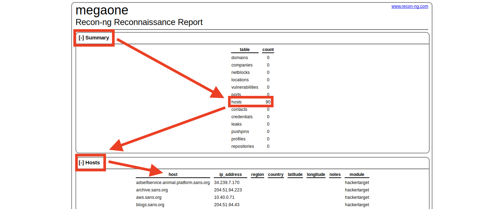

## Solution Guide: Recon-ng

The goal of this activity was to integrate OSINT technologies using Recon-ng.

---

 
- In Ubuntu, start Recon-ng by typing `recon-ng`, as the following image shows:
 

 
- In Recon-ng, run `modules search` to view all of the currently installed modules.

- Run `modules load recon/domains-hosts/hackertarget`.
 
   - This will load the `hackertarget` scanner module.
 
   - Modules need to be loaded prior to use.   
  
- Run `info` to get more information regarding the HackerTarget module.
 
   - The `SOURCE` option is required. This can be:
 
     - A list of IP addresses in a text file
     - Individual IPs
     - A domain name
    
   - For this example, we'll use the domain name option.
 
   - Set the `SOURCE` to megacorpone.com by running `options set SOURCE megacorpone.com`.
 
      - The `SOURCE` option specifies which target Recon-ng will scan.
 
- Type `run`.
 
   - Recon-ng will query Hackertarget for a scan against `megacorpone.com`.
 
   - The results will automatically display verbosely in the terminal window.

- Run `modules load reporting/html` to select and load the reporting module.
 
- Run `info` to see what parameters need to be set.
 
   - The `CREATOR` and `CUSTOMER` parameters need to be set.
 
   - Set the `CREATOR` and `CUSTOMER` parameters via the `options set` command:

      - `options set CREATOR Pentester` 
      - `options set CUSTOMER MegaCorpOne` 
 
   - Type `run` and the results will be saved to `/root/.recon-ng/workspaces/default/results.html`, as the following image shows:
 
      
- View the report.
 
    - To view the report, open the file manager and run the command `xdg-open /root/.recon-ng/workspaces/default/results.html`.
   
    - Right-click on `results.html`, and open it in Firefox to view the rendered results.

       - In the "Summary" window, we can see that Recon-ng returned a result with 151 hosts.
      
       - Expand the "Hosts" window by clicking on the + sign, as the following image shows:

        
      
    - At the bottom of the results page, we find the `CREATOR` option shown with the date and time, as the following image shows:
   
     
   
   
---
© 2023 edX Boot Camps LLC. Confidential and Proprietary. All Rights Reserved.
 
