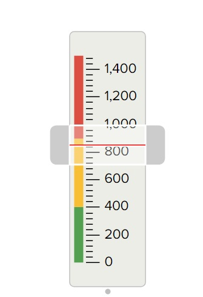
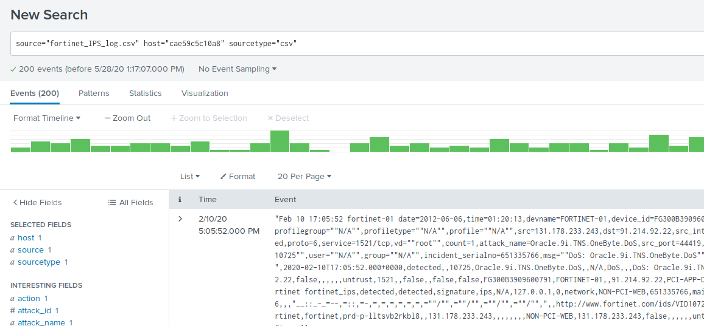
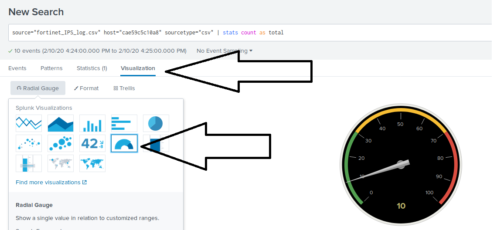
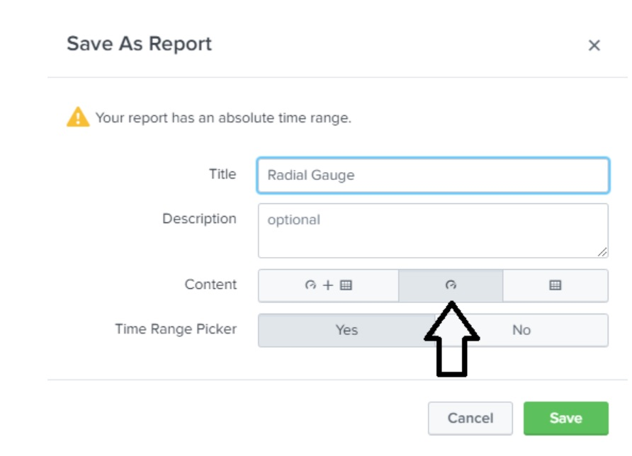
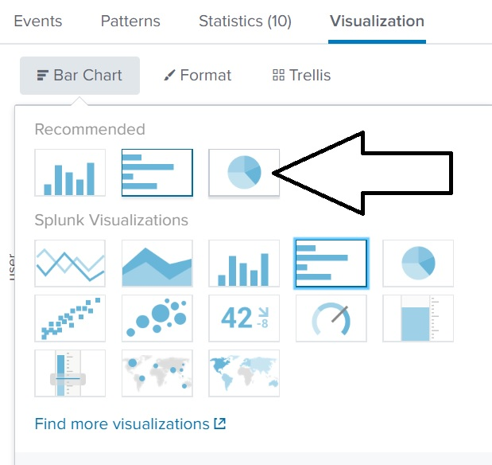
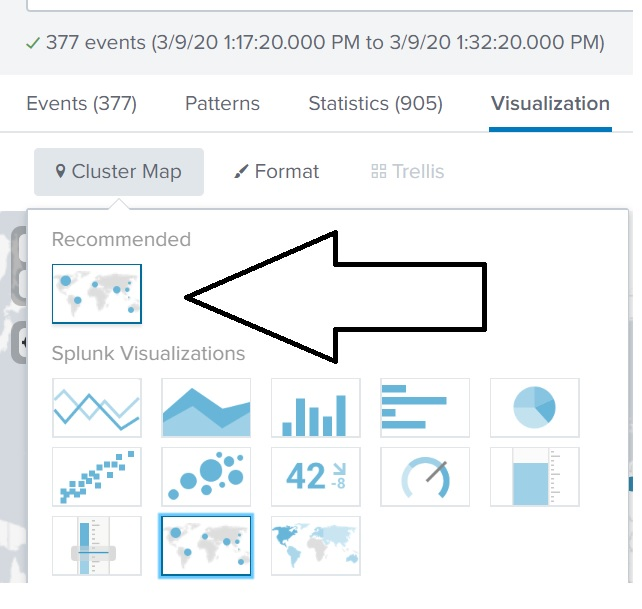
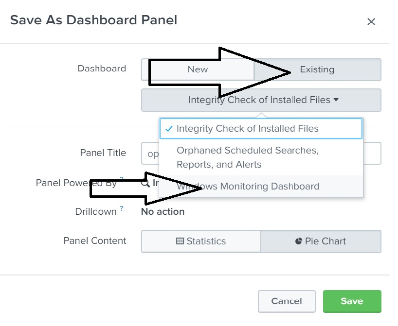

## 20.1 Lesson Plan: Splunk Dashboards and Visualizations

### Overview

In today's class, we will create dashboards that display useful visualizations of our Splunk searches.  

### Class Objectives

By the end of class, students will be able to:

- Create visualizations of single- and multiple-value searches. 

- Use the `geostats` and `iplocation` commands to add location-based visualizations to searches. 

- Combine multiple visualizations in a single dashboard. 

- Modify dashboards with time range input and drilldown capabilities.

### Lab Setup

During this class, we will use the Splunk instance inside the Ubuntu VM.

- To launch, move into the `/splunk` directory and run the following script: 

  - `sudo ./splunk.sh`
  
  - On the first time running, select Option 1.
  - All subsequent times, select Option 2.

- Once the script completes, pull up your web browser in the Ubuntu VM and enter the following URL: 

  - `localhost:8000/`

- On the Splunk login page, use the following credentials:
    - User: `admin`
    - Password: `cybersecurity`
  
- The logs for each lesson and activity are located in the `/splunk/logs` directory. 

### Module Day 1 Contents

- [x] [01. Instructor Do: Welcome Back and Module Recap](#01-instructor-do-welcome-back-and-module-recap-010)
- [x] [02. Instructor Do: Introduction to Visualizations](#02-instructor-do-introduction-to-visualizations-010)
- [x] [03. Student Do: Single-value Visualizations](#03-student-do-single-value-visualizations-015)
- [x] [04. Instructor Review: Single-value Visualizations Activity](#04-instructor-review-single-value-visualizations-activity-005)
- [x] [05. Instructor Do: Multiple-value Visualizations](#05-instructor-do-multiple-value-visualizations-010)
- [x] [06. Student Do: Multiple-value Visualizations](#06-student-do-multiple-value-visualizations-015)
- [x] [07. Instructor Do: Review Multiple-value Visualizations Activity](#07-instructor-do-review-multiple-value-visualizations-activity-005)
- [x] [08. Instructor Do: Geographic Map Visualizations](#08-instructor-do-geographic-map-visualizations-010)
- [x] [09. Student Do: Geographic Map Visualization](#09-student-do-geographic-map-visualization-015)
- [x] [10. Instructor Review: Geographic Map Visualization Activity](#10-instructor-review-geographic-map-visualization-activity-005)
- [x] [11. Break](#11-break-015)
- [x] [12. Instructor Do: Introduction to Dashboards](#12-instructor-do-introduction-to-dashboards-015)
- [x] [13. Student Do: Creating Dashboards](#13-student-do-creating-dashboards-015)
- [x] [14. Instructor Review: Creating Dashboards Activity](#14-instructor-review-creating-dashboards-activity-005)
- [x] [15. Instructor Do: Drilldowns and Dashboard Interactivity](#15-instructor-do-drilldowns-and-dashboard-interactivity-010)
- [x] [16. Student Do: Advanced Dashboards](#16-student-do-advanced-dashboards-015)
- [x] [17. Instructor Review: Advanced Dashboards Activity](#17-instructor-review-advanced-dashboards-activity-005)
- [x] [18. Instructor Do: Additional Content](#18-instructor-do-additional-content)

### Slideshow

The lesson slides are available on Google Drive here: [20.1 Slides](https://docs.google.com/presentation/d/1c3GHz3w_texfTZBhD06cYt3tavzhCBgr9v2r49GpnbY/)

- To add slides to the student-facing repository, download the slides as a PDF by navigating to File > "Download as" and choose "PDF document." Then, add the PDF file to your class repository along with any other necessary files.

- **Note:** Editing access is not available for this document. If you or your students wish to modify the slides, please create a copy by navigating to File > "Make a copy...".

### Time Tracker

The time tracker is available on Google Drive here: [20.1 Time Tracker](https://docs.google.com/spreadsheets/d/1K112UYTZdbR03-TF4ZkoHtMkRN74fyaBF-4zdboa2iA/edit#gid=0)

- **Note:** Editing access is not available for this document. If you or your students wish to modify the slides, please create a copy by navigating to File > "Make a copy...".

### Student Guide

- [20.1 Student Guide](studentguide.md)

-------

### 01. Instructor Do: Welcome Back and Module Recap (0:10)

Begin class by welcoming the students back and informing them that today they will learn how Splunk's visualization capabilities are used by security professionals to identify and mitigate security issues.

Before we begin learning the new Splunk capabilities, let's review what we covered in the last class:

- Splunk uses the Statistics feature to display specific values from search results in an easy-to-read spreadsheet.

- The `eval` command is used to design new fields or modify existing fields.

- Splunk uses reports to save searches and run them at designated times.

- Splunk alerts are designed to send automatic notifications when a specific condition, known as a trigger condition, is met.

- Designing poor alerts can cause two types of issues: false positives and false negatives.

  - False positives occur when conditions are met and an alert is triggered, but the security situation being monitored did not actually occur.

  - False negatives occur when the condition is met and an alert is not triggered, meaning the security situation occurred undetected.
  
- Baselining is a method of looking at historical data to determine how much activity is considered "normal."

- Security professionals use baselining to determine a threshold.

  - A threshold is the condition or level that, when met, triggers an alert.

- Security professionals may encounter the challenge of alert fatigue. This occurs when they receive so many alerts that they cannot adequately respond to each one.

Explain that for today's activities, the students will continue to play the role of SOC manager at Omni Medical Products. They will be tasked with creating several types of visualizations and adding them to a dashboard.

[<- Back to Module Contents](#module-day-1-contents)

---

### 02. Instructor Do: Introduction to Visualizations (0:10)

Explain that in previous classes, we learned how to visualize statistics with charts. Today, we will expand our Splunk capabilities to include adding more contextualized and informative visuals. These can assist with analysis and research of system and security issues. 

- For example, the following table shows the number of logins into a web application per minute:
  
  

- The following gauge visualization contextualizes that number by highligting the severity of the login count.
  
  
      
Explain that Splunk uses visualizations to make complex data easier to understand and analyze:

- Splunk visualizations allow interactivity and offer more in-depth details.

- These visualizations range from simple bar and column charts to more complex horizon charts and punch cards. 

Splunk visualizations can display single values, such as total number of attacks, and multiple values, such as a chart of attacks correlated by attack type. 
  
- Explain that we will first demonstrate how to build a visualization of a single value.  

#### Single-value Visualization Walkthrough

Explain that in this demonstration, we'll use a radial gauge visualization.

- **Radial gauges** are similar to the RPM dial found in the dashboard of a car. 

  - RPM (revolutions per minute) is a single value visualized in the dial.

  -  The dial includes a red section that indicates when the level is too high.
 
In this demonstration, we will use event data from a Fortinet firewall attack log to create a radial gauge measuring the Oracle.9i.TNS.OneByte.DoS attack over a one-hour period. 

1. Log into Splunk and open the Search & Reporting app.

2.  Load the following Splunk file: fortinet_IPS_logs.csv

3. Create the search value and enter the following search:

    - `source="fortinet_IPS_logs.csv"   attack_name="Oracle.9i.TNS.OneByte.DoS"`
    
    Specify a one-minute period by double-clicking the bar representing data from 4:24pm (or any other time).

    - Explain that while we are selecting a one-minute period as an example, a real SOC would make their own determination of which time period to monitor. This will depend on their own environment and the attacks they have seen in the past.

    
    
4. Turn this minute count into a single value by piping the SPL search into a `stats count as total` field:

   - Add `| stats count as total` to the end of the search and run the search again. 

   - Make sure the search spans the past one minute.

  

   **Note:** Your results may vary.

5. Next, we will turn this single value into a radial gauge. 

   - Select **Visualization** and then select the **Radial Gauge** option.

   

   - The different color values in this radial gauge were created by default by Splunk:
      - Green: 0&ndash;30
      - Yellow: 30&ndash;70
      - Red: 70&ndash;100

6. We can customize these ranges and colors based on our needs and preferences.
 
    - To edit, select **Format** > **Color Ranges** > **Manual**.

     

   - In this example, the value of that minute is 10 events, which we may consider the top of a normal level.

   - Change the ranges to:
      - Green: 0&ndash;10
      - Yellow: 10&ndash;20
      - Red: 20&ndash;30
  
      
  
7. Now the radial gauge displays the 10 events at the top of the green range.

    - Save this radial gauge by selecting **Save As** >  **Report** > **Choose a Title**.

    - Select the radial gauge icon under **Content**.
  
     
   
In the activity that follows, students will design a radial gauge to help OMP monitor attacks against its public-facing website.   

- Answer any questions that students have before the next activity.

[<- Back to Module Contents](#module-day-1-contents)

---

### 03. Student Do: Single-value Visualizations (0:15)

Explain the following: 

- This week, you will continue to play the role of SOC manager at OMP. 

- The networking team notified you about performance issues that OMP's public-facing website experienced over the weekend.

- The team discovered that these issues were caused by an attacker flooding the web server with POST requests.

- As the SOC manager, you would like to build visualizations that your SOC team can use to determine the severity of the attack. These visualizations will help your SOC respond to attacks quickly and accurately.

- Your networking team provided a log file of two hours of normal activity to analyze.

- You are tasked with designing a single-value radial gauge to help monitor attacks against OMP's website.

:globe_with_meridians: This activity uses **breakout rooms**. Assign students to groups of 3&ndash;5 and move them into breakout rooms.

Send students the following instructions:

- [Activity File: Single-value Visualizations](activities/03-Single-Value-Visualization/Unsolved/README.md)

[<- Back to Module Contents](#module-day-1-contents)

---

### 04. Instructor Review: Single-value Visualizations Activity (0:05)

As we saw from the demo, Splunk can be used to create visualizations with a single value. Students were tasked with designing a radial gauge to illustrate the severity of a single value.

Completing this activity required the following steps:

  - Designing an SPL query.

  - Creating a single value with the SPL query.

  - Displaying the single value in a radial gauge visualization.

  - Modifying the radial gauge to illustrate severity levels.

Send students the following file and use it to guide your review: 

  - [Solution Guide: Single-value Visualizations](activities/03-Single-Value-Visualization/Solved/README.md)

Answer any questions that remain before proceeding.

[<- Back to Module Contents](#module-day-1-contents)

---

### 05. Instructor Do: Multiple-value Visualizations (0:10)

We just created a visualization with a single value. Now, we will use visualizations to display multiple values. 

  The following is an example of a scenario in which multiple-value visualizations are useful:

  - A business is experiencing brute-force attacks against a web application. The manager wants to visualize the list of users being attacked and the number of attacks experienced by each user.
  
Note that these statistics will still display in a spreadsheet.

  
However, we can convert these spreadsheets into simple and interactive visualizations:

- For example, below is the data found in the spreadsheet displayed in a column chart visualization.

  

- Note the interactivity: When the mouse is hovered over a user, a count of the attacks experienced by this user is displayed. 

  
  
Explain that we will now walk through how to create an interactive multiple-value pie chart.

#### Multiple-value Visualization Walkthrough

In this demonstration, we will use event data from Windows event logs to create a pie chart of top user logins. 

- Load the following Splunk file: demo_winlogs.csv
  
1. Run the following search:  

   - `source="demo_winlogs.csv" subject="An account was successfully logged on"`
   
   - **Note:** Your values and counts may differ from the screenshots.
 
   
 
2. Create a report of the top values. 

    - Click the **user** field and select **Top values**. 

   
 
3.  Modify the top value to display the top 10 values.
    -  Click **Search** to update the results.
 
      
 
4. Under **Visualization**, select the pie chart icon under the **Bar Chart** heading.
 
    
   
   - The top 10 users with login data are displayed as a pie chart.  
 
    
  
5.  Demonstrate the interactivity by moving your mouse over any piece of the pie. 
  
     - It shows the specific count and percentage of a user.
  
     
   
6. Save the pie chart by selecting **Save As** > **Report** > **Choose a Title**.

    - Select the pie chart icon under **Content**. 
   
Explain that in the activity that follows, students will design a pie chart to help OMP understand which URL paths are being attacked.

Answer any questions students may have before the next activity.

[<- Back to Module Contents](#module-day-1-contents)

---

### 06. Student Do: Multiple-value Visualizations (0:15)

Explain the following to students:

- Your SOC staff are impressed with the radial gauge you designed to monitor attacks against the web server.

- They would like you to create a visualization of the exact URL paths targeted by attacks.

- You are tasked with designing a multiple-value visualization to display the URL paths targeted by the POST requests.

:globe_with_meridians: This activity will use **breakout rooms**. Assign students into groups of 3&ndash;5 and move them into breakout rooms.

Send students the following instructions:

- [Activity File: Multiple-value Visualization](activities/06-Multiple-Value-Visualization/Unsolved/README.md)

[<- Back to Module Contents](#module-day-1-contents)

---

### 07. Instructor Do: Review Multiple-value Visualizations Activity (0:05)

As seen in this activity, Splunk can be used to create a variety of visualizations with multiple values. Students were tasked with designing a pie chart to illustrate multiple values, specifically the URL paths being attacked.

Completing this activity required the following steps:

- Designing an SPL query for multiple values.
- Displaying multiple values with a pie chart.
- Using other visualizations to view the multiple values.

Send students the following solution file and use it to guide your review: 

- [Solution Guide: Multiple-value Visualization](activities/06-Multiple-Value-Visualization/Solved/README.md)

Answer any questions that remain before proceeding.

[<- Back to Module Contents](#module-day-1-contents)

---

### 08. Instructor Do: Geographic Map Visualizations (0:10)

Explain that we can use visualizations to gain further insight into our data, such as where in the world an attack or activity originated.

  - Organizations can monitor where users access their application from to help determine the source of security issues.

  - For example, a business knows that its application customers are primarily located in the United States. If the business is notified that a significant number of users have started accessing their application from another place in the world, they will take this as a cue to investigate the activity.
  
Explain that Splunk can create location-specific reports with the `iplocation` and `geostats` commands. 

#### Geographic Map Visualization Walkthrough

- Load the following file: demo_httplogs.csv

1. Run the following SPL command in the Search & Reporting app:
    - `source="demo_httplogs.csv"`
  
   - This log shows HTTP activity.

2. Identify the field containing the IP address. This is used to determine the location. 
  
   - We'll use the source IP address, indicated by the field `src_ip`.
      - Point out that we can also use the destination IP (`dest_ip`).
  
   - To determine the location data of the IP, run the following SPL command:
     - `source="demo_httplogs.csv" | iplocation src_ip`
  
   - The `iplocation` command outputs the city and country data of the `src_ip` field.
  
   - **Note:** The `City` and `Country` fields should now appear on your fields list. In case they aren't automatically added, you may have to complete the steps below to select these fields from the **more fields** option.

      

3. Search for the **City** and **Country** fields. 

    - Check the box to add these fields.

       

    - "City" and "Country" should now appear on the **Selected Fields** list.

       

   - Click on the **Country** field to list the countries found based on the source IP addresses.

Explain that we will introduce the `geostats` command, which uses the location data found with the `iplocation` command to map latitude and longitude data for each event.
  
1. Use the `geostats` command by running the following search: 

    - `source="demo_httplogs.csv" | iplocation src_ip | geostats count`  
  
2. Next, go to the **Visualization** tab. 
   
   - Point out that Splunk has recommended a visualization called **Cluster Map** based on your search. 
  
        

   - Select the cluster map icon and explain that this tool places our search results on a geographic map.

       

3. Hover over the circles to demonstrate the interactivity. It displays the latitude, longitude, and count of each circle.

   - Point out that the size of each circle indicates the number of events in each city.

       

   - Use the **+** and **-** buttons on the left of the map to zoom in and out on the map.

       

Summarize this walkthrough by explaining that the geographic maps in Splunk are powerful visualizations that can help security teams quickly understand where activity is coming from.

In the activity that follows, students will design a geographic map to inform OMP where attacks originated.

Answer any questions before moving on to the activity.

[<- Back to Module Contents](#module-day-1-contents)

---

### 09. Student Do: Geographic Map Visualization (0:15)

Explain the following to students:

- OMP would like you to expand your visualizations to provide more geographic information on the attacks.  

- The security team can use this information to create firewall rules that restrict traffic from specific geographic locations.

- You are tasked with designing a geographic map visualization to help your SOC team understand where attacks originated.

:globe_with_meridians: This activity will use **breakout rooms**. Assign students into groups of 3&ndash;5 and move them to breakout rooms.

Send students the following instructions:

- [Activity File: Geographic Map Visualization](activities/09-Maps/Unsolved/README.md)

[<- Back to Module Contents](#module-day-1-contents)

---

### 10. Instructor Review: Geographic Map Visualization Activity (0:05)

This activity demonstrated how Splunk can be used to create advanced visualizations such as geographic maps. Students were tasked with designing a geographic map using the `iplocation` and `geostats` commands.

Completing this activity required the following steps:

  - Designing an SPL query.

  - Identifying the fields with IP addresses.

  - Defining the fields with `iplocation`.

  - Using the `geostats` command to translate the `iplocation` to a longitude and latitude.

  - Using the geographic map to display the results from the search.

Send students the following solution file and use it to guide your review: 

- [Solution Guide: Geographic Map Visualization](activities/09-Maps/Solved/README.md)

Answer any questions that remain before proceeding to the next section. 

[<- Back to Module Contents](#module-day-1-contents)

---

### 11. Break (0:15)

[<- Back to Module Contents](#module-day-1-contents)

---

### 12. Instructor Do: Introduction to Dashboards (0:15)

So far, we've covered the following visualizations:

 - Single value
 - Multiple values
 - Geographic maps
 
Explain that while each of these visualizations is useful on its own, they are even more effective when grouped and displayed together. 

- For example, an organization that monitors a website may want to view all of the following at the same time:

  - The volume of successful and unsuccessful logins on the website
  - A geographic map of the sources of activity
  - A pie chart of the specific website pages accessed
    
- Viewing this information together can provide a security analyst a complete picture of the state of the web application.

Explain that we can use a Splunk tool called dashboards to do just this.

- **Dashboards** are a collection of multiple visualizations in a single location.

- The visualizations are placed in different sections, called **panels**.

- Panels can contain:
  - Single-value visualizations
  - Multiple-value visualizations
  - Geographic maps
  - Statistical charts

- The SOC team often has dashboards displayed on multiple screens in its operations room to provide availability and functionality across the staff.
   
   
   
Next, we will demonstrate how to create and design dashboards.  
  
#### Creating Dashboards Demonstration

Explain that we will demonstrate how to create a dashboard using the following scenario:

 - As an SOC manager, you would like to create a single three-panel dashboard to monitor your Windows server. You want the panels to include:

   - A radial gauge of successful logins
   - A pie chart of users logging in
   - A statistical chart of the data in the pie chart

Explain that we will still go through the process of creating each visualization. We'll start with the radial gauge.

- **Note:** We will be using a log file for this demonstration that was already used: `demo_winlogs.csv`
  - There is no need to reload this file.

1. Add the radial gauge with the following search: 
   - `source="demo_winlogs.csv" signature="An account was successfully logged on" | stats count as total`
   
    - Design and format the radial gauge visualization as needed.

2. To add this radial gauge to a dashboard, select **Save As** >  **Dashboard Panel**.

   

3. Since we haven't created the dashboard yet, select the **New** dashboard option.
   - Name the dashboard "Windows Monitoring Dashboard."
  
    
  
   - Name the panel "Windows Login Count."

   - Select **Radial Gauge** under **Panel Content**.
  
    
  
   - Select **Save**.

4. Confirm that the dashboard has been created by selecting **View Dashboard**.
      - This dashboard has only one panel. Let's add the next panel. 

    

    
  
5. Next, we will add the pie chart. 

    - Return to the Search & Reporting app and add the following search:
      - `source="demo_winlogs.csv"| top limit=10 user`
  
    Select the pie chart as the visualization. Then select **Save As** > **Dashboard Panel** again.
    
6. Since we already created the dashboard, we just need to add the new visualization to it.

   - Select **Existing** > **Windows Monitoring Dashboard**.

    

   - Title the dashboard panel "Top 10 Windows Users."

   - Select **Save** > **View Dashboard**.

   - Now the dashboard has multiple visualizations.

    

7. Dashboards can be edited by selecting **Edit**.
   - Rearrange panels by dragging the panel to a new location on the dashboard.

   

   

   - Select **Save** to save your changes to the dashboard.

8. Explain that the last step is to add the third panel to the dashboard.
     - Add the search:
       - `source="demo_winlogs.csv"| top limit=10 user`

    - Follow the same steps for adding this to the dashboard.

    - The completed dashboard should look like the following: 
    
      

In the activity that follows, students will add all the visualizations they've made to a dashboard. 

[<- Back to Module Contents](#module-day-1-contents)

---

### 13. Student Do: Creating Dashboards (0:15)

Explain the following to students:

- You have done an excellent job building a radial gauge, pie chart, and geographic map.

- Next, your team would like to view all of these data visualizations in a single location.

- You are tasked with designing a single dashboard to view all of the visualizations in a single location.

:globe_with_meridians: This activity will use **breakout rooms**. Assign students into groups of 3&ndash;5 and move them into breakout rooms.

Send students the following instructions:

- [Activity File: Creating Dashboards](activities/13-Dashboard/Unsolved/README.md)

[<- Back to Module Contents](#module-day-1-contents)

---

### 14. Instructor Review: Creating Dashboards Activity (0:05)

This activity demonstrated how Splunk dashboards can be used to display a variety of visualizations in a single location. Students were tasked with combining all the visualizations they have created so far into a single dashboard.

Completing this activity required the following steps:

  - Creating a new dashboard
  - Adding reports into panels in an existing dashboard
  - Modifying the layout of a dashboard

Send students the following solution file and use it to guide your review: 

- [Solution Guide: Creating Dashboards](activities/13-Dashboard/Solved/README.md)

Answer any questions that remain before proceeding.

[<- Back to Module Contents](#module-day-1-contents)

---

### 15. Instructor Do: Drilldowns and Dashboard Interactivity (0:10)

Similar to many other applications in Splunk, dashboards have advanced features that can help information security professionals research security issues. 

These include:
  - Direct input modifications within dashboards
  - Drilldowns within panels for further analysis

We will walk through how to configure these features by using the dashboard and scenario from the preceding section:

  - As an SOC manager, you created a three-panel dashboard to monitor your Windows server.

  - You will expand the functionality of this dashboard by:
    - Modifying the date and time ranges being analyzed directly on the dashboard

    - Adding a drilldown into the visualizations to assist with further analysis
    
#### Time Input Walkthrough
 
Explain that we will first walk through how to configure the dashboard to modify the date and time range.
 
1. Open the dashboard created in the preceding demonstration:
    - Select **Dashboards** > **Windows Monitoring Dashboard**.
   
    
 
2. Select **Edit** to modify the dashboard.
   
   - Select **Add Input**, then select **Time**.

   - We can modify many features in the dashboard. Today, we will only cover the Time feature.
   
   
   
3. The top of the dashboard should now show a field where you can input time.
 
   - This feature modifies the time range of data displayed in each panel.

     
   
4. For the panels to work with this new feature, we have to reconfigure some settings for each panel.
   
   - To modify the first panel, select the magnifying glass icon to edit the search for the radial gauge.
 
     
 
   - Select **Shared Time Picker**.
     - This is the input that we just created.

   - Select **Apply**.
   
   
 
   - Repeat these steps for the other two panels.
 
   - Select **Save** to save the whole dashboard.
 
- There is now a working input on the dashboard where we can quickly change the time range of each panel.
 
  
   
#### Drilldown Walkthrough
 
Next, we will add a **drilldown** to help us research specific data from a panel. 

Explain that a drilldown is similar to a drop-down menu and has a variety of functions. 
 
1. Select the **Edit** option to modify the dashboard.
  
2. On the pie chart, select the three vertical dots for more actions, then select **Edit Drilldowns**.

    - Select **Link to search** in the drop-down.
    - Keep **Auto** selected.
    - Click **Apply**.

   

     

   - Save the dashboard. 
  
3. We now have the ability to search for a specific piece of the pie chart.

   - Demonstrate by selecting one of the pieces of the pie chart. 

    

    - This creates a search based on what was selected.

    

Explain that this drilldown feature allows an SOC analyst to quickly analyze data directly from the dashboard.

In the final activity, students will modify their dashboard to add the time-based input and drilldowns to assist OMP with research on security issues.

Answer any questions students have before the last activity.

[<- Back to Module Contents](#module-day-1-contents)

---

### 16. Student Do: Advanced Dashboards (0:15)

Explain the following to students:

- Your SOC staff appreciate the great work you did to build a robust dashboard to monitor attacks against the web server. 

- Several of the staff members have requested you make the dashboard panels more interactive so they can quickly research attacks.

- You are tasked with enhancing your dashboard to add drilldowns and interactivity features.

:globe_with_meridians: This activity will use **breakout rooms**. Assign students into groups of 3&ndash;5 and move them into breakout rooms.

Send students the following instructions:

- [Activity File: Advanced Dashboards](activities/16-Advanced-Dashboards/Unsolved/README.md)

[<- Back to Module Contents](#module-day-1-contents)

---

### 17. Instructor Review: Advanced Dashboards Activity (0:05)

In this activity, students were tasked with modifying their dashboard to add a time range input as well as a drilldown capability to one of the panels.

Completing this activity required the following steps:

  - Modifying a dashboard to add a time input
  - Configuring dashboard panels to change when the time input is modified
  - Modifying panels to allow drilldowns
  - Configuring drilldowns to link to Splunk searches

Send students the following solution file and use it to guide your review: 

- [Solution Guide: Advanced Dashboards](activities/16-Advanced-Dashboards/Solved/README.md)

[<- Back to Module Contents](#module-day-1-contents)

---

### 18. Instructor Do: Additional Content

If time permits, briefly talk about the `table` command:

- The `table` command in Splunk is a non-streaming command that returns a table formed by only the fields that you specify in the arguments. The columns are displayed in the same order that fields are specified, and the column headers are the field names. Each row in the table represents an event, and the rows are the field values.

- The `table` command retrieves the raw data found in the base search, but only the data within the specified fields. It then places this data in a tabular format.

- The `table` command can also be used in conjunction with other commands for more complex searches. For example, you can use the `table` and `eval` commands together for faster searches. Similarly, the `stats` and `table` commands can be used together, but the `table` command results will be limited because the `stats` command is a transforming command.

It's important to note that the `table` command does not allow you to rename fields, only to define the fields you want to display in your tabulated results. If you need to rename a field, do it before the results are piped to the `table` command. Also, the `table` command truncates the number of results returned based on the settings in the `limits.conf` file.

Answer any questions that remain before wrapping up the class.
  
[<- Back to Module Contents](#module-day-1-contents)

---

&copy; 2024 edX Boot Camps LLC. Confidential and Proprietary. All Rights Reserved.  
