## 21.1 Lesson Plan: Introduction to Digital Forensics

### Overview

Today's class will introduce students to the digital forensics field. The class covers procedures for collecting, preserving, analyzing, and reporting forensic evidence.

### Class Objectives

By the end of the class, students will be able to:

- Summarize the basic principles and methodologies of digital forensics.

- Describe various skill sets required for digital forensics jobs.

- Outline the proper approach to collecting, preserving, analyzing, and reporting forensic evidence.

- Conduct a preliminary review for a forensic case.

- Preserve and document evidence using Autopsy.

### Instructor Notes

- In this module, you will use a new Forensics lab environment located in Windows Azure. 

- Today's lesson has three parts:
  - Introduction to the science of digital forensics.
  - Explanation of disk architecture, disk forensics, and forensic imaging formats.
  - Hands-on demonstration of Sleuth Kit Autopsy to begin a forensics investigation.

- During the Autopsy demonstration, it will take about 15 minutes for the investigation file to be analyzed. It's recommended to take the class break while this is happening.

### Lab Environment

Lab Details

 

In this module, you will use a new Forensics lab environment located in Windows Azure Lab Services. RDP into the **Windows RDP host machine** using the following credentials:

  - Username: `azadmin`
  - Password: `p@ssw0rdp@ssw0rd`

Open Hyper-V Manager to access the nested machine:

**Kali Forensics machine:**
  - Username: `root`
  - Password: `toor`

  

### Module Checklist

Before beginning to prep this week's lesson, be sure you have the following accessible within your lab.  Please notify the curriculum team as soon as possible if any of the following is not available.

- [x] Kali-Forensics

### Module Day 1 Contents

- [x] [01. Instructor Do: Welcome and Overview](#01-instructor-do-welcome-and-overview-010)
- [x] [02. Instructor Do: Introduction to Digital Forensics](#02-instructor-do-introduction-to-digital-forensics-025)
- [x] [03. Student Do: Digital Forensics in the Cloud](#03-student-do-digital-forensics-in-the-cloud-020)
- [x] [04. Instructor Review: Digital Forensics in the Cloud Activity](#04-instructor-review-digital-forensics-in-the-cloud-activity-010)
- [x] [05. Instructor Do: Overview of Digital Forensics Types and Methodology](#05-instructor-do-overview-of-digital-forensics-types-and-methodology-015)
- [x] [06. Instructor Do: The Pure Gold Credit Union Case](#06-instructor-do-the-pure-gold-credit-union-case-005)
- [x] [07. Student Do: The Pure Gold Credit Union Case](#07-student-do-the-pure-gold-credit-union-case-015)
- [x] [08. Instructor Review: The Pure Gold Credit Union Activity](#08-instructor-review-the-pure-gold-credit-union-activity-010)
- [x] [09. Everybody Do: Introduction to Autopsy](#09-everybody-do-introduction-to-autopsy-020)
- [x] [10. Break](#10-break-015)
- [x] [11. Everybody Do: Autopsy Continued](#11-everybody-do-autopsy-continued-015)
- [x] [12. Instructor Do: Wrap-Up and Review](#12-instructor-do-wrap-up-and-review-010)

### Slideshow

Slides for today's class are available on Google Drive, located here: [21.1 Slides](https://docs.google.com/presentation/d/1Kn-JVKhINnlyaj_22t1Db0U3OviIFV6fyg3gRqxXE0o/edit#slide=id.g2ba83c57306_0_2373).

- To add slides to the student-facing repository, download the slides as a PDF by navigating to File > "Download as" and choose "PDF document." Then, add the PDF file to your class repository along with other necessary files.

- **Note:** Editing access is not available for this document. If you or your students wish to modify the slides, please create a copy by navigating to File > "Make a copy...".

### Time Tracker

Time tracker for today's class is located here: [21.1 Time Tracker](https://docs.google.com/spreadsheets/d/1NR6AuKo_0tVbGQyL-MXRWdGfpDwwV2m1BJ9IByCRiac/edit#gid=0)

- **Note:** Editing access is not available for this document. If you or your students wish to modify the slides, please create a copy by navigating to File > "Make a copy...".

### Student Guide

- Send the class a student-facing version of the lesson plan: [21.1 Student Guide](StudentGuide.md)

---

### 01. Instructor Do: Welcome and Overview (0:10)

Welcome students to class and explain that digital forensics is a very exciting cybersecurity field that requires a unique set of skills.

  - We learned in earlier modules that penetration tests attempt to discover vulnerabilities in order to prevent breaches and cybercrimes.

  - We know that not all defenses can withstand the network attacks that are constant in today's cyber landscape.

  - Therefore, digital forensics attempts to discover evidence of a crime after it's been committed.

We'll begin class by introducing the field of digital forensics and describing the field's roles, skill sets, and responsibilities.

#### Roles, Knowledge, and Skill Sets

Digital forensics professionals must have a thorough understanding of hardware, operating systems, and computer networks.

- Send students the following link from NICCS detailing skills, knowledge, and other aspects associated with digital forensics:

  - [Cyber Security Workforce Framework: Digital Forensics](https://niccs.us-cert.gov/workforce-development/cyber-security-workforce-framework/digital-forensics)

Emphasize that roles and responsibilities in the field of digital forensics are not well-defined across job titles. Specific job roles and responsibilities vary by organization, but may include the following:

- **Computer forensics investigators:** These professionals gather digital information for computer system investigations, producing criminal evidence that can be used in a court of law.

  - Legal cases involve data theft, espionage, and cyberwarfare.

  - This career field involves analyzing data found on hard drives, network communications, and cloud-based data communication systems, as well as the production of reports and possible testimony in a court of law.

- **Computer forensics technicians:** These are digital detectives who work with law enforcement or government entities, or as private investigators.

  - They use investigative and computer analysis techniques to acquire, analyze, and preserve digitized evidence to be used for legal purposes.

  - They also inspect storage media and retrieve corrupted and deleted files from computing storage media, such as hard drives, removable flash media, and mobile devices. This material is used in legal proceedings.

- **Forensic computer analysts:** These professionals specialize in the recovery of deleted emails or other data that has been encrypted or deleted. This material is used in legal cases involving computer crimes.

  - Evidence produced by forensic computer analysts is used by law enforcement to assist with ongoing investigations.

  - Evidence may also be used in a court of law to help convict criminals involved in computer crimes with cases related to child pornography, drug sales, or corporate espionage, among others.

Pause to answer any questions before proceeding.

[<- Back to Module Contents](#module-day-1-contents)

---

### 02. Instructor Do: Introduction to Digital Forensics (0:25)

#### What Is Digital Forensics?

Explain that digital forensics is a field dedicated to identifying, extracting, preserving, and reporting on information obtained from computer and network systems.

- The following definition of digital forensics was published in the article ["Digital Records Forensics: A New Science and Academic Program for Forensic Readiness"](../1/Assets/instructor-resources/Digital_Records_Forensics.pdf) in the *Journal of Digital Forensics, Security and Law*:

   “The use of scientifically derived and proven methods toward the preservation, collection, validation, identification, analysis, interpretation, documentation and presentation of digital evidence derived from digital sources for the purpose of facilitating or furthering the reconstruction of events found to be criminal, or helping to anticipate unauthorized actions shown to be disruptive to planned operations.”

#### Legal Requirements

Ask the class: Why is it important to preserve the integrity of digital evidence?

Explain that forensic evidence that is intended to be used in legal proceedings must satisfy a set of legal standards in order to be admissible.

- Imagine the disappointment of spending months searching through computer and network systems collecting evidence, only to have it considered inadmissible and thrown out due to improper procedures.

- Forensic evidence is held to the same standards as any other evidence submitted in a legal case. All evidence must be wholly intact and unaltered from the scene of the crime.

- Once evidence is collected, the investigator or analyst is accountable for its ownership and whereabouts at all times.

#### Chain of Custody

Explain that a **chain of custody** is a documentation of the possession of evidence.

- Evidence taken into custody must be accounted for. This means that its whereabouts and ownership must be accurately documented at all times, from the time it is acquired to when it is presented in the court room.

- When testifying about the integrity of evidence, one must be able to provide a documented, uninterrupted chain of custody that includes:

  - A detailed log of each person who accessed or handled the evidence
  - The purpose of that access
  - Dates and times it was handled

- If you are not able to show an uninterrupted chain of custody, months or even years of hard work can be considered inadmissible in a court of law, leading to the possible release of criminals. This is why it's so critical to ensure that a proper chain of custody is maintained at all times.

#### The Digital Forensics Process

The National Institute of Standards and Technology defines a process for performing digital forensics in [Special Publication 800-86](../1/Assets/instructor-resources/NIST_800_86.pdf) as follows:

- **Collection:** We must first collect the data before we can examine and analyze it. The collection phase is the springboard to the digital forensics process, which includes identifying, labeling, recording, and acquiring data from sources while following procedures to preserve the integrity of the data.

- **Examination:** After we've collected the evidence, we begin the examination phase, which ensures that all data collected is relevant to the case. This includes forensically processing collected data and assessing and extracting data of interest while preserving the integrity of the data. This usually means working from a copy rather than the original.

- **Analysis:** After we've identified all relevant evidence, we begin the analysis phase by analyzing the results of the examination, using legally approved methods and techniques, to derive information that addresses the questions that inspired the collection and examination.

- **Reporting:** After we've analyzed all of the evidence, digital forensics investigators are required to formally report the results of the analysis, which may include describing the actions used, explaining how tools and procedures were selected, determining what other actions need to be performed, and recommendeding improvements to the forensic process.

#### Evidence Acquisition

Explain that **evidence acquisition** is one of the most critical steps in the entire forensic process. If done improperly, it can result in evidence being missed, lost, or inadmissible in a court of law.

- Explain that digital forensics data has one of two classifications: network-based or host-based.

   - **Network-based** data comes from data communications captured by network-based systems such as an IDS, IPS, and firewalls, in the form of a packet capture or similar.

     - Packet captures are useful for reconstructing events involving computer break-ins.

     - Logs from firewalls also provide insight into network activity.

   - **Host-based** data is typically found on a system that encompasses a wide variety of artifacts.

     - Investigations involving computer break-ins may involve the forensic examination of local file systems, programs, access to critical documents, and/or alterations to system files and directories.

     - Host-based examinations may involve reconstructing internet use, unauthorized activity, email recovery, and the identification of malicious files.

#### Creating Forensic Backups

Explain that during an investigation, it is important that evidence is not contaminated. As a forensic investigator, you will **image** the data. This image, not the original media, will be used for analysis.

  - **A bit-stream image** captures all created sections of a hard drive, known as partitions, whether used or not, and all unallocated drive space that doesn’t belong to partitions.

   - This method allows forensic examiners to recover deleted files and fragments of data that may exist on a hard drive.

   - A **local file system backup** is inadequate for forensic analysis. If you do make a copy through the file or operating system, you can see only the data that the operating system sees. This won’t capture deleted files or slack space, which may contain relevant data. Therefore, you must obtain a **bit-level copy**.

If needed, provide the following explanations to accompany the above descriptions:

  - A bit-level copy or bit-stream image copies over everything: slack space, deleted files, and the regular files as well.

  - A local backup only copies the files that are on the system. This does not copy over slack space or deleted files.

  - Slack space is the area of a file system that indicates deleted or truncated files.

Explain that local backups of hard drives should be performed only if the machine can be taken offline. If it’s taken off of the network, then the owner of the machine cannot send remote commands to, for example, wipe the computer or lock the digital forensics experts out.

- A forensic backup differs from a typical local backup:

  - Typical local backups target intact files. The backup image does not include the free space and slack space on a hard drive.

  - Forensic backups (system image or bit-level backups) create an exact replica of all contents contained on the entire hard drive, including slack space, free space, and deleted files.

   - Forensic backup images are created in the following formats:

     - **Raw formats:** These formats can be created with programs such as `dd`, `ddfldd`, and `ddcdd`.
       - .bin
       - .dd
       - .img
       - .raw

     - **Advanced Forensic Format (AFF):** The AFF format is for disk images and related forensic metadata.
       - .AFF
       - .AFF4

#### Working with Live Systems

One should always use caution when working with live systems. It is possible that an attacker is waiting for the user to log back into the system to complete the attack.

- The primary reason for working on a live system is to capture items that will not survive a power loss, such as volatile memory, swap files, running processes, and active network connections.

 - Explain that mistakes such as writing data to memory or disk can potentially destroy evidence, which is why it is critical to use forensic tools such as write blockers.

    - A **write blocker** is a device that allows anything connected to it to perform only read operations, therefore preventing the drive from being written to and overwriting evidence.

#### File Systems

Briefly describe the file systems that students may encounter during an investigation.

   - **New Technology File System (NTFS):** Supported under Windows 10, 8, 7, Vista, XP, and NT.

   - **File Allocation Table (FAT):** Supported by older and newer versions of Windows.

   - **Apple File System** for 10.13+ is APFS
     - **Apple File System** for 10.12- is MacOS extended

   - **Fourth Extended File System (Ext4):** Used in most Linux distributions.

#### Overview of Storage Media

Poll the class: Ask students if they know which type of storage devices they have in their computer, tablet, or phone.

Provide a brief overview of the physical layout of hard and solid-state devices and how data is stored. Also point out the implications for digital forensics.

- Physical vs. virtual drives

    - A **virtual drive** resides on a physical drive and emulates the characteristics of a hard drive. The drive can be mounted and dismounted and data can be read and written to it.

    - Drives in general are limited by the speed at which they can receive and send information.

- Mechanical hard drives

    - Mechanical hard drives have very delicate moving parts that can be damaged if not handled properly.

    - Mechanical hard drives can have far larger storage capacities than other types of drives. Therefore, the imaging process can take an extremely long time when performing a bit-level copy.

    - Implications for forensics: Data can be recovered from badly damaged or comprised devices. This requires extensive knowledge of the inner workings of hard drives and how hard drives store data.

-  Flash storage

    - Flash storage devices have no moving parts and use flash memory, allowing for quicker read and write access.

    - Flash memory or flash storage is **non-volatile**, meaning it holds data even when it's not connected to power. This technology is used in devices such as USB drives, mobile phones, cameras, and tablet computers.

- Solid-state drives (SSD)

   - SSD storage devices use flash memory chips and have no moving parts. They also have larger storage capacity and have faster read&ndash;write access.

   -  Implications for forensics: An SSD is not a mechanical drive. One must be careful with the forensics tools used to image and recover data. The data on an SSD can be lost or wiped out in seconds.

- SD or microSD cards

  - SD cards store data inside a flash memory chip, similar to solid-state devices. They are used in mobile phones and smartphones.

  - Implications for forensics: It is possible to retrieve data from an SD card even if it has been reformatted or the data has been deleted. This is because data is not immediately erased, the storage is only set aside for reuse. As long as the storage space has not been used, the preexisting data is still available. This is very useful for forensics recovery.

Emphasize that students may encounter password-protected storage media and password-protected **firmware**.

  - Firmware is a specific class of computer software that provides the low-level control for a device's specific hardware.

- These situations present extreme challenges to forensic investigators and must be considered during the initial stages of the investigation.

#### Working with Cloud-Based Evidence

Working with online evidence, such as hard drives and volatile memory located on cloud-based hardware, presents a whole new set of challenges.

- Ask the class if anyone can think of any challenges associated with cloud-based evidence.

- Students will explore these challenges in the next activity.

Answer any questions before proceeding to the first activity.

[<- Back to Module Contents](#module-day-1-contents)

---

### 03. Student Do: Digital Forensics in the Cloud (0:20)

Explain the following:

- In this activity, you will look at a case concerning a DoS attack that occurred at an online shopping website.

- You will list at least four challenges associated with conducting a cloud forensics investigation.

- You will also research how these challenges affect the chain of custody during a digital forensics investigation.

- As a bonus, you will be asked to provide at least one example of how evidence can be obtained to validate the chain of custody in cloud-based forensic investigations.

Send student the following activity:

- [Activity File: Digital Forensics in the Cloud](Activities/03_Cloud_Forensics/Unsolved/README.md)

[<- Back to Module Contents](#module-day-1-contents)

---

### 04. Instructor Review: Digital Forensics in the Cloud Activity (0:10)

Explain that the goal of this activity was to demonstrate the challenges digital forensics investigators face when dealing with cloud-based systems.

Send students the following solution guide and use it to guide your review:

- [Solution Guide: Digital Forensics in the Cloud](Activities/03_Cloud_Forensics/Solved/README.md)

[<- Back to Module Contents](#module-day-1-contents)

---

### 05. Instructor Do: Overview of Digital Forensics Types and Methodology (0:15)

Explain that, in addition to cloud-based forensics, digital forensics is a continuously evolving scientific field that incorporates many sub-disciplines.

Point out some of following subdisciplines:

- **Computer forensics** is the identification, preservation, collection, analysis, and reporting of evidence acquired from computers, notebooks, and storage media. It is used to support investigations and legal proceedings.

- **Disk forensics** involves acquiring and analyzing information stored on physical storage media, such as hard drives, smartphones, GPS systems, and removable media. This involves the recovery process of hidden data, deleted data, and slack space information.

- **Memory forensics** inspects computer memory to identify an attacker's activities on a system.

     - This area requires the broadest skill set. You must have knowledge of CPU architectures, operating systems and memory management, page tables, and virtual addressing, among other things.

     - Point out that memory forensics is different from disk forensics in that the data investigated is stored in volatile memory, such as RAM. Unlike non-volatile memory, volatile memory refers to storage media that loses its data when rebooted. Data on hard drives does _not_ change between reboots, so it is non-volatile.

- **Network forensics** is the monitoring, recording, storing, and analysis of all network traffic to determine the source of security events.

  - Ask students if they can think of any tools that can be used for network forensics.

    - Network forensic tools include Wireshark, NetworkMiner, and Snort, among others.  

    - Investigators in this area have an excellent understanding of communication and network protocols and the tools needed to capture and analyze data.

- **Email forensics** analyzes the source and content of an email as evidence. Email forensics includes the process of identifying the sender, recipient, date, time, and original location of an email message.

   - Ask students if they can think of any famous email forensics cases.

     **Hint:** What about the 2016 presidential election? Sony?

   - Point out that email forensics is important when proving attribution, as is often required by conspiracy and fraud cases.

- **Mobile device forensics** The recovery of digital evidence from smartphones, GPS devices, SIM cards, PDAs, tablets, and game consoles.

  - For example: Cell phone forensics can be used in a distracted driving case. A forensic expert can use this data to analyze what was happening at the time of the accident.

- Other forensic areas include drone, internet, and malware technologies.

Pause to answer any questions before proceeding.

#### Digital Forensic Investigation Methodology

Now that we understand the importance of maintaining an accurate chain of custody, we will explore the methodology for conducting digital forensic investigations.

Explain that a successful digital forensics investigation is crucial for the prosecution of computer criminals.

- Emphasize the importance of having a clearly defined, step-by-step process for collecting digital evidence to allow it to be presentable in a court of law.

Point out that digital forensics has a number of investigative frameworks. They include variations of the following phases:

 1. Prepare for the investigation
 2. Collect the evidence/Forensic recovery
 3. Preserve the evidence
 4. Electronic discovery and analysis
 5. Present and report

Explain that we'll discuss each one of these phases in greater detail.

#### 1. Prepare for the Investigation

Preparation is an important first step in conducting an investigation. However, there is not always a lot of time for it.

-  As an investigator, you want to consider such things as whether the incident was remote or local, what laws are relevant, and what tools should be used (GUI or CLI).

#### 2. Collect the Evidence/Forensic Recovery

The success of the analysis phase depends on the collection phase.

 - During the collection phase, the investigator makes decisions about what data to collect and the best way to collect it.

 - During forensic recovery, the evidence is extracted from a device and a master copy is made.

 - How you collect the evidence determines if the evidence is admissible in court.

#### 3. Preserve the Evidence

Investigators never work on the original copy of the evidence. A read-only master is made and stored in a digital vault.

   - All processing is done on the copy.

   - Investigators use a write blocker to ensure the prevention of data contamination.

 A **cryptographic digest** or **hash** is made to ensure that evidence has not been altered in any way.

   - This hash ensures the **integrity** of the evidence throughout the investigative process.

#### 4. Electronic Discovery and Analysis

Analysis is done after data has been collected. This is sometimes referred to as **dead analysis**.

 - It's important to document everything, including:

   - Time
   - Date
   - Locations
   - Applications used

 - Additionally, your evidence must be reproducible. If it is not, it may be ruled as inadmissible.

#### 5. Present and Report

In this phase, investigators write an expert report that lists all tests conducted, when and how they were conducted, what was found, and the investigation's conclusions.

 * Forensics investigators may be called to testify as expert witnesses in trials or depositions.

Pause to answer any questions before proceeding.

[<- Back to Module Contents](#module-day-1-contents)

---

### 06. Instructor Do: The Pure Gold Credit Union Case (0:05)

By now, students should be ready to dive into an investigation.

- Explain that over the next two days, students will be working on a case involving a ficticious bank theft at Pure Gold Credit Union.

  - The scenario is centered around employees at **Pure Gold Credit Union** who conspired to steal funds from their credit union's branch.

  - Suspicious activity was reported to senior management and devices were seized, including physical images of mobile devices.

  - The seized evidence was processed by the ingest team at the Crime Laboratory.

  - The evidence was backed up using the EnCase forensic application.

- Divide students into small groups. Explain that in the next activity, they will begin to review and document their investigation.

  - Explain that students will analyze an iPhone image of one of the Credit Union's employees. This will test their ability to use digital forensic tools to perform a scientific investigation.

[<- Back to Module Contents](#module-day-1-contents)

---

### 07. Student Do: The Pure Gold Credit Union Case (0:15)

Explain the following to students:

- In this activity, you will work as forensics investigators conducting an investigation into the Pure Gold Credit Union Case.

- You will work in small groups to become familiar with the case.

- You are provided a list of the evidence for the case.

- You are tasked with answering several questions while reviewing the case.

Send students the following files:

- [Activity File: Pure Gold Credit Union Case](Activities/07-Pure_Gold_Credit_Union_Investigation/unsolved/readme.md)
- [Resource File: Pure Gold Credit Union Scenario PDF](https://docs.google.com/document/d/1SawB-4AWmpGasziw8y7DEoPiVzwrXjxAY0EgSIocBKI/edit)

[<- Back to Module Contents](#module-day-1-contents)

---

### 08. Instructor Review: The Pure Gold Credit Union Activity (0:10)

In this activity, students were introduced to the Pure Gold Credit Union Case Study. They will continue their investigation throughout this module.

Use the following solution file to guide your review:

 - [Solution File: Pure Gold Credit Union Case](Activities/07-Pure_Gold_Credit_Union_Investigation/solved/readme.md)

Have a few students volunteer to provide a brief explanation of their group's findings.

Explain that they will continue to work on this case and, as their knowledge and skills in digital forensics expand, ultimately find evidence to implicate the culprit.

Pause to answer any questions before proceeding.

[<- Back to Module Contents](#module-day-1-contents)

---

### 09. Everybody Do: Introduction to Autopsy (0:20)

The last page of the Pure Gold Credit Union Activity describes the storage devices that were imaged as evidence.

- Remind students that the seized evidence included an iPhone image. This image contains storage devices that hold operating system data, file system data, applications, documents, pictures, videos, and music.

- Explain that we'll be looking for evidence related to the case, including:

  - SMS messages that show intent to commit a crime.
  - IP address information that indicates GPS location data.
  - Emails and email addresses that contain incriminating evidence.

#### Open-source Tools

Explain that digital forensics relies on the expertise of examiners to analyze and interpret data retrieved by trusted forensics examination tools.

- Point out that although most forensic examiners have started to use open-source tools, they may not know that they can perform a complete investigation using only open-source tools.

Explain that they will be using the [Sleuth Kit Autopsy Forensic Application](https://sleuthkit.org/autopsy/docs/user-docs/4.3/index.html).

 - **Autopsy** is an open-source graphical tool that runs on Windows and Linux platforms.

 - We'll be using Autopsy in the Kali Linux operating system.

Explain that in order to run Autopsy properly, we'll need to ensure that the Oracle Java Development Kit is installed and updated on our Kali machine.

- Have everyone run the following in a new terminal window: `apt install -y default-jdk`.

Continue with the lesson but ensure this finishes before running Autopsy.

Before we begin the analysis phase of the investigation, we will need to prepare the data prior to ingestion into Autopsy by generating file hashes of the digital evidence.

#### Prepare the Data

**Instructor note:** Have all students follow along with you during this demo. Pause to answer questions throughout the process.

Explain that now we need to prepare the data.

-  Tell students that we would first run a **virus scan** on the image. (This takes time, so we won't be doing it during class.) If any virus files are found during a virus scan, they should be documented and included in our report.

- Next, we'll generate **MD5** and **SHA-256** hashes for the evidence. This will ensure the integrity of the evidence. It's best practice to hash the evidence file using two different hashing algorithms. One can be used as a backup hash for the other.

   - Open a terminal window in Kali Linux and navigate to the `/root/Documents` directory.

   - Run the following:

     - `md5sum "PeteriPhoneimage.zip" > peter.original.md5log.txt`

     - `sha256sum "PeteriPhoneimage.zip" > peter.original.sha256log.txt`

- Point out that the file has a zip extension.

    - Note that there is another iPhone image for Rosie's phone that you will be analyzing later in the week.

    - Run the following:

      - `unzip PeteriPhoneImage.zip -d PeteriPhoneImage`
      - The above command will extract the contents of the zip file and place them into a new directory called `PeteriPhoneImage`.

#### The Autopsy Workflow

Explain that the Autopsy software has a lot of features, but in this demonstration we'll cover the following steps in the workflow:

  1. **Create a case:** Create case name, investigator information, and optional information. Case information helps investigators track the progress of the case.

  2. **Add an image:** Autopsy supports Raw, EnCase, and Virtual Disk image formats. For this case, our evidence was imaged with EnCase software.

  3. **Configure ingest modules:** For example, Email Parser, Embedded File Extractor, Android Analyzer. Ingest modules help label and categorize evidence during the ingestion process.

  4. **Ingest in progress:** The process of loading the file into Autopsy. Autopsy analyzes the file and directory structure of the iPhone image, then attempts to recreate the directory tree in its original format.

  5. **Manual analysis:** Analyze data. During this stage, we manually research the iPhone's entire file system in search of all relevant information to the case.

  6. **Create timeline:** Determine times, data, and data sources. During this phase, we attempt to recreate a timeline of events that the investigation team can use to understand the actions of everyone involved.

  7. **Report:** Finally, we will consolidate all documented evidence records into a single document that will serve as evidence in a court of law. The format is either HTML or Excel.

**Instructor note:** Complete Steps 1&ndash;3. As Step 4 will take some time, start the class break as the file begins loading in Autopsy. Resume with the final three steps.

#### Step 1. Create a Case

Students should follow along on their own machines.

Explain that we need to create a case.

  1. Navigate to the following directory: `/root/autopsy-files/autopsy-4.10.0/bin`.

  2. Type `./autopsy` to launch the application.

  3. In the Welcome window, select **New Case**.

     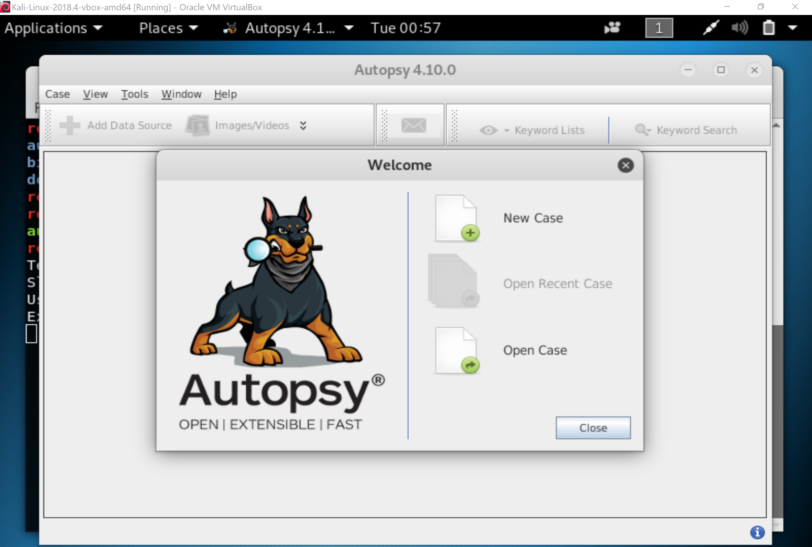

  4. Type the **Case Name**: `Pure-Gold-Credit-Union`.

  5. Type the **Base Directory**: `/root/casedata/`.

  6. For **Case Type**, select **Single-user**.

  7. Click **Next**.

  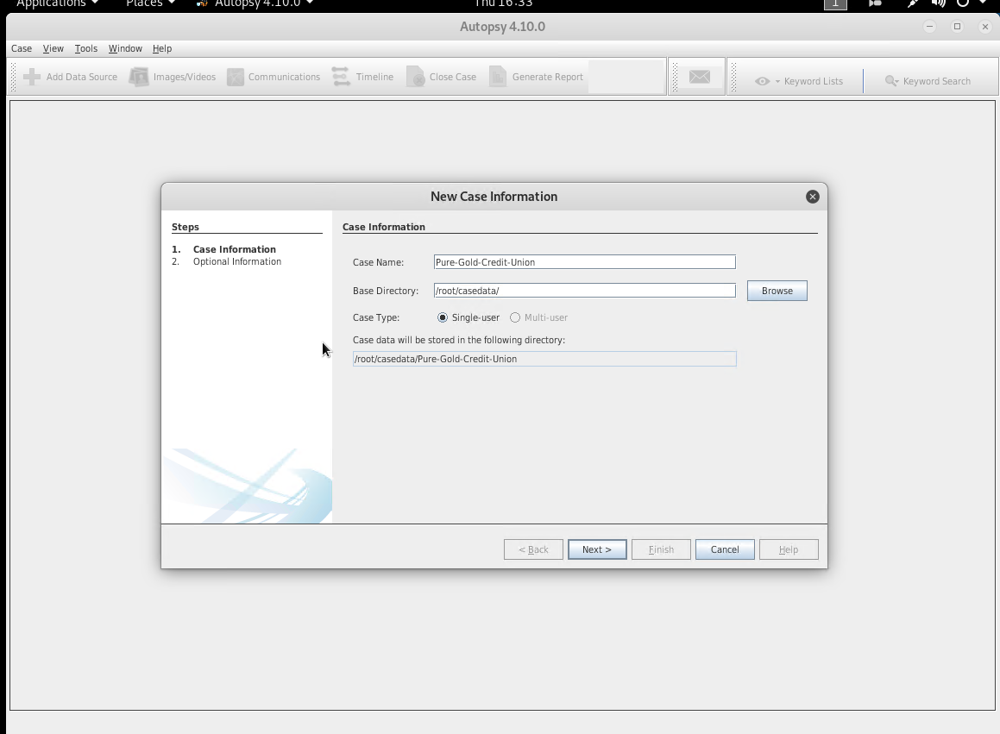

Next, enter optional information:

- Enter a **Case Number** relevant to your case. For this demo, we'll use `1EZ215-P`.

  - Case names and numbers help investigators keep track of the hundreds or thousands of cases that may be in the system.

- We'll leave the other optional information blank: **name**, **phone**, **email**, and **notes**.

- Select **Finish**.

Next, explain that we'll add the evidence file and configure ingest modules.

#### Step 2: Add an Image

1. Select **Logical Files**.

2. Click **Next**.

   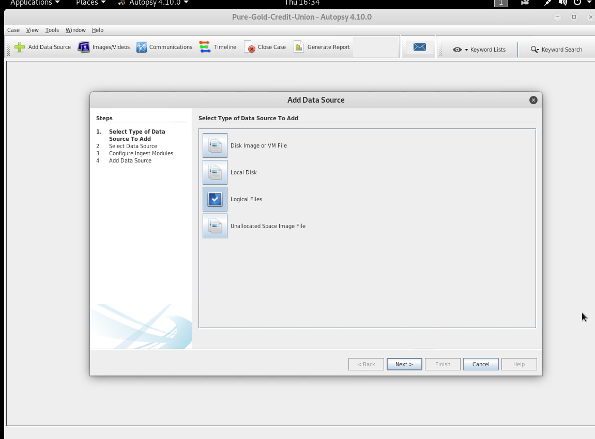

3. Leave the dropdown as "Local Files and Folders", then click "Add".

 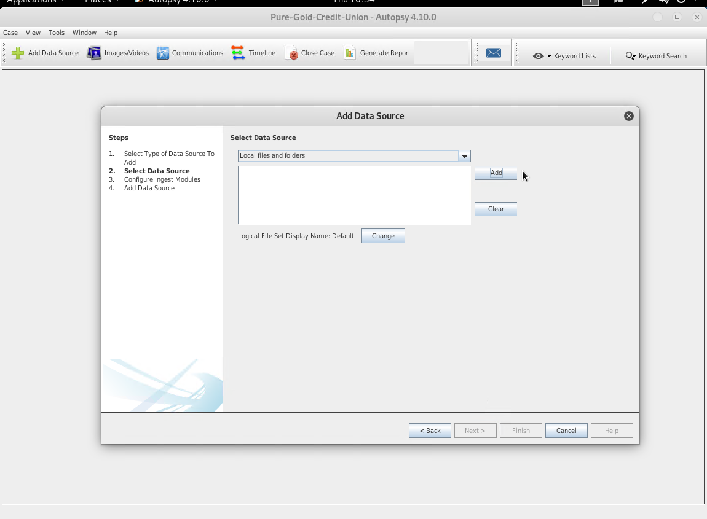

4. In the pop-up window, navigate to and select the directory named `PeteriPhoneImage`, and click **Select**.

  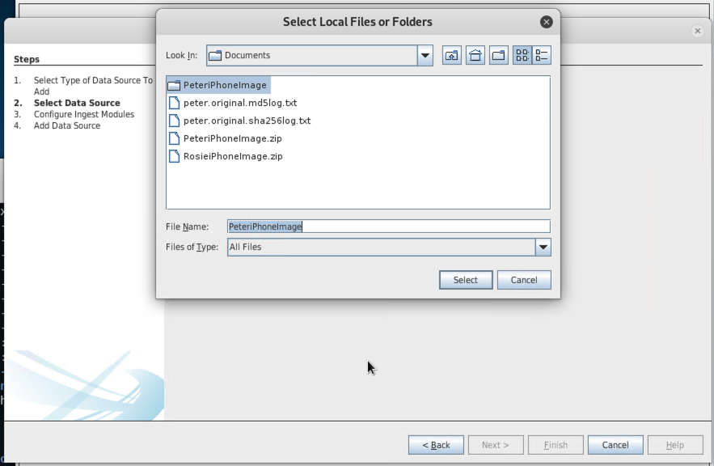

5. Click **Next** and then proceed to **Step 3**.

#### Step 3: Configure Ingest Modules

Remind students that ingest modules help label and categorize evidence during the ingestion process.

Explain that we'll need to ingest everything for this demonstration.

- Click **Select All**.

- Click **Keyword Search** and check all of the boxes.

Explain that there are two ingest modules that are particularly important: **Extension Mismatch Detector** and **Keyword Search**.

 - Extension Mismatch Detector uses the results from the File Type Identification and flags files that have an extension not traditionally associated with the file's detected type. In other words, it ignores "known" files.

 - Keyword Search is used to extract the maximum amount of data from the files being indexed.

     * The indexing will try to extract data from supported file formats, such as text files:

       * Phone numbers
       * IP addresses
       * Email addresses
       * URLs
       * Credit card numbers

    **Note:** The more items you select, the longer the ingest process will take.

 

- Ensure that the **Extension Manager** and **Keyword Search** boxes are checked and click **Next**.

#### Step 4: Ingest in Progress
 * Autopsy is now analyzing the image file. When this process is finished, the file is ready to be viewed and analyzed by the investigator.

The status is shown in the bottom-right corner of the window. You can click the progress bar to see the status.

 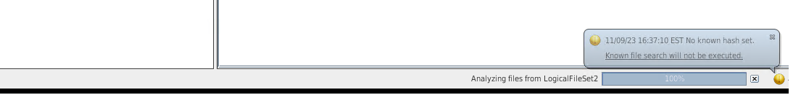
  
Dismiss class for break. When you return, the file should be analyzed and you will be able to continue to Step 5: Keyword Search.

[<- Back to Module Contents](#module-day-1-contents)

---

### 10. Break (0:15)

[<- Back to Module Contents](#module-day-1-contents)

---

### 11. Everybody Do: Autopsy Continued (0:15)

#### Step 5: Manual Analysis with Keyword Search

Explain that we can see the results of the Keyword Search ingest module as follows:

- Click on **Keyword Lists** in the upper-right portion of the toolbar.

  - Point out that we can see all of the categories that Autopsy discovered during the file ingest process, such as phone numbers, IP addresses, etc.

- In the dropdown, check **IP Addresses**.

- Click **Search**.

- Point out that Autopsy will highlight all of the IPs contained in the file for easy reference.

   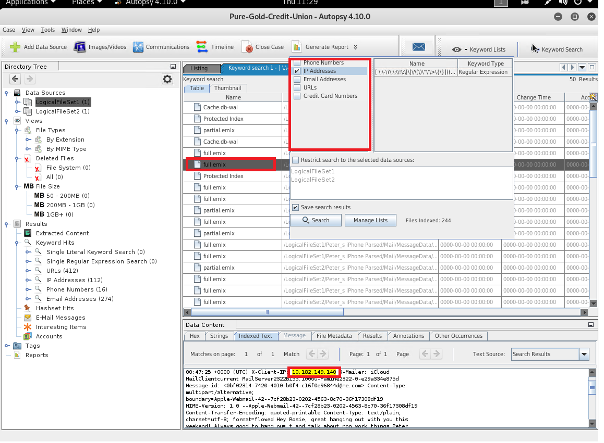

  - Ask students how IP address information can be used in this case.

    - Answer: IP addresses can reveal location information (GPS coordinates) in addition to identifying other networks or computer systems that were contacted and/or used to commit the crime.

#### Step 5b: Manual Analysis of SMS Messages

Explain that Autopsy provides us with a way to view and read SMS messages, but first we have to set up our database.

- Before we make changes, we need to close our case file.

 - In the top-left corner, click **Case**.

 - In the dropdown, click **Close Case**.

 - If the Welcome window appears, click **Close**.

- Click **Tools** on the top menu bar.

 - In the dropdown, select **Options**.

    

 - In the **Options** window, select **Central Repository**.

 - In the **Central Repository Database Configuration** window, place a check mark in the **Use a Central Repository** box, then click **Configure**.

   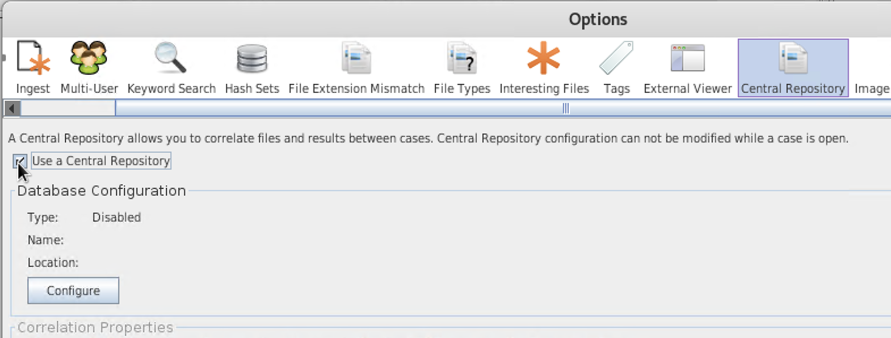

 - In the **Database Type** dropdown, select **SQLite** and click **OK**.

   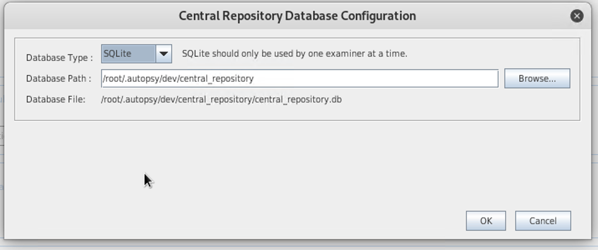

 - Click **Yes** in the **Database Does Not Exist** pop-up box, then click **OK**.

   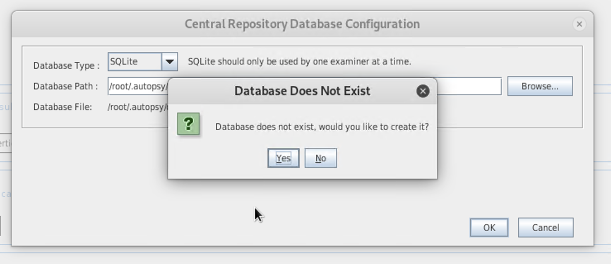

 - Reopen the recent case file by clicking **Case** in the upper-left corner, navigating to **Open Recent Case** and selecting `Pure-Gold-Credit-Union`.

 - Click the **Keywords Search** box in the upper-right corner.

   -  In the dropdown, enter `sms.db` and click **Search**.

  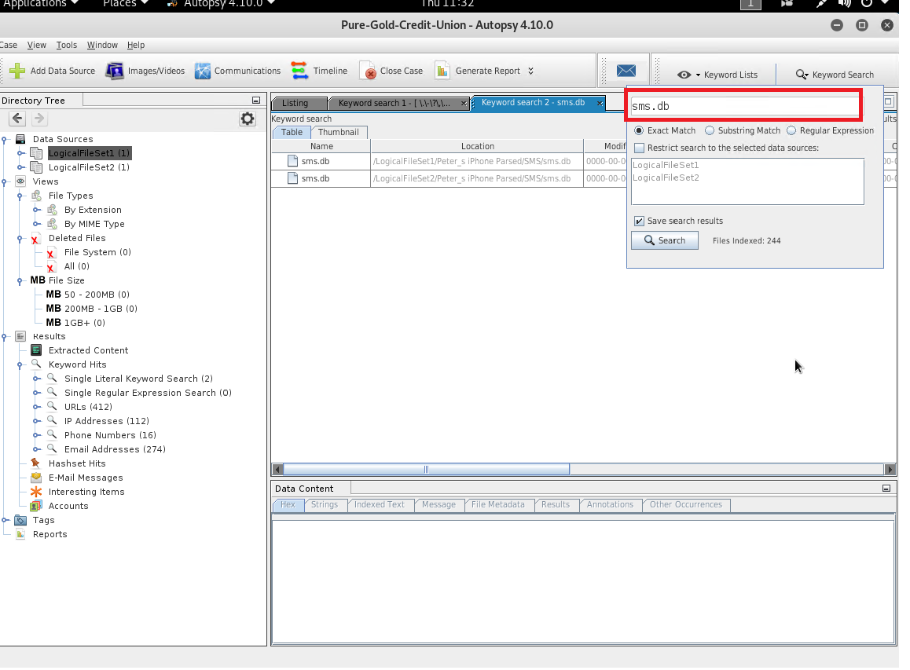

 - You should now see the `sms.db` file populated in the **Keyword Search** (the lower-right window pane) in the **Table** tab.

 - Click the `sms.db` file to highlight it.

   - You should now be able to read SMS messages in the **Data Content** window pane in the lower-right window inside the **Indexed Text** tab.

   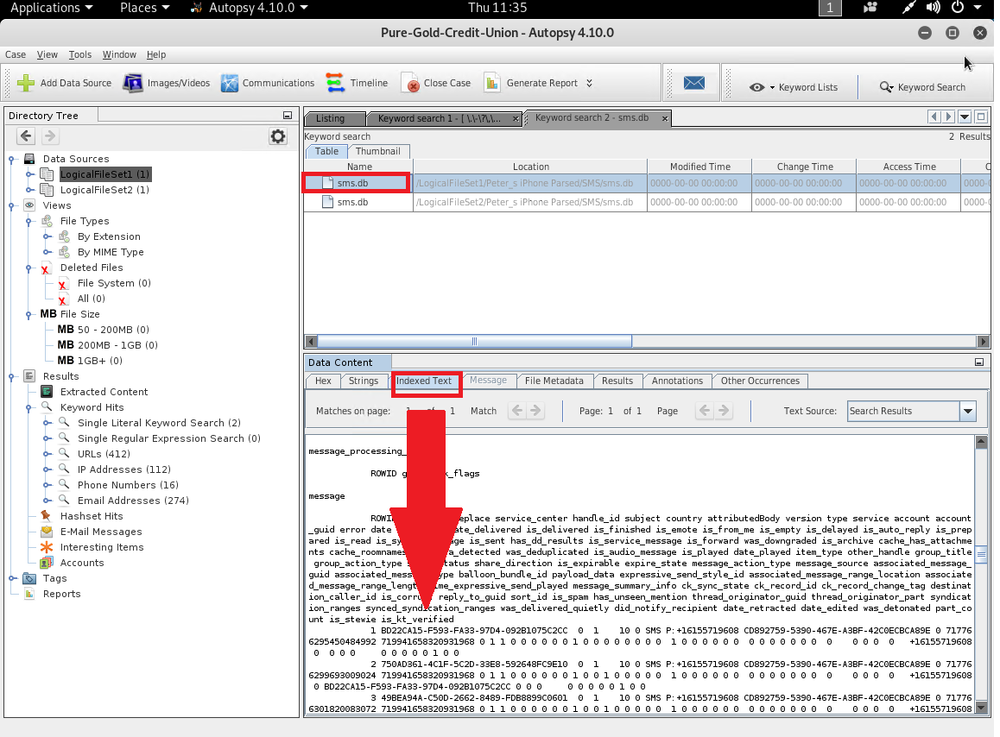

    - Ask the class: What types of information can SMS messages reveal?

      - Answer: SMS messages can implicate other individuals involved in the crime. They can also reveal the objective of the crime or the motives for committing it.

- Explain that in the next class, we will examine an iPhone image. We'll continue to learn about reporting in future classes.

[<- Back to Module Contents](#module-day-1-contents)

---

### 12. Instructor Do: Wrap-Up and Review (0:10)

Remind students that digital forensics relies on the expertise of examiners to analyze and interpret data retrieved by trusted forensics examination tools.

Summarize what was covered today:

- Although most forensic examiners have adopted the use of open-source tools, many of them may not know that they can perform a complete investigation using only open-source tools.

- Autopsy is an open-source, multi-platform, graphical tool that runs on Windows, Ubuntu, Kali Linux, and OS X platforms.

The steps we needed to complete for our first autopsy investigation were:

- Generate MD5 and SHA-256 hashes for the evidence in order to ensure the integrity of the evidence.

- Specify a case name and number to help investigators keep track of the files and their progress.

- Select the file type to be ingested, i.e., .zip, and specify a working directory where progress will be saved.

- Specify a standard time zone for the case.

- Configure ingest modules to help categorize, label, and organize data.

- Set up our central SQLite database repository to allow us to read SMS messages.

Congratulate students for a job well done starting the investigation!

In the next class, we'll continue our investigation using Autopsy to analyze artifacts on iPhone images.

[<- Back to Module Contents](#module-day-1-contents)

---

&copy; 2023 edX Boot Camps LLC. Confidential and Proprietary.   All Rights Reserved.
