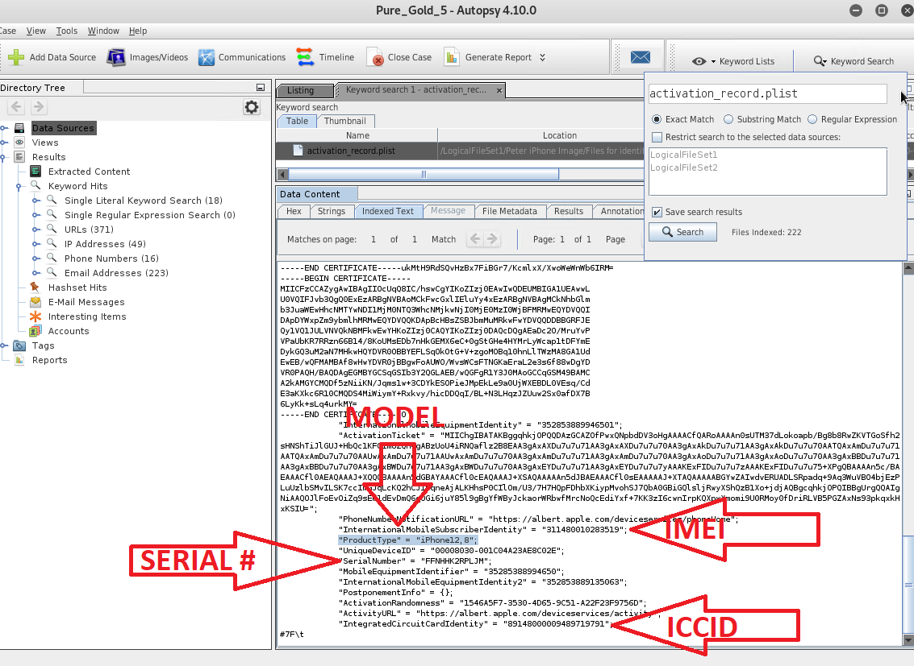

## Solution Guide: Mobile Forensics Evidence Analysis

In this activity, you practiced how to procure relevant case file data and established ownership of a device. 

---

- MD5 and SHA-265 hashes of the iPhone disk image: 

    - MD5 hash: `34c4888f095dc3241330462923f6fea5`
    
    - SHA-256 hash: `71aed05a86a753dec4ef4033ed7f52d6577ccb534ca0d1e83ffd27683e621607`
 
- Device information:  

  - Device model: iPhone 12,8
  
  - OS version #: iPhone OS 16.5.1
  
  - Device serial #: FFNHHK2RPLJM
 
  - Integrated Circuit Card ID (ICCID) number: `89148000009489700000`
  
   - International Mobile Equipment Identification (IMEI) number: `311480010283519`
 
  - Device host name: Peter's Phone

- Peter's information:
    - Peter's phone number: +16155719608
    
    - Peter's email addresses: peterbarnes12792@icloud.com

 ### Screen shots showing where to find the above

   

 

    

  
#### Bonus
 
 Research the two types of IDs below and identify how they are used to identify mobile devices:
 
  - IMEI number
 
    - From [IMEI.com](https://www.imei.info/news/your-imei-number-will-tell-you-everything-about-your-iphone/):

      - Each Apple product is associated with its own unique identification number, known as an International Mobile Station Equipment Identity IMEI.

      - It bears detailed information about the phone, such as its model, brand, production date, and the manufacturer`s site.

      - Apple recently stopped printing the unique IMEI numbers on the back of each device, but they are still easily accessible in the "About" section of an iPhone's general settings.

      - These numbers can be used by phone companies to match a particular device to phone networks, aiding in the identification of callers. 
  
  - ICCID
 
    - From  [hologram.io](https://hologram.io/blog/whats-an-iccid-number-and-why-does-it-matter-for-cellular-iot/):
 
       - The integrated circuit card ID (ICCID) is a unqiue 19- or 20-digit number printed on a SIM card used to identify the card. 
 

----
 
&copy; 2023 edX Boot Camps LLC. Confidential and Proprietary.   All Rights Reserved.

