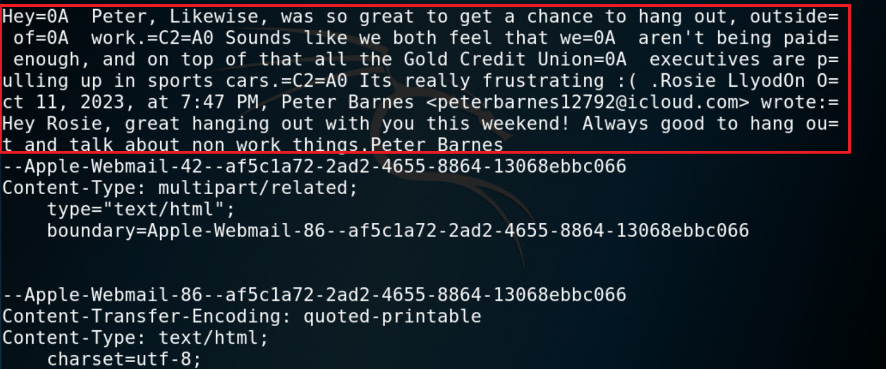

## Solution Guide: Peter's Email Evidence
 
In the interest of time, we will use this solution guide to examine a single email as an example of how to perform email forensic analysis.
 
 - These principles can be applied across all email files.
 
### Email Forensic Analysis
 
- Open a new terminal window.
 
- Navigate to the directory in Kali Linux that contains the `/Mail/MessageData` folder.

- Change into the drive `11`
 
- Open the email `full.emlx`.
  
  - In this file, we will notice several pieces of information that should be documented on your evidence worksheets.

    
 
----

2023 edX Boot Camps LLC. Confidential and Proprietary.   All Rights Reserved.
 