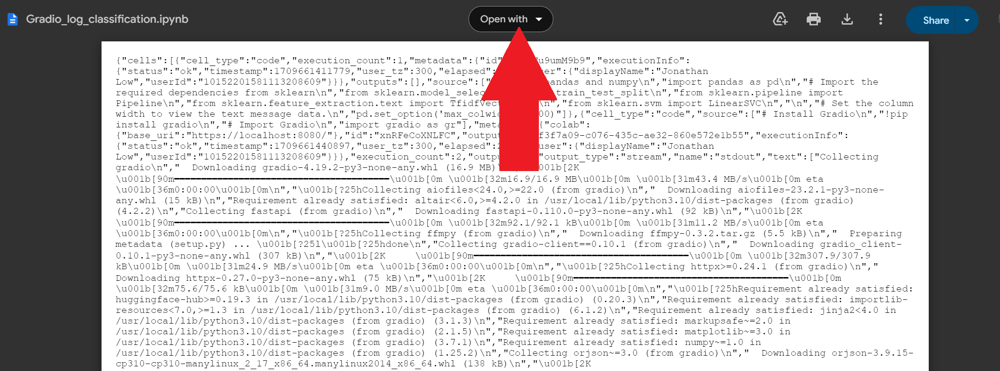

## Activity File: Defensive Security and Machine Learning

For this activity,  you will be using **Google Colaboratory** to see how ML can help security professionals find anomalies in logging activity.
- **Google Colaboratory** is a web-based program, which is designed to run **Jupyter Notebook files**.
   - **Jupyter Notebook files**, which have `.ipynb` extensions,  are known as interactive computing files.
   - In other words,  with Jupyter Notebook files, you can see pre-programmed commands, run them one at a time, and make adjustments if needed.
- You will be provided a pre-created **Jupyter Notebook file** , which uses ML to analyze logs to determine if they are anomalous.
- Complete the following three parts to complete this activity.

### Instructions

#### Part 1: Set up and Install Google Colaboratory

- Login to your gmail account and then click on the following link to access your Jupyter Notebook file: [Machine Learning Log Analyzer](https://drive.google.com/file/d/1mBpOp4ut_HPwTzu3QuHKrozTLwY_SNGu/view?usp=drive_link)
- Click on the `open with` on the top of the page:
  
  
  
  
- Click on `Connect More Apps`.

  
   
  
- Search for and select `Colaboratory`.
  
  

  
- Follow all the steps to install and sign-in to Colaboratory.

  
- Then, once it returns you to the original document, select to `open with Google Colaboratory`:
  
   

  #### Part 2: Running Google Colaboratory

- Google Colaboratory is designed to run the pre-created code from your Jupyter Notebook file.  The code is broken up into different sections, called **cells** and each **cell** need to be ran individually.
- To run each cell, simply click on the black play button on the left side of the screen.  Just be sure to wait until one completes before proceeding to the next cell.
- A green checkmark will appear on the left of the play button once the cell has completed.
- **Important:** On the 4th cell when prompted you will need to load the following [file](daily_logs.csv), so be sure to download this file.

**Explanations of Different Cells** 
  
- As you go through running the various cells, reference these images that explain what each cell is doing.

  

  

  

 #### Part 3: Checking Log records with your Gradio App

  - To check to see if a Logs Get request is identified as Anomalous or Okay, enter in the following GET request:
    - `GET /page14 HTTP/1.1 200 7890`

    

 - Continue to test out the following log records and note if the ML model finds them either "OKAY" or "ANOMALOUS":
   - `GET /image.jpg HTTP/1.1 200 45998`
   - `POST /submit_form HTTP/1.1 200 1992`
   - `POST /login HTTP/1.1 500 2875`
   - `GET /presentations/logstash-monitorama-2013/images/kibana-search.png HTTP/1.1" 200 203023 "http://semicomplete.com/presentations/logstash-monitorama-2013/`
   - `GET /blog/tags/" 500 14872` 
  

 © 2024 edX Boot Camps LLC. Confidential and Proprietary. All Rights Reserved.   

