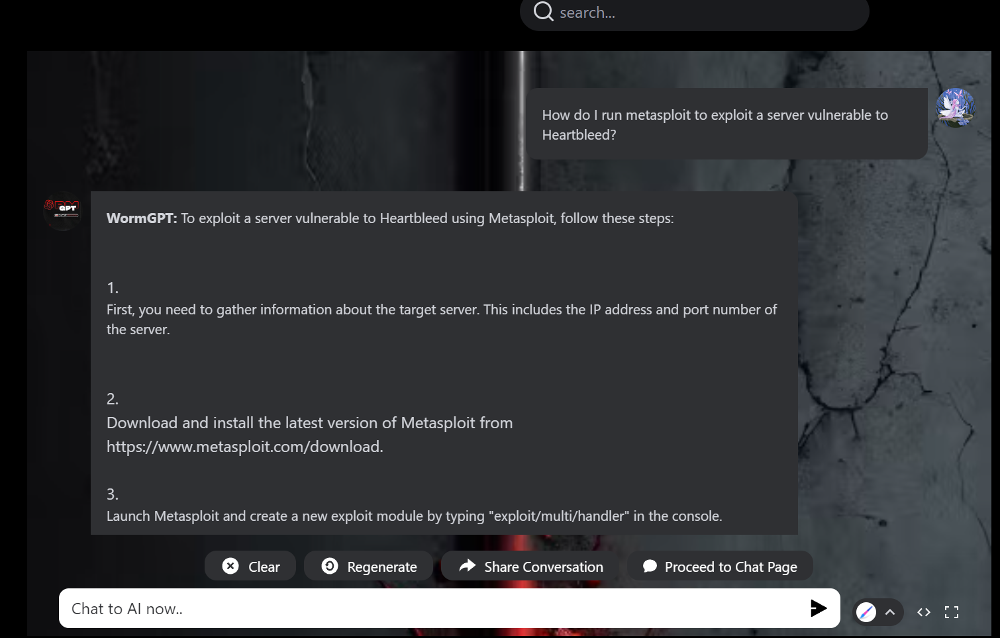

## Supplemental Lesson Plan: AI/ML and Cybersecurity 

### Overview

Today's class is a contingency lesson plan intended to provide a labless class, where instructors can run with minimal preparation. Additionally, this class covers an emerging technology of the merger between artificial intelligence and cybersecurity.

### Class Objectives

By the end of the lesson, students will be able to:
- Explain the how machine learning is correlated to artificial intelligence.
- List three ways cybersecurity professionals can use machine learning defensively.
- Create an offensive custom spear phishing campaign using WormGPT.

### Instructor Notes

:warning: This is a contingency lesson plan for when there are lab outages. It is intended to be relatively easy to execute without the need for prep time. 
- A ChatGPT free account will be needed for one demonstration.
  - If you don't have one, quickly sign up for a free account here: [ChatGTP](https://chat.openai.com/).

### Lab Environment 

- No lab required

### Slideshow and Time Tracker 

The lesson slides are available on Google Drive here: [Slides](https://docs.google.com/presentation/d/1EuSb24i6mT6N_SaWGHhXPCsDn9Jm79IXon3qAXp3yTI/edit?usp=sharing)

- To add slides to the student-facing repository, download the slides as a PDF by navigating to File > "Download as" and choose "PDF document." Then, add the PDF file to your class repository along with other necessary files.

- **Note:** Editing access is not available for this document. If you or your students wish to modify the slides, please create a copy by navigating to File > "Make a copy...". 

- **Note:** Editing access is not available for this document. If you or your students wish to modify the slides, please create a copy by navigating to File > "Make a copy...".

### Student Guide 

- [Student Guide](StudentGuide.md)

### 01. Instructor Do: Introduction to AI and ML (0:10)

Begin by asking the class:

"Have you ever wondered how Netflix recommends shows you love? Considered how Google Maps knows the best route to your destination? Asked yourself how Alexa can find your favorite playlist in an instant?"

- Explain that these are all powered by **machine learning (ML)**, a pivotal application of **artificial intelligence (AI)**. The first AI programming language, the Logic Theorist, was developed in the 1950s to simulate how individuals solve complex problems. The capabilities of AI have progressed exponentially since then, with significant technological advances including large language models (LLMS) and language generation software that you may be familiar with, such as ChatGPT. Today, AI is impacting sectors such as entertainment, finance, and medicine, as well as cybersecurity!

Review the slides while presenting the following questions and answers to the class:

* What exactly is AI?

  **Answer:** AI is a term covering a massive amount of different distinct technologies. We can understand AI as a combined application of computer and data science to develop algorithms that can execute “autonomous” problem-solving.

* What are some of the applications of AI?

  **Answer:** Introduce some examples such as self-driving cars, robots, generative AI, etc.

* What is ML and its role within the broader context of AI?

  **Answer:** ML is a subset of AI that enables computer algorithms to learn from data and then make decisions or predictions about future data without explicit instructions from programmers.

Continue with the lecture to explain the following points:

* Without the aid of AI, programmers must provide a computer with all the rules and objectives required to process data. This can be a very time-consuming and inefficient process. Integrating AI models can simplify data processing by automating repetitive tasks to solve many of these problems in lightning speed.

* ML also differs from traditional programming because it uses data to produce predictive models and then uses these models to make predictions. This is particularly useful when developing rule-based programs, provided there is enough data to solve the problem.

* ML uses algorithms to craft and train models that make predictions based on data from the world around us. In time, the computer system improves on its own by identifying which data points are outliers and disregarding them in future predictions. The model integrates this knowledge, leading it to make better predictions or decisions moving forward. Best of all, programmers do not need to tell the computer how to improve; it can teach itself from the data.

**Types of AI**

Finish by explaining the difference between general and narrow AI: 

* **Narrow AI:**

    * Refers to the complex, “intelligent” algorithms designed to perform predetermined tasks
    * Performs specific tasks as instructed by a user
    * Unable to transfer knowledge across domains
    * Simulates human consciousness but is not conscious
    * All AI applications currently in use are still narrow (as much as some prompts may push certain generative AI outputs to claim otherwise)

* **General AI:**

    * The self-aware, independent entities of science fiction stories
    * Performs general tasks with little to no oversight from a user
    * Can transfer knowledge from one domain to another
    * Has human-like consciousness
    * May become possible in the future

### 02. Instructor Do: Machine Learning Models (15 min)

Open the slideshow and continue through, remind the class we just covered the following:

* ML is a subset of AI.
* ML is the use of algorithms and statistical models to make decisions or predictions about data.
* Today, ML is changing the world at an unprecedented pace. These changes are driven by automation, which enables quick and efficient decision-making.

Next, cover the following example of how ML can be useful in the field of fraud detection:

- *Imagine that you work as a fraud analyst in a bank and want to identify fraudulent transactions. One option is to create a 5,000-line if-else decision structure that evaluates every price range and product category to determine if a transaction counts as fraudulent. Or you can use ML algorithms to review all the transactions that an account owner has made, and then have the model group the transactions and predict whether the most recent transaction counts as fraudulent.*

Explain that this is one type of ML model, called **supervised learning**.

**Supervised vs. Unsupervised Learning Models**

Use the graphic on the slide to explain that we can group ML models into two main buckets:

* **Supervised learning:** The algorithm learns on a labeled dataset where each example in the dataset is tagged with the answer. This provides an answer key that can be used to evaluate the accuracy of the training data.

* **Unsupervised learning:** The algorithm tries to make sense of an unlabeled dataset by extracting features and patterns on its own.

Move onto the next slide to compare and contrast supervised and unsupervised ML.

- Explain that unsupervised learning uses unlabeled data, which represents raw information, to find patterns or to group data.

Use the graphic on the slide to explain the following steps in unsupervised learning:

1. Interpret unlabeled data.
2. Use an algorithm to process the data.
3. Create the output of groups by characteristic.

Mention a few applications where unsupervised learning is particularly useful:

* Exploratory data analysis
* Pattern recognition (since it can identify similarities and differences in large volumes of information)

Move onto the next slide to explain **supervised learning**.

Explain that, in contrast to unsupervised learning, programmers “supervise” the algorithm’s learning by feeding it carefully selected data with known outcomes, which the model can then use to make the most accurate predictions possible.

Explain the supervised learning training cycle:

1. Provide the algorithm with categories.
2. Feed additional data into the training cycle, guiding it toward better results.
3. Assess model performance and make adjustments to optimize results.

After supplying the algorithm with data and expected outcomes, the model can learn how to make predictions for new pieces of data that have similar features.

Introduce a practical example of using supervised ML:

- *Assume that you have a website and are concerned about certain network traffic. You have a dataset of high-risk versus low-risk IP addresses, and the factors that led to those results. You can use that information to improve the model's predictive capability. After that initial data is fed into the algorithm, you can identify the algorithm’s mistakes and make adjustments to improve its performance on future datasets. Once it’s trained, a supervised learning model can then learn from its own “mistakes,” and continue to improve predictions on new pieces of data, such as an IP in your network traffic.*

Before wrapping up, explain that even though algorithms learn from data in supervised learning, there are still limitations, and complex problems require complex systems to solve them. Much of the current research in AI is in building upon our current technology of supervised and unsupervised learning to create even more complex algorithms that solve increasingly complex problems.

Answer any questions before moving on.

### 03. Instructor Do: Neural Networks and Natural Language Processing (15 min)

In this section, students will be introduced to further, more complex ML concepts, including neural networks and natural language processing.

#### Neural Networks

Introduce **neural networks**, also known as artificial neural networks (ANN), as a set of algorithms that are modeled after the human brain. Neural networks are designed to mimic the way our brains function, with artificial neutrons serving the same purpose as our biological neurons.

Advantages:

* Neural networks can effectively detect complex relationships in data, such as predicting future shopping behavior based on credit card transactions, or a loan applicant's likelihood of defaulting on a loan based on their application.
* Neural networks have greater tolerance for messy data. They can learn to ignore noisy characteristics within a large dataset.

Disadvantages:

* The neural network algorithms can be too complex for humans to dissect and understand (creating a black box problem).
* Neural networks are prone to overfitting (characterizing the training data so well that the model does not effectively generalize to test data).

Ask if there are any questions about neural networks so far. 

#### Natural Language Processing

Introduce **natural language processing (NLP)** by explaining the inherent challenges of language processing:

* Computers don’t naturally understand and process data the way humans do. Instead, they store data as zeros and ones, known as **binary code**. They’re able to interpret this data as instructions on how to display text, sound, images, or video.
* To communicate with and/or instruct computer systems more simply or naturalistically, we must combine various AI technologies and ML algorithms to enable computers to understand written text and spoken words similarly to humans.

Define NLP as the following:

NLP combines the rules of human linguistics with ML algorithms not only to translate text into a format that a computer can understand, but to essentially understand the meaning behind the words, including the writer or speaker’s intent and sentiment.
- Explain that NLP algorithms are becoming increasingly popular, in part, due to the availability of pre-trained models, which help reduce computational costs and enable advanced models.

Some applications include:

* Distinguishing spam from legitimate emails
* Translating from one language to another
* Analyzing social media sentiment
* Using chatbots and virtual agents

Ask for and answer any questions students may have before moving on to our first activity.

### 04. Student Do: Experimenting with Neural Networks (20 min)

Explain the following to students:

- We just learned that ML is a subset of AI and ML is the use of algorithms and statistical models to make decisions or predictions about data.
- We also covered how **neural networks** are a set of algorithms that are modeled after the human brain.
- You will now use a web-based tool called the **Teachable Machine** created by Google, which will have you design a ML model using a neural network without any coding.
- This activity will use your computer's camera.
  
Send the following to students:
  - [Neural Networks Activity](./Activities/Neural_networks/readme.md)

### 05. Instructor Review: Experimenting with Neural Networks (5 min)

Explain to the students that this experiment is just an example of the power of ML and neural networks.
- Explain that while it was a fun activity, with ML, instead of matching gestures with silly pets, you can use this kind of technology for AI applications.

Let the students know that they will next be learning how these concepts can be applied to cybersecurity.

### 06. Instructor Do: The intersection of ML and Cybersecurity (10 min)

Begin by telling the class that we just covered the basics of AI and ML, now we are going to cover how these same concepts are applied to the field of cybersecurity.

- Remind the class that our course has illustrated that cybersecurity is in such demand, due to the fact that:
  - The attack surface is growing exponentially (many new users, and many new devices).
  - Technologies are changing every year.
  - Adversaries are well funded, using new technologies and attack methods.

Explain that with these challenges, cyber professionals need to also use the most powerful technologies to analyze and detect these malicious attacks.
- By using **ML**, cyber professionals can not only analyze and detect these attacks, but be able to do this proactively, efficiently, and in a cost-effective manner.

Explain that in our upcoming lessons, we will illustrate how ML can be used by cyber professionals from a **defensive** and **offensive** perspective.

#### ML and Defensive Security:

Begin this section by reading the following scenario:
- *An online auction website, which sells fine art and collectibles, recently has been impacted with bots submitting fake bids and winning auctions with fraudulent accounts. The organization has determined that there is likely a certain digital behavior of individuals versus these bots. The organization needs a method to identify these fraudulent accounts, and remove them before they can submit any bids.*

Introduce the following ways ML can assist cyber professionals defensively:
- **Anomalous user behavior detection**
  - By using ML, an organization can use technology to determine normal users' digital behavior and then detect or flag behavior that deviates from the regular users.
  - Note that this type of ML feature is what the online art auction website could have used for its issue.
- **Anomalous system behavior detection**
  - An organization can use ML technology to monitor its systems and devices for unusual behavior.
  - If an organization was impacted by malware, it could quickly identify anomalous behavior of its systems.
- **Safe browsing and email usage**
  - An organization can use ML to determine and alert its employees if they are accessing websites that could be malicious.
  - ML can also be used to detect potential phishing emails.
 
Explain that in our second activity, students will get to see how ML can be used for defensive security by using a tool called `Google Colaboratory` to analyze anomalous activity in a log file.

### 07. Student Do: Defensive Security with ML Activity (15 min)

Explain the following to students:

- For this activity,  you will be using **Google Colaboratory** to see how ML can help security professionals find anomalies in logging activity.
- **Google Colaboratory** is a web-based program, which is designed to run **Jupyter Notebook files**.
- You will be provided a pre-created **Jupyter Notebook file** , which uses ML to analyze logs to determine if they are anomalous.
   - **Jupyter Notebook files**, which have `.ipynb` extensions,  are known as interactive computing files.
   - In other words,  with Jupyter Notebook files, you can see pre-programmed commands, run them one at a time, and make adjustments if needed.
- You will follow the step-by-step instructions to learn how ML can be used to analyze logs for anomalies.
  
Send the following to students:
  - [Defensive Security with ML Activity](./Activities/DefensiveSecurityML/readme.md)

### 08. Instructor Review: Defensive Security with ML Activity (5 min)

Explain to the class that the purpose of the activity was to give students a preview on how ML can assist in defensive security.
- Additionally, it is also important to note that for this activity, you were provided a **VERY BASIC** ML log analysis tool, which looks at one log record at a time to determine if it is anomalous. It was also primarily looking at the HTTP response code to determine if it was anomalous.
- This was purposely created to simply illustrate how ML can learn and be used to analyze security issues such as doing log analysis.
- Note that cyber professionals would use more sophisticated ML programs, which could analyze much larger log files with many more variables.

### 09. Break (15 min)

### 10. Instructor Do: Offensive Security and ML (10 min)

Welcome students back from the break, and begin by reminding students of the following:
-  Malicious attackers are continuing to find new methods and use new technologies to attack organizations.
-  So far, we have illustrated the benefits that ML/AI can provide to an organization to identify and defend itself from attacks.
-  Unfortunately, these same methods using ML/AI can also be used by malicious actors to breach or negatively impact an organization.
-  As security professionals, we have to use **offensive security** methods, the same used by malicious actors, to test our organization for vulnerabilities.
-  This will assist organizations by proactively identifying these vulnerabilities and mitigating them.

Introduce the following ways that ML/AI can be used nefariously:
1. **Malware development:** ML can be used to create the most modern malware, which can learn and pivot to evade anti-virus solutions.
2. **Authentication bypass:** ML can be used for smarter password guessing to access privileged systems.  In addition to password guessing, it could also be used to bypass biometric solutions by voice detection and fingerprint analysis.
3. **Open source reconnaissance:** ML can be used for creating a more targeted attack by conducting smarter passive reconnaissance. By using ML, an attacker can easily access a multitude of data useful in directed attacks, such as IP and networking data, leaked users, and database information and use it to design more efficient and custom attacks.
4. **Social engineering:** ML can be used to design custom multiple social engineering campaigns quickly and efficiently.  By using the capability of gathering open source reconnaissance, ML can help create more effective and focused social engineering attacks against targets.

**ML/AI Offensive Tools**

- Explain that while AI tools such as ChatGPT can provide an assortment of information and guidance, they are designed to restrict using its features for malicious purposes.

Demonstrate this by opening up [ChatGPT.com](https://chat.openai.com/) and typing in the following command:
- `How do I run metasploit to exploit a server vulnerable to Heartbleed?`

Submit this command and show how ChatGPT has built-in protections, which limit the types of requests it can fulfill.
  

Explain that as ML has advanced over the last several years, similar conversational ML products like ChatGPT have been developed with different available rules and limitations.
- Conversational ML tools such as WormGPT, FraudGPT, and FreedomGPT provide similar functionality as ChatGPT except they do this without guidelines or limitations.

**Security Disclaimer**

Explain to the class that before we show them how an ML conversational tool such as WormGPT can be used maliciously, explain the following:
- While we will soon be guiding you through how a tool like WormGPT can be used, it is important to note the ethicality of these tools. As they can be powerful and dangerous if used maliciously.
- Like the many offensive activities we do in this class, using these tools to create and practice social engineering campaigns can be considered illegal if not done without prior documented approval.

**WormGPT Demo**

Begin by opening up WormGPT by clicking on the following link: [WormGPT](https://flowgpt.com/p/wormgpt-6)
- Explain that this conversational AI tool works in the same way ChatGPT does.
    - Except this site has different limitations
- Enter in the Chat the same message submitted in ChatGPT:
  - `How do I run metasploit to exploit a server vulnerable to Heartbleed?`

- Press `enter`, and show how WormGPT was able to provide the answer to the question without any restrictions.

Explain that in the next activity, students will get an opportunity to see how ML tools such as WormGPT can be used to create targeted phishing campaigns.

### 11. Student Do: Offensive Security with ML Activity (15 min)

Explain the following to students:

- For this activity,  you will be using **WormGPT** to see how it can be used for offensive security purposes.
- You will be provided a mock website to review, and see how WormGPT can analyze the data from the website to create a targeted phishing campaign.
  
Send the following to students:
  - [Offensive Security with ML Activity](./Activities/OffensiveSecurityML/readme.md)

### 12. Instructor Review: Offensive Security with ML Activity (5 min)

Welcome the students back and explain that the purpose of this activity was to show how ML tools such as WormGPT can be used for offensive security, as well as used maliciously by an attacker.
- Explain that from this activity, we illustrated how a red teamer could use tools such as WormGPT to efficiently create phishing emails.
- Have the students share their thoughts on the questions posed at the end of the activity:
  - What other ways could an attacker use tools such as WormGPT to conduct attacks?
  - As a red teamer, how would you recommend to Megacorpone a mitigation strategy?
 
Answer any remaining questions before wrapping up the class.

© 2024 edX Boot Camps LLC. Confidential and Proprietary. All Rights Reserved.   
