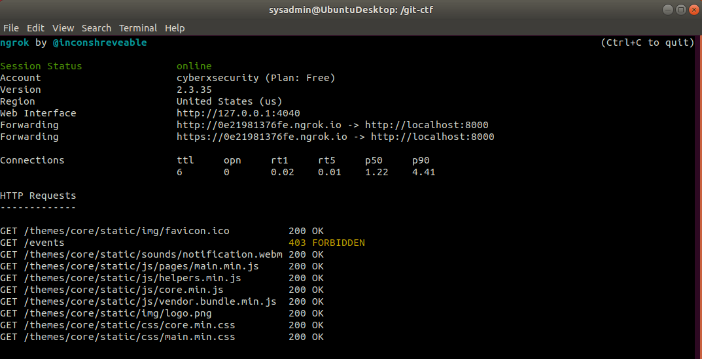
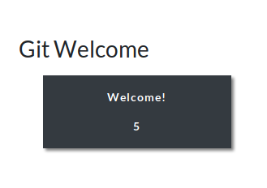

## Lesson Plan: Git Capture the Flag

Once students learned the Linux command line, this lesson plan can be used as supplemental material at any point in class. 

All of the resources for this CTF can be found on the Ubuntu machine under the `/git-ctf` directory. Inside this directory, you will find a back-end directory, a `git-ctf.sh` script and a markdown copy of all the CTF questions.

### Ways to Play

**Note:** The set up of this CTF is different from the previous CTF activities in the curriculum. There are three ways students can play this capture the flag: 

**Option 1 - Instructor-Hosted** (Recommended): The instructor launches the CTF using the `git-ctf.sh` script and hosts the CTF on their laptop. They will use the `ngrok` option (provided in the git-ctf.sh script) to expose the CTF to the web. 

  - Students connect to a url provided by ngrok in order to access the CTF site. They will create a login and then play the game. 
  - Students ignore the `git-ctf.sh` script and the `git-ctf.md` file. They will only need to use the back-end repo to answer questions.

**Option 2 - Local Docker Containers**: If the instructor does not wish to host the game on their machine, each student can use the `git-ctf.sh` script to run the docker container locally.
  - Students run the `git-ctf.sh` script and choose not to expose the game to the web.
  - The CTF site runs locally at `localhost:8000` on each student's VM.
  - Since each student is running a local copy of the same game, they would not be able to see each other's scores.
  - Final scores can be collected via Slack or by the TAs.

**Option 3: - Markdown File**: In the event that neither of the first two options are viable, students  can use the `git-ctf.md` file to play the game manually. 

  - This markdown file contains all of the questions from the game without answers or hints.
  - The instructor and TAs can decide what answers they would or would not accept for each question.

### Assets

#### CTFd

**The CTFd website**, which offers hints and scoring, is run from the `CTFd` docker container. 

- This container can either be run locally on the instructor's VM or on each student's VM. 

- If the instructor decides to run the CTF, there is an option to expose the CTF to the web when you run `./git-ctf.sh`.

- Once students have accessed the site, they need to create an account on the site by entering their name, email and a password.

- After they are logged in, they will be begin the CTF question.

#### Back-end directory

**The back-end directory** is a git repository present on the Ubuntu machine. It will not need to be cloned during the CTF. 

-  Questions will be answered by either running commands inside this directory or by reviewing documentation. Questions that require documentation review will provide the link to that documentation.   

- Answers that are commands will only need to be run within the git repo if specifically stated. 

#### git-ctf.sh Script

**`git-ctf.sh`** is a script used to control a `ctfd` docker container. Once the container is running, the entire CTF will be ready and hosted at `localhost:8000`.

- Students only need to visit the website and create an account to login.

- If students are completing the CTF locally, they will not be able to see each other's score because they are essentially each running a copy of the same website.

This script has four options:

- **Start CTFd**:  The first time it's started, the docker container will be downloaded. Then after which, the existing container will just be restarted.
    - Each time the container is started, you will have the option to expose the container to the web. This is only necessary if the instructor is going to host the game.

- **Stop CTFd** checks to see if the container is running and then stops it if it is.

- **Remove CTFd** deletes the container and the image in the case that something is wrong. 
    - Just run the script again and choose the 'Start CTFd' option to re-download.

- **Exit** This option quits the script.

### ngrok

The `ngrok` option Instructors will be used to expose the CTF to the web. If the `ngrok` option is chosen, it will remain open in the command line until it is quit with `Ctrl C`. 

- After `ngrok` quits, the script will continue and automatically stop the `CTFd` container.

- The ngrok command that is being run under the hood is `ngrok http admin:cybersecurity 8000`. There isn't any password or encryption needed to access the CTFd site. However, the site is being run inside a container within a VM that should sufficiently distance it from the instructor's personal laptop. As well, ngrok provides special links that must be used to access the site.

---

### Instructor Do: Begin the CTF

Begin the activity using the instructions specific to whichever option you choose. 

#### Option 1: Instructor runs the CTF from the Ubuntu VM.

 
 Click to view Option 1 instructions. 

 

In this potion, the instructor launches the CTF using the `git-ctf.sh` script and hosts the CTF on their machine. They will use the `ngrok` option (provided in the git-ctf.sh script) to expose the CTF to the web. 

1. Log into the VM and navigate to `/git-ctf/`. 

2. Locate the `git-ctf.sh` script and run it using `sudo`.

    - Choose the option to start CTFd.

    - When the option asks to expose the container to the web, enter `y` to continue.

3.  Ngrok will open and provide you with two URLs marked with `forwarding`. Confirm that the site is loaded by visiting one of those URLs or visiting `localhost:8000`.

     

    - Ngrok should require a password before the site loads. However, this behavior is inconsistent and sometimes a password is not required and the site loads immediately.

    - If Ngrok requires credentials to load the site, they will be `admin:cybersecurity`.

4. Send students the URLs. They will use them to connect to the CTFd site.  

    - After the site loads, students will be presented with the following screen:

      

    - They will need to register a new account on the site. 

    - Point out the **Register** button in the top right corner.

      

    - Students will need to enter an name, email and password. Explain that the email only needs to be in an email format. It doesn't need to be a valid email.

      

    - After students register, they can begin the CTF with the first 'Welcome' item.

      

5. As items are completed, more items will appear until a **Complete** item appears at the end of the game.

Explain to students that the entire game will be played within the `/git-ctf/back-end/` directory. They can ignore the `/git-ctf/git-ctf.sh` script.

#### Option 2: Students each run the CTF locally on their Ubuntu VM.

 Click to view Option 2 instructions. 

 

In this option, students will use a script to run the CTFd website on their VMs.

Send the following instructions to students:

1. Run the `/git-ctf/git-ctf.sh` script and choose Option 1 to start CTFd.

   - When the script asks if you would like to expose CTFd to the web, choose the `n` option.

   - If you accidentally choose `y` and started `ngrok`, press `CTRL-C` to stop ngrok and shutdown the script. Then, run the script again, and choose `n`.

2. Once the script reports that the site is up and running, navigate to `localhost:8000` and start playing the game. 

    - After the site loads, you will be presented with the following screen:

      

    - Register a new account by clicking the button on the right corner. 

      

    - Enter a name, email and password. The email doesn't need to be vail. It only needs to be the proper email format (example@email.com). 

     

3. Once you are registered, you can begin. 

#### Scoring

Since scoring is not automated in the option, the easiest way to keep score is for students to send their final score over Slack. 

Instructors can also set up online scoring by using the [Keep the Score](https://keepthescore.co/new/) website.

1. Go to the website and complete the following fields.
 
  - **Title**: Choose a name for your class, or you can call it the "Networking CTF". 
 
  - Specify the number of students participating.
 
  - Leave the other values as they are.

2. Select **Next**.
  
    
  
   - Enter the student names.

   - Select **Next**.
  
     
   
   - On the next page, select **Add Scores**.
  
     
  

3.  Send students the link and instruct them to open it on their machines.   

   - 

4. Explain to the class that they will each update their own scores.

   - They will select the +1 or +10 to adjust their scores to reflect the scores on their CTF. 

5. You can  displaying the scoreboard by doing the following: 

    - Click **Back**.
   
    - Click **Publish** on the bottom of the screen.
   
    - Select **View** in the leader board. 
    
     
       
 
     
    
Ask the students if they have any questions on the scoring before we begin the CTF.

#### Option 3: Students play the CTF from a spreadsheet.

If the website is not a viable option for the class, this entire CTF has been adapted to a spreadsheet:

- [Git CTF](1-Lesson-Plans/XX-Contingency/Git_CTF.xlsx)

While the process is fairly straightforward when referencing the document, provide an overview of how to complete the CTF. 
  

  
  - Once students figure out an answer (find the flag), they will place it in the **Flag** column.

  - Sll text answers must be **typed in lowercase (and without commas in numbers)** for the spreadsheet to properly process them.
  
  - The **flag value** column indicates how many points each flag is worth. 

  - If the student gets the flag right, they will automatically be assigned the points and the field color will change to green.

Explain that total points will be automatically calculated and displayed at the top of the spreadsheet.
  
  
   
Cover the following rules of the CTF:

- Students are allowed to use all class notes, slides, and online materials to solve the challenges.

- Flags do not need to be answered in any specific order. If a student is stuck on a question, they should move on to the next one.

#### Scoring

Since scoring is not automated in the option, the easiest way to keep score is for students to send their final score over Slack. 

Instructors can also set up online scoring by using the [Keep the Score](https://keepthescore.co/new/) website.

1. Go to the website and complete the following fields.
 
  - **Title**: Choose a name for your class, or you can call it the "Networking CTF". 
 
  - Specify the number of students participating.
 
  - Leave the other values as they are.

2. Select **Next**.
  
    
  
   - Enter the student names.

   - Select **Next**.
  
     
   
   - On the next page, select **Add Scores**.
  
     
  

3.  Send students the link and instruct them to open it on their machines.   

   - 

4. Explain to the class that they will each update their own scores.

   - They will select the +1 or +10 to adjust their scores to reflect the scores on their CTF. 

5. You can  displaying the scoreboard by doing the following: 

    - Click **Back**.
   
    - Click **Publish** on the bottom of the screen.
   
    - Select **View** in the leader board. 
    
     
       
 
     
    
Ask the students if they have any questions on the scoring before we begin the CTF.

---

### Wrap-up

#### Options 1 and 2

When students are finished with the CTF, stop the CTFd container and shut down the VM. 

Make sure ngrok is stopped by using `CTRL - C` in the terminal window.

#### Option 3

Students only need to report their scores before turning off their VM.

Congratulate students on finishing this Git CTF.

---

© 2022 edX Boot Camps LLC. Confidential and Proprietary. All Rights Reserved.
