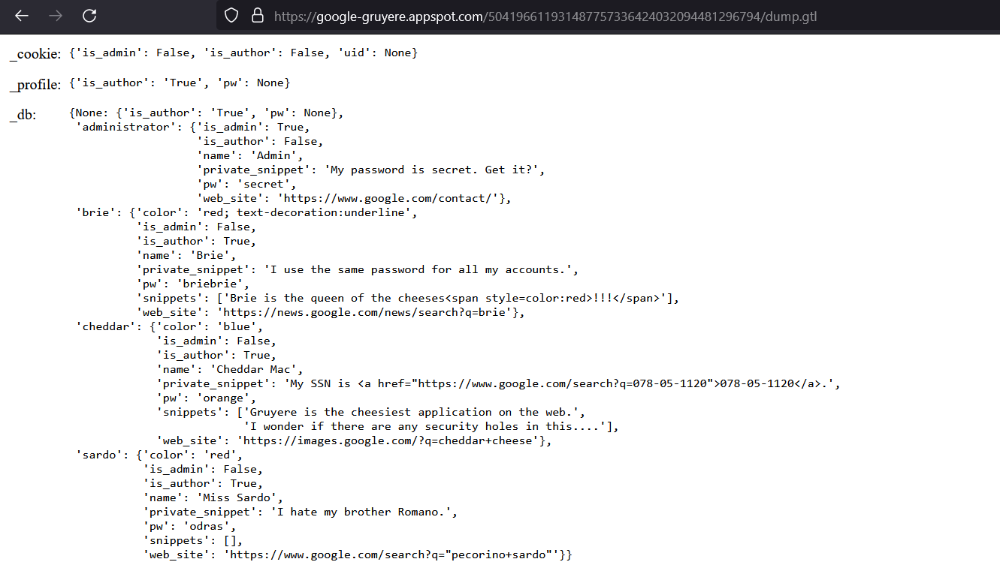

## Solution File: Information Disclosure

In this activity, you reviewed the Google Gruyere web site for any information disclosure vulnerabilities.

---

1. There are several findings; however, the most interesting findings is that you can use the debug dump page dump.gtl to display the contents of the database via the following URL:

https://google-gruyere.appspot.com/YOURNUMBERHERE/dump.gtl

Which exposes the admin and other users' passwords. 

------------

© 2024 edX Boot Camps LLC. Confidential and Proprietary. All Rights Reserved.
