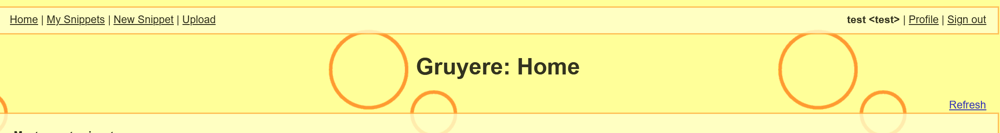
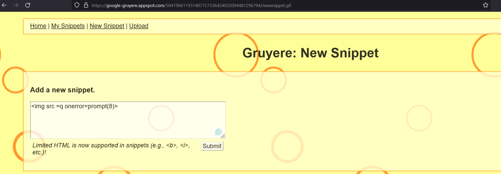
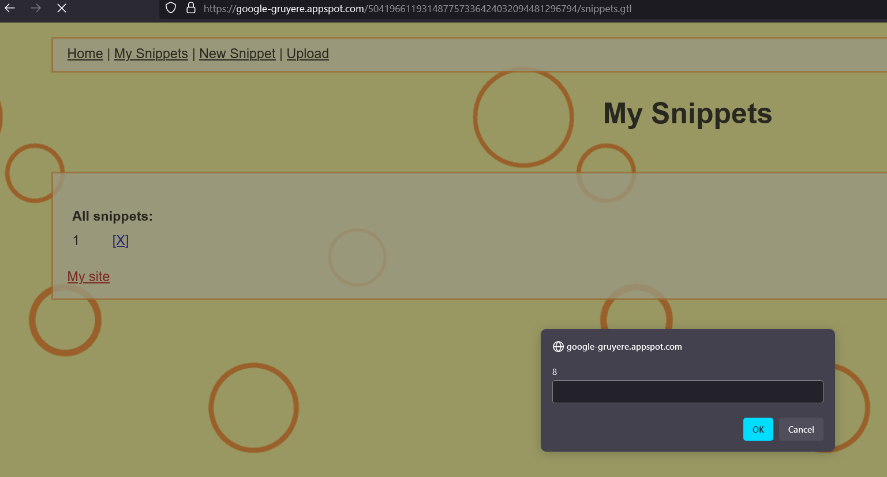

## Solution File: Stored XSS

In this activity, you reviewed the Google Gruyere web site for any stored XSS vulnerabilities.

---

1. The first step is to create an account and login with it, which shows a new toolbar available at the top of the site.

2. After some basic enumeration, you should find that under 'New Snippet' is an input box. This is where you can submit the payload.

3. After submitting and going to the 'My Snippets' page, the XSS payload will execute.

------------

© 2024 edX Boot Camps LLC. Confidential and Proprietary. All Rights Reserved.
