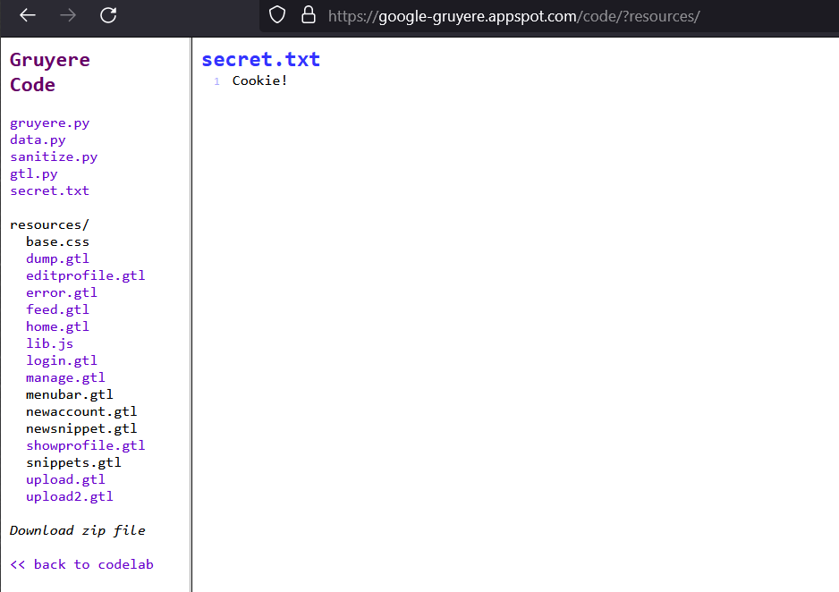
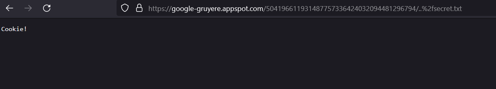

## Solution File: Directory Traversal

In this activity, you reviewed the Google Gruyere web site for any directory traversal vulnerabilities.

---

1. We know that 'secret.txt' is a web page based on our information disclosure activity. However, hypothetically, if we were not able to view the page through /code we could do it via directory traversal. 

2. By appending ..%2fsecret.txt, we can see the web page. 

If ../secret.txt didn't work, it's because your browser automatically shortended the URL by removing the extra '/', hence the need for '..%2f'.

------------

© 2024 edX Boot Camps LLC. Confidential and Proprietary. All Rights Reserved.
