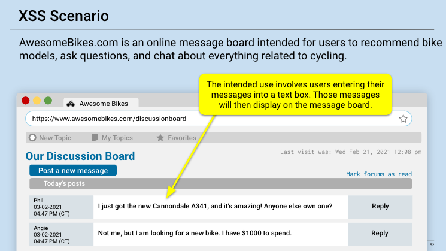
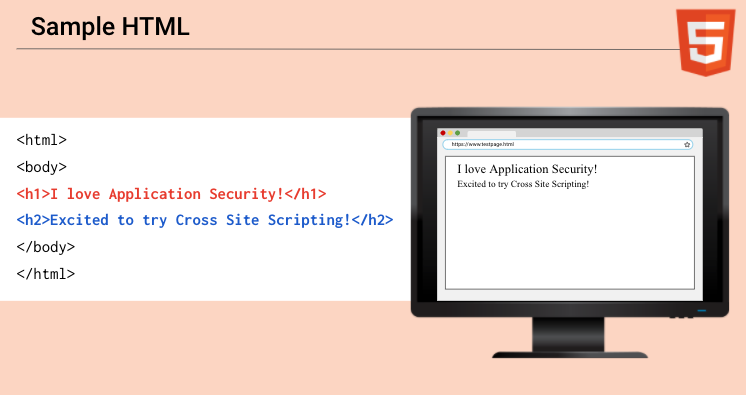

## 15.1 Lesson Plan: Web Application Penetration Testing

### Class Overview

Google Gruyere is a web application that Google has created specifically for teaching and testing web security. It's designed to be full of holes and vulnerabilities, making it a perfect tool for learning about web application security. For this lesson plan, we will focus on a few common vulnerabilities. The goal is to understand how these vulnerabilities can be exploited and how to mitigate them. 

#### Class Objectives

By the end of today's class, students should be able to:

- Understand what cross-site scripting is and the different types
- Learn what a directory traversal is and how it can be used for privilege escalation or initial access
- Perform a basic web app penetration test against a web site.

### Lab environment: Google Gruyere

Google Gruyere is a web application created by Google to educate individuals about security vulnerabilities in web applications in a safe and legal environment. It's named after the cheese with lots of holes, symbolizing the intentional vulnerabilities embedded within the app for educational purposes. The application is designed to be full of security bugs that we can exploit to understand how vulnerabilities can be identified and exploited, and more importantly, how they can be fixed.

**Legal Aspects of Pentesting with Google Gruyere**

The legality of penetration testing with Google Gruyere comes down to authorization. Google Gruyere is explicitly designed and authorized by Google for security training, making it legal for students to pentest it. Unlike unauthorized hacking, which is illegal and unethical, using Gruyere for educational purposes is encouraged as part of a learning process.

Google provides specific guidelines and limitations on how Gruyere should be used, and as long as these guidelines are followed, students can legally exploit the application to learn about web application security. This legal framework ensures that learners can practice penetration testing skills without the risk of legal repercussions.


### 01. Enumeration & Information Disclosure Vulnerabilities

Explain to students that information disclosure vulnerabilities occur when a web application or system inadvertently exposes sensitive information to users or attackers that should not normally be accessible. This information can range from technical details about the software and its environment, to user data, system files, or credentials. Such vulnerabilities are considered a security risk because they can provide attackers with the insights needed to craft more targeted and effective attacks.

Some types of information disclosures that could be useful to an adversary include:

- **Error Messages:** Verbose error messages that include stack traces, database dumps, or code snippets can reveal details about the back-end technology stack, database schema, or internal workings of an application.
  
- **Misconfigured Servers:** Web servers, databases, or application servers might be incorrectly configured to expose files, directories, or administrative interfaces to the public internet.
  
- **Insecure Storage and Transmission:** Failing to properly secure stored or transmitted data can lead to accidental disclosure. For example, sending sensitive information over unencrypted connections.
  
- **Comments in Source Code:** Developers might leave comments in web pages’ source code that contain sensitive information intended for debugging or note-taking but forgotten to be removed before going live.

Information disclosure vulnerabilities sometimes can be devastating and lead to a complete compromise of the web application. Describe to students the potential impact of information disclosure vulnerabilities:

- **Aiding Attackers:** By revealing system details, information disclosure vulnerabilities help attackers in understanding the environment they are targeting, making it easier to exploit other vulnerabilities.
  
- **Bypassing Authentication:** Exposed details about authentication mechanisms or cryptographic keys can lead to bypassing authentication or decryption of sensitive data.
  
- **Reputation and Trust:** Any loss of sensitive data can harm an organization’s reputation and erode user trust, potentially leading to legal consequences and financial loss.

- **Gathering Information:** Attackers can use disclosed information to learn about the technologies used in the application, versions, and configurations. This is often the first step in a targeted attack.
   
- **Identifying Vulnerabilities:** With knowledge about specific versions of software, attackers can look for known vulnerabilities or exploits tailored to those systems.
   
- **Crafting Targeted Attacks:** Using the gathered information, attackers can craft targeted phishing attacks, exploit known vulnerabilities, or even deduce business logic to manipulate the application.
   
- **Privilege Escalation:** Information about internal network structures or user privileges can be used to attempt privilege escalation, gaining unauthorized access to protected areas of the application or network.

#### Mitigation Strategies

There are several things a developer can do to prevent disclosure vulnerabilities from being used by an adversary. Some of these things are:

- **Minimize Error Information:** Customize error messages to avoid disclosing details about the underlying infrastructure or software. Only show generic error messages to users.
  
- **Secure Configuration:** Regularly audit and update configurations for all software and servers to minimize unnecessary exposure of information.
  
- **Encrypt Sensitive Data:** Ensure that sensitive data is encrypted both in transit and at rest to prevent disclosure through interception or unauthorized access.
  
- **Code Reviews and Testing:** Conduct thorough code reviews and testing to identify and remove unintentional information leaks, such as comments in source code.

Information disclosure vulnerabilities can significantly aid attackers in planning and executing more serious attacks, making them a critical aspect of web security to address. By understanding and mitigating these vulnerabilities, organizations can better protect their systems and data from unauthorized access and exploitation. Answer any questions before moving onto the demonstration.

### 02: Activity: Information Disclosure

Explain to students that they will now use Google Gruyere to look for any information disclosure vulnerabilities.

Send students the following files:
- [Activity File: Information Disclosure](Activities/Unsolved/01_info/README.md)

### 03. Instructor Review: Information Disclosure

This activity challenged students to look for information disclosure vulnerabilities on Google Gruyere. Ensure students understand the impact that viewing the code or dump files on a web application can have.

Send students the following solution guide and use it to guide your review:

- [Solution Guide: Information Disclosure](Activities/Solved/01_info/README.md)

Answer any questions that remain before proceeding.

### 04. Cross-Site Scripting

Explain that we will now learn about cross-site scripting (XSS). Injection vulnerabilities and XSS are due to a flaw in code where an attacker can inject code that will be interpreted and executed by the server the web application is running on. This can lead to several outcomes, such as denial of service, initial access, or even exfiltration.

- **Cross-Site Scripting (XSS):** XSS is a vulnerability that allows an attacker to inject malicious scripts into content that is then served to other users. This can compromise the interactions those users have with the vulnerable website. XSS attacks are primarily aimed at manipulating client-side scripts of web applications to execute in the context of the user's browser.

- XSS targets the users of the web application by executing malicious scripts in their browsers.

- XSS exploits vulnerabilities in a web application that fail to properly sanitize user input, allowing attackers to inject client-side scripts (e.g., JavaScript) into web pages viewed by other users.

- XSS can lead to various attacks against the end user, including stealing session tokens, cookies, or personal data; redirecting the user to malicious sites; or performing actions on behalf of the user.

- XSS operates at the client-side, manipulating how web content is rendered and interacted with by the user's browser.

#### XSS Scenario
 
Cross-site scripting can allow an attacker to enter payloads into the source code of a webpage to cause unintended consequences. Let's look at the following example: 

    

  - AwesomeBikes.com is an online message board intended for users to recommend bike models, ask questions, and chat about everything related to cycling. 

  - The intended use involves users entering their messages into a text box. Those messages will then display on the message board. 

  - However, because this site is vulnerable to injection attacks, a malicious user can input a script in the text box. Rather than post the text of the script to the message board, the webpage will interpret the script as code. 
  
  - This code will infect any user who subsequently visits AwesomeBikes.com. 

Explain that depending on the specific script that the user inputs, the impact on subsequent visitors can include a number of potential actions, such as the following:

- Redirecting to a spoof page where the malicious user can then try to sell fake products and capture credentials. 

- Stealing the user's cookies.

- Adding a keylogger onto the user's machine. 

- Downloading malware to the user's machine. 

Explain that to learn how XSS exploits affected webpages, we first need to look behind the scenes of a webpage and learn how the source code creates the displays that we interact with when visiting. 
  
To better understand how the webpage source code works, we will cover the following:

  - **HTML:** A language used to build the structure of a webpage.

  - **JavaScript:** A language used to make webpages interactive and dynamic.

#### HTML

Explain that when a user enters a URL in a browser and the browser displays a webpage, several high-level steps occur behind the scenes.

  - For example, if you want to access Google.com:

    - **Step 1:** You enter "google.com" in the search bar on the top of your browser and press Enter.

    - **Step 2:** Your browser sends a request to Google's web server.

    - **Step 3:** Google's web server returns an HTML file to your browser.

    - **Step 4:** Your browser renders the HTML file to display what you see on the webpage.
    
Ask the class whether anyone is familiar with HTML. Lead a discussion about it by covering the following: 

  - **HTML**, or **Hypertext Markup Language**, is a language used to display the content on a webpage.

  - It is a considered a **client-side language** as it is designed to run on the user's client, the browser.

  - HTML contains **elements**, which can define the following:

    - The boundaries of a paragraph on a webpage, like where a paragraph starts and ends.

    - The size and boldness of headings on a webpage.
    
    - The placement of embedded images, video, or audio.

  - HTML elements use **tags** and **angle brackets** `< >` to delineate the HTML structure of a webpage.

    - For example, the `<html>`, `<body>`, and `<H1>` tags introduce content into a webpage.
 
Let's look at an example of HTML code:

  ```html
    <html>
    <body>
    <h1>I love Application Security!</h1>
    <h2>Excited to try Cross Site Scripting!</h2>
    </body>
    </html>
 ```
    
Break down the HTML elements as follows, and use the following image as a reference:
  
  - `<html>` and `</html>`: 

    - `<html>`: This indicates the start of HTML code. 

    - `</html>`: This closes the HTML. (Note that a forward slash `/` indicates end of script.)

  - `<body>` and `</body>`: 

    - `<body>`: This indicates the contents or attributes of the webpage. 

    - `</body>`: This closes the body of the HTML script.

  - `<h1>I love Application Security!</h1>`:

    - `<h1>`: This indicates a heading on a website.

    - `I love Application Security!`: The text to be displayed in the heading. 

    - `</h1>`: This closes the header. 

  - `<h2>Excited to try Cross Site Scripting!</h2>`:

    - `<h2>`: This indicates a heading, but at a smaller size. 

    - `Excited to try Cross Site Scripting!`: The text to be displayed in the heading. 

    - `</h2>`: This closes the header. 
    
Let's see what the webpage will look like when the browser renders this code:
 
    


Note the following about what is displayed:

   - None of the tags themselves are displayed on the page, only the text between the tags.

   - The `<h1>` tag tells the browser to display the text of `I love Application Security!` at a specific size.

   - The `<h2>` tag tells the browser to display the text of `Excited to try Cross Site Scripting!` at a smaller size.
 
 Explain that these are just a few of the many available HTML tags. We will soon explore other tags, including the following:

   - `<b>` for bolding text

   - `<u>` for underlining text
  
📚 If students want to explore many other HTML tags, share the following resource: [W3Schools: HTML Element Reference](https://www.w3schools.com/TAGS/default.ASP).
 
#### JavaScript

While HTML provides options that can improve the aesthetic and design of a webpage, it still has limitations to static improvements and cannot create more dynamic features. 

Explain that **JavaScript** is a programming language that allows web developers to add complex web features that dynamically update web content and add life to a webpage. These features include the following:

  - Animations

  - Audio and video playback

  - Interactive games and maps

  - Online chats

JavaScript is also considered a client-side language, as it is designed to run on the user's browser. It is added into the HTML code by adding a `<script>` tag.

Let's look at the previous sample HTML code again, this time with an added JavaScript tag:

 

- Break down the syntax of the added JavaScript tag:

   - `<script>`: This indicates the start of the JavaScript.

   - `alert("I love javascript")`: A JavaScript alert script used to create a pop-up that states "I love javascript!"

   - `</script>`: This closes the JavaScript.
   
- When the browser renders this new code, the webpage will show that the JavaScript made a pop-up appear.

Explain that this is just one example of the many types of scripts that JavaScript can run.

- 📚 If any students want to learn more about JavaScript, share the following resource: [W3Schools: JavaScript Tutorial](https://www.w3schools.com/js/DEFAULT.asp).

Explain that because we have now covered what makes a website work, we can look more closely at these concepts on a real website.

### 05: Instructor Demo: Cross-Site Scripting
Explain to students that you'll be demonstrating reflective XSS in Google Gruyere.

1. First, open a Google Gruyere session by going to https://google-gruyere.appspot.com/start.

2. At the end of your URL, append `<script>alert(1)</script>`.

Explain that by appending this script tag to the URL, you are injecting JavaScript code into the web page. If the web application does not properly sanitize user input (which Google Gruyere intentionally doesn't, for teaching purposes), this script is executed by the browser.

3. You will then get a pop-up with '1' displayed. 

Explain that this is a simple piece of JavaScript that triggers the browser to display an alert box with the message '1'. This demonstrates the execution of arbitrary JavaScript in the context of the web application's domain, signifying a successful XSS attack.


Remind students that this is a very basic demonstration of reflected XSS and it's typically not this easy in the real world. Answer any questions before instructing students to continue to their activity.

### 06: Activity: Cross-Site Scripting

Explain to students that they will now use Google Gruyere to perform stored XSS attacks on the site.

Send students the following file:
- [Activity File: Stored XSS](Activities/Unsolved/02_StoredXSS/README.md)

### 07: Instructor Review: Cross-Site Scripting

This activity challenged students to perform stored XSS on Google Gruyere, which is different than reflected XSS. Ensure students understand the difference between the two and why stored XSS is typically considered a bigger threat than reflected XSS.

Send students the following solution guide and use it to guide your review:

- [Solution Guide: Stored XSS](Activities/Solved/01_StoredXSS/README.md)

Answer any questions that remain before proceeding.

### 08: Directory Traversal

Explain to students that we will now look at another web application vulnerability: directory traversal. Directory traversal allows an attacker to read, and sometimes write, files on the server that hosts a web application. It exploits inadequate security mechanisms to access directories and files stored outside the web root folder, i.e., imagine being able to peek into someone's diary just because they didn't store it securely.

Remind students that a website is essentially a bunch of files in a folder on a server. In essence, directory traversal exploits the way web applications handle file path inputs. The vulnerability occurs when an application uses user input to construct a path to a file without properly handling ".." sequences that can move the path up the directory structure.

- **User Input for File Paths:** The vulnerability typically arises when a web application accepts user-controlled input to determine which file to read or execute. Without proper validation, this can be exploited.
  
- **Manipulating Paths with Special Characters:** Attackers manipulate these paths by using special characters like ".." (dot-dot) to navigate up the directory hierarchy (parent directories).
  
- **Bypassing Restrictions:** The goal is to escape the restricted directory the application is intended to operate within. By doing so, attackers can access files and directories stored outside the web root folder.
  
- **Lack of Proper Sanitization:** If the application does not properly sanitize user input, especially by removing ".." sequences and symbolic links, it becomes vulnerable.

### Example Scenario

Give students an example by explaining that an example web application allows users to download specific files, where the file name is passed through a query parameter:

1. **Normal Use Case (Intended Behavior):**
   - A user requests a file by visiting a URL like `http://example.com/download?file=report.pdf`.
   - The server constructs a file path such as `/var/www/data/user_files/report.pdf` and serves the file.

2. **Exploitation (Directory Traversal Attack):**
   - An attacker modifies the request to `http://example.com/download?file=../../../../etc/passwd`.
   - The application constructs a path without proper validation: `/var/www/data/user_files/../../../../etc/passwd`.
   - This path resolves to `/etc/passwd`, a critical system file containing user account information.

### Mitigation Strategies

- **Validate Input:** Ensure all user input is validated against a strict whitelist of permitted values. Reject any input that contains invalid characters, especially file path navigations like "..".
  
- **Sanitize Paths:** Use functions to normalize or resolve paths to their absolute form, removing any ".." sequences or symbolic links that could lead to directory traversal.
  
- **Use Platform APIs for File Access:** Leverage platform-specific APIs that automatically handle path traversal attacks rather than manually concatenating file paths.
  
- **Access Control:** Implement proper access control checks to ensure that the user is authorized to access the requested file.

Remind students that a directory traversal vulnerability exposes sensitive files and directories to unauthorized access, posing a significant security risk. Mitigating this vulnerability involves validating and sanitizing user inputs, using secure APIs for file access and implementing robust access control measures.

### 09: Activity: Directory Traversal

Explain to students that they will now use Google Gruyere to perform a directory traversal attack on the site.

Send students the following files:

- [Activity File: Directory Traversal](Activities/Unsolved/03_traversal/README.md)

### 10: Instructor Review: Directory Traversal

This activity challenged students to perform directory traversal on Google Gruyere. Ensure that students understand the severity of directory traversal and how it can lead to privilege escalation or initial access on the server.

Send students the following solution guide and use it to guide your review:

- [Solution Guide: Directory Traversal](Activities/Solved/03_traversal/README.md)

Answer any questions that remain before ending class.

------------

© 2024 edX Boot Camps LLC. Confidential and Proprietary. All Rights Reserved.
