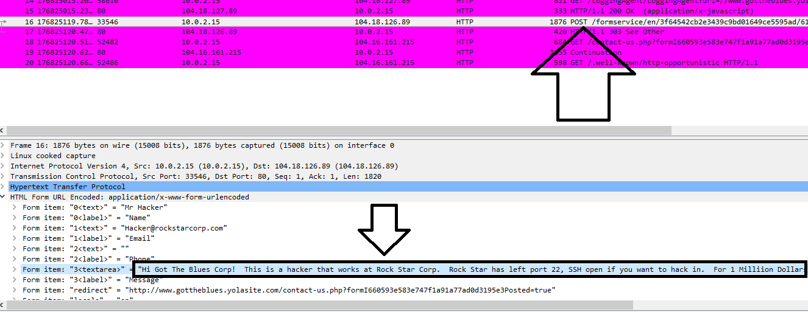
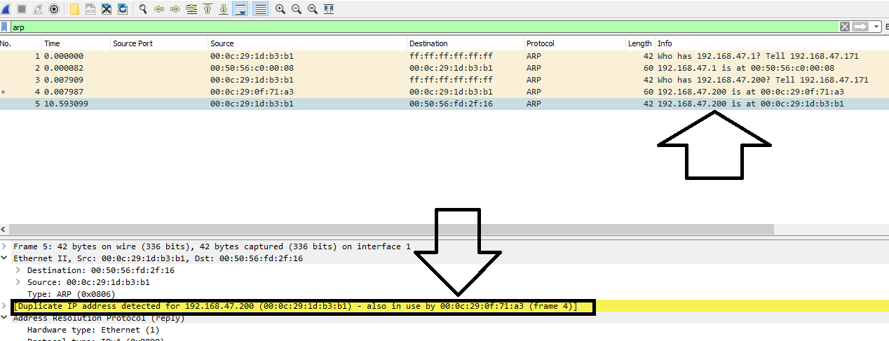

## Solution File: Rocking your Network Homework

### Phase 1: *"I'd Like to Teach the World to Ping"*

You have been provided a list of network assets belonging to RockStar Corp. Use `ping` to ping the network assets for only the Hollywood Office.
- Determine the IPs for the Hollywood office and run `ping` against the IP ranges in order to determine which IP is accepting connections.
- RockStar Corp doesn't want any of its servers, even if they are up, indicating that they are accepting connections.
- Create a summary file in a word document that lists out the `ping` command used, as well as a summary of the results.
- Your summary should determine which IPs are accepting connections and which are not. 
- Also indicate at which OSI layer your findings are found.

**Solution**

Determine the IPs for the Hollywood office and run ping against the IP addresses in order to determine which IP is accepting connections.

- From the RockStar server list, there are five servers for the Hollywood office:

  ```    
  15.199.95.91    Hollywood Database Server
  15.199.94.91    Hollywood Web Server 1
  203.0.113.32		Hollywood Web Server 2
  161.35.96.20		Hollywood Application Server 1
  192.0.2.0	    	Hollywood Application Server 2
  ```

- List the ping command used, as well as a summary of the results.

- Your summary should illustrate which IPs are accepting connections and which are not.

    ```
    To run ping against a subnet of a range of IPs you would run:
      
                    ping <IP Address>

                    
    For the 5 Servers you would run:
      
            ping 15.199.95.91
            ping 15.199.94.91
            ping 203.0.113.32
            ping 161.35.96.20
            ping 192.0.2.0
    ```

  - The results may vary slightly, but they should show only one IP is available and accepting connections:  `161.35.96.20 is alive`.

- Be sure to indicate at which OSI layer your findings are found. 
   - `The Network Layer, since a ping requires an IP address.`
  


### Phase 2:  *"Some SYN for Nothin'"*

With the IP(s) found from Phase 1, determine which ports are open:
  - You will run a `SYN SCAN` against the IP accepting connections. See the following **SYN SCAN Instructions**.
  - Using the results of the `SYN SCAN`, determine which ports are accepting connections. 
  - Add these findings to the summary and be sure to indicate at which OSI layer your findings were found.
  
**Solution**  
  
- From the previous phase, the IP of `161.35.96.20` was determined to be up and accepting connections.

- To run a SYN SCAN against the IP address accepting connections, run `nmap -sS 161.35.96.20`.
                
  - These results may also vary slightly, but they should return the following:

  ```
  Starting Nmap 7.80 ( https://nmap.org ) at 2020-03-18 09:46 EDT
  Nmap scan report for 161.35.96.20
  Host is up (0.0056s latency).
  Not shown: 999 filtered ports
  PORT   STATE SERVICE
  22/tcp open  ssh

  Nmap done: 1 IP address (1 host up) scanned in 19.16 seconds
  ```

- This indicates that the only open port is port 22, which is used by the SSH service.

- Understand that a SYN SCAN runs on the Transport layer.

### Phase 3:  *"I feel a DNS Change Comin' On"*

With your findings from Phase 2, determine if you can access the server that is accepting connections.
  
- RockStar Corp recently reported that it is unable to access `rollingstone.com` in the Hollywood office. Sometimes when it tries to access the website, a different, unusual website comes up. 
- Determine if something was modified on this system to affect the viewing of `rollingstone.com`.
- Use `nslookup` to determine which website `rollingstone.com` is being redirected to.


**Solution**
  
Since the last phase determined that SSH is open, you would attempt to login via SSH.
- The default usernames/password are:
  - **Username:**   `jimi`
  - **Password:**   `hendrix`

- To login, you would use `ssh jimi@161.35.96.20` and enter in `hendrix` as the password when prompted.

Since RockStar Corp mentions that it went to one website and another came up, there is a potential issue with the DNS. 
  
- To validate the issue with the redirection that is happening on the RockStar server, run `cat /etc/hosts`.

- This file will show a record that displays: `98.137.246.8 rollingstone.com`.

  - This explains why `rollingstone.com` was redirected.
- To figure out the domain of the IP, run `nslookup 98.137.246.8`.
  - `nslookup` is a domain name lookup utility that runs from the command line.
  - This will show the domain name: `name = media-router-fp2.prod1.media.vip.gq1.yahoo.com` indicating that it belongs to yahoo.com.
- DNS runs on the Application layer.
 
### Phase 4: *"ShARP Dressed Man"*
 
On this same server, in the same directory as the last file from Phase 3, the hacker left a note as to where they stored away some packet captures.  
- These are packets that were captured from activity in the Hollywood office.
- Use Wireshark to analyze these pcap files and determine if there was any suspicious activities related to a hacker.
   
**Solution**
     
In the `/etc` directory, there is a file called:  `packetcaptureinfo.txt`.
- In this file is a message that states:
   ``` 
    My Captured Packets are here:
    https://drive.google.com/file/d/1ic-CFFGrbruloYrWaw3PvT71elTkh3eF/view?usp=sharing
   ```  
- This link will take you to a download for the pcap packets: [pcapfile](secretlogs.pcapng) as a backup.
- Open this file called `secretlogs.pcapng` in Wireshark.
  
HTTP Finding:

- Add a filter for HTTP.
- Search for the "POST" Request.
- Expand "HTML Form URL Encoded: application/x-www-form-urlencoded".

- There is a message that was sent from the hacker that states:
  ```  
    "Hi Got The Blues Corp! This is an inside hacker that works at RockStar Corp. RockStar has left port 22 SSH open if you want to hack in. For 1 million dollars I will provide you the user and password!"
  ```
  - HTTP runs on the Application layer.
    
    
  
ARP finding:

- Add a filter for ARP.
- In packet 4, there is an ARP response indicating: `192.168.47.200 is at 00:0c:29:0f:71:a3`.
- In packet 5, there is a spoof ARP response indicating the same IP	`192.168.47.200` is at a different MAC address of `00:0c:29:1d:b3:b1`.
- Wireshark also indicates that this a duplicate ARP response.
- The hacker's device likely has the MAC address of `00:0c:29:1d:b3:b1` and they are creating a spoof record to direct the traffic intended for `92.168.47.200` over to their device.
- ARP runs on the Data Link layer.


  


   
### Your Submission:  *"It's the End of the Assessment as We Know It, and I Feel Fine"*
 
Provide the following for each phase: 

  - List the steps and commands used to complete the tasks.

  - List any vulnerabilities discovered.
  
  - List any findings associated to a hacker.
  
  - Document the mitigation recommendations to protect against the discovered vulnerabilities.
  
  - Document the OSI layer where the findings were found. 

The following is a sample summary.

---

### Summary Network Vulnerability Assessment for RockStar Corp
    
**Phase 1**
    
Our analysis determined there were five groups of IPs or five networks belonging to the Hollywood office. To ping them using fping, we ran the following:

```
fping -g 15.199.95.91/28
fping -g 15.199.94.91/28	
fping -g 203.0.113.32/28
fping -g 161.35.96.20/32	
fping -g 192.0.2.0/28
```         
- The only server that showed as available was `161.35.96.20`.
    
Ping runs on the Network layer of the OSI.
    
Mitigation: 

- If RockStar Corp doesn't want the ability to ping any of its servers, it should restrict ICMP echo requests to all of its servers, including: `161.35.96.20`.
    
**Phase 2**
    
We ran a SYN scan against the server accepting connections:
- `nmap -sS 161.35.96.20`

This returned the following running services and open ports:  
```      
PORT      STATE    SERVICE
22/tcp    open     ssh

```    

SYN scans run on the Transport layer.

Mitigation: 
  - RockStar Corp should consider also filtering out SSH traffic to prevent unauthorized access to its server.

### Phase 3
    
Since SSH was open, we logged into the RockStar server with the default username and password:
      
- `ssh jimi@161.35.96.20`
      
As it was indicated certain websites are being redirected, the hosts file was checked and there was a record added to redirect `rollingstone.com`.
    
 - The hosts file had the following record: `98.137.246.8 rollingstone.com`.
                      
- This explains why rollingstone.com was redirected.

To figure out what is the domain of the redirected IP, we ran `nslookup 98.137.246.8`.

- This showed the domain name `name = unknown.yahoo.com`.  
- This indicated rollingstone.com was being redirected to yahoo.com.
  
DNS runs on the Application layer.
    
Mitigation: 

- Default usernames and passwords should never be used and all of them should be changed and reset on all servers.

- The hosts file should be monitored and write access only given to limited staff.
             
### Phase 4
   
In the `/etc` directory, there was a file called "packetcaptureinfo.txt."

- In this file is a message that states:

  ```
  My Captured Packets are here:
  https://drive.google.com/file/d/1ic-CFFGrbruloYrWaw3PvT71elTkh3eF/view?usp=sharing
  ```

- This link takes you to a download for the pcap packets. 

- The file is called `secretlogs.pcapng` and was analyzed in Wireshark.
   
**HTTP finding**
- Applied a filter for HTTP
- Searched for the "POST" request
- Expanded "HTML Form URL Encoded: application/x-www-form-urlencoded"
- There is a message sent from the hacker that states:
  
  ```
  "Hi Got The Blues Corp! This is an inside hacker that works at RockStar Corp. RockStar has left port 22 SSH open if you want to hack in. For 1 milliion dollars I will provide you the user and password!"
  ```

- This indicated an insider is trying to sell unauthorized access to RockStar Corp's system.
- The IP address of the sender is 10.0.2.15.


- HTTP runs on the Application layer.   
  
   
**ARP finding**

- A filter was applied for ARP.

- In packet 4, there is an ARP response indicating `192.168.47.200` is at `00:0c:29:0f:71:a3`.
- In packet 5, there is a spoof ARP response indicating the same IP of `192.168.47.200` is at a different MAC address of `00:0c:29:1d:b3:b1`.
- Wireshark also indicates that this is a duplicate ARP response.
- This indicates that the hacker's device likely has the MAC address of `00:0c:29:1d:b3:b1` and they are creating a spoof record to direct the traffic intended for `92.168.47.200` to their device.
- ARP runs on the Data Link layer.

Mitigation: 

  - To prevent ARP spoofing, RockStar Corp can start creating static ARP entries or purchase networking technologies that can identify and stop spoof ARP requests.

  - RockStar Corp should consider launching an internal investigation and start with the owner of the device who has the MAC address of `00:0c:29:1d:b3:b1` (for the ARP spoof) and also check the owner of the device with the IP of `10.0.2.15`(for the HTTP post request).
          
---
&copy; 2023 edX Boot Camps LLC. Confidential and Proprietary. All Rights Reserved. 
